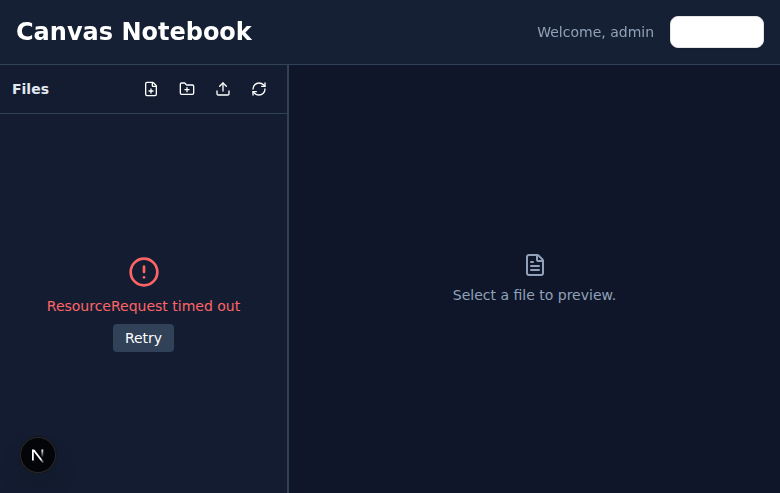

# Canvas Notebook 📔

Eine Next.js Web-App als Online-Notebook (ähnlich wie Obsidian) mit SSH-Integration, Datei-Browser und integriertem Terminal.



## ✨ Features

✅ **Fertig implementiert:**
- 🔐 **Sichere Authentifizierung** - ENV-basierte Credentials mit bcrypt Hashing
- 🔑 **SSH-Key Support** - Key-basierte SSH-Auth (empfohlen)
- 🛡️ **Security Headers** - CSP, X-Frame-Options, CSRF Protection
- ⚡ **Rate Limiting** - Schutz vor Brute-Force Angriffen
- 📁 File Browser (lokales FS oder SSH/SFTP)
- 📝 File Editor (Markdown, Code, Text) mit Auto-Save
- ⬆️ File Upload/Download
- ✏️ Create, Rename, Move, Delete Dateien/Ordner
- 🎨 Moderne UI mit shadcn/ui + Tailwind
- 🔄 Connection Pooling für SSH
- 🛡️ Path Validation (Directory Traversal Protection)
- 💻 Integriertes Terminal (xterm + node-pty, Stop/Copy/Fullscreen)
- 🖼️ Image/PDF Viewer

🚧 **In Planung:**
- 🔍 Global Search
- 📡 File Watching (Polling)

---

## 🚀 Schnellstart

### Production (Bereits deployed auf chat.canvasstudios.store)

**Live URL:** https://chat.canvasstudios.store

**Login:**
- Username: `admin`
- Password: `7b&BIfeGW)a[3!AKCOKJ`

**Setup Status:**
- ✅ Traefik Reverse Proxy konfiguriert
- ✅ systemd Service (Port 3001)
- ✅ Cloudflare DNS & Proxy aktiv
- ✅ SSL/TLS via Cloudflare
- ✅ Starke Credentials gesetzt

### Development

#### 1. Node.js Version prüfen

```bash
node --version  # Muss >= 20.9.0 sein
```

#### 2. Dependencies installieren

```bash
cd "/home/ubuntu/webapp canvasstudios/canvas-notebook"
npm install
```

#### 3. SSH Credentials konfigurieren

Die `.env.local` ist bereits konfiguriert mit:

```bash
# File System (Local FS mode)
SSH_BASE_PATH=/home/canvas-notebook/workspace
SSH_USE_LOCAL_FS=true

# SSH Configuration (optional if local FS)
SSH_HOST=ssh.canvas.holdings
SSH_PORT=22
SSH_USER=canvas-notebook
SSH_KEY_PATH=/home/ubuntu/.ssh/id_rsa

# App Configuration (PRODUCTION)
APP_USERNAME=admin
APP_PASSWORD_HASH=$2b$10$WhVaZ2qvrscxhfhXD.Jb/.3G05p5D5LGCUNnlFHHAjGKPN3BcqteW
SESSION_SECRET=0DmVUwqY95tTRC0x1GQgECnZKPkCggiFnfVg0xt54hY=
```

#### 4. Dev-Server starten

```bash
PORT=3001 npm run dev
```

Server läuft auf: **http://localhost:3001**

#### 5. Production Deployment

Die App läuft in Production via systemd:

```bash
# Status prüfen
systemctl status canvas-notebook.service

# Logs ansehen
journalctl -u canvas-notebook.service -n 200 --no-pager

# Restart
sudo systemctl restart canvas-notebook.service

# App neu deployen
npm run build
sudo systemctl restart canvas-notebook.service
```

---

## ✅ Smoke Test

Der Smoke-Test erwartet, dass der Server läuft:

```bash
npm run test:smoke
```

## 🧪 Tests

Integrationstest (API):

```bash
npm run test:integration
```

E2E (Playwright):

```bash
npm install
npm run test:e2e
```

Alles zusammen (build + start + smoke + integration + e2e):

```bash
npm run test:all
```

Tests laufen im lokalen Dateisystem-Modus, wenn `SSH_TEST_MODE=1` gesetzt ist.
Für Production kann lokales FS mit `SSH_USE_LOCAL_FS=true` aktiviert werden.
In Tests kann `SESSION_SECURE_COOKIES=false` gesetzt werden, damit Cookies über HTTP funktionieren.

## 🔑 SSH Setup - 3 Optionen

### Option 1: SSH Key verwenden (Empfohlen ⭐)

Wenn du bereits einen SSH Key hast:

```bash
# Prüfe ob Key existiert
ls -la ~/.ssh/id_rsa

# Wenn ja, in .env.local eintragen:
SSH_KEY_PATH=/home/ubuntu/.ssh/id_rsa

# Key muss lesbar sein:
chmod 600 ~/.ssh/id_rsa
```

### Option 2: SSH Password verwenden

Wenn kein SSH Key vorhanden ist:

```bash
# In .env.local:
SSH_PASSWORD=dein_echtes_passwort

# Teste die Verbindung:
ssh ubuntu@ssh.canvas.holdings
```

### Option 3: Eingeschränkten SSH-Benutzer erstellen

Für mehr Sicherheit kannst du einen separaten SSH-Benutzer mit eingeschränktem Zugriff erstellen.

📖 **Siehe:** [SETUP_RESTRICTED_SSH_USER.md](../SETUP_RESTRICTED_SSH_USER.md)

---

## 📁 Projektstruktur

```
canvas-notebook/
├── app/
│   ├── page.tsx                    # Main Dashboard
│   ├── login/page.tsx              # Login Page
│   │
│   ├── api/
│   │   ├── auth/                   # Auth API Routes
│   │   │   ├── login/route.ts
│   │   │   └── logout/route.ts
│   │   │
│   │   ├── files/                  # File Operations API
│   │   │   ├── tree/route.ts       # ✅ GET file tree
│   │   │   ├── read/route.ts       # ✅ GET file content
│   │   │   ├── write/route.ts      # ✅ POST save file
│   │   │   ├── create/route.ts     # ✅ POST create file/folder
│   │   │   ├── delete/route.ts     # ✅ DELETE file/folder
│   │   │   ├── rename/route.ts     # ✅ POST rename
│   │   │   ├── upload/route.ts     # ✅ POST upload file
│   │   │   └── download/route.ts   # ✅ GET download file
│   │   │
│   │   └── terminal/               # ✅ WebSocket Terminal (via custom server)
│   │
│   ├── components/
│   │   ├── file-browser/           # ✅ File Browser Components
│   │   │   ├── FileBrowser.tsx
│   │   │   ├── FileTree.tsx
│   │   │   ├── FileNode.tsx
│   │   │   └── FileContextMenu.tsx
│   │   │
│   │   ├── editor/
│   │   │   └── FilePreview.tsx     # ✅ Basic File Preview
│   │   │
│   │   └── ui/                     # ✅ shadcn/ui Components
│   │       └── ... (button, input, dropdown, etc.)
│   │
│   ├── lib/
│   │   ├── ssh/                    # ✅ SSH/SFTP Layer
│   │   │   ├── connection-pool.ts  # Connection Pooling
│   │   │   └── sftp-client.ts      # SFTP Operations
│   │   │
│   │   └── auth/
│   │       └── session.ts          # ✅ iron-session Config
│   │
│   └── store/
│       └── file-store.ts           # ✅ Zustand State Management
│
├── .env.local                      # ⚠️ SSH Credentials hier!
├── middleware.ts                   # ✅ Auth Middleware
├── next.config.ts                  # ✅ Next.js Config
└── README.md                       # 📖 Diese Datei
```

---

## 🚢 Production

```bash
npm run build
npm run start
```

Falls `next build` mit Turbopack scheitert (ssh2 native assets), setze `NEXT_DISABLE_TURBOPACK=1` oder verwende `next build --webpack`.

Hinweis: Bei `output: 'standalone'` nutzt `npm run start` den `node .next/standalone/server.js` Einstieg.

Für den Terminal-WebSocket wird der Custom Server verwendet (`server.js`). In Production sollten SSL/TLS, Monitoring, und stärkere Credentials gesetzt werden.

Weitere Details:
- `docs/DEPLOYMENT.md`
- `docs/MONITORING.md`

---

## ⚙️ Environment Variables

**Aktuelle Production `.env.local`:**

```bash
# ===== SSH Configuration =====
SSH_HOST=ssh.canvas.holdings
SSH_PORT=22
SSH_USER=canvas-notebook
SSH_KEY_PATH=/home/ubuntu/.ssh/id_rsa

# ===== App Configuration (PRODUCTION) =====
APP_USERNAME=admin
APP_PASSWORD_HASH=$2b$10$WhVaZ2qvrscxhfhXD.Jb/.3G05p5D5LGCUNnlFHHAjGKPN3BcqteW
# Plain password: 7b&BIfeGW)a[3!AKCOKJ (nur für Referenz)
SESSION_SECRET=0DmVUwqY95tTRC0x1GQgECnZKPkCggiFnfVg0xt54hY=

# ===== File System =====
SSH_BASE_PATH=/home/ubuntu/webapp canvasstudios/canvasstudios_projektordner

# ===== Terminal Configuration =====
MAX_TERMINALS_PER_USER=3
TERMINAL_IDLE_TIMEOUT=1800000

# ===== Connection Pool Settings =====
SSH_POOL_MAX=5
SSH_POOL_MIN=0
SSH_POOL_IDLE_TIMEOUT=600000

# ===== Claude Code =====
CLAUDE_CODE_AUTO_START=true

# ===== Next.js =====
NEXT_PUBLIC_WS_URL=ws://3.66.71.254:3001
```

**Für neue Credentials generieren:**
```bash
# Starkes Passwort + Hash
node scripts/generate-password-hash.js --generate

# SSH Key
./scripts/setup-ssh-key.sh
```

---

## 🐛 Troubleshooting

### ❌ Problem: "All configured authentication methods failed"

**Ursache:** SSH-Credentials in `.env.local` sind nicht korrekt.

**Lösung:**

1. **SSH Key verwenden:**
   ```bash
   # Prüfe ob Key existiert
   ls -la ~/.ssh/id_rsa

   # Wenn ja:
   SSH_KEY_PATH=/home/ubuntu/.ssh/id_rsa

   # Rechte prüfen
   chmod 600 ~/.ssh/id_rsa
   ```

2. **SSH Password verwenden:**
   ```bash
   # Teste Verbindung manuell
   ssh ubuntu@ssh.canvas.holdings

   # Wenn erfolgreich, Passwort in .env.local setzen:
   SSH_PASSWORD=dein_passwort
   ```

3. **Server neu starten:**
   ```bash
   # Dev-Server beenden (Ctrl+C) und neu starten:
   PORT=3001 npm run dev
   ```

### ❌ Problem: "ResourceRequest timed out" im File Browser

**Ursache:** Kann keine SSH-Verbindung zum Server aufbauen.

**Lösung:**

1. Prüfe SSH-Credentials (siehe oben)
2. Teste SSH-Verbindung manuell:
   ```bash
   ssh ubuntu@ssh.canvas.holdings
   ```
3. Prüfe Server-Logs:
   ```bash
   # Im Terminal wo npm run dev läuft
   # Suche nach "[SSH Pool] Connection error"
   ```
4. Prüfe ob Server erreichbar ist:
   ```bash
   ping ssh.canvas.holdings
   ```

### ❌ Problem: "Permission denied" beim File-Zugriff

**Ursache:** SSH-Benutzer hat keine Berechtigung für den Workspace-Ordner.

**Lösung:**
```bash
# Auf ssh.canvas.holdings:
sudo chown -R ubuntu:ubuntu "/home/ubuntu/webapp canvasstudios/canvasstudios_projektordner"
sudo chmod -R 755 "/home/ubuntu/webapp canvasstudios/canvasstudios_projektordner"
```

### ❌ Problem: Dev-Server startet nicht

**Ursache:** Node.js Version < 20

**Lösung:**
```bash
nvm install 20
nvm use 20
npm install
```

---

## 🛠️ Tech Stack

- **Frontend:** Next.js 16.1.1, React 19.2.3, TypeScript 5.9.3
- **UI:** shadcn/ui, Tailwind CSS 4.1.18, Radix UI, lucide-react
- **Backend:** Node.js 20+, Next.js API Routes
- **SSH/SFTP:** ssh2, ssh2-sftp-client, generic-pool
- **State Management:** Zustand 5.0.9
- **Auth:** iron-session 8.0.4
- **Terminal (planned):** xterm.js, node-pty, ws

---

## 📝 Development

### Scripts

```bash
npm run dev          # Development server (Port 3001)
npm run build        # Production build
npm run start        # Production server
npm run lint         # ESLint
```

### File Operations API

```typescript
// GET File Tree
GET /api/files/tree?path=.&depth=3

// Read File
GET /api/files/read?path=file.txt

// Write File
POST /api/files/write
Body: { path: "file.txt", content: "..." }

// Create File/Folder
POST /api/files/create
Body: { path: "newfolder", type: "directory" }

// Delete File/Folder
DELETE /api/files/delete
Body: { path: "file.txt" }

// Rename File/Folder
POST /api/files/rename
Body: { oldPath: "old.txt", newPath: "new.txt" }

// Upload File
POST /api/files/upload
FormData: { file: File, path: "." }

// Download File
GET /api/files/download?path=file.txt
```

---

## 🔒 Security

✅ **Implementiert:**
- **bcrypt Password Hashing** - Sichere Passwort-Speicherung
- **SSH-Key Authentication** - Key-basierte SSH-Verbindungen
- **Rate Limiting** - 5 Login-Versuche/Min
- **Security Headers** - CSP, X-Frame-Options, X-XSS-Protection
- **Middleware Protection** - Alle Routes geschützt
- **Path Validation** - Directory Traversal Prevention
- **Session Encryption** - iron-session mit starkem Secret
- **Timing Attack Protection** - Künstliche Verzögerungen
- **HTTPS-only Cookies** - in Production

📚 **Dokumentation:**
- **[docs/SECURITY.md](docs/SECURITY.md)** - Vollständiger Security-Guide
- **Security-Tools:**
  - `./scripts/setup-ssh-key.sh` - SSH-Key Generator
  - `node scripts/generate-password-hash.js --generate` - Passwort-Generator

🔒 **Quick Security Checklist:**
```bash
# 1. SSH-Key generieren (empfohlen)
./scripts/setup-ssh-key.sh

# 2. Starkes Passwort generieren
node scripts/generate-password-hash.js --generate

# 3. .env.local aktualisieren
# - SSH_KEY_PATH setzen
# - APP_PASSWORD_HASH setzen
# - SESSION_SECRET setzen
# - SSH_PASSWORD entfernen

# 4. Server neu starten
PORT=3001 npm run dev
```

---

## 🎯 Nächste Schritte

1. ✅ **SSH Credentials konfigurieren** (in `.env.local`)
2. ✅ **Dev-Server starten** und testen
3. 🚧 **Markdown Editor** implementieren
4. 🚧 **Terminal mit Claude Code** integrieren
5. 🚧 **Image/PDF Viewer** hinzufügen

---

## 📚 Documentation

- [IMPLEMENTATION_PLAN.md](../IMPLEMENTATION_PLAN.md) - Detaillierter Implementierungsplan
- [SETUP_RESTRICTED_SSH_USER.md](../SETUP_RESTRICTED_SSH_USER.md) - SSH-Benutzer Setup Guide

---

## 📧 Support

Bei Problemen oder Fragen:
- Siehe [Troubleshooting](#-troubleshooting) oben
- Prüfe Server-Logs im Terminal wo `npm run dev` läuft
- Teste SSH-Verbindung manuell: `ssh ubuntu@ssh.canvas.holdings`

---

## 📄 License

Private Project - Canvas Studios

---

**Status:** Ready to use (nach SSH-Konfiguration) ✅
│   │   ├── terminal/               # ✅ Terminal UI (xterm)
│   │   ├── layout/                 # ✅ Resizable Layout
