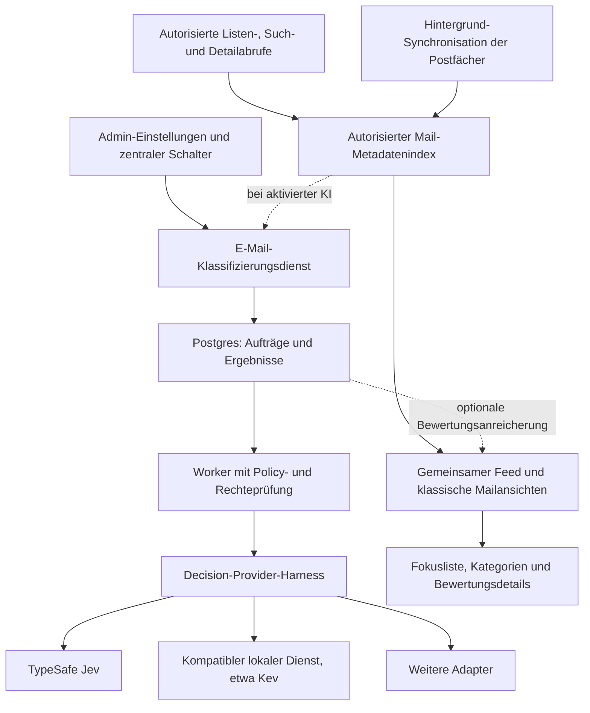

# Plan: zentrale E-Mail-Kategorisierung mit austauschbaren Entscheidungsmodellen

Stand: 2026-10-06. Untersuchte Codebasis: `e65644ecb`. Branch: `codex/email-classification-plan` im bestehenden Worktree `d6d2bb9a-41c2-47cf-ba77-cdbfa21fe3cf`.

Status: Architektur- und Umsetzungsvorschlag. Es wurde kein Produktcode verändert, kein Modell aufgerufen und keine Mail verarbeitet. Gemeintes Modell: **Jev von TypeSafe AI**. Die vom Nutzer bereitgestellte Mailtool-Referenz und das Request-Beispiel konkretisieren vier gemeinsame Bewertungsfelder: Kategorie, Priorität, Spamwahrscheinlichkeit und Antwortbedarf.

## 1. Ziel und empfohlener Umfang

Ein Serveradministrator aktiviert die automatische Kategorisierung zentral für alle berechtigten Postfächer der Instanz. Persönliche und gemeinsame Workspace-Postfächer verwenden denselben Dienst. Nutzer müssen keinen eigenen Provider konfigurieren und erhalten keinen individuellen Aktivierungsschalter.

V1 umfasst **Kategorie, Priorität, Spam-% und Antwortbedarf-%** als Grundlage einer neuen Arbeitsansicht: **Fokus** zeigt vorrangig wichtige Nachrichten und Antwortbedarf, **Klassisch** die vertraute chronologische Ansicht. Beide Modi funktionieren für ein einzelnes Postfach und für alle berechtigten Postfächer gemeinsam, einschließlich Arbeitspostfächern. Kategorien, Prozentwerte und erweiterte Filter erscheinen schrittweise bei Bedarf. Alle vier Bewertungen gehören zu einem gemeinsamen versionierten Fragenschema und werden möglichst in einem Providerrequest pro Mail ermittelt.

Der zentrale KI-Schalter ist standardmäßig ausgeschaltet. Nach seiner Aktivierung wird Fokus zur Standardansicht für Nutzer ohne gespeicherte Moduswahl; eine ausdrücklich gewählte klassische Ansicht bleibt erhalten. Dieser UI-Schalter wählt die Arbeitsweise, nicht die Teilnahme an der zentralen Verarbeitung. Die erste Version sortiert innerhalb von Canvas mit virtuellen Ansichten; automatische Änderungen an Gmail-Labels, Outlook-Kategorien oder IMAP-Ordnern sind eine spätere, gesonderte Erweiterung. Jede berechtigte Mail bleibt über „Alle E-Mails“ bzw. die normale Ordneransicht erreichbar.

Ein zentraler Schalter ist sinnvoll. Trotzdem muss die Administrationsoberfläche erkennen lassen, ob Mailinhalte an einen externen Dienst gehen oder auf einem selbst betriebenen Endpunkt verarbeitet werden. Ein Modellfehler darf eine wichtige Mail weder verschwinden lassen noch den normalen Postfachabruf blockieren.

## 2. Befund im aktuellen Repository

| Bereich | Aktueller Code und Konsequenz |
| --- | --- |
| Mailanbieter | `app/lib/email/service.ts` verbindet lokale Google-/Microsoft-OAuth- und SMTP/IMAP-Konten mit verwalteten Konten über `managed-client.ts`. Der KI-Provider muss unabhängig vom Mailanbieter gewählt werden. |
| Berechtigungen | `mailbox-access.ts` löst persönliche und gemeinsame Postfächer auf, einschließlich Kontoinhaber, Workspace und Lese-/Schreibrechten. Der Worker und die Ergebnis-API benötigen diese fachlichen Grenzen auch ohne Browser-Session. |
| Browserabruf | `/api/email/messages/list` und die Nachrichten-Detailroute autorisieren zuerst das Postfach und rufen anschließend den zentralen Maildienst auf. `EmailClient.tsx` lädt Seiten, Suchergebnisse und Hintergrundaktualisierungen. |
| Cache | `cache/read-through.ts` und `cache/store.ts` besitzen normalisierte Nachrichtenreferenzen und Postgres-Persistenz. Der SWR-Listenpfad gilt aktuell für lokale persönliche Standardlisten. Suche und Filter umgehen ihn; verwaltete Listen kehren vorher zurück; Workspace-Zugriffe erzwingen ihre Lesepolicy. Ein Cache-Hook allein würde große Teile des Produkts auslassen. |
| Nachrichtenidentität | `provider-message-identity.ts` und `cache/store.ts` behandeln IMAP mit Ordner + UIDVALIDITY + UID. Eine rohe UID oder ein RFC-Message-ID-Header ist kein globaler Primärschlüssel. |
| Inbox-Ereignisse | `inbox-events.ts` erfasst nur aktive Workspace-Mailboxbindungen, zuletzt bis zu 50 Inbox-Nachrichten pro Durchlauf. Historische Nachrichten vor der Bindung werden ausgelassen. Der interne Poll-Endpunkt führt anschließend die Automation-Queue aus. Ein allgemeiner Klassifizierungsworker ist damit noch nicht vorhanden. |
| Automationen | `workspace-email-automation-events.ts` erzeugt Agent-Runs aus Inbox-Ereignissen. Klassifizierung darf keinen kompletten Agent-Run pro Mail benötigen und keine Voraussetzung für bestehende Automationen werden. |
| Vorhandene E-Mail-KI | `ai-service.ts`, `ai-runtime.ts` und `mailbox-ai.ts` erzeugen Zusammenfassungen und Antworten über den geerbten Agent-Runtime. Für einen organisationsweiten Entscheidungsdienst brauchen wir eine eigene Providerwahl und ein geschlossenes Ergebnisschema. |
| Kategorien | `email-client-types.ts` enthält derzeit keine Klassifizierungsdaten. Providerordner können als Junk/Spam erkannt werden; eine allgemeine KI-Kategorisierung ist im untersuchten Mailcode nicht vorhanden. Inbox-Cases besitzen Status/Priorität, sind aber keine Kategorisierung sämtlicher Provider-Mails. |
| Administration | `requireInstanceAdmin` und die Settings-Komponenten liefern das Muster für zentrale Adminfunktionen. Der bestehende E-Mail-Bereich nutzt den Settings-Tab `system-email`. |
| Secrets | `/api/integrations/env` und der gemeinsame ENV-Speicher unterstützen System-, Organisations- und User-Bereiche. Die zentrale V1-Konfiguration verwendet System-Secrets; persönliche Providerkeys werden nicht automatisch übernommen. |
| Mobile | Die vorhandenen nativen APIs betreffen Inbox-Cases und Entwurfsprüfung (`email.review.v1`). Eine native vollständige Mailbox mit Kategorien ist ein eigener Clientumfang; das Backend wird dafür erweiterbar gehalten. |

### 2.1 Aktuelle Mail-UX und notwendiger Umbau

Der Client arbeitet mit genau einem aktiven Konto/Postfach und einem Ordner (`EmailClient.tsx:182-196`). Der Header bietet Postfachauswahl, Verfassen, Refresh und Suche (`EmailMailboxHeader.tsx:65-135`). Die Liste zeigt Absender, Zeit, Betreff, Vorschautext und Gelesenstatus; es gibt keine Bewertungsspalten (`EmailMailboxNavigation.tsx:247-289`). Der bestehende „Focus“-Button blendet vor allem Layoutbereiche aus und sendet ein Layoutsignal an die Shell (`EmailClient.tsx:106-140`); er priorisiert keine Nachrichten. „Alle Ordner“ in der Suche meint nur das ausgewählte Postfach (`EmailClient.tsx:533-565`, `EmailSearchBar.tsx:47-49`).

Desktop nutzt Postfachnavigation, Liste und Reader; schmale Ansichten öffnen die Nachricht in einem Dialog (`EmailWorkspaceLayout.tsx:18-22`, `EmailClient.tsx:1479-1512`). Öffnen markiert eine Mail heute automatisch als gelesen (`EmailClient.tsx:687`), bedeutet aber nicht erledigt. Die vorhandenen Reader-, Compose- und Versandprüfungsabläufe sind wichtige Bestandteile der neuen Ansicht. Der global gehostete Review Center darf weder durch Scopewahl noch durch niedrige KI-Priorität verschwinden (`EmailReviewCenter.tsx:11,55-68`).

Folgerung: Der neue Fokusmodus ist eine eigene Ansicht mit eigenen Datenabfragen. Den bisherigen Layoutschalter benennen wir in **„Ablenkungsfrei“** um und verschieben ihn in die Anzeigeoptionen. Die bestehende Listenansicht bleibt als klassischer Modus verwendbar. Die Erweiterung benötigt keinen vollständigen Neubau von Nachrichtendarstellung und Antworteditor.

## 3. Jev und offene Alternativen

Jev verarbeitet `state` plus vorgegebene `questions` über `POST /v1/systemone`. **Choice** wählt eine Kategorie bzw. Prioritätsstufe und liefert eine Verteilung; **Noul** liefert die Wahrscheinlichkeit für eine Ja/Nein-Frage; **Score** bewertet anhand geordneter Kriterien. Mehrere Fragen können denselben Zustand verwenden. Für V1 sind das zwei Choice-Fragen (`category`, `priority`) und zwei binäre Fragen (`is_spam`, `needs_reply`). [Offizielle API](https://docs.typesafe.ai/api), [Quickstart](https://docs.typesafe.ai/introduction/quickstart).

### SDK- und Transportwahl

Das Nutzerbeispiel verwendet Vercels `experimental_evaluate`. Die zum Recherchezeitpunkt aktuelle v7-Dokumentation beschreibt `experimental_decide`; Context7 enthält ebenfalls noch Beispiele mit `experimental_evaluate`. Vor Umsetzung ist die konkrete SDK-Version zu pinnen und ihr Export-/Antwortvertrag zu prüfen. Im SDK heißen binäre Fragen `boolean` und ihr Ergebnisfeld `probability`; der direkte TypeSafe-Vertrag verwendet `noul`. Der Adapter normalisiert beide auf unsere binäre Entscheidung. [AI-SDK-Referenz](https://ai-sdk.dev/docs/reference/ai-sdk-core/decide), [Entscheidungsformate](https://ai-sdk.dev/docs/ai-sdk-core/decisions).

Ein String wie `typesafe-ai/jev` verwendet im AI SDK standardmäßig Vercel AI Gateway. Das ist ein eigener Transport mit Gateway-Credentials; für direkte TypeSafe-Anbindung wird ein explizites Providermodell verwendet. Die vorhandene Notebook-E-Mail-KI nutzt `@earendil-works/pi-ai`; `ai` und `@ai-sdk/*` sind derzeit keine direkten Projektdependencies. V1 kann weiterhin den direkten TypeSafe-HTTP- und kompatiblen HTTP-Adapter liefern. Ein optionaler Vercel-Gateway-Adapter bleibt hinter derselben Canvas-Schnittstelle und erhält explizite scoped Credentials, kein pro Request verändertes globales Default-Providerobjekt. [AI-SDK-Modellauflösung](https://ai-sdk.dev/docs/ai-sdk-core/decisions).

`confidence` bei Choice/Score ist eine aus der Verteilung berechnete Größe. Noul liefert keinen separaten Confidence-Wert. Wir speichern Klassenwahrscheinlichkeit, Provider-Confidence und unsere Entscheidung getrennt. Auch ein hoher Modellwert ist kein gemessener Nachweis, dass die Klassifikation auf unseren Mails richtig liegt. [Confidence-Dokumentation](https://docs.typesafe.ai/confidence).

Für reproduzierbare Ergebnisse verwenden wir einen versionierten Modellnamen statt still wandernder Aliase. Zum Recherchezeitpunkt dokumentiert TypeSafe `jev-1.13.0`; die tatsächlich zurückgegebene Modellversion wird zusätzlich gespeichert. Modellwechsel benötigen eine neue Auswertung. [Modelle](https://docs.typesafe.ai/models).

| Kandidat | Eignung für den Harness |
| --- | --- |
| Jev / TypeSafe | Erster gehosteter Adapter für Choice und Noul; Score kann der allgemeine Vertrag ebenfalls abbilden. |
| [Kev](https://github.com/jaredpalmer/kev) | Selbst betreibbare Jev-ähnliche Modellfamilie mit TypeSafe-kompatibler `/v1/systemone`-API und Choice/Score/Noul. Bevorzugter Kandidat zum Belegen des Providerwechsels. Kompatibilität ersetzt keine Qualitätsprüfung auf unseren Mails. |
| [Open JEV](https://github.com/zhihz/openjev) | Forschungsalternative mit lokalen Choice/Binary-Ergebnissen auf Qwen. Das Projekt benennt relative Kandidatenwahrscheinlichkeiten und fehlende automatische Kalibrierung ausdrücklich. Eigener Adapter; keine ungeprüfte Gleichsetzung mit Jev. |
| [GLiNER2](https://github.com/fastino-ai/GLiNER2) | Schemaorientierte lokale Klassifikation/Extraktion mit anderer Schnittstelle. Später über einen separaten Adapter anschließbar; Fähigkeiten und Score-Semantik müssen explizit beschrieben werden. |

V1 liefert den TypeSafe-Adapter und einen konfigurierbaren, anhand von Vertragsfixtures geprüften System-One-kompatiblen HTTP-Adapter. Ein lokaler Modellserver bleibt ein separat betriebener Dienst. Wir installieren keine GPU-/Python-Runtime in den Notebook-Container. Ein realer Kev-Abnahmelauf kommt erst mit einem bereitgestellten Endpunkt.

## 4. Architektur

### 4.1 Allgemeiner Decision-Harness

Vorgeschlagene Dateien unter `app/lib/decision-models/`: `types.ts`, `registry.ts`, `service.ts` und `providers/`. Der Harness kennt keine Mailboxen, Postgres-Tabellen, Nutzerpräferenzen oder Aktionen wie Verschieben/Senden.

Der Vertrag enthält explizit:

- Zustand als begrenzten Text bzw. strukturierten Textdatensatz und ein versioniertes Fragenschema.
- Fragetypen `choice`, `binary` und `ordinal`, stabile Frage-/Kandidaten-IDs und Beschreibungstexte.
- Providerkonfiguration, Modellreferenz, Credential-Kontext, Timeout und AbortSignal als Eingaben.
- Typisierte Antworten, vollständige Verteilungen soweit verfügbar, tatsächliches Modell, Laufzeit, Usage und optionale Provider-Confidence.
- Deklarierte Fähigkeiten, Kontextlimits, Wahrscheinlichkeitstyp und Kalibrierungsreferenz. Keine erfundenen Wahrscheinlichkeiten für Provider, die nur Labels zurückgeben.
- Strukturierte Fehler: fehlende Konfiguration, ungültiger Vertrag, nicht unterstützte Fähigkeit, Timeout, Rate Limit und Providerfehler.

Der E-Mail-Dienst verlangt zunächst `choice` + `binary` für das vollständige Vier-Felder-Schema. Ein binärer Klassifikator darf eine dokumentierte Ja/Nein-Choice abbilden; ein Adapter muss diese Abbildung offenlegen. Alle Fragen bewerten denselben Mailzustand; eine Prioritätsfrage interpretiert nicht erst die generierte Kategorie. Mehrere Fragen in einem Request sind keine automatische Batch-API für verschiedene Mails. Adapter ohne gemeinsame Ausführung dürfen intern mehrere Aufrufe machen, müssen dies in Usage und Laufzeit offenlegen. Ein generatives Modell mit JSON-Ausgabe wäre ebenfalls anschließbar, aber selbst ausgegebene Confidence-Zahlen werden nicht als kalibrierte Wahrscheinlichkeit behandelt. Optionale Verteilungen werden nicht erfunden.

Der Adapter erledigt Transport und Formatumwandlung. Der Harness validiert Antworttypen, IDs, Wertebereiche und Verteilungssummen. E-Mail-Orchestrierung entscheidet über Wiederholungen, Abbruch, Rechte, Schwellen und Persistenz. Ein Provider darf keine Produktzustände verändern. V1 hat keinen stillen Fallback auf einen anderen externen Anbieter.

### 4.2 E-Mail-Dienst und Datenmodell

Unter `app/lib/email/classification/` liegen `schema.ts`, `policy.ts`, `settings-store.ts`, `mailbox-registry.ts`, `store.ts`, `service.ts`, `worker.ts` und `availability.ts`. Die Namen sind Vorschläge, keine bereits implementierten Module.

Postgres speichert diese fachlichen Bereiche:

| Bereich | Inhalt |
| --- | --- |
| Zentrale Einstellungen | Instanz-ID, Aktivierung, Provider-/Modellreferenz, Schemaprofil, Schwellenprofil, Limits und monotone Revision; Änderungen mit `expectedRevision`, Änderungszeit und Admin-ID. |
| Mailbox-Synchronisation | Kontoinhaber, tatsächlicher Berechtigungsbereich, `accountSource: local/managed`, Account-ID, Bindungsrevision, Provider, letzter erfolgreicher Sync, Cursor und Abdeckungsstatus. Verwaltete Account-IDs dürfen nicht ungeprüft eine lokale `email_accounts`-Zeile voraussetzen. |
| Mail-Metadatenindex | Kanonische Mailreferenz, Herkunft, tatsächlicher Providerordner, begrenzte Listenmetadaten, Zeit, Antwortstatus samt Verfügbarkeit und Indexrevision. Dauerhafte Grundlage für aggregierte Ansichten und Zähler, unabhängig von Klassifizierung und kurzlebigem Cache; aktuelle Rechte vor Ausgabe prüfen. |
| Klassifizierungsaufträge | Nachrichtenreferenz, Schema-/Modell-/Policyrevision, Fingerprint, Zustand, Versuche, `nextAttemptAt`, Lease und Claim-Token. Eindeutiger Auftrag pro Nachricht und Konfigurations-/Inhaltsstand. |
| Ergebnisse und Korrekturen | Gewählte Kategorie/Priorität mit jeweils optionaler Verteilung, Spam- und Antwortbedarfwahrscheinlichkeit, Provider-Confidence pro Frage, Score-Semantik, ausgewerteter Inhaltsumfang, Modell-/Adapter-/Kalibrierungsversion, Zeit, abgeleitete Entscheidungen und davon getrennte manuelle Korrekturen mit Version. Kategorie, wirksame Priorität und binäre Werte erhalten für Filter/Sortierung indizierbare Felder. |
| Persönlicher Fokuszustand | Nutzer-ID + kanonische Mailreferenz + Revision für „Für mich erledigt“ und optional spätere Wiedervorlage. Dieser Zustand verändert weder Modellbewertung noch gemeinsamen Workspace-Case. Das gespeicherte Ansichtsformat verwendet den bestehenden `UserPreferences`-Dienst. |

Ergebnisse sind unabhängig von kurzlebigen Cacheeinträgen und von Automation-Inbox-Cases. Gemeinsame Postfächer erhalten ein Ergebnis pro Mail, das alle berechtigten Nutzer sehen; persönliche bleiben an den Inhaber gebunden. Kein Schlüssel hängt vom zufällig aufrufenden Workspace-Mitglied ab.

Identität: Instanz/Berechtigungsbereich + Inhaber + Accountquelle + Account-ID + normalisierte Providerreferenz. Bei IMAP sind Ordner, UIDVALIDITY und UID Pflicht. Fingerprints berücksichtigen Schema, normalisierten Inhalt, Modell und Konfiguration; Änderungen an gelesen/ungelesen lösen keine neue KI-Auswertung aus. Manuelle Korrekturen überleben einen Providerwechsel. Bei Ordnerwechsel, UIDVALIDITY-Wechsel oder neuem Provider-ID muss die Referenz neu geprüft werden.

Migrationen folgen den bestehenden Postgres-Startmigrationen. Einstellungen liegen für dieses Feature ebenfalls in Postgres, damit Ausschalten und spätes Worker-Ergebnis atomar gegeneinander geprüft werden können. Admin-/Availability-Muster werden wiederverwendet; es gibt keine zweite kanonische Konfiguration in `server-settings.ts`.

### 4.3 Verarbeitung und vollständige Abdeckung

1. Ein eigener Discovery-Dienst registriert aktive lokale und verwaltete Postfächer und prüft aktuelle Bindungen und Besitzverhältnisse. Reine SMTP-Konten ohne lesbare Inbox werden ausgelassen.
2. Ein serverseitiger Metadaten-Sync synchronisiert neue eingehende Nachrichten auch bei geschlossenem Browser. Paging/Cursor, überlappende Abruffenster und Deduplizierung verhindern, dass ein hohes Mailaufkommen hinter einem festen Top-50-Fenster verschwindet. Dieser Mailindex dient auch dem klassischen Gesamtfeed und bleibt von Klassifizierungsaufträgen getrennt. Bei aktivierter KI wird ein begrenzter jüngerer Inbox-Bestand zur Analyse eingereiht; eine komplette historische Analyse bleibt eine explizite Adminaktion mit Mengen-/Kostenlimit.
3. Listen-, Such- und Detailwege ergänzen nach ihrer bestehenden Autorisierung und bei aktivierter KI gültige gespeicherte Klassifizierungsdaten. Fehlende Aufträge werden nur bei aktivierter, gültig konfigurierter Klassifizierung idempotent angelegt; normale Metadatensynchronisation ist davon unabhängig. Eine gemeinsame Wrapper-Schicht deckt alle Rückgabepfade ab. Rohabrufe für Metadaten-Sync, Klassifizierungsworker, Reply-Watcher und bestehende Automationen bleiben nutzbar; der Worker darf sich beim Nachladen nicht erneut selbst einreihen.
4. Der Worker beansprucht Aufträge mit Postgres-Leases/Claim-Token. Vor Inhaltsabruf, Provideraufruf und Ergebnisübernahme prüft er Aktivierung, Konfigurationsrevision, aktives Konto, Eigentümer/Organisation und aktuelle Bindung. Die Klassifizierung ist ein expliziter zentraler Dienstauftrag und verwendet keine zufällige Chat-Modellauswahl eines Nutzers.
5. Bereits autorisiert vorhandene Inhalte werden bevorzugt. Fehlen sie, verwendet der Worker die vorhandenen Maildienste mit der für Hintergrundverarbeitung geltenden Lesepolicy. Ein Cachetreffer hebt die Policy nicht auf. Klassifizierung markiert Mails nicht als gelesen.
6. Pro Mail geht begrenzter bereinigter Text an den Provider: Absender, Empfänger, Betreff und Haupttext; bei HTML-only-Mails sichere Textextraktion. Der zentral konfigurierte Bewertungskontext enthält den tatsächlichen Postfachzweck und gegebenenfalls einen begrenzten Organisationskontext. Geschäftliche Dringlichkeitsregeln werden nicht ungeprüft auf persönliche Postfächer übertragen. Anhänge, externe Bilder und verlinkte Webseiten werden nicht nachgeladen. Kürzung und verwendeter Umfang werden festgehalten; ein Snippet-Ergebnis wird nicht als vollständige Inhaltsprüfung ausgegeben.
7. Wiederholungen sind begrenzt, mit Backoff/Jitter und `Retry-After`. Limits gelten pro Provider und Instanz sowie fair pro Postfach. Ein Circuit Breaker verhindert wiederholte Aufrufe eines ausgefallenen Dienstes. Neue Konfigurationen werden nicht nachträglich in einen laufenden Auftrag gemischt.
8. Ergebnisse werden in einer Transaktion nur für den noch gültigen Claim, die aktuelle Bindung und Policyrevision publiziert. Worker-Ausfall verliert keine Aufträge; ungültige/späte Resultate verändern keine Kategorie.

Der Worker wird über den vorhandenen Serverstart-/Wartungspfad gestartet, mit einem Timer pro Prozess und Datenbankkoordination über Prozesse hinweg. Ein interner Wartungsendpunkt kann ergänzen, ersetzt aber nicht den nachgewiesenen regelmäßigen Scheduler. Der vorhandene Automation-Poller bleibt ein unabhängiger Ablauf.

### 4.4 Zentraler Schalter und Settings

Admin-Karte **„KI-Kategorisierung für E-Mail-Postfächer“** im bestehenden E-Mail-Einstellungsbereich. Sichtbar und schreibbar nur für Instanzadministratoren; API durch `requireInstanceAdmin` geschützt. V1 gilt instanzweit für alle berechtigten Nutzer, ohne User-Overrides. Mailbox-/Ergebnisdaten bleiben trotzdem sauber organisations- und inhabergebunden.

Die Karte bietet Aktivierung, Providerwahl, versioniertes Modell, sicheren Konfigurationsstatus, Verbindungstest mit synthetischem Inhalt und einen Hinweis auf externe oder selbst betriebene Verarbeitung. Endpunkt, Schwellen, Kategorien-/Prioritätskriterien, zentrale Regelprofile für Postfachzwecke, Mengenlimits und historische Analyse können hinter erweiterten Einstellungen liegen. API-Keys erscheinen ausschließlich im zentralen Secrets-Bereich. Ein Adminstatus zeigt analysiert/ausstehend/fehlgeschlagen, aktuellen Lauf, Latenz und Providerusage; Kosten nur bei bekannter Preisgrundlage als Schätzung. Die in der Referenz gezeigten 64 parallelen Worker sind kein Default: Parallelität bleibt begrenzt und reagiert auf Providerlimits, insbesondere 429.

Geplante APIs: `GET/PATCH /api/admin/email-classification/settings`, `POST /api/admin/email-classification/test`, eine authentifizierte Availability-API, autorisierte Kategorien-/Ergebnisabfragen und ein Korrektur-Endpunkt. Jede Mailabfrage löst ihre Account-/Workspace-Rechte selbst auf; eine vom Client gelieferte Organisations-ID genügt nicht.

| Zustand | Verhalten |
| --- | --- |
| Aus / Einstellung fehlt | Keine automatische Klassifizierungs-Discovery, keine KI-Aufträge, keine Provideraufrufe und keine KI-Sortierung. Klassische Mailansicht; autorisierter normaler Abruf und der Mailindex für gemeinsame Ansichten bleiben unabhängig nutzbar. |
| Aktiv und bereit | Neue Mails werden im Hintergrund analysiert; vorhandene, gültige Ergebnisse sofort angezeigt. |
| Aktiv, Konfiguration fehlt | Sichtbarer Adminhinweis mit `/settings?tab=secrets`; Mails bleiben unverändert lesbar. Aktivierung setzt validierte Konfiguration voraus, später entfernte Credentials werden als Störung angezeigt. |
| Provider gestört | Bestehende gültige Kategorien bleiben verfügbar; neue Mails zeigen „Noch nicht kategorisiert“ bzw. ausstehende Analyse. Keine erzwungene Ersatzkategorie. |
| Ausschalten während eines Laufs | Revision erhöhen, wartende Aufträge pausieren, laufende Requests bestmöglich abbrechen. Bereits versandte Inhalte lassen sich nicht zurückholen; spätere Antworten werden nicht mehr angewendet. Effektive Ansicht wird klassisch; Postfachscope, geöffnete Mail und Entwürfe bleiben erhalten, die gespeicherte Moduspräferenz wird nicht überschrieben. |
| Wieder einschalten | Gültige Ergebnisse wiederverwenden, offene Aufträge kontrolliert fortsetzen. Veraltete Modell-/Schemastände als solche behandeln. Keine unbegrenzte Neuverarbeitung des Bestands. |

Availability wird nach Änderungen und bei Fokuswechsel aktualisiert. Der Server prüft den Schalter unabhängig vom UI. Frühere Ergebnisse werden beim Ausschalten nicht automatisch gelöscht; Aufbewahrung/Löschung ist eine gesonderte Datenfunktion mit Anbindung an Konto-/Nutzerlöschung und Sperrung bei Disconnect.

Für V1 liegen neue Keys wie `TYPESAFE_API_KEY` bzw. der konfigurierte kompatible Providerkey im Systembereich von `Canvas-Secrets.env`. Die Secrets-Kategorisierung muss neue Keys erkennen. Formulare verwenden `/api/integrations/env` mit PATCH bzw. Revision für Textänderungen; serverinterne Credentials nutzen denselben scoped ENV-Service, keine neue Datei und keinen User-/Prozess-ENV-Fallback. Normale Availability-Antworten enthalten weder Schlüssel noch interne Providerfehler.

### 4.5 Cache mit Klassifizierungsdaten anreichern

Die Mail-Listen und Detailantworten werden auch bei einem Cachetreffer um einen kompakten `classification`-Block ergänzt: wirksame Kategorie und Priorität, `spamProbability`, `replyProbability`, abgeleiteter Spam-/Antwortbedarfzustand, Auswertungszustand, manuelle Korrekturen, Ergebnisrevision und Gültigkeit für die aktuelle Policy-/Schema-/Modellrevision. Beide Wahrscheinlichkeiten bleiben numerisch in `[0, 1]`; Prozente werden erst für die Anzeige formatiert. Vollständige Verteilungen und Diagnoseinformationen werden bei Bedarf separat geladen. Damit erhält die UI alle vier Felder direkt mit der bestehenden Mailantwort, ohne einen Provider- oder KI-Aufruf pro sichtbarer Nachricht. Fehlende Werte sind `null`/nicht verfügbar, niemals erfundene 0 Prozent.

Der bestehende Cache übernimmt neue Felder nicht automatisch: `metadataForMessage`, `detailForMessage` und die `fallback*Message`-Funktionen in `cache/read-through.ts` bilden ausdrücklich bekannte Felder ab. Ein beliebiges zusätzliches JSON-Feld würde beim Speichern bzw. Rekonstruieren verloren gehen. Vor einer tatsächlichen Anpassung dieser Symbole ist ihre Impact-Analyse erforderlich.

**V1 verwendet eine gemeinsam geladene Projektion aus Mailcache und dauerhaften Klassifizierungsergebnissen.** Die Listen werden bereits mit `getMessages` gesammelt gelesen. Klassifizierungen werden über normalisierte Nachrichtenreferenzen ebenfalls gesammelt und indiziert zugeladen bzw. per Join ergänzt; keine Datenbankabfrage pro Mail und keine zweite unabhängig gepflegte Ergebniskopie im Provider-Metadaten-JSON. Ein Mailprovider-Refresh kann dadurch weder KI-Ergebnisse noch manuelle Korrekturen überschreiben. Ein Cachemiss rekonstruiert die Anreicherung aus der dauerhaften Ergebnisablage, ohne erneut zu klassifizieren.

Mail-Frische und Klassifizierungsrevision bleiben getrennt. Ein neues Ergebnis oder eine manuelle Korrektur aktualisiert die Ergebnis-/Ansichtsrevision; es invalidiert nicht pauschal Mailtexte, Anhänge oder den gesamten Mailboxcache. Providerabruf und Ergebnisübernahme dürfen sich gegenseitig nicht als frischer markieren. Inhalt, Identität und aktuelle Policy entscheiden darüber, ob eine Klassifizierung noch passt; gelesen/ungelesen allein macht sie nicht ungültig.

Kategorienseiten, Prioritäts-/Antwortbedarfansichten und Zähler können zusätzlich kurzzeitig gecacht werden. Ihre Schlüssel enthalten den tatsächlichen Mailbox-/Berechtigungsbereich, Ordner, Filter, Sortierung, Cursor sowie Mailindex- und Klassifizierungsrevision und bei Antwortbedarf die aktuelle Antwortstatusrevision. Sie werden nach neuen Ergebnissen, Korrekturen und Änderungen am synchronisierten Bestand gezielt erneuert. Sie beruhen auf dem vollständigen jeweils synchronisierten Index; eine normale Provider-Listenseite ist dafür keine ausreichende Grundlage. Eine zusätzliche materialisierte Projektion kommt erst bei nachgewiesenem Bedarf aus Latenzmessungen hinzu.

Jeder Cacheabruf bleibt aktuell autorisiert. Workspace-Lesepolicies werden auch bei Anreicherung erzwungen; die neuen Daten schalten den bisher eingeschränkten SWR-Pfad nicht pauschal frei. Dieselbe Ergebnisanreicherung gilt außerhalb des Caches für Suchergebnisse, Workspace- und verwaltete Abrufe. Ausschalten und Policy-/Modellwechsel werden vor Ausgabe geprüft, damit alte Cachewerte keine deaktivierte KI-Sortierung reaktivieren. Ein Fehler beim Laden der Zusatzdaten lässt die normale Mailansicht funktionsfähig.

Abnahme: Cachetreffer mit Kategorien ohne KI-Aufruf, eine Sammelabfrage statt N Einzelabfragen, Cachemiss mit erhaltenen Ergebnissen, Korrektur während Provider-Refresh, kein Verlust bei Cachebereinigung, korrekte Kategorienzähler über mehrere Seiten, sofortige Deaktivierung trotz warmem Cache sowie unveränderte persönliche und Workspace-Zugriffsgrenzen. Die Latenz wird mit und ohne Anreicherung gemessen; eine konkrete Beschleunigung ist erst nach Umsetzung und Messung bestätigt.

### 4.6 Gemeinsamer Feed und vollständige Herkunft jeder Mail

`listEmailMailboxes(userId)` in `mailbox-access.ts:37-78` vereinigt bereits persönliche lokale/verwaltete Konten und aktive zugängliche Workspace-Bindungen. Das ist die Grundlage für die Scopeauswahl, nicht die rein persönliche Kontoliste. **„Alle Postfächer“ umfasst nur die aktuell lesbaren Postfächer des angemeldeten Nutzers**, unabhängig vom gerade geöffneten App-Workspace. Lizenz, aktuelle Mitgliedschaft, Bindung und Workspace-Lesepolicy werden berücksichtigt. Send-only-/getrennte Konten zählen nicht als verfügbare Eingangspostfächer. Administrationsrechte erteilen keinen zusätzlichen Mailzugriff. Die Ausschlüsse des allgemeinen Inbox-Widgets werden nicht still auf diesen eigenständigen Mailfeed übertragen.

Vorgeschlagener eigener Vertrag: `GET /api/email/feed` mit Postfachscope (`all`, `personal`, `work`, konkrete Mailboxreferenz), Ansicht (`important`, `all`, Kategorie, Spamverdacht), Filter, Sortierung, Limit und opakem Cursor. Fokus-/klassischer Modus bestimmen passende Abfragen, bleiben von der Postfachauswahl getrennt. Der Server ermittelt die erlaubten Postfächer und filtert vor Ranking, Zählern und Ausgabe. Ein künstlicher Account „all“ ist kein Ersatz für diesen Vertrag.

Jeder Feed-Eintrag enthält seine kanonische Identität und vollständige Herkunft: Mailboxreferenz, Accountquelle/Account-ID, Inhaber, Workspace/Berechtigungsbereich, tatsächlicher Ordner, normalisierte Providerreferenz und verfügbare Aktionen. `PublicEmailAccount`/die heutige Kontonormalisierung liefern `accountSource` noch nicht; die Registry muss diese Herkunft serverseitig auflösen, statt sie aus ID-Präfixen oder einem globalen Managed-Modus zu erraten. Der aktuelle `EmailMessageSummary` besitzt diese Herkunft ebenfalls noch nicht; `mailboxFetch`, Detailabruf und Mutationen hängen heute am aktiven Konto (`EmailClient.tsx:365-381,637-647,948-960`). Detail, Anhänge, Antwortabsender, Verschieben, Archivieren und Korrekturen lösen künftig die Herkunft **der ausgewählten Nachricht** auf und werden serverseitig erneut autorisiert. Neue Nachrichten aus „Alle“ benötigen vor dem Entwurf ein konkretes sendeberechtigtes Absenderpostfach. Deep Links und Chatkontext bewahren die exakte Mailherkunft; der Feed-Scope darf nicht als Agent-Workspace ausgegeben werden.

Ranking und Zähler laufen über den gesamten synchronisierten, autorisierten Metadatenindex plus wirksame Bewertungen und persönlichen Fokuszustand. Die ersten zehn Mails je Konto zusammenzukleben liefert weder globales Ranking noch vollständige Zahlen. Der Cursor bindet Nutzer, Scope/Berechtigungsstand, Filter, Rankingrevision und Snapshot; stabile Tie-Breaker sind Datum und kanonische Mailidentität. Rechteentzug wirkt sofort auch bei noch gültigem Snapshot. Dieselbe reale Mail wird innerhalb desselben Zugriffsbereichs dedupliziert; identische Betreffzeilen oder RFC-Message-IDs in verschiedenen Postfächern reichen dafür nicht.

Abdeckung und Fehler werden je Quelle erfasst. Faire Discovery verhindert, dass ein großes Arbeitspostfach die persönlichen oder kleineren Postfächer verdrängt. Fehlende Provider-Pagingfähigkeit ist eine sichtbare Einschränkung. Berechtigungen und die aktuelle Sender-Lesepolicy werden vor Ausgabe bei Index-, Cachetreffern und Zählern erneut geprüft (`mailbox-access.ts:107`, `local-service.ts:1151`). Ein gemeinsamer Feedcache ergänzt zum bisherigen Schlüssel Nutzer/Fokuszustandsrevision, autorisierten Postfachscope und Ranking-/Indexrevision. Ein Konto-/Scopewechsel darf keine fremden zwischengespeicherten Zeilen kurz anzeigen.

Der allgemeine Mailindex und sein leseberechtigter Abruf sind von KI-Aufträgen getrennt. So funktioniert **Klassisch + Alle Postfächer** auch nach zentralem Ausschalten als chronologischer Feed. Beide Modi starten mit den **Posteingängen** des gewählten Scopes; Gesendet, Papierkorb und tatsächliche Provider-Spamordner werden nicht still hinzugemischt. Inbox-Ordner werden pro Provider aufgelöst, statt überall dieselbe Ordner-ID vorauszusetzen. Einzelpostfächer behalten ihre echten Ordner; die Gesamtansicht bekommt keinen erfundenen globalen Provider-Ordnerbaum. „Ordner öffnen“ führt zunächst zur Auswahl eines konkreten Postfachs. Coverage und historische Reichweite gelten auch für den klassischen Gesamtfeed; der Cache mit 7/30 Tagen Retention ist kein vollständiger Index. Der bisherige direkte Providerabruf der klassischen Einzelmailbox bleibt erreichbar.

## 5. Bewertungen und neue Mail-UX nach Progressive Disclosure

### 5.1 Fachlicher Bewertungsvertrag

Die Nutzerreferenz zeigt eine tabellarische Mailansicht mit den Spalten Kategorie, Priorität, Spam und Reply. Diese vier fachlichen Bewertungen werden übernommen. Die neue Nutzeranforderung verändert ihre Darstellung: **keine ständig sichtbare Vier-Spalten-Bewertungstabelle als Standard**, sondern eine vorbereitete Fokusliste. Performance-/Batchdiagnose erscheint in den Adminwerkzeugen. Das gemeinsame Schema erhält diese Definitionen:

| Frage | Typ im Canvas-Harness | Bedeutung und Anzeige |
| --- | --- | --- |
| `category` | `choice` | Hauptzweck aus dem zentralen Kategorienprofil, als übersetztes Badge. |
| `priority` | `choice` | `low`, `normal`, `high`, `urgent`, mit eigener Verteilung soweit vorhanden. Dringlichkeit ist relativ zum autorisierten Postfach-/Organisationskontext. |
| `is_spam` | `binary` | Modellwert für unerwünschte Massenwerbung, Betrug oder Phishing; Anzeige **Spam-%**. Ein bestellter Newsletter ist nicht allein deshalb Spam. |
| `needs_reply` | `binary` | Modellwert dafür, dass eine persönliche Antwort erwartet wird bzw. zur Lösung nötig ist; Anzeige **Antwortbedarf-%**. Automatische Benachrichtigungen benötigen normalerweise keine Antwort. |

Für die beispielhafte nicht angekommene Kundenbestellung wären Support und hohe Priorität plausibel. Daraus folgen noch keine gemessenen Prozentwerte und keine tatsächliche Benachrichtigung/Zuweisung; dieser Planungslauf ruft kein Modell auf.

Startschema: **Korrespondenz**, **Rechnungen/Belege**, **Support**, **Vertrieb**, **Sicherheit**, **Newsletter**, **Werbung**, **Benachrichtigungen**, **Sonstiges**. Die Kategorien aus Screenshot/Request sind Beispiele für zentral konfigurierbare Kriterien; Shopping, Social oder Events können spätere Profile ergänzen. Kriterien müssen Überlappungen definieren, etwa Supportanfrage gegenüber allgemeiner Korrespondenz. Stabile technische IDs bleiben von übersetzten Anzeigenamen getrennt. Änderungen am zentralen Schema erzeugen eine neue Version.

Priorität verwendet die bereits bei Inbox-Cases bekannten Werte `low/normal/high/urgent`, bleibt aber eine separate Bewertung pro Provider-Mail. Kriterien: low = Information ohne Handlungsbedarf; normal = reguläre Anfrage; high = erhebliche Verzögerung, Beschwerde oder kurzfristige Frist; urgent = akuter Sicherheitsvorfall oder unmittelbar drohender Schaden. Werbliche Wörter wie „dringend“ begründen allein keine hohe Priorität. Eine Sicherheitsbenachrichtigung kann wichtig sein und trotzdem keine Antwort benötigen. Der Klassifizierungsworker überschreibt keine manuell gepflegte Case-Priorität.

`replyProbability` beschreibt **P(Antwort erforderlich)**, nicht P(Nutzer wird antworten), nicht die Sicherheit eines formulierten Antwortentwurfs und nicht den tatsächlichen Versandstatus. Der vorhandene `isAnswered`-/Antwortstatus bleibt unabhängig. Die Ansicht „Antwort erforderlich“ kombiniert den wirksamen Antwortbedarf mit dem aktuellen, soweit bekannten Antwortstatus; beantwortete Mails verschwinden aus dieser Aufgabenansicht, ohne ihre ursprüngliche Modellbewertung zu verlieren. Unbekannter Antwortstatus wird nicht als sicher unbeantwortet ausgegeben. Automatische Antworttexte und Versand gehören weiterhin zum vorhandenen Compose-/Review-Prozess.

Die Normalisierung muss die Herkunft des Antwortstatus erhalten: ausdrücklich beantwortet, ausdrücklich nicht beantwortet oder unbekannt. Der aktuelle Cachemapper setzt fehlendes `isAnswered` auf `false`; dieser Altwert allein belegt deshalb keinen bekannten unbeantworteten Zustand. Die neue Projektion ergänzt eine explizite Antwortstatus-Verfügbarkeit und wertet Alt-/Providerdaten ohne Nachweis als unbekannt. Antworten außerhalb von Canvas sind nur erkennbar, soweit der Provider bzw. ein belastbarer Threadabgleich diese Information liefert.

**Spam ist eine unabhängige binäre Bewertung**, keine konkurrierende Inhaltskategorie. Eine Mail kann beispielsweise Rechnung und Spamverdacht zugleich sein. Bestellte Newsletter sind nicht automatisch Spam. „Sonstiges“ bedeutet fachlich andere Kategorie; „Unsicher“ und „Noch nicht analysiert“ sind unterschiedliche Auswertungszustände.

Die deterministische Policy verwendet frage-/providerbezogene Schwellen, den Abstand der besten Choice-Kandidaten und separat validierte Spam-/Antwortbedarfprofile. Für Kategorie, Priorität, Spam und Antwortbedarf gibt es unabhängige Unsicherheitszustände. Unvollständige oder nicht kalibrierte Ergebnisse dürfen die automatische Spam-Sortierung nicht aktivieren. Es gibt zunächst keine als universell richtig behaupteten 80-/95-/99-Prozent-Grenzen. Die Schwellen entstehen aus der Auswertung unseres Maildatensatzes. Anwendungsregeln bestimmen erst danach, welche Ansicht/Markierung entsteht. Benachrichtigungen, Mitarbeiterzuweisung und Änderungen an Inbox-Cases benötigen einen expliziten späteren Regelumfang; ein Modellrequest führt solche Aktionen nicht selbst aus.

### 5.2 Zwei unabhängige Entscheidungen: Postfachscope und Arbeitsmodus

Oben stehen zwei klar beschriftete, getrennte Bedienelemente: **„Alle Postfächer ▾“** und **„Fokus | Klassisch“**. Die Postfachauswahl bietet Alle, Persönlich, Arbeit und einzelne Postfächer, nach Workspace gruppiert. „Arbeit“ meint die lesbaren gemeinsamen Workspace-Postfächer; ein persönliches Konto mit geschäftlicher Adresse bleibt zunächst persönlich, solange kein expliziter Postfachtyp existiert. Die Bezeichnung darf nicht aus der Domain geraten werden.

Empfehlung für den ersten Einstieg bei aktivierter KI: **Alle Postfächer + Fokus**. Danach merken wir die bewusste Auswahl. Moduswechsel verändert weder Postfachscope noch eine geöffnete Mail oder einen ungespeicherten Entwurf. „Klassisch“ ist eine verständliche Nutzerbezeichnung; „Legacy“ bleibt interne Terminologie. Klassisch + Einzelpostfach nutzt die vorhandene Ordner-/Listenansicht; Klassisch + Alle zeigt die gleichen Posteingänge chronologisch, immer mit Herkunft.

`emailExperienceMode: focus | classic` wird im vorhandenen `UserPreferences`-Dienst und `/api/user-preferences` gespeichert. Type, Normalisierung, Update-Whitelist und API-Validierung müssen gemeinsam erweitert werden (`user-preferences.ts:97,174,281`, `app/api/user-preferences/route.ts:71`). Ohne gespeicherte Wahl bestimmt die zentrale Availability den Standard. Gewünschter und wirksamer Modus bleiben getrennt: Bei KI aus ist die effektive Ansicht klassisch; nach Wiederaktivierung gilt die gespeicherte Wahl wieder. Die vorhandene Session-Postfachwahl kann um typisierten Scope erweitert werden; eine dauerhafte Scopepräferenz ist unabhängig davon optional. Es gibt keinen personenbezogenen KI-Ausschalter.

### 5.3 Erste Ebene: wichtige Mails statt Rohbewertungen

Die Standardansicht verwendet eine ruhige, überschaubare Aufgabenliste. Jede Zeile zeigt Absender, Betreff, vorhandenen Vorschautext, Datum und höchstens ein bis zwei konkrete Gründe, etwa **„Hohe Priorität“** oder **„Antwort erforderlich“**. In Gesamt-/Arbeitsscopes ist die Postfachherkunft immer sichtbar. Prozentwerte, neun Kategorie-Tabs, Providerdaten und Volltext-Zusammenfassungen stehen nicht in jeder Zeile. V1 nutzt bestehende Snippets; zusätzliche generative Zusammenfassungen wären ein eigener asynchroner Umfang.

| Sichtbare Gruppe | Regel und Nutzen |
| --- | --- |
| Jetzt wichtig | Wirksame hohe/akute Priorität, sofern ausreichend belastbar. Auch wichtige Information ohne Antwortbedarf gehört hierhin. |
| Antwort erforderlich | Übrige Mails mit belastbarem wirksamem Antwortbedarf, die weder nachweislich beantwortet noch persönlich erledigt sind. Bei unbekanntem Antwortstatus sagt die UI „Antwortstatus unbekannt“ statt sicher „offen“. |
| Noch prüfen | Unsichere relevante Ergebnisse, Konflikt zwischen hoher Priorität und Spamverdacht sowie unvollständige Bewertungen. Diese Mails werden nicht als unwichtig behandelt. |
| Noch nicht vorbereitet | Sichtbarer Zugang zu neuen/unbewerteten Mails mit Anzahl und Vorschau; beim initialen Lauf bzw. Providerfehler besonders deutlich. Solange Ergebnisse fehlen, bleiben diese Mails unmittelbar erreichbar. |

Eine Nachricht steht höchstens einmal in den Gruppen. Eine dringende Supportmail mit Antwortbedarf steht unter „Jetzt wichtig“ und trägt zusätzlich den Antwortgrund. Sortierung ist nachvollziehbar: Gruppe, wirksame Priorität, gegebenenfalls zuverlässiger Antwortbedarf, Datum, kanonische Referenz. Wir addieren keine willkürlichen vier Scores zu einer scheinbar präzisen Gesamtwichtigkeit. Kategorie beschreibt Zweck und Filter, nicht automatisch Wert. Ein noch nicht kalibriertes Signal darf keine wichtige Mail verstecken.

Die Zuordnung ist deterministisch: Zuerst aktuelle Leserechte prüfen und für den persönlichen Fokus erledigte Referenzen ausschließen; sie bleiben in „Alle E-Mails“ erreichbar. Ohne Bewertung folgt „Noch nicht vorbereitet“. Ein Wichtigkeits-/Spamkonflikt oder entscheidungsrelevante Unsicherheit geht vor und führt zu „Noch prüfen“. Erst danach folgen belastbarer Spam ohne Wichtigkeitskonflikt → Spamansicht, hohe/akute Priorität → „Jetzt wichtig“, verbleibender Antwortbedarf → „Antwort erforderlich“, sonst → „Weitere E-Mails“. Eine bloß unsichere Inhaltskategorie muss eine ansonsten eindeutige Wichtigkeitsentscheidung nicht blockieren. Die Reihenfolge der Prüfung ist von der sichtbaren Reihenfolge der Gruppen getrennt.

**„Alle E-Mails“** bleibt als direkte Ansicht immer erreichbar. **„Weitere E-Mails“** führt zu übriger Information/Newslettern; Kategorien und Spamverdacht liegen hinter „Filter“ bzw. einer aufklappbaren Navigation. Eine geprüfte Spamzuordnung ist eine virtuelle Ansicht. Ein hoher Spamwert bei gleichzeitig hoher Dringlichkeit führt zunächst zu „Noch prüfen“. Tatsächliche Provider-Spamordner bleiben separat über das Einzelpostfach erreichbar. Keine automatische Löschung, kein automatischer Versand.

### 5.4 Zweite und dritte Ebene: lesen, handeln, Bewertung verstehen

Beim Öffnen bleibt der vorhandene Reader mit Antworteditor erhalten. Direkt relevant sind Mailherkunft, Kategorie/Priorität und die berechtigte nächste Aktion. **„Antworten“** verwendet den tatsächlichen Herkunftsaccount. Eine wichtige Sicherheitswarnung ohne Antwortbedarf kann **„Für mich erledigt“** anbieten. Bei Read-only-Postfächern werden Schreibaktionen bedarfsgerecht erläutert, während Lesen und persönliche Fokusbearbeitung möglich bleiben. Mobile zeigt denselben Ablauf im bestehenden Nachrichten-Dialog; Details brauchen keinen Hover.

**„Bewertung ansehen“** klappt erst dann die vier Felder auf: Kategorie, Priorität, Spam-% und Antwortbedarf-%. „Antwortbedarf“ bezeichnet P(Antwort erforderlich), nicht eine Vorhersage des Nutzerverhaltens. Unsicherheit, ausstehende Analyse und unbekannter tatsächlicher Antwortstatus werden sprachlich erklärt. Fehlende Prozentwerte sind ein Strich, keine 0. Verteilungen können bei Bedarf tiefer eingeblendet werden; Modell-/Transportdiagnose bleibt außerhalb des gewöhnlichen Mailablaufs.

An dieser Stelle können berechtigte Nutzer die Einschätzung korrigieren. Rohwahrscheinlichkeiten und wirksame manuelle Entscheidung bleiben getrennt erkennbar. Eine Korrektur verändert nicht künstlich den originalen Modellwert. Die Prozentwerte dienen dem Verständnis, nicht als Pflichtlektüre vor jeder Antwort.

### 5.5 Erledigung und gemeinsame Arbeitspostfächer

**Gelesen ist nicht erledigt.** Öffnen allein entfernt keine Mail aus dem Fokus. Bestätigtes Antworten, bewusstes Archivieren oder eine rückgängig machbare persönliche Erledigung können die eigene Aufgabenliste verändern. „Für mich erledigt“ ist ein neuer nutzergebundener Zustand mit eigener Nachrichtenreferenz; er setzt weder Provider-Gelesenstatus noch Versandstatus noch den Workspace-Case auf geschlossen. Bereits beantwortete Mails verlieren den Antwortbedarf als Aufgabe, können aber weiterhin eine ungeklärte wichtige Information enthalten. Neue eingehende Nachrichten werden nicht durch die Erledigung einer älteren Mail dauerhaft unterdrückt; eine spätere Threadgruppierung muss das explizit berücksichtigen.

Gemeinsame Postfächer verwenden dieselbe Fokus-UX und dieselben gemeinsamen Klassifizierungsergebnisse. Ein Nutzer kann mit Leserecht seinen persönlichen Fokuszustand ändern; hierfür wird ausschließlich sein Zustand geschrieben und die Mail als `read` autorisiert. Gemeinsame Kategorie-/Prioritätskorrekturen benötigen weiterhin Schreibrecht. „Für mich erledigt“ bedeutet nicht, dass das Team den Vorgang abgeschlossen hat. Bestehende Case-Zuweisungen und Case-Prioritäten behalten ihren eigenen Vertrag; V1 erzeugt nicht automatisch für jede Mail einen neuen Case.

Der vorhandene **Postausgang / Entwürfe prüfen** bleibt in beiden Modi erreichbar. Sein globaler Scope wird klar benannt; seine Zähler sind keine Zähler des ausgewählten Eingangspostfachs. Ein leerer Eintrag braucht keine große dauerhafte Fläche. Anstehende menschliche Freigabe, fehlgeschlagener Versand und unklarer Versandstatus bleiben sichtbar, unabhängig von Fokus-Ranking und Postfachscope.

Benutzer können Kategorie/Priorität korrigieren, „Kein Spam“ wählen und Antwortbedarf bestätigen/verwerfen. Persönliche Korrekturen gelten im eigenen Postfach; Workspace-Korrekturen gelten gemeinsam und benötigen Schreibberechtigung. Read-only-Nutzer sehen die Ergebnisse. Korrekturen verwenden `expectedVersion` und werden vom Worker nicht überschrieben; sie bestimmen die wirksamen Ansichten, schreiben aber keine künstlichen 0-/100-Prozentwerte in die originale Modellbewertung. Optionales späteres Training ist ein eigener Prozess.

### 5.6 Suche, Aktualisierung und ehrliche Zustände

**Filter, Sortierung und Zähler für alle vier Felder müssen serverseitig über den synchronisierten Nachrichtenbestand arbeiten**, nicht nachträglich die gerade geladenen zehn Mails filtern. Dafür braucht der Klassifizierungsindex aktuelle Nachrichtenreferenzen und begrenzte Listenmetadaten unabhängig vom SWR-Cache. Ansichtsabfragen liefern stabile Cursor, berücksichtigen wirksame Korrekturen, prüfen aktuelle Mailboxrechte und entfernen/verbergen nicht mehr erreichbare Referenzen. Zähler beschreiben ihre Abdeckung: analysiert, ausstehend, historisch nicht erfasst und letzter erfolgreicher Sync. Ein unvollständiger Sync darf nicht als vollständiges Postfach ausgegeben werden.

Suche durchsucht standardmäßig alle erreichbaren Mails im gewählten Postfachscope statt nur dessen Fokusgruppe. Während der Suche steht sichtbar „Suchergebnisse · Alle E-Mails“; Beenden stellt die vorige Arbeitsansicht wieder her. Bei Einzelpostfächern sind „Dieser Ordner“ und „Alle Ordner“ eindeutige Suchbereiche; bei Gesamt-/Arbeitsscope heißt es „Ausgewählte Postfächer“. Kategorien und erweiterte Filter werden bewusst kombiniert. Falls ein verwalteter Provider den nötigen Such-/Pagingvertrag nicht unterstützt, zeigt die UI die Einschränkung; sie erfindet keine vollständige Trefferzahl. Eine globale historische Providersuche ist ohne gemeinsamen Pagingvertrag nicht zugesichert. V1 benötigt keine neue Control-Plane-Klassifizierungslogik.

Neue Ergebnisse aktualisieren Hinweise, verschieben aber keine Zeilen während Lesen, Schreiben oder Mehrfachauswahl. Eine sichtbare Aktion **„Neue wichtige Mails“** übernimmt eine neue Reihenfolge bewusst. Rechtsentzug entfernt unberechtigte Inhalte unmittelbar. Erst nachgewiesen leere wichtige Gruppen rechtfertigen „Keine wichtigen Mails“; bei ausstehenden Analysen heißt es „Bewertung läuft“. Quelle nicht verbunden, nur teilweise synchronisiert und Provider gestört sind getrennte Zustände mit gezieltem Einstieg, keine generische leere Liste.

### 5.7 Komponenten und Abnahme der neuen Erfahrung

Neue fachliche Bausteine: `EmailScopeSelector`, `EmailExperienceSwitch`, `EmailFocusFeed`, `EmailRatingDetails` sowie ein gemeinsamer Controller für selektierte Mailherkunft. Der klassische Renderer und vorhandene Reader-/Compose-Komponenten werden wiederverwendet. Die komplette neue Logik wird nicht zusätzlich in den bereits großen `EmailClient.tsx` gepackt. Backend-Verträge bleiben unabhängig vom Layout; native Clients können sie später ebenfalls verwenden.

Abnahmefälle: Alle/Einzel/Persönlich/Arbeit in beiden Modi; richtige Absenderadresse im Reply/Compose; Read-only-Quelle und entzogenes Senderleserecht trotz warmem Cache; globale Postausgangsfehler; wichtige Mail ohne Antwortbedarf; Antwortbedarf mit unbekanntem Status; gleiche Nachricht in nur einer Gruppe; neue/unbewertete Mails; initiale Teilabdeckung; Providerfehler; persönliches Erledigen ohne Teamabschluss und Undo; neue Mail nach alter Erledigung; zentral aus/ein mit erhaltener Scope-/Moduswahl; Suche findet Mail außerhalb des Fokus; ausstehender Entwurf und geöffnete Mail bleiben beim Moduswechsel erhalten; Keyboard, 320px-Mobile und breiter Desktop; keine springende Liste bei asynchronem Ranking.

Ein interaktiver UI-Entwurf mit erfundenen Beispieldaten liegt unter `email-focus-preview/email-focus-ux.html`. Er zeigt Scope, Fokus/Klassisch, Mailauswahl und aufklappbare Bewertungen; er implementiert keine Produktfunktion und verbindet sich mit keinem Postfach.

## 6. Qualität und Sicherheitsgrenzen

Jevs eigene Dokumentation beschreibt unter anderem Beeinflussbarkeit durch adversariale Inhalte, Ablenkung durch langen irrelevanten Kontext und Abhängigkeit von der Reihenfolge der Choice-Optionen. Deshalb gehören präzise Kriterien und Angriffsmails in unsere Evaluation. Ein geschlossenes Schema verhindert keine falsche semantische Entscheidung. [Bekannte Grenzen von Jev](https://docs.typesafe.ai/model-jaggedness/jev-1.13).

Mailinhalt ist untrusted input: Er darf weder Fragenschema, Providerendpunkt, Schlüsselbereich noch Aktionen bestimmen. Der Administrator konfiguriert erlaubte Providerziele. Requests erfolgen serverseitig; Redirects und Zieladressen werden geprüft. Selbst betriebene private Endpunkte werden ausdrücklich konfiguriert. Logs/Metriken erfassen Status, Usage, Latenz und opaque IDs, keine Mailtexte oder Rohantworten mit sensiblen Inhalten. Administratorstatus gibt keinen zusätzlichen Lesezugriff auf persönliche Mails.

Ein versionierter Evaluationssatz enthält repräsentative deutsch-/englischsprachige Mails, HTML-only, kurze/gekürzte Texte, Newsletter, Rechnungen, legitime Werbung, Spam, Grenzfälle und Prompt-Injection. Die Nutzer-Kundenbestellung, werbliche Dringlichkeit, ein wichtiger Sicherheitsalarm ohne Antwortbedarf, automatische Benachrichtigungen sowie bereits beantwortete Mails sind explizite Abnahmefälle für das Vier-Felder-Schema. Synthetische bzw. freigegebene anonymisierte Beispiele zuerst; echte Postfächer werden nicht für einen Benchmark an externe Dienste geschickt, ohne dass das im freigegebenen Betriebsumfang liegt.

Getrennte Entwicklungs-, Kalibrierungs- und Testdaten verhindern, dass die gewählten Schwellen nur die Trainingsbeispiele gut treffen. Gemessen werden Kategorie-/Prioritätsqualität pro Klasse/Sprache, falsch als Spam markierte legitime Mails, Spam- und Antwortbedarf-Precision/Recall, Anteil unsicherer Ergebnisse, Brier Score/Calibration Error pro Frage, Latenz und Kosten. Ergebnisse gelten für genau Modell-, Schema- und Providerstand. Der erste Rollout vergleicht intern im Beobachtungsmodus; automatische Spam-Sortierung wird erst nach einem festgelegten und bestandenen Qualitätskriterium freigegeben.

## 7. Auswirkungen und vorgeschlagene Umsetzungsreihenfolge

GitNexus wurde für diesen Worktree mit `--index-only` neu erstellt. Upstream-Analyse des aktuellen Codes, ohne Testdateien:

| Symbol | Direkte Abhängigkeiten | Weitere Reichweite | Bewertung |
| --- | --- | --- | --- |
| `listEmailMessages` | 2 im Graph | 4 Symbole insgesamt, E-Mail/Todo | LOW |
| `readEmailMessage` | 8 | 17 Symbole, drei gruppierte Prozess-Einstiege; Mailaktionen, Anhänge, Todo, Agenten/Compose | CRITICAL |
| `resolveEmailMailboxAccess` | 18 | 24 Symbole, zwei gruppierte Prozess-Einstiege; Lesen, Anhänge, Draft/Send | HIGH |
| `scheduleBackgroundMaintenance` | 1 | 2 Symbole | LOW |

Das sind Grenzen des Callgraphen, keine Vollständigkeitsgarantie: Quellcodeprüfung findet zusätzlich dynamische Poller-/Toolaufrufe. Vor jeder tatsächlichen Symboländerung ist Impact erneut auszuführen. Bestehende Abruf-/Zugriffsverträge werden möglichst verwendet; neue Orchestrierung und Ergebnisanreicherung liegen in eigenen Modulen. Vor jedem Commit `detect_changes()`.

Die Umsetzung erfolgt sequenziell; jede Phase wird fertig geprüft und separat committet, bevor die nächste beginnt:

1. **Vertrag und Policy:** Fragetypen, Providerfähigkeiten, normalisierte Vier-Felder-Resultate, zentraler Bewertungskontext, Startschema, Aktivierungssemantik und versionierter Evaluationssatz. Abnahme: zwei Choice- und zwei binäre Fragen pro Mail, explizite SDK-/HTTP-Abbildung, austauschbare Adapter ohne Mail-/Datenbankwissen, kein impliziter Fallback.
2. **Persistenz und Rechte:** Postgres-Migration, zentrale Settingsrevision, Registry/Metadatenindex für lokale/verwaltete Konten, Job-Leases, Ergebnisse, manuelle Overrides und persönlicher Fokuszustand. Abnahme: Deduplizierung, aktuelle Sender-Lesepolicy, Besitzer-/Organisationsgrenzen, Disconnect/Löschung, Toggle- und Claim-Rennen; eigener Erledigungszustand schließt keinen gemeinsamen Fall.
3. **Provideranschluss:** TypeSafe und kompatibler HTTP-Adapter, scoped Secrets, Limits/Abbruch, strenge Antwortvalidierung. Abnahme: Vertragsfixtures, Konfigurationsfehler, 429/529/Timeout und unsichere Resultate; reale Providerabnahme getrennt dokumentieren.
4. **Hintergrundablauf, gemeinsamer Feed und Cache-Anreicherung:** Serverstart, faire Metadatensynchronisation getrennt von KI-Aufträgen für persönliche/gemeinsame und lokale/verwaltete Postfächer, vollständige Herkunft, serverseitiges Ranking/Cursor/Zähler und gesammelte Resultatanreicherung von Listen/Details. Abnahme: alle berechtigten Posteingänge, mehr als ein Abruffenster, geschlossener Browser, Neustart, Rechteentzug bei warmem Cache, unbekannte Abdeckung, Modellwechsel, Ausschalten während Request, chronologischer Feed bei KI aus, Erhalt manueller Korrekturen bei Provider-Refresh und gemessene Abruflatenz; keine Änderung des Gelesenstatus.
5. **Adminoberfläche:** Karte im E-Mail-Settingsbereich, Schalter, Providerwahl/-test, zentrale Regelprofile, sichere Availability und Lauf-/Verbrauchsstatus. Abnahme: Admin-only UI/API, Default aus, sofortige serverseitige Sperre, Secrets-Link und Konfigurationskonflikte; unbekannte Usage/Kosten bleiben als unbekannt erkennbar.
6. **Mailbox-UI:** Scopeauswahl und gespeichertes Fokus/Klassisch, wichtigste Mails zuerst, drei Anzeigeebenen, persönliches Erledigen/Undo, Korrekturen, lesbare Coverage und weiterhin sichtbarer Postausgang. Reader-/Compose-Verträge an ausgewählte Mailherkunft binden. Abnahme vollständig nach 5.7, einschließlich aller Scopes/Modi, responsive UI und zentralem Ausschalten; diese Phase kann sequenziell in fertige Teilaufgaben Scope/klassischer Gesamtfeed, Fokusliste, Details/Bearbeitung aufgeteilt werden.
7. **Qualität und Rollout:** Providervergleich, Schwellenprofile, zunächst Beobachtung und anschließend kategorisierte Ansichten. Spam-Sortierung erst mit bestandener eigener Evaluation. Betriebsdokumentation mit Limits, Recovery und Datenaufbewahrung.

Fokussierte Tests ergänzen die vorhandenen Mailbox-, persönlichen Boundary-, Cache-, Identity-, AI-Scope-, Inbox- und Mobile-Vertragstests. Danach Typecheck, relevante Lints und `npm run build`. UI-/End-to-End-Abnahme ist erforderlich; Playwright/Chrome DevTools werden nach der Repositoryregel erst nach ausdrücklicher Freigabe genutzt. Für einen benötigten lokalen Stack gilt `canvas-local-team-seat-dev`; Container werden nur bei explizitem Auftrag gebaut, nach erfolgreichem Build und ohne parallele Teststacks.

Dieser Planungslauf hat keine Build-/UI-/Providerabnahme ausgeführt. Er liefert den überprüfbaren Architekturplan; die Implementierungsphasen sind noch offen.
