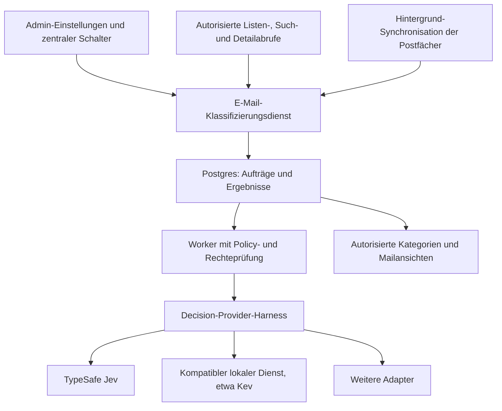

# Plan: zentrale E-Mail-Kategorisierung mit austauschbaren Entscheidungsmodellen

Stand: 2026-10-06. Untersuchte Codebasis: `e65644ecb`. Branch: `codex/email-classification-plan` im bestehenden Worktree `d6d2bb9a-41c2-47cf-ba77-cdbfa21fe3cf`.

Status: Architektur- und Umsetzungsvorschlag. Es wurde kein Produktcode verändert, kein Modell aufgerufen und keine Mail verarbeitet. Die Beschreibung des Nutzers passt zu **Jev von TypeSafe AI**; diese Zuordnung liegt dem Plan zugrunde.

## 1. Ziel und empfohlener Umfang

Ein Serveradministrator aktiviert die automatische Kategorisierung zentral für alle berechtigten Postfächer der Instanz. Persönliche und gemeinsame Workspace-Postfächer verwenden denselben Dienst. Nutzer müssen keinen eigenen Provider konfigurieren und erhalten keinen individuellen Aktivierungsschalter.

V1 umfasst Kategorien, Spamverdacht, Filter, eine nach Kategorien gruppierte Ansicht und manuelle Korrekturen. Standardmäßig ist die Funktion ausgeschaltet. Die erste Version sortiert innerhalb von Canvas mit virtuellen Ansichten; automatische Änderungen an Gmail-Labels, Outlook-Kategorien oder IMAP-Ordnern sind eine spätere, gesonderte Erweiterung. Mails bleiben über die normale Ordneransicht erreichbar.

Ein zentraler Schalter ist sinnvoll. Trotzdem muss die Administrationsoberfläche erkennen lassen, ob Mailinhalte an einen externen Dienst gehen oder auf einem selbst betriebenen Endpunkt verarbeitet werden. Ein Modellfehler darf eine wichtige Mail weder verschwinden lassen noch den normalen Postfachabruf blockieren.

## 2. Befund im aktuellen Repository

| Bereich | Aktueller Code und Konsequenz |
| --- | --- |
| Mailanbieter | `app/lib/email/service.ts` verbindet lokale Google-/Microsoft-OAuth- und SMTP/IMAP-Konten mit verwalteten Konten über `managed-client.ts`. Der KI-Provider muss unabhängig vom Mailanbieter gewählt werden. |
| Berechtigungen | `mailbox-access.ts` löst persönliche und gemeinsame Postfächer auf, einschließlich Kontoinhaber, Workspace und Lese-/Schreibrechten. Der Worker und die Ergebnis-API benötigen diese fachlichen Grenzen auch ohne Browser-Session. |
| Browserabruf | `/api/email/messages/list` und die Nachrichten-Detailroute autorisieren zuerst das Postfach und rufen anschließend den zentralen Maildienst auf. `EmailClient.tsx` lädt Seiten, Suchergebnisse und Hintergrundaktualisierungen. |
| Cache | `cache/read-through.ts` und `cache/store.ts` besitzen normalisierte Nachrichtenreferenzen und Postgres-Persistenz. Der SWR-Listenpfad gilt aktuell für lokale persönliche Standardlisten. Suche und Filter umgehen ihn; verwaltete Listen kehren vorher zurück; Workspace-Zugriffe erzwingen ihre Lesepolicy. Ein Cache-Hook allein würde große Teile des Produkts auslassen. |
| Nachrichtenidentität | `provider-message-identity.ts` und `cache/store.ts` behandeln IMAP mit Ordner + UIDVALIDITY + UID. Eine rohe UID oder ein RFC-Message-ID-Header ist kein globaler Primärschlüssel. |
| Inbox-Ereignisse | `inbox-events.ts` erfasst nur aktive Workspace-Mailboxbindungen, zuletzt bis zu 50 Inbox-Nachrichten pro Durchlauf. Historische Nachrichten vor der Bindung werden ausgelassen. Der interne Poll-Endpunkt führt anschließend die Automation-Queue aus. Ein allgemeiner Klassifizierungsworker ist damit noch nicht vorhanden. |
| Automationen | `workspace-email-automation-events.ts` erzeugt Agent-Runs aus Inbox-Ereignissen. Klassifizierung darf keinen kompletten Agent-Run pro Mail benötigen und keine Voraussetzung für bestehende Automationen werden. |
| Vorhandene E-Mail-KI | `ai-service.ts`, `ai-runtime.ts` und `mailbox-ai.ts` erzeugen Zusammenfassungen und Antworten über den geerbten Agent-Runtime. Für einen organisationsweiten Entscheidungsdienst brauchen wir eine eigene Providerwahl und ein geschlossenes Ergebnisschema. |
| Kategorien | `email-client-types.ts` enthält derzeit keine Klassifizierungsdaten. Providerordner können als Junk/Spam erkannt werden; eine allgemeine KI-Kategorisierung ist im untersuchten Mailcode nicht vorhanden. Inbox-Cases besitzen Status/Priorität, sind aber keine Kategorisierung sämtlicher Provider-Mails. |
| Administration | `requireInstanceAdmin` und die Settings-Komponenten liefern das Muster für zentrale Adminfunktionen. Der bestehende E-Mail-Bereich nutzt den Settings-Tab `system-email`. |
| Secrets | `/api/integrations/env` und der gemeinsame ENV-Speicher unterstützen System-, Organisations- und User-Bereiche. Die zentrale V1-Konfiguration verwendet System-Secrets; persönliche Providerkeys werden nicht automatisch übernommen. |
| Mobile | Die vorhandenen nativen APIs betreffen Inbox-Cases und Entwurfsprüfung (`email.review.v1`). Eine native vollständige Mailbox mit Kategorien ist ein eigener Clientumfang; das Backend wird dafür erweiterbar gehalten. |

## 3. Jev und offene Alternativen

Jev verarbeitet `state` plus vorgegebene `questions` über `POST /v1/systemone`. **Choice** wählt eine Kategorie und liefert eine Verteilung; **Noul** liefert die Wahrscheinlichkeit für eine Ja/Nein-Frage; **Score** bewertet anhand geordneter Kriterien. Mehrere Fragen können denselben Zustand verwenden. Das passt zu Kategorie + Spamfrage pro Mail. [Offizielle API](https://docs.typesafe.ai/api), [Quickstart](https://docs.typesafe.ai/introduction/quickstart).

`confidence` bei Choice/Score ist eine aus der Verteilung berechnete Größe. Noul liefert keinen separaten Confidence-Wert. Wir speichern Klassenwahrscheinlichkeit, Provider-Confidence und unsere Entscheidung getrennt. Auch ein hoher Modellwert ist kein gemessener Nachweis, dass die Klassifikation auf unseren Mails richtig liegt. [Confidence-Dokumentation](https://docs.typesafe.ai/confidence).

Für reproduzierbare Ergebnisse verwenden wir einen versionierten Modellnamen statt still wandernder Aliase. Zum Recherchezeitpunkt dokumentiert TypeSafe `jev-1.13.0`; die tatsächlich zurückgegebene Modellversion wird zusätzlich gespeichert. Modellwechsel benötigen eine neue Auswertung. [Modelle](https://docs.typesafe.ai/models).

| Kandidat | Eignung für den Harness |
| --- | --- |
| Jev / TypeSafe | Erster gehosteter Adapter für Choice und Noul; Score kann der allgemeine Vertrag ebenfalls abbilden. |
| [Kev](https://github.com/jaredpalmer/kev) | Selbst betreibbare Jev-ähnliche Modellfamilie mit TypeSafe-kompatibler `/v1/systemone`-API und Choice/Score/Noul. Bevorzugter Kandidat zum Belegen des Providerwechsels. Kompatibilität ersetzt keine Qualitätsprüfung auf unseren Mails. |
| [Open JEV](https://github.com/zhihz/openjev) | Forschungsalternative mit lokalen Choice/Binary-Ergebnissen auf Qwen. Das Projekt benennt relative Kandidatenwahrscheinlichkeiten und fehlende automatische Kalibrierung ausdrücklich. Eigener Adapter; keine ungeprüfte Gleichsetzung mit Jev. |
| [GLiNER2](https://github.com/fastino-ai/GLiNER2) | Schemaorientierte lokale Klassifikation/Extraktion mit anderer Schnittstelle. Später über einen separaten Adapter anschließbar; Fähigkeiten und Score-Semantik müssen explizit beschrieben werden. |

V1 liefert den TypeSafe-Adapter und einen konfigurierbaren, anhand von Vertragsfixtures geprüften System-One-kompatiblen HTTP-Adapter. Ein lokaler Modellserver bleibt ein separat betriebener Dienst. Wir installieren keine GPU-/Python-Runtime in den Notebook-Container. Ein realer Kev-Abnahmelauf kommt erst mit einem bereitgestellten Endpunkt.

## 4. Architektur

### 4.1 Allgemeiner Decision-Harness

Vorgeschlagene Dateien unter `app/lib/decision-models/`: `types.ts`, `registry.ts`, `service.ts` und `providers/`. Der Harness kennt keine Mailboxen, Postgres-Tabellen, Nutzerpräferenzen oder Aktionen wie Verschieben/Senden.

Der Vertrag enthält explizit:

- Zustand als begrenzten Text bzw. strukturierten Textdatensatz und ein versioniertes Fragenschema.
- Fragetypen `choice`, `binary` und `ordinal`, stabile Frage-/Kandidaten-IDs und Beschreibungstexte.
- Providerkonfiguration, Modellreferenz, Credential-Kontext, Timeout und AbortSignal als Eingaben.
- Typisierte Antworten, vollständige Verteilungen soweit verfügbar, tatsächliches Modell, Laufzeit, Usage und optionale Provider-Confidence.
- Deklarierte Fähigkeiten, Kontextlimits, Wahrscheinlichkeitstyp und Kalibrierungsreferenz. Keine erfundenen Wahrscheinlichkeiten für Provider, die nur Labels zurückgeben.
- Strukturierte Fehler: fehlende Konfiguration, ungültiger Vertrag, nicht unterstützte Fähigkeit, Timeout, Rate Limit und Providerfehler.

Der E-Mail-Dienst verlangt zunächst `choice` + `binary`. Ein binärer Klassifikator darf eine dokumentierte Ja/Nein-Choice abbilden; ein Adapter muss diese Abbildung offenlegen. Ein generatives Modell mit JSON-Ausgabe wäre ebenfalls anschließbar, aber selbst ausgegebene Confidence-Zahlen werden nicht als kalibrierte Wahrscheinlichkeit behandelt.

Der Adapter erledigt Transport und Formatumwandlung. Der Harness validiert Antworttypen, IDs, Wertebereiche und Verteilungssummen. E-Mail-Orchestrierung entscheidet über Wiederholungen, Abbruch, Rechte, Schwellen und Persistenz. Ein Provider darf keine Produktzustände verändern. V1 hat keinen stillen Fallback auf einen anderen externen Anbieter.

### 4.2 E-Mail-Dienst und Datenmodell

Unter `app/lib/email/classification/` liegen `schema.ts`, `policy.ts`, `settings-store.ts`, `mailbox-registry.ts`, `store.ts`, `service.ts`, `worker.ts` und `availability.ts`. Die Namen sind Vorschläge, keine bereits implementierten Module.

Postgres speichert vier fachliche Bereiche:

| Bereich | Inhalt |
| --- | --- |
| Zentrale Einstellungen | Instanz-ID, Aktivierung, Provider-/Modellreferenz, Schemaprofil, Schwellenprofil, Limits und monotone Revision; Änderungen mit `expectedRevision`, Änderungszeit und Admin-ID. |
| Mailbox-Synchronisation | Kontoinhaber, tatsächlicher Berechtigungsbereich, `accountSource: local/managed`, Account-ID, Bindungsrevision, Provider, letzter erfolgreicher Sync, Cursor und Abdeckungsstatus. Verwaltete Account-IDs dürfen nicht ungeprüft eine lokale `email_accounts`-Zeile voraussetzen. |
| Klassifizierungsaufträge | Nachrichtenreferenz, Schema-/Modell-/Policyrevision, Fingerprint, Zustand, Versuche, `nextAttemptAt`, Lease und Claim-Token. Eindeutiger Auftrag pro Nachricht und Konfigurations-/Inhaltsstand. |
| Ergebnisse und Korrekturen | Kategorieverteilung, Spamwert, Provider-Confidence, Score-Semantik, ausgewerteter Inhaltsumfang, Modell-/Adapter-/Kalibrierungsversion, Zeit, abgeleitete Entscheidung und davon getrennte manuelle Korrektur mit Version. |

Ergebnisse sind unabhängig von kurzlebigen Cacheeinträgen und von Automation-Inbox-Cases. Gemeinsame Postfächer erhalten ein Ergebnis pro Mail, das alle berechtigten Nutzer sehen; persönliche bleiben an den Inhaber gebunden. Kein Schlüssel hängt vom zufällig aufrufenden Workspace-Mitglied ab.

Identität: Instanz/Berechtigungsbereich + Inhaber + Accountquelle + Account-ID + normalisierte Providerreferenz. Bei IMAP sind Ordner, UIDVALIDITY und UID Pflicht. Fingerprints berücksichtigen Schema, normalisierten Inhalt, Modell und Konfiguration; Änderungen an gelesen/ungelesen lösen keine neue KI-Auswertung aus. Manuelle Korrekturen überleben einen Providerwechsel. Bei Ordnerwechsel, UIDVALIDITY-Wechsel oder neuem Provider-ID muss die Referenz neu geprüft werden.

Migrationen folgen den bestehenden Postgres-Startmigrationen. Einstellungen liegen für dieses Feature ebenfalls in Postgres, damit Ausschalten und spätes Worker-Ergebnis atomar gegeneinander geprüft werden können. Admin-/Availability-Muster werden wiederverwendet; es gibt keine zweite kanonische Konfiguration in `server-settings.ts`.

### 4.3 Verarbeitung und vollständige Abdeckung

1. Ein eigener Discovery-Dienst registriert aktive lokale und verwaltete Postfächer und prüft aktuelle Bindungen und Besitzverhältnisse. Reine SMTP-Konten ohne lesbare Inbox werden ausgelassen.
2. Ein serverseitiger Worker synchronisiert neue eingehende Nachrichten auch bei geschlossenem Browser. Paging/Cursor, überlappende Abruffenster und Deduplizierung verhindern, dass ein hohes Mailaufkommen hinter einem festen Top-50-Fenster verschwindet. Beim erstmaligen Einschalten wird ein begrenzter jüngerer Inbox-Bestand erfasst; eine komplette historische Analyse bleibt eine explizite Adminaktion mit Mengen-/Kostenlimit.
3. Listen-, Such- und Detailwege ergänzen nach ihrer bestehenden Autorisierung gespeicherte Klassifizierungsdaten und legen fehlende Aufträge idempotent an. Eine gemeinsame Wrapper-Schicht deckt alle Rückgabepfade ab. Rohabrufe für Worker, Reply-Watcher und bestehende Automationen bleiben nutzbar; der Worker darf sich beim Nachladen nicht erneut selbst einreihen.
4. Der Worker beansprucht Aufträge mit Postgres-Leases/Claim-Token. Vor Inhaltsabruf, Provideraufruf und Ergebnisübernahme prüft er Aktivierung, Konfigurationsrevision, aktives Konto, Eigentümer/Organisation und aktuelle Bindung. Die Klassifizierung ist ein expliziter zentraler Dienstauftrag und verwendet keine zufällige Chat-Modellauswahl eines Nutzers.
5. Bereits autorisiert vorhandene Inhalte werden bevorzugt. Fehlen sie, verwendet der Worker die vorhandenen Maildienste mit der für Hintergrundverarbeitung geltenden Lesepolicy. Ein Cachetreffer hebt die Policy nicht auf. Klassifizierung markiert Mails nicht als gelesen.
6. Pro Mail geht begrenzter bereinigter Text an den Provider: Absender, Betreff und Haupttext; bei HTML-only-Mails sichere Textextraktion. Anhänge, externe Bilder und verlinkte Webseiten werden nicht nachgeladen. Kürzung und verwendeter Umfang werden festgehalten; ein Snippet-Ergebnis wird nicht als vollständige Inhaltsprüfung ausgegeben.
7. Wiederholungen sind begrenzt, mit Backoff/Jitter und `Retry-After`. Limits gelten pro Provider und Instanz sowie fair pro Postfach. Ein Circuit Breaker verhindert wiederholte Aufrufe eines ausgefallenen Dienstes. Neue Konfigurationen werden nicht nachträglich in einen laufenden Auftrag gemischt.
8. Ergebnisse werden in einer Transaktion nur für den noch gültigen Claim, die aktuelle Bindung und Policyrevision publiziert. Worker-Ausfall verliert keine Aufträge; ungültige/späte Resultate verändern keine Kategorie.

Der Worker wird über den vorhandenen Serverstart-/Wartungspfad gestartet, mit einem Timer pro Prozess und Datenbankkoordination über Prozesse hinweg. Ein interner Wartungsendpunkt kann ergänzen, ersetzt aber nicht den nachgewiesenen regelmäßigen Scheduler. Der vorhandene Automation-Poller bleibt ein unabhängiger Ablauf.

### 4.4 Zentraler Schalter und Settings

Admin-Karte **„KI-Kategorisierung für E-Mail-Postfächer“** im bestehenden E-Mail-Einstellungsbereich. Sichtbar und schreibbar nur für Instanzadministratoren; API durch `requireInstanceAdmin` geschützt. V1 gilt instanzweit für alle berechtigten Nutzer, ohne User-Overrides. Mailbox-/Ergebnisdaten bleiben trotzdem sauber organisations- und inhabergebunden.

Die Karte bietet Aktivierung, Providerwahl, versioniertes Modell, sicheren Konfigurationsstatus, Verbindungstest mit synthetischem Inhalt und einen Hinweis auf externe oder selbst betriebene Verarbeitung. Endpunkt, Schwellen, Kategorienbeschreibung, Mengenlimits und historische Analyse können hinter erweiterten Einstellungen liegen. API-Keys erscheinen ausschließlich im zentralen Secrets-Bereich.

Geplante APIs: `GET/PATCH /api/admin/email-classification/settings`, `POST /api/admin/email-classification/test`, eine authentifizierte Availability-API, autorisierte Kategorien-/Ergebnisabfragen und ein Korrektur-Endpunkt. Jede Mailabfrage löst ihre Account-/Workspace-Rechte selbst auf; eine vom Client gelieferte Organisations-ID genügt nicht.

| Zustand | Verhalten |
| --- | --- |
| Aus / Einstellung fehlt | Keine automatische Discovery, keine Aufträge, keine Provideraufrufe und keine KI-Sortierung. Normale Postfachansicht. |
| Aktiv und bereit | Neue Mails werden im Hintergrund analysiert; vorhandene, gültige Ergebnisse sofort angezeigt. |
| Aktiv, Konfiguration fehlt | Sichtbarer Adminhinweis mit `/settings?tab=secrets`; Mails bleiben unverändert lesbar. Aktivierung setzt validierte Konfiguration voraus, später entfernte Credentials werden als Störung angezeigt. |
| Provider gestört | Bestehende gültige Kategorien bleiben verfügbar; neue Mails zeigen „Noch nicht kategorisiert“ bzw. ausstehende Analyse. Keine erzwungene Ersatzkategorie. |
| Ausschalten während eines Laufs | Revision erhöhen, wartende Aufträge pausieren, laufende Requests bestmöglich abbrechen. Bereits versandte Inhalte lassen sich nicht zurückholen; spätere Antworten werden nicht mehr angewendet. Filter und Ansichten wechseln zurück. |
| Wieder einschalten | Gültige Ergebnisse wiederverwenden, offene Aufträge kontrolliert fortsetzen. Veraltete Modell-/Schemastände als solche behandeln. Keine unbegrenzte Neuverarbeitung des Bestands. |

Availability wird nach Änderungen und bei Fokuswechsel aktualisiert. Der Server prüft den Schalter unabhängig vom UI. Frühere Ergebnisse werden beim Ausschalten nicht automatisch gelöscht; Aufbewahrung/Löschung ist eine gesonderte Datenfunktion mit Anbindung an Konto-/Nutzerlöschung und Sperrung bei Disconnect.

Für V1 liegen neue Keys wie `TYPESAFE_API_KEY` bzw. der konfigurierte kompatible Providerkey im Systembereich von `Canvas-Secrets.env`. Die Secrets-Kategorisierung muss neue Keys erkennen. Formulare verwenden `/api/integrations/env` mit PATCH bzw. Revision für Textänderungen; serverinterne Credentials nutzen denselben scoped ENV-Service, keine neue Datei und keinen User-/Prozess-ENV-Fallback. Normale Availability-Antworten enthalten weder Schlüssel noch interne Providerfehler.

### 4.5 Cache mit Klassifizierungsdaten anreichern

Die Mail-Listen und Detailantworten werden auch bei einem Cachetreffer um einen kompakten `classification`-Block ergänzt: wirksame Kategorie, Spamverdacht, Auswertungszustand, manuelle Korrektur, Ergebnisrevision und Gültigkeit für die aktuelle Policy-/Schema-/Modellrevision. Vollständige Verteilungen und Diagnoseinformationen werden bei Bedarf separat geladen. Damit erhält die UI ihre Badges und Gruppen direkt mit der bestehenden Mailantwort, ohne einen Provider- oder KI-Aufruf pro sichtbarer Nachricht.

Der bestehende Cache übernimmt neue Felder nicht automatisch: `metadataForMessage`, `detailForMessage` und die `fallback*Message`-Funktionen in `cache/read-through.ts` bilden ausdrücklich bekannte Felder ab. Ein beliebiges zusätzliches JSON-Feld würde beim Speichern bzw. Rekonstruieren verloren gehen. Vor einer tatsächlichen Anpassung dieser Symbole ist ihre Impact-Analyse erforderlich.

**V1 verwendet eine gemeinsam geladene Projektion aus Mailcache und dauerhaften Klassifizierungsergebnissen.** Die Listen werden bereits mit `getMessages` gesammelt gelesen. Klassifizierungen werden über normalisierte Nachrichtenreferenzen ebenfalls gesammelt und indiziert zugeladen bzw. per Join ergänzt; keine Datenbankabfrage pro Mail und keine zweite unabhängig gepflegte Ergebniskopie im Provider-Metadaten-JSON. Ein Mailprovider-Refresh kann dadurch weder KI-Ergebnisse noch manuelle Korrekturen überschreiben. Ein Cachemiss rekonstruiert die Anreicherung aus der dauerhaften Ergebnisablage, ohne erneut zu klassifizieren.

Mail-Frische und Klassifizierungsrevision bleiben getrennt. Ein neues Ergebnis oder eine manuelle Korrektur aktualisiert die Ergebnis-/Ansichtsrevision; es invalidiert nicht pauschal Mailtexte, Anhänge oder den gesamten Mailboxcache. Providerabruf und Ergebnisübernahme dürfen sich gegenseitig nicht als frischer markieren. Inhalt, Identität und aktuelle Policy entscheiden darüber, ob eine Klassifizierung noch passt; gelesen/ungelesen allein macht sie nicht ungültig.

Kategorienseiten und Zähler können zusätzlich kurzzeitig gecacht werden. Ihre Schlüssel enthalten den tatsächlichen Mailbox-/Berechtigungsbereich, Ordner, Filter, Sortierung, Cursor sowie Mailindex- und Klassifizierungsrevision. Sie werden nach neuen Ergebnissen, Korrekturen und Änderungen am synchronisierten Bestand gezielt erneuert. Sie beruhen auf dem vollständigen jeweils synchronisierten Index; eine normale Provider-Listenseite ist dafür keine ausreichende Grundlage. Eine zusätzliche materialisierte Projektion kommt erst bei nachgewiesenem Bedarf aus Latenzmessungen hinzu.

Jeder Cacheabruf bleibt aktuell autorisiert. Workspace-Lesepolicies werden auch bei Anreicherung erzwungen; die neuen Daten schalten den bisher eingeschränkten SWR-Pfad nicht pauschal frei. Dieselbe Ergebnisanreicherung gilt außerhalb des Caches für Suchergebnisse, Workspace- und verwaltete Abrufe. Ausschalten und Policy-/Modellwechsel werden vor Ausgabe geprüft, damit alte Cachewerte keine deaktivierte KI-Sortierung reaktivieren. Ein Fehler beim Laden der Zusatzdaten lässt die normale Mailansicht funktionsfähig.

Abnahme: Cachetreffer mit Kategorien ohne KI-Aufruf, eine Sammelabfrage statt N Einzelabfragen, Cachemiss mit erhaltenen Ergebnissen, Korrektur während Provider-Refresh, kein Verlust bei Cachebereinigung, korrekte Kategorienzähler über mehrere Seiten, sofortige Deaktivierung trotz warmem Cache sowie unveränderte persönliche und Workspace-Zugriffsgrenzen. Die Latenz wird mit und ohne Anreicherung gemessen; eine konkrete Beschleunigung ist erst nach Umsetzung und Messung bestätigt.

## 5. Kategorien, Spam und UI

Startschema: **Korrespondenz**, **Rechnungen/Belege**, **Support**, **Newsletter**, **Werbung**, **Benachrichtigungen**, **Sonstiges**. Kriterien müssen Überlappungen definieren, etwa Supportanfrage gegenüber allgemeiner Korrespondenz. Stabile technische IDs bleiben von übersetzten Anzeigenamen getrennt. Änderungen am zentralen Schema erzeugen eine neue Version.

**Spam ist eine unabhängige binäre Bewertung**, keine konkurrierende Inhaltskategorie. Eine Mail kann beispielsweise Rechnung und Spamverdacht zugleich sein. Bestellte Newsletter sind nicht automatisch Spam. „Sonstiges“ bedeutet fachlich andere Kategorie; „Unsicher“ und „Noch nicht analysiert“ sind unterschiedliche Auswertungszustände.

Die deterministische Policy verwendet kategorien-/providerbezogene Schwellen, den Abstand der besten Kandidaten und ein separat validiertes Spamprofil. Unvollständige oder nicht kalibrierte Ergebnisse dürfen die automatische Spam-Sortierung nicht aktivieren. Es gibt zunächst keine als universell richtig behaupteten 80-/95-/99-Prozent-Grenzen. Die Schwellen entstehen aus der Auswertung unseres Maildatensatzes.

Im Mailclient erscheinen Kategorien und „Spamverdacht“ zusätzlich zu den bestehenden Ordnern. Mails können nach Kategorie gruppiert werden; innerhalb der Gruppe bleibt die zeitliche Sortierung. Die normale Inbox zeigt weiterhin alle Mails. Eine geprüfte Klassifikation kann eine Nachricht der virtuellen Spamverdacht-Ansicht zuordnen; ungeklärte Ergebnisse bleiben ohne automatische Umleitung sichtbar. Keine automatische Löschung und kein automatischer Versand.

Benutzer können die Kategorie korrigieren und „Kein Spam“ wählen. Persönliche Korrekturen gelten im eigenen Postfach; Workspace-Korrekturen gelten gemeinsam und benötigen Schreibberechtigung. Read-only-Nutzer sehen die Ergebnisse. Korrekturen verwenden `expectedVersion` und werden vom Worker nicht überschrieben; optionales späteres Training ist ein eigener Prozess.

**Filter und Zähler müssen serverseitig über den synchronisierten Nachrichtenbestand arbeiten**, nicht nachträglich die gerade geladenen zehn Mails filtern. Dafür braucht der Klassifizierungsindex aktuelle Nachrichtenreferenzen und begrenzte Listenmetadaten unabhängig vom SWR-Cache. Kategorieabfragen liefern stabile Cursor, prüfen aktuelle Mailboxrechte und entfernen/verbergen nicht mehr erreichbare Referenzen. Zähler beschreiben ihre Abdeckung: analysiert, ausstehend, historisch nicht erfasst und letzter erfolgreicher Sync. Ein unvollständiger Sync darf nicht als vollständiges Postfach ausgegeben werden.

Suche, Kategorien und Ordner müssen klar definierte kombinierbare Filter haben. Falls ein verwalteter Provider den nötigen Such-/Pagingvertrag nicht unterstützt, zeigt die UI die Einschränkung; sie erfindet keine vollständige Trefferzahl. V1 benötigt keine neue Control-Plane-Klassifizierungslogik, nutzt aber nur tatsächlich verfügbare Mailabrufverträge.

Native Clients können später denselben Ergebnisvertrag verwenden. Bestehende Inbox-Case-Prioritäten und Entwurfsprüfungen werden nicht automatisch aus der neuen Klassifikation umgeschrieben.

## 6. Qualität und Sicherheitsgrenzen

Jevs eigene Dokumentation beschreibt unter anderem Beeinflussbarkeit durch adversariale Inhalte, Ablenkung durch langen irrelevanten Kontext und Abhängigkeit von der Reihenfolge der Choice-Optionen. Deshalb gehören präzise Kriterien und Angriffsmails in unsere Evaluation. Ein geschlossenes Schema verhindert keine falsche semantische Entscheidung. [Bekannte Grenzen von Jev](https://docs.typesafe.ai/model-jaggedness/jev-1.13).

Mailinhalt ist untrusted input: Er darf weder Fragenschema, Providerendpunkt, Schlüsselbereich noch Aktionen bestimmen. Der Administrator konfiguriert erlaubte Providerziele. Requests erfolgen serverseitig; Redirects und Zieladressen werden geprüft. Selbst betriebene private Endpunkte werden ausdrücklich konfiguriert. Logs/Metriken erfassen Status, Usage, Latenz und opaque IDs, keine Mailtexte oder Rohantworten mit sensiblen Inhalten. Administratorstatus gibt keinen zusätzlichen Lesezugriff auf persönliche Mails.

Ein versionierter Evaluationssatz enthält repräsentative deutsch-/englischsprachige Mails, HTML-only, kurze/gekürzte Texte, Newsletter, Rechnungen, legitime Werbung, Spam, Grenzfälle und Prompt-Injection. Synthetische bzw. freigegebene anonymisierte Beispiele zuerst; echte Postfächer werden nicht für einen Benchmark an externe Dienste geschickt, ohne dass das im freigegebenen Betriebsumfang liegt.

Getrennte Entwicklungs-, Kalibrierungs- und Testdaten verhindern, dass die gewählten Schwellen nur die Trainingsbeispiele gut treffen. Gemessen werden Kategoriequalität pro Klasse/Sprache, falsch als Spam markierte legitime Mails, Spam-Precision/Recall, Anteil unsicherer Ergebnisse, Brier Score/Calibration Error, Latenz und Kosten. Ergebnisse gelten für genau Modell-, Schema- und Providerstand. Der erste Rollout vergleicht intern im Beobachtungsmodus; automatische Spam-Sortierung wird erst nach einem festgelegten und bestandenen Qualitätskriterium freigegeben.

## 7. Auswirkungen und vorgeschlagene Umsetzungsreihenfolge

GitNexus wurde für diesen Worktree mit `--index-only` neu erstellt. Upstream-Analyse des aktuellen Codes, ohne Testdateien:

| Symbol | Direkte Abhängigkeiten | Weitere Reichweite | Bewertung |
| --- | --- | --- | --- |
| `listEmailMessages` | 2 im Graph | 4 Symbole insgesamt, E-Mail/Todo | LOW |
| `readEmailMessage` | 8 | 17 Symbole, drei gruppierte Prozess-Einstiege; Mailaktionen, Anhänge, Todo, Agenten/Compose | CRITICAL |
| `resolveEmailMailboxAccess` | 18 | 24 Symbole, zwei gruppierte Prozess-Einstiege; Lesen, Anhänge, Draft/Send | HIGH |
| `scheduleBackgroundMaintenance` | 1 | 2 Symbole | LOW |

Das sind Grenzen des Callgraphen, keine Vollständigkeitsgarantie: Quellcodeprüfung findet zusätzlich dynamische Poller-/Toolaufrufe. Vor jeder tatsächlichen Symboländerung ist Impact erneut auszuführen. Bestehende Abruf-/Zugriffsverträge werden möglichst verwendet; neue Orchestrierung und Ergebnisanreicherung liegen in eigenen Modulen. Vor jedem Commit `detect_changes()`.

Die Umsetzung erfolgt sequenziell; jede Phase wird fertig geprüft und separat committet, bevor die nächste beginnt:

1. **Vertrag und Policy:** Fragetypen, Providerfähigkeiten, normalisierte Resultate, Startschema, zentrale Aktivierungssemantik und versionierter Evaluationssatz. Abnahme: austauschbare Adapter ohne Mail-/Datenbankwissen, kein impliziter Fallback.
2. **Persistenz und Rechte:** Postgres-Migration, zentrale Settingsrevision, Registry für lokale/verwaltete Konten, Job-Leases, Ergebnisse und manuelle Overrides. Abnahme: Deduplizierung, Besitzer-/Organisationsgrenzen, Disconnect/Löschung, Toggle- und Claim-Rennen.
3. **Provideranschluss:** TypeSafe und kompatibler HTTP-Adapter, scoped Secrets, Limits/Abbruch, strenge Antwortvalidierung. Abnahme: Vertragsfixtures, Konfigurationsfehler, 429/529/Timeout und unsichere Resultate; reale Providerabnahme getrennt dokumentieren.
4. **Hintergrundablauf und Cache-Anreicherung:** Serverstart, faire Discovery/Synchronisation für persönliche und gemeinsame sowie lokale und verwaltete Postfächer, Nachladen und gesammelte Resultatanreicherung von Listen/Details. Abnahme: geschlossener Browser, mehr als ein Abruffenster, Neustart, Modellwechsel, Ausschalten während Request sowie warmem Cache, Erhalt manueller Korrekturen bei Provider-Refresh und gemessene Abruflatenz; keine Änderung des Gelesenstatus.
5. **Adminoberfläche:** Karte im E-Mail-Settingsbereich, Schalter, Providerwahl/-test und sichere Availability. Abnahme: Admin-only UI/API, Default aus, sofortige serverseitige Sperre, Secrets-Link und Konfigurationskonflikte.
6. **Mailbox-UI:** Badges, Kategoriengruppen, autorisierte serverseitige Filter/Zähler, Abdeckungsanzeige und Korrekturaktionen. Abnahme: mehrere Seiten, Suche/Filter, Account-/Workspacewechsel, read-only, responsive UI, Modellwechsel und Ausschalten bei aktiver Kategorienansicht.
7. **Qualität und Rollout:** Providervergleich, Schwellenprofile, zunächst Beobachtung und anschließend kategorisierte Ansichten. Spam-Sortierung erst mit bestandener eigener Evaluation. Betriebsdokumentation mit Limits, Recovery und Datenaufbewahrung.

Fokussierte Tests ergänzen die vorhandenen Mailbox-, persönlichen Boundary-, Cache-, Identity-, AI-Scope-, Inbox- und Mobile-Vertragstests. Danach Typecheck, relevante Lints und `npm run build`. UI-/End-to-End-Abnahme ist erforderlich; Playwright/Chrome DevTools werden nach der Repositoryregel erst nach ausdrücklicher Freigabe genutzt. Für einen benötigten lokalen Stack gilt `canvas-local-team-seat-dev`; Container werden nur bei explizitem Auftrag gebaut, nach erfolgreichem Build und ohne parallele Teststacks.

Dieser Planungslauf hat keine Build-/UI-/Providerabnahme ausgeführt. Er liefert den überprüfbaren Architekturplan; die Implementierungsphasen sind noch offen.
