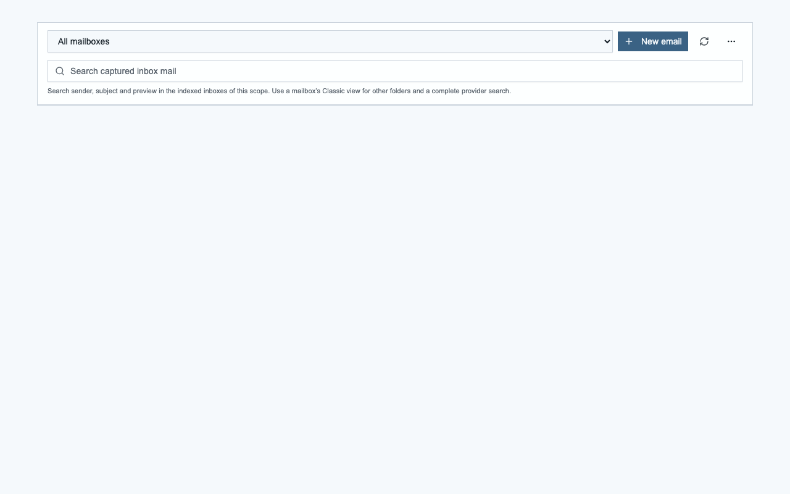
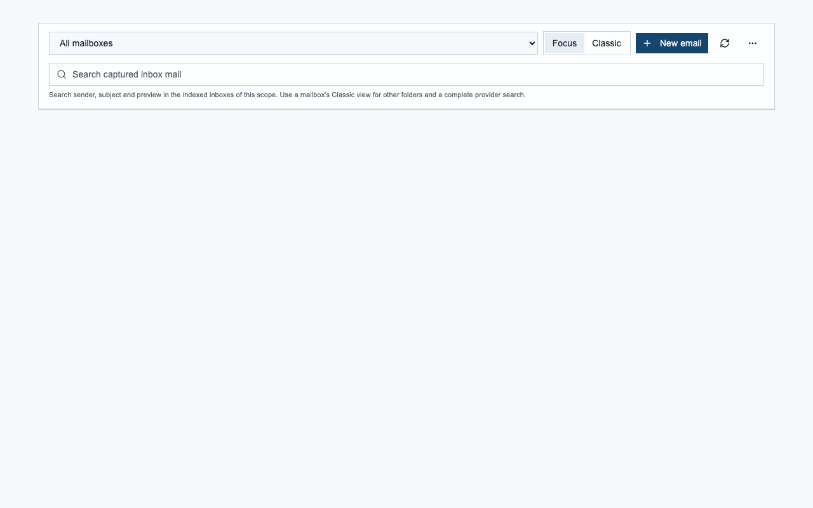

# Email Focus visibility validation

Date: 2026-10-09. Result: passed.

When email preparation is centrally disabled, the header omits the Focus/Classic
switch and its disabled-preparation notice. Central activation restores both
choices. Processing readiness is separate: a temporary provider failure must not
hide the switch or cached assessments while preparation remains activated.

## Source and build checks

- `npm run test:email:classification:focus-ui`: passed, including central
  activation/deactivation and both mode callbacks.
- `npm run test:email:classification:experience`: passed.
- Focused ESLint for the header and its existing UI test: passed.
- `NODE_ENV=production npm run build`: passed, including TypeScript and the
  existing license/dictation prebuild gates. The fresh worktree had no runtime
  environment configuration, so route collection logged missing auth/base-URL
  warnings. This build is not evidence of a configured authentication service.
- GitNexus found the expected header/test changes and no affected execution
  flows in the change analysis. Upstream analysis identifies the E-Mail client
  and its dashboard/page consumers.

## Chromium component checks

The actual `EmailFocusHeader`, shared UI components, EN/DE translations and
application CSS were loaded in a temporary React fixture. The fixture uses a
font fallback because the Next.js font loader is outside this component test.
Eight combinations passed: EN/DE, desktop 1280 x 800/mobile 390 x 844, light/dark.
Twenty-four settled viewport screenshots were inspected.

- Disabled preparation: neither mode button nor the central-disabled notice
  appears. Mailbox selection, search, compose, refresh and appearance still work.
- Enabled preparation: accessible names and mutually exclusive `aria-pressed`
  values agree with the displayed Classic -> Focus -> Classic click cycle.
- Central deactivation after selecting Focus removes the complete switch.
- Mailbox selection, search with accents/emoji, compose/refresh callbacks and
  entering/exiting distraction-free mode pass their interaction roundtrips.
- `controlsOnly` with disabled preparation has one mailbox selector and no
  duplicate search, mode switch, compose, refresh or appearance controls.
- Loading/unavailable-compose states, long mailbox labels and an active
  temporary source-catalog error remain usable.
- No clipped buttons, overlapping/offscreen controls, horizontal overflow or
  browser runtime errors were found. Mobile controls wrap within the viewport.

This evidence covers the changed browser component. It does not establish a
complete application journey, live provider behavior or deployed production
acceptance. No application server or container was started; Chromium was closed.

## Screenshots

| Preparation | Desktop, English, light | Mobile, German, dark |
| --- | --- | --- |
| Disabled |  |  |
| Enabled, Focus selected |  |  |
