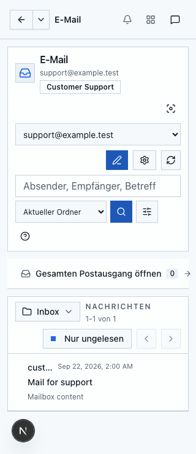
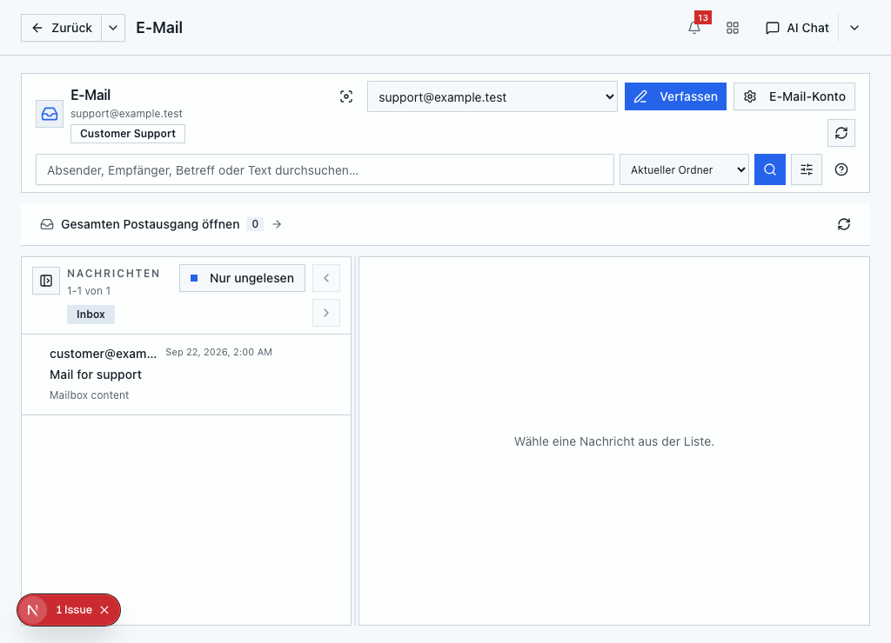
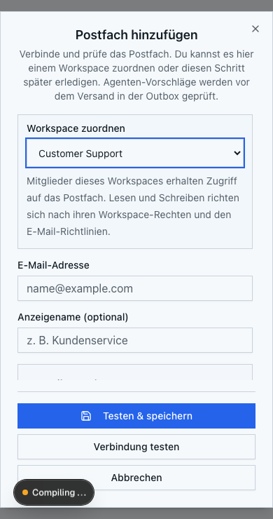

# E-Mail-Einrichtung, Zuordnung und Onboarding

Stand: 22. September 2026. Ausgangsaudit gegen `c9168e618` (inklusive PR #146); Umsetzung auf `codex/email-setup-audit`, mit `origin/main` bis `ed60b12d8` abgeglichen.
Die folgenden Abschnitte dokumentieren den ursprünglichen Befund. Die Umsetzung und Abnahme stehen am Ende dieses Dokuments.

## Ergebnis des Ausgangsaudits

Persönliche Konten, Business-Postfächer und Systemversand sind als verschiedene Konzepte vorhanden. Die zentrale E-Mail-App führt sie aber noch nicht durchgängig zusammen. Besonders die persönliche Kontoverwaltung trennt den Business-Scope nicht in allen Schreib- und Standardauswahlpfaden. Das muss vor einer bloßen Erweiterung des Kontoselektors korrigiert werden.

## Ablauf vor der Umsetzung

| Art | Einrichtung und Zuordnung | Aktuelle Nutzung |
| --- | --- | --- |
| Persönlich | Angemeldeter Nutzer verbindet Google oder SMTP/IMAP in der E-Mail-App oder unter `/settings?tab=system-email`. Microsoft-Code existiert, die Auswahl ist derzeit ausgeblendet. | Persönliche Konten im Kontoselektor, persönliches Hauptkonto, eigene Richtlinien. Eine berufliche Adresse wird durch ihre Domain nicht automatisch zum gemeinsamen Postfach. |
| Business / Workspace | Organisationsadmin verbindet ein SMTP/IMAP-Postfach in den E-Mail-Einstellungen. Workspace-Verwaltung ordnet es einem Workspace derselben Organisation zu. | Workspace-Agenten und Review/Outbox nutzen die Zuordnung. Die normale Ordner-/Nachrichtenansicht der E-Mail-App listet diese Konten nicht für Workspace-Mitglieder. |
| Systemversand | Instanzadmin konfiguriert System-SMTP separat. | Plattformbenachrichtigungen, kein auswählbares Benutzerpostfach. |

Eine zusätzliche API kann ein persönliches Konto einem Workspace zuordnen. Diese verlangt Verwaltungsrecht am bisherigen und neuen Workspace und belässt den Konto-Scope auf `personal`. Die Sichtbarkeit der dadurch freigegebenen Inhalte und Aktionen muss vor einem prominenten UI-Einstieg ausdrücklich erklärt werden; eine Zuordnung darf nicht als bloße persönliche Sortierung dargestellt werden.

## Bestätigte Lücken im Ausgangsstand

### P1: Persönliche Kontoverwaltung muss Business-Konten ausschließen

- `app/lib/email/account-store.ts`, `ensurePrimaryEmailAccount`: Nach Entfernen des persönlichen Hauptkontos kann das neueste aktive Business-Konto desselben Admins zum persönlichen Hauptkonto werden.
- `getEmailAccountForUser` ohne ID, `hasActivePrimaryEmailAccount` und `setPrimaryStoredEmailAccount` berücksichtigen den Konto-Scope ebenfalls nicht durchgehend.
- `upsertSmtpEmailAccount` sucht bestehende Konten nach Eigentümer/Adresse bzw. ID ohne persönliche Scope-Grenze. Die persönliche Einrichtung derselben Adresse kann deshalb die zentralen Business-Zugangsdaten ändern. Der zentrale Business-Pfad verhindert die umgekehrte Kollision bereits.
- Kein nachgewiesener organisationsübergreifender Zugriff: Das Problem betrifft die Vermischung zweier Rollen desselben Kontoeigentümers.

**Änderung:** Persönliche Verwaltung und Standardauswahl explizit auf persönliche Konten begrenzen, Scope-Kollisionen vor Schreiben von Secrets ablehnen. Bestehende fehlerhafte Hauptkonto-Markierungen bereinigen. Nicht pauschal den internen Lookup für explizite IDs einschränken: Berechtigte Workspace-Transporte verwenden ihn mit dem serverseitig ermittelten Kontoeigentümer.

### P1: Gemeinsamer Postfachzugriff fehlt in der E-Mail-App

- `EmailClient.loadAccounts` lädt `/api/email/accounts`.
- `service.listEmailAccounts` und `account-store.listEmailAccountRecordsForUser` liefern persönliche Konten. Das ist für persönliche Einstellungen richtig, für eine zentrale Postfachübersicht unvollständig.
- `email-client-types.EmailAccount` und `EmailMailboxHeader` besitzen keinen expliziten persönlichen/Workspace-Kontext oder Workspace-Namen.
- Ordner, Suche, Lesen, Anhänge und Aktionen laufen über den persönlichen Benutzerkontext. Nur Business-Konten in die Liste aufzunehmen reicht deshalb nicht.
- `workspace-email-tools.ts` hat bereits einen separaten, berechtigungsgeprüften Zugriff mit `accountOwnerId`; dieser ist Referenz für die gemeinsame Auflösung, keine Erlaubnis zur ungeprüften Übernahme einer User-ID vom Client.

**Änderung:** Separaten Postfachkatalog für die App einführen. Persönliche Verwaltungslisten bleiben privat. Ein serverseitiger Resolver prüft pro Operation Session, Scope, aktive Zuordnung, Organisation und Workspace-Rechte. Er liefert Zugriffskontext und Fähigkeiten für Lesen, Schreiben, Review und Verwaltung. Nutzer-/Workspace-Kontext gehört auch in Cache-Schlüssel und Deep Links.

### P2: Fehlende Verbindung und verlorene Verbindung werden vermischt

- `listEmailAccountRecordsForUser` listet nur `active`; abgelaufene Konten verschwinden statt als reparierbar angezeigt zu werden.
- `EmailClient` zeigt bei leerer Kontoliste unmittelbar das persönliche Setup. Ein Nutzer mit ausschließlich Business-Zugang bekommt damit den falschen Einstieg.
- `loadAccounts` setzt bei Fehlern den Fehlerzustand, aber der frühe Leerzustand rendert diesen Fehler nicht. Die eingebettete Einstellungskarte lädt separat und kann eigene Fehler anzeigen; der App-Ladefehler selbst bleibt verborgen.
- Ein SMTP-Konto ohne IMAP ist ein gültiger Sendekanal und darf nicht wie ein leeres oder defektes Postfach wirken.

**Änderung:** Zustände unterscheiden: Laden, Ladefehler mit Wiederholen, kein Zugang, nur persönliche Konten, nur Workspace-Konten, abgelaufene Verbindung, Send-only. Defekte Konten bleiben in einer sicheren Status-/Verwaltungsübersicht sichtbar, dürfen aber keine Provider-Operationen auslösen.

### P2: Onboarding und Dokumentation sind nicht durchgängig

- Der Start-Wizard richtet Benutzer/Lizenz ein; seine E-Mail-Adresse ist keine Postfachverbindung.
- `GettingStartedCard` verlinkt Notebook, Automationen und Einstellungen, aber keinen E-Mail-Einstieg.
- `EmailShell` nennt `hintPage="emails"`; `hint-config.ts` definiert diese Seite nicht. Eine vorbereitete E-Mail-Tour existiert damit noch nicht.
- Produktdocs nennen teilweise nur „Settings → Integrations“. Die Oberfläche liegt inzwischen im Tab `system-email`; der alte Link funktioniert nur mit dem passenden `section=emailAccounts`-Alias.
- Business-Einrichtung und anschließende Workspace-Zuordnung sind getrennte Schritte ohne durchgängige Führung.

## Zielablauf aus Nutzersicht

1. E-Mail öffnen: vorhandene berechtigte Konten sofort anzeigen. Kein persönliches Konto verlangen, wenn ein Workspace-Postfach nutzbar ist.
2. Ohne Postfach: „E-Mail einrichten“ mit zwei klaren Wegen: „Mein Postfach verbinden“ und „Gemeinsames Workspace-Postfach“. Kurz erklären, wer Zugriff erhält. „Später einrichten“ bleibt möglich.
3. Persönlich: Provider wählen, Verbindung prüfen, Absender und Lese-/Versandregeln bestätigen. Beruflich genutzte Einzelkonten bleiben persönlich.
4. Gemeinsam: Organisationsadmin verbindet und testet das Postfach; Workspace-Verwalter ordnet es zu. Nutzer ohne Verwaltungsrecht sehen eine Erklärung, welche Rolle die Einrichtung übernehmen muss, statt eines fehlschlagenden Admin-Formulars.
5. Abschluss: „Postfach öffnen“ zeigt Scope, Workspace-Name und Absender. Verbindungstest beschreibt getrennt SMTP/IMAP und verschickt nicht implizit eine echte Nachricht.
6. Im Betrieb: ein zentraler Kontoselektor mit Gruppen „Persönlich“ und „Workspaces“. Gleiche Adressen bleiben über Scope/Workspace unterscheidbar. Suche und Entwürfe behalten den gewählten Postfachkontext.
7. Bei Problemen: direkt „Erneut verbinden“, „IMAP ergänzen“ oder „Richtlinie prüfen“ anbieten. Fehlerhafte Entwürfe bleiben in der bereits vorhandenen Outbox. Kontowechsel dürfen keine ungespeicherten Entwürfe verlieren.

## Umsetzung in abgeschlossenen Schritten

1. **Kontogrenzen sichern:** Persönliche Primary-/Upsert-/Policy-/Disconnect-Pfade überprüfen und absichern; Regressionstests für Business-Kollision und Standardauswahl. Erst nach grünen Tests weiter.
2. **Zugriffsmodell vereinheitlichen:** App-Postfachkatalog, gemeinsamer Resolver, explizite Fähigkeiten; alle Ordner-/Nachrichten-/Such-/Anhangs-/Compose-Operationen damit verbinden. Bestehende Agent-/Review-Policies erhalten.
3. **Postfachauswahl integrieren:** Gruppierte Auswahl, persistierter gültiger Kontext, korrektes Absenderpostfach, sichere Cache- und Request-Grenzen. Bei Rechteentzug Auswahl und Inhalte räumen, keine stille Nutzung eines anderen Absenders.
4. **Einrichtung und Reparatur:** Rollenabhängiger Leerzustand und geführte Business-Zuordnung; Statusanzeige für abgelaufen/revoked/send-only; wiederholbare Fehleraktionen.
5. **Onboarding und Hilfe:** Optionalen E-Mail-Einstieg hinzufügen, echte passende Hint-Ziele registrieren, produktnahe DE/EN-Texte und Dokumentation angleichen. Fortgeschrittene Server-/Policy-Einstellungen aufklappbar; Titel, Scope und Hauptaktion auch bei 320 px sichtbar halten.
6. **End-to-End-Abnahme:** Browser-Journeys und serverseitige Berechtigungstests, Produktionsbuild, Review und separater PR. Dieser Audit enthält keine Freigabe eines noch nicht getesteten zentralen Workspace-Postfachzugriffs.

## Verbindliche Abnahmetests

- Nutzer A sieht keine persönlichen Konten von B; Organisationsgrenzen bleiben wirksam.
- Business-Konto desselben Admins wird weder automatisch noch über persönliche API zum persönlichen Hauptkonto; persönliche SMTP-Eingabe derselben Business-Adresse verändert keine Credentials.
- Nur Workspace-Postfach vorhanden: App öffnet dieses ohne persönliches Setup; Viewer kann lesen, Schreibaktionen hängen an serverseitigen Rechten.
- Entfernte Mitgliedschaft, archivierte Zuordnung und veralteter Deep Link scheitern vor Provider-/Cache-Zugriff. Alte Antworten überschreiben keinen neuen Postfachkontext.
- Persönliche Workspace-Zuordnung erklärt tatsächliche Freigabe; Rechte am alten und neuen Ziel werden geprüft.
- Fehlgeschlagene Kontenabfrage zeigt Wiederholen statt irreführendem Erst-Setup. Expired/revoked bietet Wiederverbindung; SMTP-only erklärt fehlende Inbox.
- Onboarding bleibt optional und erneut erreichbar; Lizenz-/Login-Mail wird nicht als verbundenes Postfach gewertet.
- DE/EN, 320/390/1024 px: Scope, Absender und Hauptaktion sichtbar; Details aufklappbar, keine horizontale Überbreite.
- Workspace-Suche, Anhänge, Compose, Agent-Draft, Notification, Review und Outbox verwenden denselben Postfachkontext und dieselben Grenzen.

## Prüfstatus des ursprünglichen Audits

- Dokumente und Quellcodepfade unabhängig durch Hauptagent und Subagent geprüft.
- `test:email:system` und `test:pi:email-agent-policy` erfolgreich.
- `test:email:review` erfolgreich: persönliche/Workspace-Policy, persistente Fehler, Versionsschutz, unsicherer Versandstatus, PostgreSQL-Migration und Review-Store. Die Warnung „Audit unavailable“ gehört zum absichtlich simulierten Fehler nach erfolgreichem Versand.
- `test:email:accounts` startet in der aktuellen Shell nicht: Der Test erwartet eine Datenbank, konfiguriert aber keine isolierte PostgreSQL-Verbindung. Abbruch mit `postgres_missing_database_url`, bevor die Kontenfälle laufen. Eine passende isolierte Datenbank-Testfixture ist Teil von Schritt 1; der Test darf nicht gegen die vorhandenen Benutzerdaten umgebogen werden.
- Keine neue Browser-/Provider-Einrichtungsprüfung in diesem Audit; keine echten Nachrichten oder Zugangsdaten geändert. Die 15 erfolgreichen Browser-Tests von PR #146 prüfen Review/Suche, nicht diese noch fehlende Setup-Journey.

## Umgesetzter Stand

1. **Kontogrenzen:** Persönliche Defaults und Management-Pfade schließen Business-Konten aus. Scope-Kollisionen schreiben keine Secrets. Isolierte PostgreSQL-Tests ersetzen die frühere fehlende Datenbank-Testfixture.
2. **Zugriff:** `/api/email/mailboxes` liefert persönliche und berechtigte Workspace-Postfächer samt Fähigkeiten. Der Resolver prüft Session, Mitgliedschaft, Zuordnung, Organisationsgrenze und Operationsrecht vor Providerzugriff. Persönliche Einstellungen bleiben owner-only. Shared-AI und Agenttools verlangen zusätzlich `canRunAgent`.
3. **Oberfläche:** Gruppierte Auswahl mit pro Nutzer gespeichertem gültigem Kontext, sichtbarer Absender und Workspace, getrennte Quell-/Postfach-Workspaces, Schutz vor veralteten Antworten und Rechteentzug. Read-only-Mitglieder ändern auch implizit keinen Lesestatus. Shared-Manuellversand erstellt zuerst einen dauerhaften Outbox-Eintrag.
4. **Einrichtung/Reparatur:** Optionaler Leerzustand mit persönlichen/gemeinsamen Wegen, Rollenführung und konkretem Workspace-Zuweisungslink. Abgelaufene und fehlende Credentials werden reparierbar angezeigt; reine SMTP-Konten bleiben sendefähig. Zuweisungswechsel prüft alte/neue Rechte vor Secret-Schreiben und archiviert die alte Bindung. Verbindungsänderungen erhalten vorhandene Policies.
5. **Onboarding/Hilfe:** Optionaler E-Mail-Einstieg auf Home, drei E-Mail-Hinweise bei aktivierter Hint-Funktion, DE/EN-Texte und aktualisierte Produktdocs. Technische Optionen bleiben aufklappbar.
6. **Review-Fixes:** Zentrale Trash-Route verlangt Löschrecht; Tools respektieren KI-Rechte des tatsächlichen Postfach-Workspaces; fehlende persönliche SMTP-Secrets sind mit vollständigen Credentials ersetzbar. Shared-Dateianhänge werden mit Actor-/Quellworkspace-Rechten geprüft und als Upload-Kopie gespeichert. Der Composer fixiert den Quellworkspace; ein Wechsel kann keine andere Datei desselben Pfads unterschieben.

## Abnahme

- **33 Playwright-Tests erfolgreich**: 18 Setup-/Mailbox-/Hinweisfälle und 15 bestehende Review-/Such-/Fokustests. DE/EN und 320/390/1024 px; persönliche/Workspace-Auswahl, Read-only, Source-Kontext, Reparatur, SMTP-only, rollenabhängige Einrichtung, mobiler Business-Dialog und optionaler Hinweisablauf.
- Lokale App mit echter Bootstrap-Anmeldung auf Port 3001; Katalogvertrag zusätzlich gegen den laufenden Server geprüft. Providerzugriffe und E-Mail-Schreibaktionen der Browser-Journeys sind Fixture-basiert. Keine echten Nachrichten oder Provider-Zugangsdaten geändert.
- `test:email:accounts`, `test:email:personal-boundaries`, `test:email:mailboxes`, `test:email:setup`, `test:email:review`, `test:email:ai-runtime-scope`, `test:pi:email-agent-policy` und `test:onboarding:tour-safety` erfolgreich. Die absichtliche Warnung „Audit unavailable“ prüft den Schutz nach bereits erfolgtem Versand.
- TypeScript und fokussiertes ESLint erfolgreich. GitNexus-Vergleich gegen `origin/main` enthält die erwarteten Konto-, Mailbox-, KI- und Outbox-Pfade. Neue Symbole waren teilweise noch nicht indexiert; ihre Aufrufer wurden zusätzlich manuell geprüft.
- Unabhängiges Subagent-Review fand vier konkrete Lücken; alle korrigiert und nachgeprüft, keine verbleibenden Blocker aus diesem Review.
- `npm run build` erfolgreich auf dem mit `origin/main` (`ed60b12d8`) zusammengeführten Stand: Lizenzprüfung, Produktionskompilierung, TypeScript und Seitengenerierung abgeschlossen; CLI-Version `2026.9.22.3`. Kein Container gebaut.

### Bewusste Grenzen

- Gemeinsame Entwürfe unterstützen Dateianhänge inklusive Bilddateien, derzeit keine eingebetteten Inline-Bilder. Die Oberfläche erklärt dies; die API lehnt solche Eingaben vor Entwurfserstellung mit HTTP 400 ab. Persönlicher Composer unverändert.
- Microsoft OAuth wird vom aktuellen Einrichtungsbildschirm nicht angeboten. Kein neuer Microsoft-Provider oder Live-OAuth-Test ist Bestandteil dieses Changesets.
- Direkter manueller Personalversand behält sein bisheriges Policy-Verhalten. Shared-Versand und Review/Outbox prüfen Empfängerregeln serverseitig; abgelehnte oder fehlgeschlagene Shared-Sends bleiben erhalten.
- Kein Container-Build, kein Deployment, kein Merge des neuen PR.

### Geprüfte Screenshots

