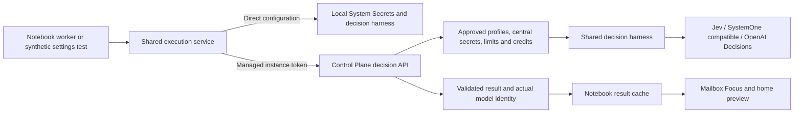

# Managed Decision Models

Implemented on 2026-10-07 in the paired Notebook `codex/email-classification-plan` and Control Plane `codex/managed-email-decisions-plan` branches. This extends the existing email classification harness; activation remains an independent instance-wide administrator setting.

## Execution boundary

`@canvas/decision-models` is the versioned Node/TypeScript package in `packages/decision-models`. Notebook owns its canonical source; Control Plane consumes a tracked generated copy. `node scripts/sync-decision-models-package.mjs --target <absolute-control-plane-path> --check` verifies source-manifest parity. The package contains the three native adapters, capabilities, strict validation and bounded DNS-pinned transport; it does not depend on Next.js, mailbox storage or secret services.

Notebook owns mailbox authorization, sender policy, message selection, question criteria, human corrections and the durable result cache. Control Plane owns approved model profiles, provider credentials, instance access, usage credits and distributed capacity. It receives a bounded assessment state and question schema, without mailbox credentials or email mutation instructions.

## Control Plane configuration

Platform administrators use Managed Models → Decision Models to create an active profile, assign a tariff, select the default and test a fixed synthetic state against a selected instance. A profile is available only with a supported native adapter, usable configuration and an explicit finite active USD tariff; zero is an explicit free tariff. TypeSafe/SystemOne credentials are central managed secrets; OpenAI Decisions reuses the central OpenAI secret. Private SystemOne endpoints require explicit central approval. Instances cannot supply endpoints, secret names or organization IDs.

`GET /v1/managed/decisions/models` publishes contract version 1, safe model references, inference revisions, capabilities and readiness. `POST /v1/managed/decisions/evaluate` accepts a stable request ID, model reference, inference revision, schema version, state and questions. Responses include the resolved identity and validated probabilities/usage. Administrative profile, tariff, test and uncertain-operation routes live under `/v1/managed-services`.

Existing instance tokens receive `decisions:read` and `decisions:evaluate` through the managed provisioning/reconcile path without rotation or removal of existing scopes. VM and organization are derived from that token; the existing managed-model entitlement and credit policy apply. A license URL alone does not establish a managed provider connection.

## Notebook configuration and cache

`executionMode` selects `direct` or `managed`. Existing configurations migrate to direct and retain their provider settings. Fresh connected installations can select a managed default while classification remains disabled. Saving a managed selection resolves its actual identity server-side. Worker and administrator test share this execution path; managed execution does not read a local provider key or silently fall back to another provider.

The UI exposes the managed model and availability first. Deployment mode, own-provider details and advanced limits are collapsible. Provider tests use a fixed synthetic message and do not activate classification, read a mailbox or establish spam calibration.

The managed evaluation fingerprint covers actual provider/model, adapter/inference revision, email schema and question criteria. The direct fingerprint remains compatible with previous results. Pricing, credentials, display settings and temporary catalog failures do not invalidate ratings. A 30-second catalog cache reduces control-plane reads; stale metadata can describe an outage, but cannot authorize new inference. Model/inference changes reset spam-validation references and fence late results.

Cached ratings remain in Notebook and supply both Focus and home cards without inference in the read path. Every read and publication still checks mailbox rights, source binding and sender policy. Publication checks the managed profile identity rather than the preserved direct provider selection.

Selection remains an OR rule for each personal or work Inbox: all confirmed unread messages regardless of age, plus other messages from the last 30 days. Bounded scans, historical batches, daily attempts and global concurrency remain in force. This does not process the whole read archive.

## Retries, limits and settlement

PostgreSQL atomically claims `(vm, requestId)` with a canonical payload hash and distributed capacity: four concurrent/60 requests per minute per VM, sixteen/240 per organization, and centrally configured provider limits. Conflicting payloads under one ID are rejected. Budget is reserved before dispatch; actual known usage is settled through the existing credit ledger. Missing token counts remain unknown. The ledger retains its existing integer-cent accounting precision.

Completed outcomes are encrypted and replayable for 24 hours. Operation tombstones remain for 30 days. A retry after network loss or an uncorrelated authentication/rate-limit error retains the original ID. A new ID is allowed only for explicitly correlated, known non-dispatched/rejected outcomes. Concurrent requests and unknown outcomes do not automatically dispatch again.

Recovery resumes pending settlement and handles expired leases. An uncertain dispatched operation retains a seven-day reservation for administrator review; Decision Models lets an administrator release it or confirm metered usage. This prevents application-level duplicate dispatch and duplicate ledger captures; it does not promise exactly-once upstream inference without a provider guarantee.

## Rollout and validation

Deploy Control Plane first with migrations `0105`/`0106`, profiles, tariffs, central secrets and scope reconciliation. Then deploy Notebook, verify catalog/version/capabilities, run a synthetic test and explicitly enable classification. Preserve direct configuration until the administrator chooses managed execution. A temporarily unavailable catalog pauses new work while keeping cached ratings.

Focused harness, managed execution, persistence and settings tests, paired typechecks and production builds are part of acceptance. Local end-to-end checks use the single production-like stack from `canvas-local-team-seat-dev`, PostgreSQL 18, CA-verified native SMTP/IMAP and a synthetic compatible model in the existing Control Plane API container. Paid TypeSafe/OpenAI inference and production rollout are separate from these local checks.
