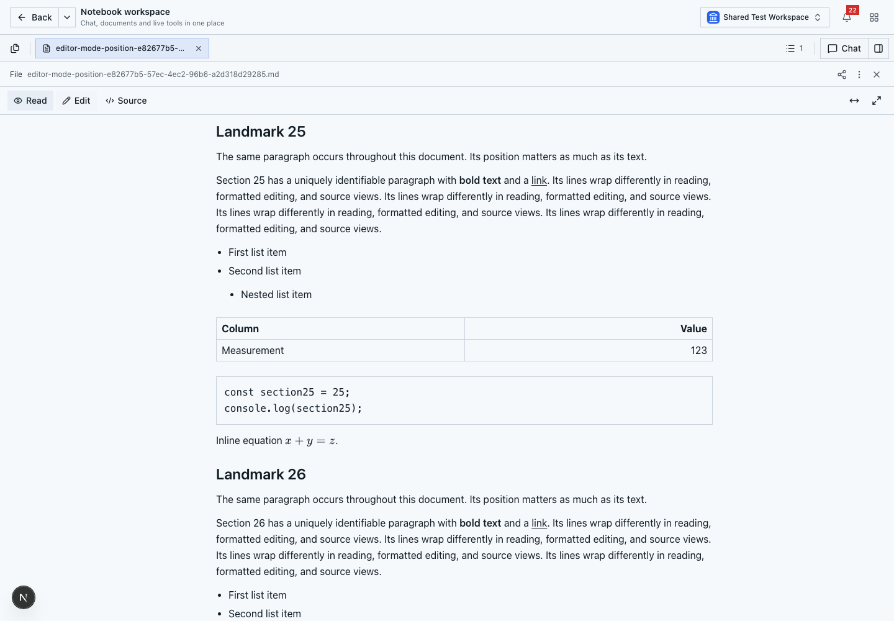
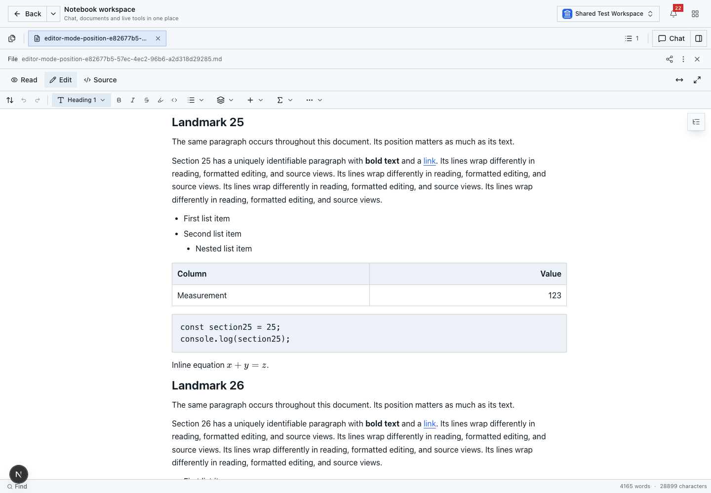
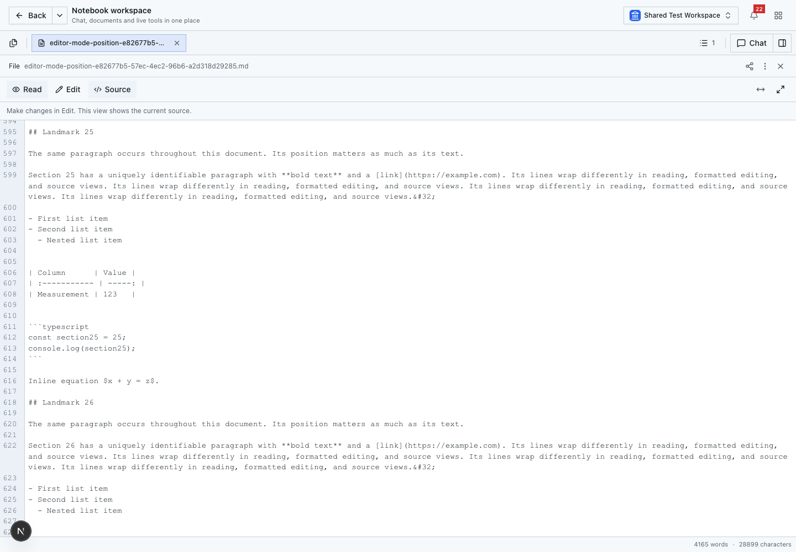
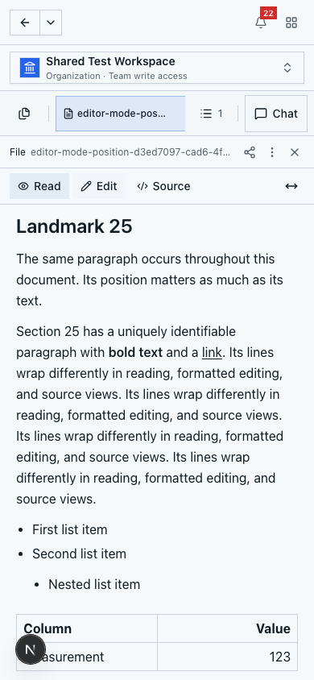
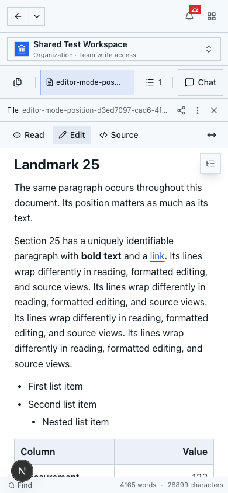
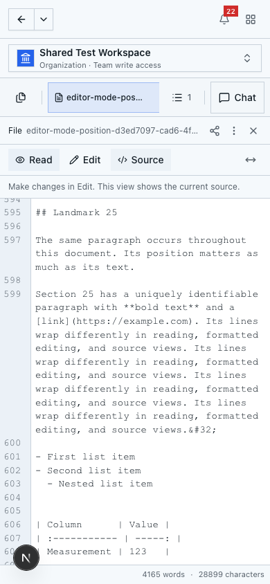

# Markdown mode position

Read, Edit and Source share a document-scoped viewport controller. Before replacing a view, it captures a source character position and its vertical distance from the viewport. The next view restores that text position after layout, without changing the editor selection, focus, document content or history.

The position map uses the configured Markdown codec's lexical spans and the actual rich document tree. Repeated paragraphs remain distinct; YAML prefixes, inline syntax, lists, tables, Unicode and Canvas entities retain source coordinates. Existing rich block IDs provide stable references. Editor-only empty trailing paragraphs map to EOF. Unavailable rich projections retain lexical Read/Source positions.

Consecutive switches retain the transferred anchor while the document, width and scroll position are unchanged. Content or viewport changes trigger a fresh capture. Layout corrections run for at most 1.5 seconds and yield to interaction. Browser scroll anchoring is disabled during that correction, and a CodeMirror scroll handler suppresses obsolete queued handoffs. New navigation requests override a handoff; previously applied requests are not replayed on remount.

The local rich binding also prevents delayed menu cleanup on a removed editor from reclaiming the current Source view's lease.

## Verification

Run `npm run test:editor:mode-position` for the source map and controller regressions. The existing local document/source/rich binding tests and `scripts/canvas-markdown-rendering-test.ts` cover content, history and shared renderer behavior.

Use the managed local development stack defined by the `canvas-local-team-seat-dev` skill for the application tests. Load the private local bootstrap admin credentials into `TEST_LOGIN_EMAIL` and `TEST_LOGIN_PASSWORD` without recording them in artifacts. Against the current host development server, run:

```sh
E2E_EXTERNAL_SERVER=1 COLLABORATION_E2E=1 BASE_URL=http://localhost:3000 npm run test:editor:mode-position:e2e
```

The 11 Playwright cases cover every direction on desktop/mobile, interior wrapped text, rapid switches, document/session reload counts, source/rich changes, undo/redo, old/fresh heading navigation, source-only documents, normalization, metadata, tab isolation and delayed images with user cancellation. The local browser fixture mounts the production editors and document bindings; only unrelated platform requests are mocked.

## Screenshots

The same landmark after switching views:

| Read | Edit | Source |
| --- | --- | --- |
|  |  |  |
|  |  |  |
