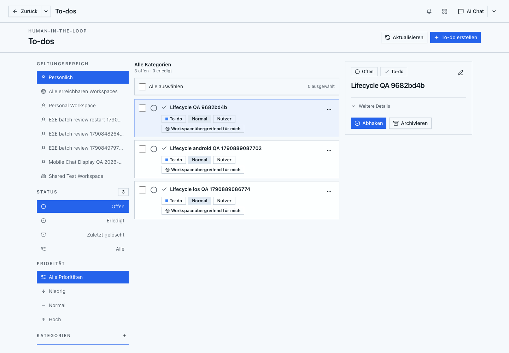
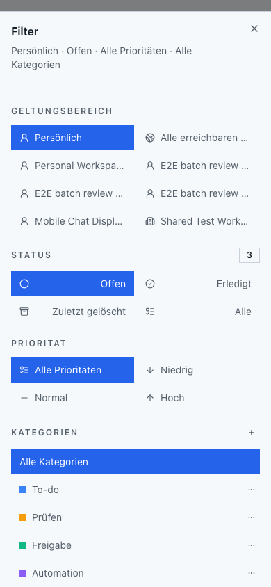
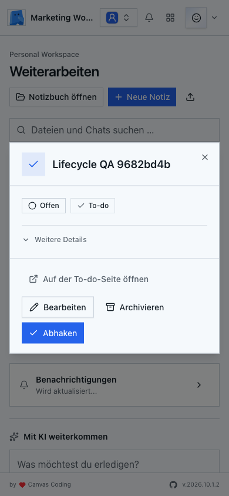

# Lifecycle-based To-dos

## Outcome

Web and Expo track tasks by `open`, `done`, and `archived`. Opening a task is a read-only operation. Task attention and task counts follow lifecycle, responsibility, priority, and due dates rather than personal read state.

The implementation spans Canvas Notebook and the private Expo client. It does not require a native API change or a database migration in the initial release.

## Contract and rollout

- New clients explicitly request `todoMode=lifecycle`. Mobile bootstrap advertises `todos.lifecycle`.
- Lifecycle Todo responses omit `seenAt`, `readAt`, and `readState`. Read filters and read mutations are unsupported in this mode.
- Generic Inbox envelopes keep their required `unread` boolean, with lifecycle Todo items reporting `false`. Notification read state for other sources keeps its meaning.
- Lifecycle attention includes relevant open tasks even without a due date. Urgency is ordered by overdue, due today, high priority, due soon, then open.
- Old clients retain the existing DTOs, read actions, enum values, and cursor behavior. New enum values must not leak into legacy responses.
- Deploy the backward-compatible Notebook changes first, then the Expo release. Retire legacy storage only after enforcing a supported client minimum; do not infer task completion from read state.

## Milestones

1. Backend: implement the explicit mode, scoped lifecycle attention and counts, legacy compatibility, and API regression coverage.
2. Clients: remove Web read controls and read-on-open writes; update Expo contracts, Inbox groups/actions, caches, and widget ranking.
3. Verification: execute relevant Notebook tests and production build, Expo verify, Web functional and visual QA, and available native development-client QA.
4. Delivery: independent review of both diffs, scoped commits, and linked pull requests in both repositories.

Each milestone is verified before moving on. Client subtasks share the already verified API contract. Legacy table deletion is a later rollout gate rather than a destructive migration bundled into this release.

## QA inventory

| Requirement | Evidence |
| --- | --- |
| Opening a Todo performs no mutation | Web store/API tests; browser request capture; Expo read-on-open regression and native flow |
| Normal open tasks persist after opening | lifecycle attention test with no priority/due exception; Web and Expo return-to-list flow |
| Complete, reopen, archive, restore and undo | API lifecycle tests; Web controls; Expo list/detail/Inbox actions |
| Lifecycle counts remain consistent | scoped count fixtures, limited-preview fixture, cache invalidation, widget snapshot assertions |
| Old clients remain compatible | legacy/new DTO fixtures, enum and cursor separation, old request paths |
| Viewer access remains enforced | reader may inspect but cannot mutate; outsider denied; workspace isolation |
| Other notifications retain read behavior | notification Inbox assertions and mark-all-read checks |
| Linked files and agent follow-ups | existing navigation/follow-up tests plus available UI flows |
| Responsive presentation | desktop and compact viewport screenshots, no read controls or accidental clipping |
| Mobile native presentation | development-client/available-device flows; explicitly report unavailable platforms |

Tests use disposable databases on the existing managed PostgreSQL service. Live Web QA uses the current worktree with the private managed host environment. No containers are built or recreated by this task.

## Verified Web implementation

- `npm run build` completed, including TypeScript, all static routes and CLI version injection.
- Todo detail/store/navigation tests, Home/widget/notification tests, file-review regression tests and changed-file ESLint completed successfully.
- Disposable PostgreSQL lifecycle/legacy tests cover explicit DTOs, rejected read mutations, exact counts beyond preview limits, scope exclusions, cursor separation and current/aggregate feed deadlines.
- Production-server browser QA passed: normal task opening without mutations, no read controls, complete/reopen/archive/restore with no `todo_read_states` rows, email-link login, Home/bell/popups, real saved chat widget and markdown link, permissions, conflict/retry/dirty-close behavior, and compact presentation.
- Production-server bulk browser QA passed with 105 selected tasks across pagination, stale-version conflict, category/priority changes, archive/restore, read-only exclusion and filter-change races. Selection and restore created no read-state rows.

The initial development-server runs exceeded cold-compilation time limits. The completed production build passed the same functional flows without changing application behavior or weakening test assertions.

