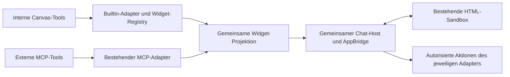

# Plan: Canvas-Tools als HTML-Widgets im Chat

Stand: 10. September 2026. Basis: `main` bei `4c55fb97` nach PR #138 und #139.
Status: Implementierung abgeschlossen, automatisierte Prüfungen und Produktionsbuild
bestanden. Die Browserabnahme in Paket 5 steht aus; die gemäß AGENTS.md erforderliche
Freigabe für Playwright wurde angefragt und liegt bisher nicht vor. Die weiteren
Widget-Kandidaten sind in [tool-widgets-candidates.md](tool-widgets-candidates.md)
priorisiert. Dieses Dokument ersetzt den Entwurf vor dem Main-Update.

## Ziel und erster Lieferumfang

Bestehende interne Canvas-Tools können nach einer erfolgreichen Ausführung eine
HTML-Oberfläche im Chat anzeigen. Interne und externe Widgets verwenden denselben
Host, dieselbe Sandbox und dieselbe Nachrichtenverarbeitung.

Die erste vollständige Umsetzung ist eine Automationskarte mit Name, Zeitplan,
Zeitzone, nächstem Lauf, Status und den Aktionen **Öffnen**, **Bearbeiten** sowie
**Pausieren/Fortsetzen**. Die Karte bleibt bei eingeklappten Tool-Details, im
Minimalmodus und nach einem Neuladen sichtbar. Bearbeiten öffnet zunächst den
vorhandenen Automationseditor.

**Jetzt ausführen**, Löschen, ein vollständiger Editor im Widget und weitere
Widget-Typen folgen nach diesem abgeschlossenen Lieferumfang. Die Veröffentlichung
interner Tools über den extern erreichbaren Canvas-MCP-Server ist ein eigener
späterer Schritt.

## Was Main bereits liefert

| Vorhanden | Wiederverwendung |
| --- | --- |
| `McpAppWidget` mit AppBridge, Initialisierung, Größenanpassung, Reload und Tool-Freigaben | Gemeinsamen Host daraus entwickeln; vorhandenes MCP-Verhalten über einen Adapter erhalten. |
| `apps-host.ts` mit begrenzten, kurzlebigen Tickets und erneuter Berechtigungsprüfung | Ticketmechanik für interne Ressourcen erweitern. |
| Fester Canvas-Relay und inneres iframe mit opaker Origin | Bestehende Isolation und Routing ohne zusätzliche Konfiguration beibehalten. |
| `McpAppFrameTransport` mit Fenster-/Origin-Bindung und Nachrichtenlimits | Für beide Widget-Quellen verwenden. |
| MCP-Metadaten, Resource-Lesen und Anzeigeprojektion für gespeicherte Ergebnisse | Kompatibel um interne Widget-Referenzen ergänzen. |
| OAuth-Connection-Health und Reconnect-Hinweise | Für externe Widgets weiterverwenden; interne Karten benötigen keine MCP-Verbindung. |

Die geltenden Grenzen stehen in [MCP Apps security model](../../security/mcp-apps.md).
Externe Netzwerkzugriffe aus Widgets und allgemeine Host-Navigation sind derzeit
nicht freigegeben. Auch interne HTML-Bundles müssen innerhalb dieser Grenzen
funktionieren. Eine neue Subdomain, ein zweiter Server oder eine neue OAuth-Schicht
sind für diesen Plan nicht erforderlich.

## Architekturentscheidungen

- Interne Widgets sind versionierte, mit Canvas ausgelieferte HTML/JS/CSS-Bundles.
  Die KI liefert Tool-Argumente; ausführbarer Widget-Code stammt aus der Registry.
- Ein gemeinsamer Descriptor unterscheidet ausdrücklich `builtin` und `mcp`.
  Interne Widgets bekommen keine fingierte `connectionId`.
- Vorhandene `details.mcpApp`-Nachrichten bleiben lesbar. Neue interne Ergebnisse
  erhalten einen versionierten `details.toolApp`-Eintrag; eine gemeinsame Funktion
  normalisiert beide Formate für den Host. Es gibt keine zweite persistierte Kopie
  der Widget-Daten im Frontend-Nachrichtenmodell.
- Eine interne Referenz enthält Ressourcen-/Schema-Version, tatsächliche Operation,
  Bezug zum Tool-Aufruf, und Entitätsreferenz. Einen kleinen freigegebenen Snapshot liefert der Server
  erst nach erneuter Autorisierung beim Laden der Karte.
  Beispielressource: `ui://canvas/automation-job/v1`.
- Backend und Registry bestimmen zulässige Ressourcen und Aktionen. Vom Browser
  übergebene Tool-Namen, Job-IDs oder Deskriptoren begründen keine Berechtigung.
- Im Chat gespeichert werden Ergebnisdaten und Referenzen. HTML-Bundles, kurzlebige
  Ticket-URLs, Freigaben und Secrets werden nicht als Widget-Historie gespeichert.

## Verbindliche Reihenfolge

Jedes Arbeitspaket wird abgeschlossen, angemessen getestet und einzeln committed,
bevor das nächste beginnt. Vorgeschlagene neue Dateinamen sind noch keine Dateien.

### 1. Gemeinsamen Vertrag und internen Backend-Adapter ergänzen

- [x] Unter `app/lib/tool-apps/` Typen, Registry und Normalisierung ergänzen.
- [x] Vorhandene MCP-Deskriptoren über einen Kompatibilitätsadapter übernehmen.
- [x] Die Ticket-/Ressourcenmechanik aus `apps-host.ts` gemeinsam nutzen; je nach
  Quelle die zuständige Autorisierung aufrufen. Interne Widgets verwenden normale
  Chat-/Agent-/Workspace- und Automationsrechte, keine MCP-Adminberechtigung.
- [x] Interne Render-/Aktionsanfragen an eine serverseitig verifizierte Nachricht
  samt `toolCallId` binden. Die daraus abgeleitete Automation muss mit der
  angefragten Entität übereinstimmen. Bei noch nicht gespeicherten Live-Ergebnissen
  entweder die autoritative Runtime-Zuordnung prüfen oder die Speicherung abwarten.
- [x] Die Render-Auslieferung prüft Sitzung und aktuelle Rechte erneut. Eine
  nicht registrierte Ressource oder Operation wird abgewiesen.

**Betroffen:** `app/lib/mcp/apps-types.ts`, `apps-host.ts`,
`app/api/mcp/apps/route.ts`; neue interne Adapter-/Routenanbindung. Gemeinsame
Mechanik extrahieren, fachliche Regeln in den jeweiligen Adaptern behalten.

**Abnahme:** Alte MCP-Deskriptoren funktionieren weiterhin. Ein berechtigter Nutzer
kann eine interne Testressource laden; fremde Chats, falsche Tool-Aufrufe,
ausgetauschte Job-IDs und entzogene Berechtigungen werden abgewiesen.

### 2. Bestehenden Host teilen und Canvas-Stil übertragen

- [x] Aus `McpAppWidget.tsx` einen gemeinsamen `ToolAppWidget` entwickeln; die
  MCP-Anbindung bleibt ein schlanker Adapter. Transport, Fehlerbehandlung,
  Initialisierung, Resize und Aufräumen werden nur einmal implementiert.
- [x] Unterstützte Fähigkeiten pro Adapter begrenzen. Externe MCP-Tool-Aufrufe
  behalten die bestehende sichtbare Allow-/Reject-Freigabe.
- [x] Canvas-Tokens für Farben, Schrift, Abstände, Rahmen und Radius an das
  iframe übergeben. Theme, Sprache und Zeitzone explizit aktualisieren.
- [x] Kleine wiederverwendbare Widget-Komponenten aus vorhandenen UI-Primitiven
  und Formatierern aufbauen. Assets und gegebenenfalls Schriftdateien werden
  gebündelt/eingebettet, da die bestehende CSP externe Abrufe blockiert.
- [x] Produktionsbuild um die Auslieferung der internen Bundles ergänzen; die
  bestehenden Ticket-Routen und den globalen Abschaltschalter weiterverwenden.

**Betroffen:** `McpAppWidget.tsx`, `McpAppChatContext.tsx`,
`apps-browser-transport.ts`, `app/globals.css`, `components/ui/`, neue Widget-Bundles
und deren Build-Anbindung. Keine neue parallel laufende Sandbox implementieren.

**Abnahme:** Interne Testansicht und bestehende MCP-Fixtures verwenden denselben
Host. Hell/Dunkel, schmale Breite und Localewechsel funktionieren; die bisherigen
Sandbox- und Freigabegrenzen bleiben wirksam.

### 3. Widgets sichtbar und zuverlässig im Chat verankern

- [x] Widget-Ausgabe aus `ToolCallPill` herauslösen. `ChatMessageList` platziert sie
  unabhängig von `ToolBatchDisclosure` und `hiddenToolMessageIds`.
- [x] Eine stabile Instanzkennung aus Chat und Tool-Aufruf verwenden. Mehrere
  Aufrufe desselben Tools erzeugen getrennte Karten; wiederholte Events erzeugen
  keine zusätzlichen Karten. Innerhalb einer Tool-Gruppe Aufrufreihenfolge erhalten.
- [x] Live-Updates, finales Nachrichtensynchronisieren und gespeicherten Verlauf
  durch dieselbe Normalisierung führen. Gateway-Aufrufe anhand der tatsächlichen
  `details.operation` erkennen, nicht nur am äußeren Tool-Namen.
- [x] Bestehende Display-/Kontext-/Persistenzprojektionen gezielt erweitern:
  registrierte Referenz und begrenzte Anzeigedaten bleiben gültig; UI-Metadaten
  gelangen nicht automatisch in den Modellkontext. Bestehende Sicherheitsfilter
  dürfen für interne Job-Daten nicht pauschal umgangen werden.
- [x] Nur sichtbare Widgets aktiv halten und bestehende Ticketlimits beachten.
  Resize erhält den Scrollanker; Schließen/Wechseln räumt Bridge und Anfragen auf.
- [x] Alte Nachrichten, unbekannte Versionen, übergroße Daten und Clients ohne
  Widget-Host behalten einen verständlichen Text-Fallback. Teilen und Export
  erweitern keine Datenberechtigungen und übernehmen keine aktiven Tickets.

**Betroffen:** `ChatMessageList.tsx`, `ChatToolRunMessages.tsx`,
`useChatRuntimeEvents.ts`, `chatMessageMapping.ts`, `app/lib/chat/run-collapse.ts`,
`app/lib/pi/message-projection.ts`, `visual-data-projection.ts` und die bestehende
Nachrichtenspeicherung. Zunächst keine neue Datenbanktabelle erforderlich.

**Abnahme:** Interne und externe Widgets bleiben bei eingeklappten Details und im
Minimalmodus sichtbar. Live, Reload und Reconnect zeigen pro Aufruf genau eine
Karte. Verlaufsanzeige löst keine erneute schreibende Tool-Ausführung aus.

### 4. Automationskarte vollständig umsetzen

- [x] `create_automation_job`, `inspect_automation_job` und `update_automation_job`
  liefern nach Erfolg dieselbe registrierte Kartenart. Fehler und Abbrüche
  erzeugen keine falsche Erfolgskarte.
- [x] Name, lesbarer Zeitplan, Zeitzone, nächster Lauf und Aktiv-/Pausiert-Status
  anzeigen. Agent-/Workspace-Kontext nur im zulässigen Umfang weitergeben.
- [x] **Öffnen** und **Bearbeiten** führen über konkrete, vom Canvas-Host erzeugte
  Aktionen in die vorhandene Automationsansicht. Keine allgemeine Navigation für
  beliebige iframe-Anfragen freischalten.
- [x] **Pausieren/Fortsetzen** als klar beschriftete, vom Host gerenderte Aktion
  ausführen. Der bewusste Nutzerklick löst die enge Backend-Operation aus; interne
  Widget-Skripte erhalten keinen generischen Zugriff auf alle Canvas-Tools.
- [x] Gemeinsame Automationsaktionen für API und Widget verwenden. Insbesondere
  Composio-Synchronisierung, Verantwortlichkeit, Audit und Rate Limits aus der
  bestehenden PATCH-Route erhalten; nicht direkt am Store vorbeiorchestrieren.
- [x] Versionsprüfung und serialisierte/gegen Wiederholung abgesicherte
  Statusänderungen einbauen. Konflikte dürfen keine veralteten Änderungen
  überschreiben; Prüfungen müssen vor externen Nebenwirkungen wirksam sein.
- [x] Historischen Erstellungserfolg und aktuellen Jobzustand unterscheiden.
  Nach Nutzeraktionen Zustand aktualisieren und ein kurzes, gespeichertes
  Aktionsereignis für den weiteren Chatkontext erzeugen. Ein Refresh startet
  keinen neuen Modelllauf.
- [x] Gelöschte Jobs und Rechteentzug zeigen einen passenden Zustand ohne aktive
  Aktionen. Bei fehlender Verbindung einer Automation deren tatsächliche
  Integrationszuordnung verwenden; „aktiv“ bedeutet nicht „alle Verbindungen ok“.

**Betroffen:** `app/lib/pi/scoped-tools.ts`, neue Automations-Widget-Ressource,
`app/lib/automations/presentation.ts`, gemeinsame Domain-Aktionen,
`app/api/automations/jobs/[jobId]/route.ts`, `messages/de.json`, `messages/en.json`.

**Abnahme:** Eine im Chat erstellte Automation lässt sich über die Karte öffnen,
bearbeiten und pausieren/fortsetzen. Fremde Nutzer, Doppelklicks, veraltete Versionen
und private Composio-Verbindungen umgehen keine bestehenden Regeln.

### 5. Gesamtabnahme und dokumentierten Lieferumfang abschließen

- [x] Bestehende Prüfungen ausführen: `test:mcp:apps`, `test:mcp:apps-host`,
  `test:mcp:message-projection`; relevante Chat-Gruppierungs- und Automationstests.
- [x] Gezielte Tests für Adapter-Bindung, Ereignis-Deduplizierung, Verlauf,
  Berechtigungswechsel, Statuskonflikte und Widget-Aktionen ergänzen.
- [ ] Browserprüfung für Erstellung, Reload, Minimalmodus, mehrere Karten,
  Hell/Dunkel, mobile Breite, Tastatur/Fokus, Scrollverhalten und Fehlerzustände.
  Laut Repository-Regel UI-Automation erst nach ausdrücklicher Nutzerfreigabe.
- [x] `npm run build` erfolgreich abschließen. Container nur auf ausdrücklichen
  Wunsch bauen; für einen lokalen Stack den verwalteten Dev-Skill verwenden.
- [x] `docs/security/mcp-apps.md` um interne Ressourcen, Aktionen und den
  tatsächlichen unterstützten Umfang ergänzen; diese Checkliste aktualisieren.

Vor Produktänderungen GitNexus-Impact für die betroffenen Symbole ausführen und
hohe Risiken melden. Vor jedem Commit `detect_changes` im aktuellen Worktree
ausführen. Der für diesen Plan verfügbare Hauptcheckout-Index enthält nicht alle
neuen MCP-Apps-Symbole; die Befunde wurden deshalb im aktuellen Quellcode geprüft.
Vor der Umsetzung muss die Impact-Grundlage aktuell sein.

**Lieferkriterium:** Arbeitspakete 1–5 sind abgeschlossen und verifiziert. Dann
folgen weitere Widgets über die Registry, beginnend mit Todo-Karten und
Artefaktansichten. Externe MCP-Widgets behalten ihre bisherigen Fähigkeiten und
Reconnect-Hinweise und profitieren von derselben verbesserten Chat-Platzierung.

## Durchgeführte Prüfungen

- Paket 1: `tool-apps-access-test`, `test:mcp:apps-host`, TypeScript ohne Emit.
  Interne Ressourcen werden im folgenden Build-Paket bereitgestellt; die
  Produktion erzeugt bis zur Tool-Anbindung noch keine internen Widget-Referenzen.
- Paket 2: Widget-Bundle (837 KiB), Daten-/HTML-Strukturprüfung, bestehende
  Host-Tests, TypeScript und gezieltes ESLint. Die Browserabnahme bleibt in Paket 5
  offen; die Freigabe für UI-Automation wurde angefragt.

- Paket 3: gemeinsame Live-/Verlaufsprojektion, Deduplizierung und Frame-Budget;
  interne Projektionstests, Chat-Gruppierung, MCP-Projektion, Pi-Persistenz-/
  Kontexttests, TypeScript und gezieltes ESLint bestanden. Größenänderungen
  verwenden das bestehende Bottom-Lock-Verhalten; inaktive Karten behalten ihre Höhe.

- Paket 4: echte interne Create-/Inspect-/Update-Tools und das Gateway
  `automation_manage` geprüft. PGlite-Transaktionstests für HTTP-Aktion, parallele
  Änderungen, stale Revision/updatedAt, private Composio-Verbindungen, falsche
  Chat-/Job-Bindung, Rechte-/Seat-Entzug, Löschung, Providerfehler und atomare
  Chat-Ereignisse bestanden. Bestehende exklusive Sitzungssperre, Zeitpläne,
  Integritäts- und Migrationsprüfungen sowie Host-Regression, TypeScript und
  gezieltes ESLint bestanden.

## Details des umgesetzten Statuswechsels

Der Editor, interne Update-Tools und Widgets verwenden `updateAutomationJobForUser`.
Lesende Berechtigungs-/Verbindungsabfragen werden vor der Transaktion vorbereitet.
Unter einer PostgreSQL-Zeilensperre wird der vorbereitete Stand erneut geprüft;
Widget-Anfragen liefern Revision und `updatedAt`. Erst danach werden Änderung,
optionaler Chat-Eintrag und der Composio-Statuswechsel ausgeführt. Gleichbleibende
reine Statusanfragen erzeugen keine weitere Revision und keinen weiteren Audit-Eintrag.
Eine alte Anfrage wird mit 409 abgewiesen und nicht automatisch wiederholt.

Die Widget-Aktion verwendet `withExclusivePiSessionExecution`: Ein laufender Chat
liefert einen verständlichen Konflikt. Ein inaktiver Runtime-Cache wird vor der
atomaren Ergänzung des Verlaufs verworfen. Das kurze Nutzerereignis startet keinen
Modelllauf. Nach Erfolg wird die vorhandene `message_saved`-Benachrichtigung gesendet.
Öffnen/Bearbeiten nutzen `/automations/{jobId}` beziehungsweise `?edit=1`.

Die HTML-Karte zeigt den beim Laden autorisierten aktuellen Jobstand. Ihre Überschrift
beschreibt die historische Tool-Operation. `active` bestätigt keinen gesunden Zustand
aller Integrationen; Quarantäne und verfügbare Statusaktionen werden separat behandelt.
Für noch nicht gespeicherte Live-Ergebnisse versucht der Host die lesende Zuordnung
begrenzt erneut und bietet anschließend ein manuelles Neuladen an.

Eine Datenbank und Composio bilden keine verteilte Transaktion. Ein unklarer Netzwerk-
oder Commit-Ausgang kann weiterhin eine manuelle Zustandsprüfung erfordern. Die UI
meldet dann keinen Erfolg und führt keine automatische Wiederholung aus.

## Abschließende Code- und Build-Abnahme

- `npm run build` bestanden, einschließlich Lizenzprüfungen, Next.js-
  Produktionskompilierung, TypeScript und Seitengenerierung. Das Tracing der
  neuen API-Route enthält das erzeugte Widget-HTML für die Produktionsauslieferung.
  Der Build ohne Runtime-Konfiguration meldet die fehlende MCP-OAuth-Base-URL
  sowie Node-localStorage-Hinweise; diese verhindern den Build nicht. Eine reale
  OAuth-Verbindung wurde in diesem Worktree nicht neu eingerichtet oder getestet.
- `test:mcp:apps`, `test:mcp:apps-host`, `test:mcp:message-projection`,
  `chat-tool-batches-test`, `pi-message-projection-test`,
  `pi-session-exclusive-execution-test`, `test:automation:schedule`,
  `test:automation:integrity` und `test:automation:postgres-migration` bestanden.
- Neue Adapter-, HTML-/Daten-, Projektions-/Gateway- und Automations-/HTTP-/
  Transaktionstests bestanden. Die neuen Prüfungen sind gesammelt über
  `npm run test:tool-apps` ausführbar. Die PGlite-Tests verwenden isolierte
  Testdaten sowie gemockte Identitäts-/Providergrenzen; keine produktiven
  Automationen, E-Mails oder externen Trigger wurden verändert.
- TypeScript ohne Emit, gezieltes ESLint und Diff-Prüfung bestanden.
- Kein Container gebaut oder gestartet, kein Deployment und kein Push.
- **Noch offen:** echte Browserprüfung für Layout, Tastatur, Fokus, Scrollverhalten,
  Theme-/Localewechsel, Karten im Minimalmodus und Interaktion mit dem vorhandenen
  Editor. Ohne diese Prüfung ist die UI-Abnahme nicht als bestanden markiert.
