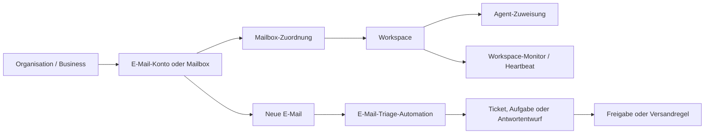

# Workspace Heartbeats und E-Mail-Automationen

## Zweck

Dieses Dokument beschreibt die Zielarchitektur fuer proaktive Agentenarbeit in Canvas Notebook. Sie verbindet zwei Anforderungen:

- Ein Agent soll einen Workspace regelmaessig auf handlungsrelevante Entwicklungen pruefen (Heartbeat).
- E-Mails eines Unternehmens sollen sicher einem Arbeitskontext zugeordnet, als Tickets verarbeitet und mit Agentenunterstuetzung beantwortet werden koennen.

Das Ziel ist ein moeglichst einfaches Produktmodell: **Agenten sind wiederverwendbare Rollen; Workspaces besitzen den Arbeitskontext, die Daten, Integrationen und Automationen.** Agenten laufen nicht dauerhaft. Sie werden durch einen Zeitplan oder ein Ereignis gestartet und schlafen danach wieder.

Dieses Dokument ist eine Architekturentscheidung und keine unmittelbare Implementierungsanweisung. Die V1-Abgrenzung dient als naechster Planungsschritt.

## Begriffe

| Begriff | Bedeutung |
| --- | --- |
| Organisation / Business | Der fachliche und berechtigte Eigentuemer von gemeinsamen Daten und Business-Integrationen. |
| Workspace | Der konkrete Arbeitsbereich, etwa `Kundensupport`, `Sales` oder ein Projekt. Er bestimmt Kontext, Mitglieder, Daten und Regeln. |
| Agent | Wiederverwendbare Rolle mit Grundanweisungen und Faehigkeiten, etwa `Support-Triage`. |
| Agent-Zuweisung | Die Verwendung eines Agenten in einem Workspace mit lokalen Anweisungen, erlaubten Tools und Zugriffsgrenzen. |
| E-Mail-Konto / Mailbox | Eine technische Verbindung zu einer Adresse oder einem Postfach inklusive OAuth-/SMTP-Geheimnissen. |
| Mailbox-Zuordnung | Die explizite Berechtigung, eine Mailbox in einem Workspace zu verwenden. |
| Automation | Ein durch Zeitplan oder Ereignis gestarteter, nachvollziehbarer Agentenlauf. |
| Heartbeat | Eine zeitgesteuerte Workspace-Automation, die nur bei relevanten Ergebnissen informiert. |

## Aktueller Stand

### Heartbeats

Heartbeats werden aktuell in den Settings eines Agenten konfiguriert. Intern wird pro User und Agent ein Automation-Job vom Typ `heartbeat` angelegt. Die Standardkonfiguration ist ein Intervall von 60 Minuten innerhalb der Arbeitszeit Montag bis Freitag, 09:00 bis 18:00 Uhr.

Die fachlichen Anweisungen stehen in der agentenspezifischen `HEARTBEAT.md`. Der Lauf erhaelt ein verbindliches Antwortprotokoll:

- Gibt es keine neuen oder relevanten Informationen, muss der Agent exakt `HEARTBEAT_OK` antworten.
- Bei `HEARTBEAT_OK` wird keine normale Chat-Antwort ausgeliefert und ein neuer, leerer Laufkontext wieder entfernt.
- Bei einer relevanten Antwort wird diese ueber den konfigurierten Kanal zugestellt und im Lauf protokolliert.

Ein separater Scheduler fragt regelmaessig faellige Automationen ab, reiht sie ein und fuehrt sie aus. Er nutzt Schutzmechanismen gegen parallele Laeufe desselben Jobs sowie Retry- und Stale-Run-Behandlung.

Die wesentliche Luecke ist der Scope: Ein Heartbeat ist heute an User und Agent gebunden, wird jedoch nicht als explizite Workspace-Automation modelliert. Damit sind Workspace-Daten, lokaler Auftrag, Berechtigungen und Benachrichtigungsziel nicht die primaere fachliche Einheit.

### E-Mail

E-Mail-Konten sind heute in erster Linie User-Verbindungen. Die Speicherung ordnet ein Konto einem User zu; ein Workspace wird bei KI-Entwuerfen und Dateianhaengen punktuell als Kontext uebergeben, aber nicht als verbindliche Mailbox-Zuordnung erzwungen.

Das ist fuer persoenliches Schreiben sinnvoll, reicht aber nicht fuer Business-Automationen. Ein Support-Agent muss eindeutig wissen, welche Organisation, welcher Workspace, welche Mailbox, welche Daten und welche Versandregeln gelten.

## Architekturentscheidung

### Leitprinzip

**Der Workspace ist die Grenze fuer Automationen.**

Eine Automation wird immer in einem konkreten Workspace ausgefuehrt. Der Workspace bestimmt:

- den Agenten und dessen lokale Rolle;
- die les- und schreibbaren Daten, Dateien, Tickets und Integrationen;
- die zugeordnete Mailbox;
- Zeitplan, Arbeitszeiten und Zustellung;
- Freigabe- und Versandregeln;
- Audit-Protokoll, Ownership und Mitgliedschaft.

Der Agent selbst bleibt wiederverwendbar. Beispielsweise kann der Agent `Support-Triage` in mehreren Workspaces eingesetzt werden, er sieht und verarbeitet aber stets nur den Kontext seiner jeweiligen Zuweisung.

### Zielbild



Es gibt zwei verschiedene Arten proaktiver Arbeit:

| Ausloeser | Beispiel | Richtige Automation |
| --- | --- | --- |
| Zeitplan | offene Blocker, SLA-Verletzungen, liegengebliebene Entwuerfe pruefen | Workspace-Heartbeat bzw. geplante Automation |
| Ereignis | neue Kundenmail, Ticket-Update, Webhook | ereignisbasierte E-Mail-Triage |

Eine E-Mail-Eingangsverarbeitung soll nicht auf den naechsten Heartbeat warten. Der Eingang ist ein Ereignis und wird zeitnah verarbeitet. Polling bleibt nur als technische Absicherung oder fuer Provider ohne Webhook-Unterstuetzung.

## E-Mail-Konten und Workspace-Zuordnung

### Konto und Zuordnung trennen

Ein E-Mail-Konto soll nicht automatisch immer einem Workspace gehoeren. Stattdessen werden technische Verbindung und fachliche Berechtigung getrennt:

```text
E-Mail-Konto: support@firma.de
  └─ Mailbox-Zuordnung: Workspace "Kundensupport"
       └─ Support-Triage, Arbeitsregeln und Versandfreigabe
```

Diese Trennung erlaubt persoenliche E-Mail-Nutzung ohne sofortige Projekt- oder Business-Zuordnung, waehrend Automationen eine eindeutige Grenze erhalten.

### Aufloesungsregel fuer den Arbeitskontext

Bei manueller E-Mail-Nutzung wird der effektive Workspace in dieser Reihenfolge bestimmt:

1. explizit durch den User in der aktuellen Aktion gewaehlter Workspace;
2. fest konfigurierte Standard-Zuordnung der Mailbox;
3. persoenlicher Standard-Workspace des Users.

Die dritte Stufe ist ausschliesslich ein Komfort-Fallback fuer manuelle, persoenliche Nutzung. Sie darf keine Business-Automation aktivieren und keine vorhandene feste Zuordnung veraendern.

### Eigentum und Regeln

| Art der Mailbox | Kann unzugeordnet bleiben? | Wer verbindet sie? | Darf automatisiert werden? |
| --- | ---: | --- | ---: |
| Persoenliche Mailbox eines Users | Ja | Der User | Erst nach expliziter Workspace-Zuordnung |
| Business-Mailbox | Nein, sobald sie operativ genutzt wird | Organisations-Admin oder berechtigte Rolle | Ja, nur im explizit zugeordneten Workspace |
| Geteilte Business-Mailbox | Nicht ohne Routing | Organisations-Admin | Spaeter, mit expliziten Routingregeln |

Eine Business-Mailbox wird nicht als stiller Fallback in den persoenlichen Standard-Workspace gelegt. Fehlt die Zuordnung, werden Eingangsereignisse nicht agentisch verarbeitet und sichtbar als Konfigurationsproblem gemeldet.

## Heartbeats als Workspace-Automationen

### Fachliches Modell

Ein Heartbeat wird als besondere, geplante Workspace-Automation behandelt:

- genau ein Workspace als Ausfuehrungskontext;
- ein gewaehlter Agent bzw. eine Agent-Zuweisung;
- ein Zeitplan mit Zeitzone und Arbeitszeitfenster;
- Workspace-spezifische Pruefanweisungen;
- ein konfiguriertes Zustellziel;
- Laufhistorie mit Ergebnis, Fehlern und Auditdaten.

Die globale `HEARTBEAT.md` eines Agenten bleibt als fachliche Basis sinnvoll. Workspace-spezifische Anforderungen werden als zusaetzliche Anweisungen gespeichert, zum Beispiel:

> Pruefe im Workspace Kundensupport ueberfaellige Tickets, unbeantwortete Kundenmails und Entwuerfe, die laenger als einen Werktag offen sind.

So wird keine neue, dauerhaft laufende Agentenklasse benoetigt.

### Ergebnis- und Benachrichtigungsregeln

- `HEARTBEAT_OK` bedeutet erfolgreich, aber ohne Nachricht an den User.
- Relevante Ergebnisse werden kurz und konkret zugestellt und mit dem Workspace verlinkt.
- Fehler, fehlende Berechtigungen oder nicht erreichbare Integrationen werden als handlungsrelevante Meldung behandelt.
- Ein erfolgreicher No-op-Heartbeat darf auch keine generische „Automation abgeschlossen“-Push ausloesen. Diese Semantik muss fuer Chat, externe Kanaele und Mobile Push einheitlich sein.

### Kontinuitaet

`lastRunAt` und `lastRunStatus` reichen nicht aus, um fachlich sicher zu wissen, ob etwas bereits berichtet wurde. Fuer Checks mit dem Anspruch „seit dem letzten Heartbeat“ braucht die jeweilige Quelle einen belastbaren Vergleichspunkt, etwa:

- Ticket-Aktualisierungszeit oder SLA-Status;
- E-Mail-Message-ID bzw. Thread-ID;
- persistierten Watermark/Zeitpunkt pro Quelle;
- optional eine kleine Liste bereits gemeldeter Ereignis-IDs mit Ablaufzeit.

Der Heartbeat soll keine reine Chat-Erinnerung als Zustand missbrauchen. Wiederholungsfreiheit gehoert in die fachliche Datenquelle bzw. den Automation-State.

## E-Mail-Triage und Support-Automation

### Ablauf fuer neue E-Mails

1. Der Provider meldet eine neue E-Mail per Webhook; bei Bedarf ergaenzt ein Poller verpasste Ereignisse.
2. Die Eingangsverarbeitung prueft Nachricht-ID, Thread-ID und Idempotenz, damit dieselbe Mail nicht mehrfach verarbeitet wird.
3. Die Mailbox-Zuordnung bestimmt den Workspace. Ohne eindeutige Zuordnung wird die Nachricht in eine sichtbare Klaerungswarteschlange gelegt.
4. Die Triage-Automation arbeitet ausschliesslich mit der Workspace-Agent-Zuweisung und ihren erlaubten Datenquellen.
5. Sie erstellt oder aktualisiert ein Ticket, ordnet Prioritaet und Thema zu und erzeugt bei Bedarf einen Antwortentwurf.
6. Ein Mensch gibt den Entwurf frei, oder eine explizite Workspace-Regel erlaubt den Versand fuer eng begrenzte Faelle.
7. Versand, Ergebnis und alle Entscheidungen werden nachvollziehbar protokolliert.

### Warum nicht ausschliesslich Heartbeats?

Ein Heartbeat ist richtig fuer regelmaessige Kontrollen wie „welche Tickets sind ueberfaellig?“. Neue E-Mails brauchen dagegen eine zeitnahe, genau-einmalige und idempotente Verarbeitung. Die Kombination ist sinnvoll:

- **E-Mail-Ereignisautomation:** Neue Nachricht klassifizieren, Ticket anlegen, Entwurf vorbereiten.
- **Workspace-Heartbeat:** offene oder ueberfaellige Tickets, fehlende Freigaben, eskalierte Threads und fehlgeschlagene Aktionen pruefen.

## Sicherheits-, Berechtigungs- und Betriebsregeln

### Berechtigungen

- Jede Ausfuehrung validiert zu Beginn und vor kritischen Aktionen Mitgliedschaft, Workspace-Zugriff, Agent-Zuweisung und Mailbox-Zuordnung.
- Wird eine Berechtigung waehrend eines Laufs entzogen, wird der Lauf beendet; es darf kein Versand erfolgen.
- Secrets bleiben an der Konto-/Integrationsverbindung. Agenten erhalten nie rohe Zugangsdaten.
- Bei Offboarding eines Users bleiben Business-Mailboxen organisationsverwaltet; persoenliche Mailboxen bleiben privat oder werden bewusst getrennt.

### Externe Inhalte sind nicht vertrauenswuerdig

E-Mail-Text, HTML, Anhaenge, Links und in Nachrichten enthaltene Anweisungen duerfen keine Agentenregeln ueberschreiben. Sie werden als untrusted input behandelt. Insbesondere duerfen sie nicht:

- auf Dateien oder Daten anderer Workspaces zugreifen;
- Freigabe- oder Versandregeln umgehen;
- neue Integrationen oder Automationen erzeugen;
- versteckte Anweisungen in HTML oder Anhaengen als Systemanweisung verwenden.

### Versand

Voreinstellung ist immer: **Entwurf erstellen, nicht senden.**

Eine spaetere Auto-Send-Regel ist pro Workspace, pro Mailbox und pro Fallklasse explizit zu konfigurieren. Sie benoetigt mindestens Empfaengergrenzen, Auditdaten, eine Abschaltmoeglichkeit und eine Fehler-/Bounce-Behandlung.

### Zuverlaessigkeit

- Alle Provider-Ereignisse verwenden Idempotenzschluessel.
- Laeufe duerfen nach Fehlern wiederholt werden, ohne doppelte Tickets, Entwuerfe oder Sendungen zu erzeugen.
- Provider-Ausfaelle, Token-Ablauf und Rate Limits muessen sichtbar werden.
- Alte E-Mails werden beim ersten Verbinden nicht automatisch vollstaendig abgearbeitet. Es gibt einen klaren Startzeitpunkt oder einen bewussten Backfill.
- Abwesenheitsnotizen, Bounces und automatische Antworten muessen erkannt werden, damit keine Antwortschleifen entstehen.

## Relevante Sonderfaelle

| Fall | Erwartetes Verhalten |
| --- | --- |
| Keine Mailbox-Zuordnung | Manuell: persoenlicher Standard-Workspace als Fallback. Automation: nicht ausfuehren, Konfiguration anfordern. |
| Mehrere moegliche Workspace-Zuordnungen | Nicht raten; in Klaerungswarteschlange legen. |
| Geteilte Mailbox fuer mehrere Teams | In V1 nicht unterstuetzen; spaeter nur mit sichtbaren Regeln und Prioritaeten. |
| Wechsel des Standard-Workspace | Veraendert keine feste Mailbox-Zuordnung. |
| Mehrere Aliasse oder Absender | Pro Alias klare Versand- und Routingregeln; Thread-Zuordnung bleibt stabil. |
| Mail-Thread enthaelt neue Anfrage | Thread aktualisieren oder nach Regel neues Ticket; nie blind duplizieren. |
| Unbekannter bzw. boesartiger Anhang | Nicht automatisch ausfuehren oder als Anweisung behandeln; sichere Scan-/Preview-Policy anwenden. |
| Workspace geloescht oder archiviert | Automationen pausieren, neue E-Mail-Ereignisse nicht ausfuehren, Auditdaten nach Retention-Policy behalten. |
| Zustellkanal nicht erreichbar | Lauf als fehlerhaft bzw. zustellungsbeduerftig markieren, nicht still als Erfolg behandeln. |

## V1: bewusst kleiner Umfang

Die erste Version soll leicht erklaerbar und sicher sein. Sie umfasst:

1. Eine Business-Mailbox ist genau einem Workspace zugeordnet.
2. Persoenliche Mailboxen duerfen ohne Zuordnung existieren und nutzen manuell den persoenlichen Standard-Workspace als Fallback.
3. Automationen duerfen nur mit expliziter Workspace- und Mailbox-Zuordnung laufen.
4. Ein Workspace kann einen Support-Triage-Agenten und einen Workspace-Monitor konfigurieren.
5. Neue E-Mails erzeugen Tickets bzw. Antwortentwuerfe; es gibt keinen automatischen Versand.
6. Der Workspace-Heartbeat prueft unter anderem ueberfaellige Tickets, offene Entwuerfe und Fehler bei E-Mail-Automationen.
7. Eine unklare Zuordnung, fehlende Berechtigung oder fehlende Integration wird sichtbar gemeldet und nicht geraten.
8. Alle Laeufe sind idempotent, auditierbar und korrekt Workspace-gescoped.

Nicht Teil von V1 sind Multi-Workspace-Mailboxen, komplexes inhaltsbasiertes Routing, automatischer Versand, automatische Altdatenmigration und selbsttaetige Regelanpassungen durch Agenten.

## Datenmodell: Zielrichtung

Die konkreten Namen koennen sich bei der Umsetzung aendern. Fachlich werden mindestens diese Beziehungen benoetigt:

| Entitaet | Wichtige Felder / Beziehungen |
| --- | --- |
| `email_accounts` | Verbindung, Provider, Secrets-Referenz, Eigentuemertyp und Eigentuemer-ID; darf ohne Workspace existieren. |
| `workspace_email_mailboxes` | `workspace_id`, `email_account_id`, Status, Rolle (eingehend/ausgehend), Routing- und Versandpolicy. |
| `workspace_agent_assignments` | `workspace_id`, `agent_id`, lokale Anweisungen, erlaubte Tools/Integrationen, Status. |
| `automation_jobs` | immer explizites `workspace_id`; Typ wie `heartbeat` oder `email_event`; Agent-Zuweisung und Zustellung. |
| `email_events` bzw. Inbox-State | Provider-ID, Message-ID, Thread-ID, Idempotenzstatus, zugeordneter Workspace und Verarbeitungsresultat. |
| `tickets` / `email_drafts` | Workspace, Mailbox, Thread, Status, Entwurf, Freigabe, Auditverweise. |

Fuer die Migration ist zu beachten: Bestehende User-Konten bleiben zunaechst unzugeordnet. Sie erhalten keine Automation, bis ein User oder Admin bewusst eine Workspace-Zuordnung setzt.

## Produktoberflaeche

Die Produktoberflaeche soll die Architektur sichtbar machen, ohne Datenmodellbegriffe vorauszusetzen.

### Workspace-Einstellungen

Ein Bereich **Proaktive Arbeit** enthaelt zwei Karten:

1. **Workspace-Monitor**
   - Ein/Aus
   - zuständiger Agent
   - Rhythmus und Arbeitszeit
   - was geprueft wird
   - wohin relevante Hinweise gehen

2. **E-Mail-Automation**
   - zugeordnete Mailbox
   - zuständiger Triage-Agent
   - Verhalten bei neuer E-Mail
   - Entwuerfe und Freigabe
   - sichtbarer Status von Verbindung und letzter Verarbeitung

### Persoenliche Einstellungen

Der User kann eigene E-Mail-Konten verbinden und einen persoenlichen Standard-Workspace festlegen. Die UI erklaert deutlich, dass dieser Fallback keine Business-Automation aktiviert.

## Umsetzungsreihenfolge nach V1-Freigabe

1. Fachliche Entscheidungen finalisieren: Ownership von Business-Mailboxen, V1-Ticketziel und Freigabeprozess.
2. Workspace-Mailbox-Zuordnung und Berechtigungschecks implementieren, inklusive Migration bestehender User-Konten als unzugeordnet.
3. Heartbeat-Job auf expliziten Workspace-Scope umstellen und die UI in die Workspace-Einstellungen verschieben bzw. dort zusaetzlich anbieten.
4. Ereignisbasierte E-Mail-Inbox mit Idempotenz und Klaerungswarteschlange bereitstellen.
5. Support-Triage fuer Ticket und Entwurf implementieren, zunaechst ohne Auto-Send.
6. Workspace-Monitor mit Ticket-/Entwurfs-/Fehlerchecks integrieren.
7. End-to-End pruefen: Berechtigungen, Workspace-Isolation, Duplikate, Token-Ablauf, Fehlermeldungen, No-op-Benachrichtigungen und Offboarding.

## Offene Entscheidungen vor der Implementierung

- Welches vorhandene oder neue Datenmodell repraesentiert ein Support-Ticket in V1?
- Soll eine Business-Mailbox zwingend organisationsverwaltet sein, oder darf ein User sie mit expliziter Organisationsfreigabe bereitstellen?
- Welche Rollen duerfen eine Mailbox zuordnen, einen Agenten aktivieren und spaeter Auto-Send-Regeln konfigurieren?
- Welcher Zustellkanal ist fuer relevante Workspace-Monitor-Hinweise die V1-Voreinstellung?
- Welche Retention- und Datenschutzregeln gelten fuer E-Mail-Inhalt, Anhaenge, Entwuerfe und Auditdaten?

Erst nach diesen Entscheidungen wird die V1 in konkrete Datenbank-, API-, UI- und Test-Tasks zerlegt.
