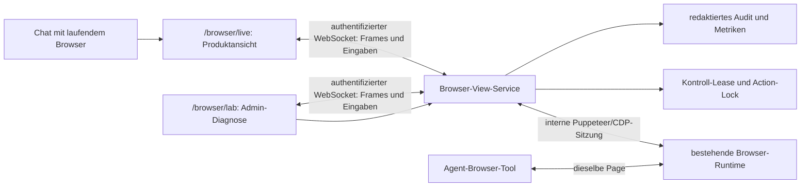

# Browser Lab und Live-Browser-Plan

Stand: 2026-07-19
Status: Phase 0 bis 6 implementiert und per Build, Security-/Lasttests sowie End-to-End-Test validiert

## 1. Entscheidung und Zielbild

Canvas Notebook soll dem Nutzer erlauben, genau die Chromium-Seite zu sehen und bei Bedarf zu bedienen, die sein Agent bereits verwendet. Agent und Nutzer arbeiten damit im selben Browserprofil, mit denselben Tabs, Cookies, Logins und Seiteneinstellungen.

Die Admin-Diagnose bleibt bewusst separat unter `/browser/lab`. Die Produktoberfläche liegt unter `/browser/live` und wird aus einer konkreten Chat-/Agent-Session heraus geöffnet. Nutzer wählen dort keine technischen Browseridentitäten aus; Agent und Session stammen aus dem bereits geöffneten, autorisierten Chat.

Die Umsetzung nutzt die vorhandene Puppeteer-/Chromium-Runtime. Es wird kein zweiter Browser, kein frei erreichbarer Chrome-Debugging-Port und kein allgemeiner Server-Desktop bereitgestellt.

## 2. Was ist produktrelevant, was gehört nur ins Lab?

| Bestandteil | Lab | Produktion | Begründung |
| --- | --- | --- | --- |
| Gemeinsame Browserseite und dauerhaftes Profil | ja | ja | Kern der Zusammenarbeit; Cookies und Logins müssen erhalten bleiben. |
| Serverseitige Autorisierung, kurzlebige View-Tickets und Kontroll-Lock | ja | ja | Sicherheits- und Konsistenzanforderung, keine Debug-Hilfe. |
| Bildstream und Maus-/Tastatureingaben | ja | ja | Kernfunktion. |
| Status `Ansehen`, `Agent steuert`, `Nutzer steuert` | ja | ja | Vermeidet konkurrierende Aktionen. |
| Tab-, Popup-, Download- und Dialogzustand | ja | ja | Für reale Browserarbeit erforderlich. |
| Browser-/Agent-Aktivität in verständlicher Form | ja | ja, reduziert | In Produktion nur nutzerrelevante Aktionen, niemals rohe Tool- oder Protokolldaten. |
| Manuelle Auswahl von Agent und Chat-Session | ja | nein | Im Lab für Tests; später entsteht der Kontext aus dem geöffneten Chat. |
| Profil-Key, Profilpfad, Roh-URL-Policy, Frame-Rate und Speicherdetails | optional | nein | Betriebsdiagnostik, keine normale Nutzerinformation. |
| Konsolenlogs, CDP-Protokoll, Rohfehler und „Seite zurücksetzen“ | optional | nur Admin-Support | Hilft beim Debuggen, kann aber Details und Seitendaten offenlegen. |
| Feste Testwerte wie `1280 × 800 · 6 FPS` | ja | nein | Im Lab vergleichbar; Produktion passt die Darstellung innerhalb definierter Grenzen an. |

Die Trennung gilt auch im Code: Die sicheren Browser-View-Services dürfen nicht von Komponenten der Lab-Route abhängen. Die Lab-UI ist lediglich ihr erster Client.

## 3. Bestehende Architektur und zu berücksichtigende Dokumente

### Vorhandene Browser-Runtime

Die aktuelle Runtime besitzt bereits die entscheidenden Bausteine:

- Chromium wird lokal über Puppeteer gestartet; im Container läuft es headless.
- Ein Browserprofil ist standardmäßig nach Nutzer und Agent abgegrenzt; ein Workspace wird, sofern vorhanden, ebenfalls in den Kontext aufgenommen.
- Cookies, Local Storage und Chromium-Einstellungen liegen im persistenten `userDataDir` unter dem Daten-/Cache-Pfad.
- Die aktive Seite gehört zu einer Agent-Session und wird mit einem Action-Lock serialisiert.
- Browseraktionen sind bereits durch eine zentrale URL-Policy und Runtime-Settings abgesichert.

Die visuelle Oberfläche ergänzt diese Runtime. Sie darf keine parallele Puppeteer- oder Chromium-Instanz mit einem abweichenden Profil starten.

### Bestehende Pläne

| Dokument | Verhältnis zu diesem Vorhaben | Erforderliche Anpassung |
| --- | --- | --- |
| `docs/crawl4ai-web-fetch-integration-plan.md` | Beschreibt browserbasierten, gerenderten Web-Fetch für den Agenten. Das ist keine interaktive Browseransicht. | Inhaltlich kein Umbau. Bei Umsetzung dieses Plans soll ein kurzer Scope-Verweis ergänzt werden: Crawl4AI erhält keinen Zugriff auf die Live-View und umgekehrt. Gemeinsame Requirement-/URL-/Resource-Gates bleiben zulässig. |
| `docs/architecture/canvas-notebook/team-workspace/13-resource-aware-ingestion-and-job-backpressure.md` | Definiert bereits Mindestwerte und Gates für Chromium-basierte Arbeit. | Bei Freigabe des Lab-Spikes um das Budget `interactive_browser_view` ergänzen; die generelle 1,5-GiB-Untergrenze bleibt bestehen. |
| `docs/architecture/canvas-notebook/team-workspace/18-collaboration-and-file-conflict-policy.md` | Definiert kurzlebige Tickets, Heartbeats und Locks für kollaborative Verbindungen. | Kein Browser-spezifischer Umbau nötig. Das Ticket-/Heartbeat-Muster wird für Browser-Views wiederverwendet, aber nicht mit Dokument-Locks vermischt. |

Damit existiert aktuell kein Plan, der ersetzt werden muss. Die zwei späteren, gezielten Ergänzungen verhindern jedoch widersprüchliche Ressourcen- oder Scope-Annahmen.

## 4. Abgrenzung und Nicht-Ziele

V1 ist eine gemeinsame Browser-Session, kein vollständiger Remote-Desktop.

Nicht Teil von V1 sind:

- VNC/noVNC, X11-Desktop, Shell- oder Betriebssystemsteuerung;
- ein nach außen offener DevTools-/CDP-Port;
- Zugriff auf den lokalen Chrome-Browser oder das lokale Dateisystem des Nutzers;
- Cookie-Inspector, Export von Browserdaten oder Einblick in gespeicherte Passwörter;
- WebRTC-Video, Audio oder Medienwiedergabeoptimierung;
- mehrere gleichzeitige schreibende Nutzer in derselben Browserseite;
- automatische Umgehung von CAPTCHA, Paywalls oder Browserwarnungen.

WebRTC oder ein Desktop-Stream können später separat bewertet werden. Der erste Weg ist ein bildbasierter CDP-Stream mit begrenzter Framerate, weil Chromium bereits headless betrieben wird.

## 5. Zustandsmodell: Profil, Seite und Viewer trennen

### 5.1 Persistentes Browserprofil

Die Identität des Profils wird ausschließlich auf dem Server aus dem autorisierten Runtime-Kontext hergeleitet:

```text
userId + agentId + workspaceId + profileScope
```

Für produktive Zusammenarbeit bleibt der Profil-Scope `agent`; ein Scope `session` wäre für wiederkehrende Logins ungeeignet, weil jede Chat-Session ein anderes Profil bekäme. Derselbe Nutzer, derselbe Agent und derselbe Workspace müssen bei einer neuen Chat-Session wieder dasselbe Profil erhalten.

Das Profil enthält insbesondere:

- HTTP-only Cookies, normale Cookies und Local Storage,
- Website-spezifische Logins und Einwilligungen,
- Chromium-Präferenzen, soweit sie im User-Data-Verzeichnis liegen,
- Cache und Sessionwiederherstellung, innerhalb der vorgegebenen Browser-Richtlinien.

Weder das Frontend noch der Agent erhalten eine API zum Auslesen oder Exportieren von Cookies. „Profil zurücksetzen“ ist eine getrennte, bestätigte Admin-/Nutzeraktion und niemals ein Nebeneffekt von „Neue Seite“ oder einem Reload der Lab-Route.

### 5.2 Browserseite und Tabs

Eine Browser-View referenziert eine aktive Seite der vorhandenen Runtime. Die Runtime muss Pop-ups und neu geöffnete Seiten als kontrollierte Tabs erkennen und an die View melden. Ein Tabwechsel ändert nur die sichtbare Seite, nicht das Profil.

Ein Reload oder WebSocket-Reconnect der Lab-UI trennt nur den Viewer. Er darf weder den Browserprozess noch die aktive Seite schließen. Die bestehende Idle-Logik wird um eine Viewer-Lease erweitert, damit eine aktiv betrachtete oder bediente Seite nicht vorzeitig geschlossen wird.

### 5.3 Viewer- und Kontrollsitzung

Eine kurzlebige Browser-View-Sitzung besitzt:

```text
viewId
userId
agentId
agentSessionId
workspaceId
profileKey (nur serverintern)
activeTabId
mode: view | agent | user
leaseExpiresAt
```

Nur ein Owner der View kann interaktive Eingaben senden. Weitere berechtigte Clients sind zunächst read-only. Der Wechsel zu `user` pausiert den Agenten, bevor die erste Eingabe weitergegeben wird. Der Wechsel zu `agent` erfordert eine explizite Nutzeraktion. Alle Agent- und Nutzereingaben laufen durch denselben Browser-Action-Lock.

## 6. Zielarchitektur



### 6.1 Browser-View-Service

Ein serverseitiger Service kapselt die neue Funktion. Er erhält nur einen vollständig autorisierten Browser-Runtime-Kontext und:

1. löst die vorhandene aktive Seite auf oder startet sie kontrolliert;
2. öffnet eine interne DevTools-Protocol-Sitzung auf genau dieser Seite;
3. startet einen begrenzten JPEG-Screencast oder nutzt im Fallback ereignisbasierte Screenshots;
4. mappt skalierte Frontend-Koordinaten auf die feste Chromium-Viewport-Größe;
5. validiert und serialisiert Maus-, Scroll- und Tastatureingaben;
6. sendet Tab-, Navigation-, Dialog- und Kontrollzustand;
7. beendet beim Viewer-Disconnect nur die View, nicht den Browser.

Die CDP-Verbindung bleibt eine Implementierungsdetails des Servers. Sie wird nie als Port, URL oder Socket an den Browser-Client weitergereicht.

### 6.2 Transport

Für Frames wird ein separater WebSocket-Pfad empfohlen, beispielsweise `/ws/browser`, statt hochfrequente Bilddaten in den Chat-WebSocket einzumischen. Der bestehende Upgrade-Router, die Trusted-Origin-Prüfung, Cookie-Authentifizierung, Heartbeats, Größenlimits und Rate-Limits werden wiederverwendet.

Nach der normalen App-Authentifizierung stellt eine Route ein kurzlebiges, signiertes View-Ticket aus. Der WebSocket prüft dieses Ticket zusätzlich zur Session-Cookie-Authentifizierung. Der Client kann niemals selbst `userId`, `workspaceId`, `agentId`, Profil oder Berechtigungen setzen.

Beispielhafte Nachrichten:

| Richtung | Nachricht | Zweck |
| --- | --- | --- |
| Client → Server | `view_subscribe` | Ticket einlösen und View lesen. |
| Client → Server | `control_request` | Wechsel zu `view`, `agent` oder `user` anfordern. |
| Client → Server | `input_mouse`, `input_key`, `input_scroll` | Nur im Modus `user`; streng rate-limitiert. |
| Server → Client | `frame` | JPEG-Frame mit Sequenznummer und Viewport-Metadaten. |
| Server → Client | `state` | URL, Titel, Tabs, Dialog, Control-Owner und Lease. |
| Server → Client | `error` | Redaktierter, nutzerverständlicher Fehlercode. |

Frames erhalten eine Sequenznummer und werden bestätigt oder bei Rückstau verworfen. Es darf nie eine unbegrenzte Frame-Queue entstehen.

## 7. Security, Datenschutz und Dateiflüsse

### Autorisierung und Isolation

- Die Route setzt eine gültige Canvas-Session voraus.
- Der Nutzer benötigt Leserecht im Workspace und die Berechtigung, den gewählten Agenten auszuführen bzw. dessen Session zu öffnen.
- Agent, Chat-Session und Workspace werden serverseitig miteinander abgeglichen.
- Manuell eingegebene IDs aus URL, Form oder WebSocket sind nur Auswahlhinweise und keine Autorisierung.
- Die bestehende Browser-URL-Policy gilt identisch für Agent und Nutzer. Die View darf keine interne Netzadresse oder URL freischalten.

### Datenschutz

- Frame-Daten werden nur im Speicher gestreamt und nicht standardmäßig gespeichert.
- Audit-Events enthalten Actor, Zeit, Aktionstyp und Zielzustand, nie Tastaturtext, Cookies, Screenshot-Pixel oder sensible Formularwerte.
- Passwort- und Zahlungsseiten erhalten eine sichtbare private Eingabemeldung; Frames werden weiterhin nur live übertragen, aber nicht geloggt oder gecacht.
- Debug-Logs zeigen keine Profilpfade, Cookie-Namen, Request-Header, Tokens oder Voll-URLs mit Credentials.

### Uploads und Downloads

- Ein Server-Browser kann nicht auf Dateien des Nutzergeräts zugreifen. Uploads wählen daher erst eine Datei aus dem autorisierten Arbeitsbereich der Agent-Session aus; erst dann wird sie über die kontrollierte Browseraktion hochgeladen.
- Downloads landen serverseitig in einem kontrollierten Bereich der Agent-Session und werden über die Canvas-Datei-API mit Pfad-, Ownership- und Berechtigungsprüfung angeboten.
- Native Dateidialoge werden nicht als Remote-Desktop-Durchgriff behandelt.

Diese Dateiflüsse verwenden den Arbeitsbereich der Agent-Session und setzen keine lizenzpflichtige Team-Workspace-Navigation voraus.

## 8. Ressourcen- und Betriebsmodell

Die Visualisierung erhöht die Last gegenüber gelegentlichen Agent-Screenshots. Vor jedem Start bewertet ein gemeinsamer Resource Resolver Browser-Runtime, verfügbaren cgroup-konformen Speicher, CPU und laufende Browserprofile.

| Profil | Zulässiges Verhalten für `interactive_browser_view` |
| --- | --- |
| Unter 1,5 GiB effektivem Memory | blockiert; klare Ressourcenmeldung. |
| 1,5–4 GiB | höchstens ein sichtbarer Browser, ein Viewer, 2–4 FPS, 1280×800 oder kleiner; keine zweite interaktive Session. |
| Ab 4 GiB und 2 vCPU | ein aktiver interaktiver Browser mit 4–8 FPS; weitere Agent-Browser nur nach Budget. |
| Ab 8 GiB und 4 vCPU | mehrere Sessions möglich, aber pro Nutzer/Organisation budgetiert und mit harter Frame- und Browserprofilgrenze. |

Die Werte sind konservative Startwerte und müssen im Lab mit realen Zielseiten gemessen werden. Browserprofile dürfen nicht allein wegen der aktuellen globalen Obergrenze hochskaliert werden. Besonders CPU-intensiv sind Scrollen, Animationen, große DOMs und JPEG-Kodierung.

Bei knappen Ressourcen degradiert das System in dieser Reihenfolge:

1. niedrigere Framerate;
2. kleinere Viewport-/JPEG-Qualität;
3. nur ereignisbasierte Screenshots im Lab;
4. read-only Viewer ohne Eingaben;
5. neue View mit verständlichem Grund ablehnen.

Ein kritischer Speicherdruck beendet zuerst neue oder inaktive Views, nicht unkontrolliert die gesamte Node-App.

## 9. Umsetzungsphasen

### Implementierungsstand vom 2026-07-19

- Die geschuetzte Route `app/[locale]/(routes)/browser/lab/page.tsx` und die Lab-Oberflaeche unter `app/components/browser-lab/` sind umgesetzt.
- Kurzlebige signierte View-Tickets werden ueber `POST /api/browser/view` ausgegeben und im separaten WebSocket-Pfad `/ws/browser` zusaetzlich zur normalen Session-Cookie-Authentifizierung geprueft.
- Bildframes besitzen Sequenznummern und Client-Bestaetigungen; bei einem nicht bestaetigten Frame oder WebSocket-Rueckstau wird kein weiterer Frame angehaeuft.
- Agenten- und Nutzereingaben verwenden denselben Browser-Action-Lock. Waehrend der Nutzersteuerung werden mutierende Agenten-Browseraktionen abgewiesen.
- Tabs, Pop-ups, Navigation, Maus, Tastatur, Scrollen und JavaScript-Dialoge sind an die bestehende persistente Browser-Runtime angebunden.
- Das Ressourcenbudget blockiert interaktive Views unter 1,5 GiB effektivem Speicher und reduziert Framerate, Viewport und Parallelitaet auf kleineren Systemen.
- Kontrollwechsel, Navigation, Tabwechsel, Dialogaktionen sowie Connect/Disconnect werden ohne Tastaturtext, Screenshotdaten, Cookies oder URL-Querydaten auditiert.
- Da die Agent-Runtime noch keinen fortsetzbaren Pause-Zustand besitzt, bricht die Nutzeruebernahme einen aktiven Agentenlauf in dieser ersten Version kontrolliert ab. Eine echte Pause-/Resume-Semantik bleibt ein separates Runtime-To-do.
- Page-Crashs werden durch eine kontrolliert neu aufgebaute Seite abgefangen; Verbindungs- und Navigationsfehler bleiben sichtbar und koennen ohne Verlust des Browserprofils erneut versucht werden.
- Uploads und Downloads aus Phase 4 laufen ausschliesslich ueber den autorisierten Arbeitsbereich der Agent-Session. Pfadtraversal, Symlinks ausserhalb des Roots, unzulaessige Dateitypen und Groessenueberschreitungen werden abgewiesen.
- Die Produktansicht `app/[locale]/(routes)/browser/live/page.tsx` validiert eine eigene Agent-/Chat-Session und deren Ausfuehrungskontext serverseitig. Sie zeigt keine Lab-Auswahl, Profilpfade oder Rohdiagnostik.
- Der Chat zeigt „Live-Browser“ nur dann, wenn exakt fuer die geoeffnete Agent-/Session-Kombination ein Browser laeuft. Der Status-Endpunkt ist `no-store` und loest den Ausfuehrungskontext der angefragten, eigenen Session auf.
- Die Runtime-Registry liegt pro Node-Prozess auf `globalThis`, damit der Custom-WebSocket-Server und die von Next gebuendelten Route-Handler denselben Browserstatus sehen, obwohl sie in getrennten Modulgraphen laufen.
- Der Produktflow bleibt mit dem aktivierten Community-Plan kompatibel. Er verwendet keine optionalen Team-Workspace-APIs; Ownership und Session-Kontext werden trotzdem vollstaendig serverseitig validiert.
- TypeScript, ESLint, `npm run build`, Browser-/Ticket-/Lock-/URL-/WebSocket-Service-Tests und ein Security-Lasttest mit 20.000 Iterationen sind erfolgreich.
- Der serielle Playwright-Lauf gegen den frisch gebauten Test-Container ist mit 6 von 6 Szenarien erfolgreich: Auth-Gate, Lab-Shell, Recovery/Retry, Steuerungsuebergabe, Chat-Produktintegration sowie Upload/Download.

### Phase 0 – Verträge und Testspike

- Browser-View-Typen, Zustandsautomaten und Nachrichten-Schemas definieren.
- Prüfen, dass ein Screencast aus der aktuellen headless Chromium-Konfiguration zuverlässig funktioniert.
- Fallback mit begrenzten Screenshots validieren.
- Prototyp ausschließlich mit einer erlaubten Testseite und einem Profil durchführen.
- Keine UI-Integration außerhalb der Lab-Route.

**Erfolgskriterium:** Derselbe Tab wird nach Agenten-Navigation sichtbar; ein UI-Reload lässt Cookies und die Seite unverändert.

### Phase 1 – Runtime- und Kontrollschicht

- `app/lib/pi/browser/` um einen fokussierten Browser-View-Service erweitern.
- Gemeinsamen Lock für Agent- und Nutzereingaben einführen.
- View-Lease in die Idle-Close-Entscheidung einbeziehen.
- Tabs, Pop-ups, Navigation und JavaScript-Dialoge als Zustandsereignisse abbilden.
- Ressourcenresolver um das Budget `interactive_browser_view` erweitern.

**Erfolgskriterium:** Agent und Nutzer können nicht gleichzeitig mutieren; bei Nutzerübernahme pausiert der Agent nachweisbar vor dem ersten Input.

### Phase 2 – Sichere API und WebSocket

- Geschützte Lab-Session-Route und Ticket-Ausstellung implementieren.
- Eigenen WebSocket-Pfad in `server/websocket-server.ts` beziehungsweise dem zentralen Upgrade-Router hinzufügen.
- Vorhandene Auth-, Origin-, Größen- und Rate-Limit-Mechanismen wiederverwenden.
- Frame-Backpressure, Heartbeat, Disconnect und Lease-Ablauf testen.
- Redaktierte Audit- und Betriebsereignisse ergänzen.

**Erfolgskriterium:** Fremde User-, Workspace-, Agent- oder Session-IDs werden zuverlässig abgewiesen; ein Socket-Disconnect hinterlässt keinen Eingabe-Lock.

### Phase 3 – Separate Lab-Route

- Route `app/[locale]/(routes)/browser/lab/page.tsx` mit Server-Session-Guard anlegen.
- Development-/Admin-Gate serverseitig durchsetzen und die Route zunächst nicht in den App Launcher aufnehmen.
- Browser-Lab-Komponenten unter `app/components/browser-lab/` anlegen.
- Lab zeigt Agent-/Session-Auswahl, Live-Browserfläche, Kontrollmodus, Tabs sowie eine klar getrennte Debug-Seitenleiste.
- Die sichtbare Viewport-Größe ist fest und Eingaben werden präzise skaliert.

**Erfolgskriterium:** Ein berechtigter Nutzer kann denselben Agenten-Tab ansehen, übernehmen und wieder an den Agenten geben, ohne Profilverlust.

### Phase 4 – Reale Browserarbeit absichern (abgeschlossen)

- Workspace-vermittelten Upload-Flow ergänzen.
- Sicheren Downloadbereich und Canvas-Download-Übergabe ergänzen.
- Passwort-/sensible Formularhinweise, Dialog- und Popup-UX vervollständigen.
- Browser-Crash, Page-Crash, Navigation-Fehler und Ressourcendegradierung verständlich darstellen.

**Erfolgskriterium:** Login, Upload und Download funktionieren ohne Cookie-Export, lokalen Dateisystemdurchgriff oder versteckte Browserdaten.

### Phase 5 – Validierung und kontrollierter Rollout (abgeschlossen)

- Unit- und Service-Tests für Ownership, Ticket, Lock, Koordinaten, Frame-Backpressure, Redaction und Ressourcenresolver ergänzen.
- API-/WebSocket-Integrationstests ergänzen.
- `npm run lint` und `npm run build` ausführen.
- Sichtbare UI- und End-to-End-Prüfungen mit Playwright oder Chrome DevTools nur nach expliziter Freigabe durchführen.
- Lab zunächst nur für Development/Admin aktivieren und Metriken zu Speichernutzung, Frame-Drops, Latenz und Crashs erfassen.

**Erfolgskriterium:** Die Lab-Route zeigt keine unredigierten Geheimnisse, bleibt unter Ressourcenlimits stabil und erfüllt alle relevanten Fehlerszenarien.

### Phase 6 – Produktintegration (abgeschlossen)

- Lab-Route bleibt als Admin-Diagnoseoberfläche erhalten.
- In der Chat-/Agent-Ansicht erscheint für eine laufende Browser-Session ein kontextgebundener Einstieg „Live-Browser öffnen“.
- Die Produktansicht übernimmt nur Nutzerfunktionen: Status, Viewer, Tabs, Nutzerübernahme und verständliche Agent-Aktivität.
- Agent-/Session-Picker, Rohprotokolle, Profilpfade und Diagnoseaktionen bleiben im Lab oder Admin-Support.

**Erfolgskriterium:** Nutzer starten die Funktion aus dem richtigen Chat-Kontext, ohne technische Browser-Identitäten auswählen oder verstehen zu müssen.

## 10. Akzeptanzkriterien für den Übergang aus dem Lab

Die technische Freigabe wurde gegen folgende Punkte geprüft:

- [x] Browserprofile werden stabil aus Nutzer, Agent und optionalem Workspace hergeleitet und nicht durch Viewer-Reconnects ersetzt.
- [x] Reload, WebSocket-Reconnect und Nutzerübernahme erzeugen keine parallelen Eingaben; der gemeinsame Action-Lock bleibt massgeblich.
- [x] Browserdebug-Port, Cookie-Werte, Profilpfade und unredigierte Tastaturinhalte erreichen weder Produktclient noch Audit-Logs.
- [x] Ressourcenlimits und Verbindungsobergrenzen lehnen zusätzliche interaktive Browser kontrolliert ab.
- [x] Upload und Download verwenden nur autorisierte Canvas-Dateiflüsse innerhalb der Agent-Session.
- [x] Frame-Backpressure begrenzt die Queue; unbestätigte Frames werden nicht aufgestaut.
- [x] Lab-Debugfunktionen sind von der Produktansicht getrennt.
- [x] Der Einstieg und die Rückkehr funktionieren aus dem tatsächlichen Community-Chatflow ohne Team-Workspace-Feature.

## 11. Entschiedene Sonderfälle und verbleibende Betriebsfragen

1. Die View öffnet sich nicht ungefragt. Der Chat blendet den Einstieg nur für die exakt geöffnete Session und nur während einer laufenden Browser-Runtime ein.
2. Mehrere lesende Verbindungen sind innerhalb der harten WebSocket-Grenze zulässig; es gibt weiterhin nur einen schreibenden Kontroll-Owner. Der Server begrenzt aktuell auf vier Browser-View-Sockets pro Nutzer.
3. „Take control“ bricht einen aktiven Agentenlauf vor dem ersten Nutzereingriff kontrolliert ab. Echtes Pause/Resume ist ein späteres Runtime-Feature und wird nicht vorgetäuscht.
4. Das Löschen eines persistenten Browserprofils bleibt eine separate, bestätigungspflichtige Admin-/Nutzerfunktion. Die Live-View löscht niemals Profile oder Logins.
5. Die konservativen Memory-, Viewport- und FPS-Grenzen bleiben die Produktionsdefaults. Weitere Hochskalierung erfordert reale Telemetrie zu Latenz, Frame-Drops, CPU und Speicherdruck.
6. Die aktuell aktivierte Lizenz ist ein Community-Plan. Die Live-Browser-Funktion ist deshalb bewusst nicht an `teamWorkspace` oder `personalWorkspaces` gekoppelt.

## 12. Betrieb und Weiterentwicklung

`/browser/lab` bleibt die nicht verlinkte Admin-Diagnose für technische Auswahl- und Fehlerfälle. `/browser/live` ist der einzige normale Produkteinstieg und übernimmt Agent sowie Session aus dem Chat. Beide Oberflächen verwenden dieselbe autorisierte Transport-, Runtime-, Lock- und Dateischicht.

Für einen Rollout sollen Browserstarts, aktive Viewer, verworfene Frames, Verbindungsabbrüche, Page-Crash-Recoveries und Ressourcenablehnungen aggregiert beobachtet werden. Die Telemetrie darf weiterhin keine Frames, Formulareingaben, Cookies oder vollständigen URLs mit Zugangsdaten enthalten.
