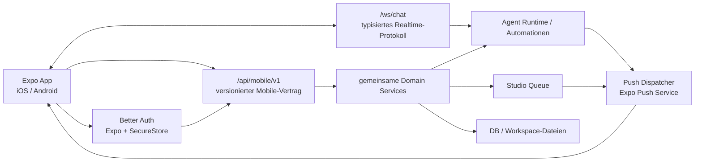

# Canvas Notebook Expo Mobile App – Produkt- und Umsetzungsplan

> Stand: 2026-07-19
>
> Status: Entwurf zur Freigabe
>
> Zielplattformen: iOS und Android
>
> Produktziel: Native Companion-App für Canvas-Notebook-Instanzen, keine WebView-Hülle und keine lokale Agent-Runtime
>
> Mobile-Repository: separates privates Git-Repository `canvas-notebook-mobile`; kein Unterordner dieses öffentlichen Server-Repositorys

## 1. Kurzentscheidung

Canvas Notebook soll eine echte Expo-/React-Native-App erhalten. Die App wird als nativer Client für eine gehostete oder selbst gehostete Canvas-Notebook-Instanz gebaut. Agenten, Automationen, Studio-Jobs, Dateien und Kollaboration bleiben serverseitig; die App stellt die für unterwegs wichtigsten Workflows nativ bereit.

Der erste Release konzentriert sich auf:

1. Instanz verbinden und sicher anmelden.
2. Agent-Chats in Echtzeit führen und fortsetzen.
3. Push-Benachrichtigungen öffnen direkt die betroffene Session, Aufgabe oder Generierung.
4. Workspaces wechseln und relevante Aktivität sehen.
5. To-dos prüfen, erstellen, zuweisen und abschließen.
6. Studio-Inhalte mit einem vereinfachten Flow generieren, ansehen, speichern und teilen.
7. Dateien durchsuchen, Markdown lesen und kontrolliert bearbeiten sowie Medien hochladen.

Die App ist damit zuerst ein produktiver mobiler Begleiter für Freelancer, Small-Business-Nutzer und Content Creator. Sie versucht nicht, jede Desktop- oder Admin-Funktion abzubilden.

## 2. Produktziel und wichtigste mobile Jobs

Aus den priorisierten Zielgruppen ergeben sich fünf mobile Kern-Jobs:

| Job | Typische Situation | Erwartetes Ergebnis |
|---|---|---|
| Agent überwachen und steuern | Unterwegs kommt eine Rückfrage oder ein Lauf ist fertig | Session öffnen, Ergebnis lesen, antworten, steuern oder abbrechen |
| Content erstellen und freigeben | Idee, Foto oder Kundenfeedback kommt unterwegs | Prompt oder Referenz hochladen, Generation starten, Ergebnis teilen oder speichern |
| Aufgaben abarbeiten | Agent oder Team weist eine Aufgabe zu | Aufgabe öffnen, Kontextdatei prüfen, kommentieren, abschließen oder Follow-up starten |
| Wissen und Dateien nutzen | Eine Notiz, Kundeninfo oder Datei wird spontan benötigt | Workspace durchsuchen, Inhalt lesen, Markdown korrigieren oder Datei teilen |
| Systemaktivität prüfen | Automation, Studio-Job oder Agent arbeitet im Hintergrund | Status und Kosten-/Fehlerhinweis sehen, bei Bedarf erneut starten oder zur Web-App wechseln |

Der mobile „Aha-Moment“ ist: Der Nutzer erhält eine Push-Nachricht zu einem fertigen Agenten- oder Studio-Ergebnis, öffnet den richtigen Kontext mit einem Tap und kann sofort weiterarbeiten oder das Ergebnis teilen.

## 3. MVP-Scope

### 3.1 P0 – Muss im ersten produktiven Release enthalten sein

#### A. Instanzverbindung, Authentifizierung und Kompatibilität

- Verwaltete Canvas-Cloud als vorkonfigurierte Instanz.
- Manuelle HTTPS-Server-URL für Self-Hosted-Nutzer.
- Verbindungsprüfung vor dem Login.
- Anzeige von Instanzname, Serverversion, Deployment-Modus und unterstützten Mobile-Funktionen.
- E-Mail-/Passwort-Login über Better Auth.
- Session sicher in `expo-secure-store` speichern.
- Abmelden widerruft Session und Push-Registrierung und leert nutzerspezifische lokale Daten.
- Klare Upgrade-Meldung, wenn die Instanz die benötigte Mobile-API-Version nicht unterstützt.
- Release-Builds akzeptieren nur HTTPS. Unsicheres HTTP ist ausschließlich in lokalen Development Builds erlaubt.

Warum P0: Ohne einen versionierten Verbindungs- und Auth-Flow ist die App bei unterschiedlichen Self-Hosted-Versionen nicht zuverlässig betreibbar.

#### B. Native Navigation und Workspace-Kontext

- Expo Router mit geschützten Routen und nativen Tabs.
- Tabs: `Home`, `Chat`, `Studio`, `Dateien`, `Inbox`.
- Globaler Workspace-Switcher mit Berechtigungsanzeige.
- Home zeigt:
  - laufende Agent-Sessions,
  - ungelesene Antworten,
  - fällige oder neue To-dos,
  - aktive Studio-Generierungen,
  - fehlgeschlagene Automationen.
- Jeder Request trägt den aktiven Workspace explizit; kein impliziter globaler Serverzustand.

#### C. Agent Chat

- Agent auswählen und Session erstellen.
- Session-Historie pro Workspace laden und durchsuchen.
- Nachrichten paginiert laden.
- Echtzeit-Streaming über das bestehende Chat-WebSocket-Protokoll.
- Text, Markdown, Bilder und Dateianhänge darstellen.
- Fotos, Videos und Dokumente aus Kamera, Mediathek und Dateiauswahl anhängen.
- Laufstatus, Tool-Aktivität und verständliche Fehlerzustände anzeigen.
- Lauf steuern: Follow-up, Steer, Abort sowie wartende Nachricht entfernen.
- Ungelesen-/Gelesen-Status synchronisieren.
- Lokalen Composer-Entwurf pro Session erhalten.
- Verbindungsabbruch mit Reconnect und klarer Sendebestätigung behandeln; Nachrichten niemals still doppelt senden.

Nicht im ersten Release: vollständige Tool-Rohdatenansicht, Agenten-Erstellung, Tool-/Skill-Konfiguration und komplexe Runtime-Provider-Einstellungen.

#### D. Push Notifications und Deep Links

- Device-Registrierung pro Nutzer, Instanz und Installation.
- Push-Ereignisse mindestens für:
  - Agentenantwort fertig,
  - Agentenfehler oder benötigte Nutzeraktion,
  - neues/zugewiesenes/fälliges To-do,
  - Studio-Generierung fertig oder fehlgeschlagen.
- Notification-Tap öffnet exakt die passende native Route.
- Push-Payload enthält standardmäßig keine Prompts, Dateiinhalte oder vollständigen Nachrichtentexte.
- Vorschautext ist eine explizite Nutzereinstellung und standardmäßig deaktiviert.
- Token-Rotation, Logout, deaktivierte Notifications und ungültige Push-Tokens werden serverseitig bereinigt.

Warum P0: Die 24/7-Server-Runtime wird mobil erst durch verlässliche Re-Engagement-Flows wirklich wertvoll.

#### E. Inbox und To-dos

- Gemeinsame Inbox für ungelesene Agentenantworten, To-dos und relevante Fehler.
- To-dos filtern nach Workspace, Status, Fälligkeit, Priorität und Zuweisung.
- To-do erstellen, bearbeiten, zuweisen, als erledigt markieren und archivieren.
- Verknüpfte Dateien öffnen.
- Follow-up an den Agenten aus einer Aufgabe starten.
- Inbox-Zähler und Gelesen-Status mit dem Server synchronisieren.

#### F. Studio Quick Create und Mediathek

- Vorhandene Starting Points, Modelle und Presets vom Server laden.
- Vereinfachte Erstellung für Bild, Video und Sound über ein gemeinsames Formular:
  - Modus,
  - Prompt,
  - Modell oder Serverstandard,
  - Seitenverhältnis,
  - optionale Referenzmedien.
- Referenzbild direkt aufnehmen oder aus Mediathek/Dateien wählen.
- Queue-Position und Generierungsstatus anzeigen.
- Aktive Jobs im Vordergrund pollen; im Hintergrund über Push abschließen.
- Generierungen und Outputs paginiert anzeigen.
- Ergebnis auf dem Gerät speichern, über das native Share Sheet teilen oder in den Workspace übernehmen.
- Fehler müssen Provider-, Konfigurations- und Kontingentprobleme nutzerverständlich unterscheiden und auf die Web-Einstellungen verlinken.

Nicht im ersten Release: Bulk-Editor, Persona-/Produkt-/Style-Verwaltung, Preset-Builder und Aspect-Ratio-Editor. Bestehende Presets dürfen verwendet, aber zunächst nicht mobil verwaltet werden.

#### G. Dateien und Markdown

- Dateibaum oder flache Suche pro Workspace.
- Markdown, Bilder, PDF, Video und Audio nativ ansehen.
- Markdown in einer einfachen nativen Editoransicht bearbeiten.
- Speichern mit bestehendem Revision-/Hash-Schutz.
- Bei Konflikten niemals überschreiben: Serverstand, lokaler Entwurf und Aktionen „neu laden“/„lokalen Text kopieren“ anbieten.
- Datei oder Ordner erstellen, umbenennen und in den Papierkorb verschieben.
- Dokumente und Medien über native Picker hochladen.
- Bestehende öffentliche Links erstellen, kopieren, teilen und widerrufen, sofern berechtigt.
- Lokale Entwürfe sichern, aber im MVP keine Offline-Änderungen automatisch synchronisieren.

Nicht im ersten Release: vollständiger Tiptap-WYSIWYG-Editor, MARP-Bearbeitung, Excalidraw-Bearbeitung und Yjs-Live-Collaboration. Diese benötigen einen eigenen Mobile-Editor-Track.

#### H. Native Qualität

- Dark Mode und System-Theme.
- Safe Areas, dynamische Schriftgrößen, Screenreader-Labels und reduzierte Animationen.
- Leere, ladende, offline und fehlerhafte Zustände für jeden Screen.
- Netzwerkstatus und Retry ohne Datenverlust.
- Crash- und Performance-Telemetrie ohne Prompts, Nachrichten, Dateinamen, Tokens oder Dateiinhalte.
- Deutsch und Englisch ab erstem Release.

### 3.2 P1 – Direkt nach dem MVP

- Automationen auflisten, letzte Runs und Logs anzeigen, aktivieren/deaktivieren und „Jetzt ausführen“.
- E-Mail-Triage: wichtige Nachrichten, Agentenzusammenfassung, Entwurf prüfen/freigeben; kein vollständiger Ersatz für native Mail-Apps.
- Eingehendes Share Sheet: Bild, Video, URL oder Text aus anderen Apps direkt an Chat, Studio oder Workspace senden.
- Mehrere gespeicherte Canvas-Instanzen mit strikt getrennten Sessions und Caches.
- QR-Pairing aus der Web-App für Self-Hosted-Instanzen.
- Biometrische App-Sperre.
- Lokale globale Suche über zuletzt geladene Sessions, To-dos und Dateien.
- App-Badge-Zähler und feinere Notification-Kategorien.

### 3.3 P2 – Spätere Ausbaupfade

- Mobile Live-Collaboration für Markdown inklusive Yjs-Awareness.
- Reichhaltiger Markdown-/Block-Editor.
- Team-Review und Kommentare direkt an Studio-Outputs.
- Automation-Builder.
- Agenten-Erstellung und Capability-Verwaltung.
- Kalenderansicht und Kalender-Integrationen.
- Native Widgets und Shortcuts.
- Enterprise SSO/MDM und verwaltete Instanzkonfiguration.
- Direkte APNs-/FCM-Zustellung für Enterprise ohne Expo Push Service.

## 4. Bewusste Nicht-Ziele des MVP

- Keine WebView für die gesamte Canvas-Web-App.
- Keine lokale Next.js-, Node-, Agenten- oder Browser-Runtime.
- Kein Terminal und keine Shell auf dem Mobilgerät.
- Kein lokaler KI-Provider und keine lokalen Provider-Secrets.
- Keine Admin-, Lizenz-, Backup-, Plugin-, Skill-, MCP- oder Integrationsverwaltung.
- Kein vollständiger E-Mail-Client.
- Keine versprochene exakte Hintergrundausführung auf dem Telefon. Mobile Betriebssysteme planen Background Tasks ungenau; die Canvas-Server-Runtime bleibt für Heartbeats und Automationen zuständig.
- Kein vollwertiger Offline-Modus. Lesecache und lokale Entwürfe sind erlaubt, serverseitige Aktionen benötigen eine Verbindung.

## 5. Technische Grundarchitektur

### 5.1 Repository-Struktur

Server und Mobile-App werden bewusst getrennt versioniert. Das öffentliche Repository enthält die
Serverimplementierung und den kanonischen Mobile-API-Vertrag. App-Quellcode, EAS-Konfiguration,
Store-Metadaten und Release-Workflows liegen ausschließlich im privaten Nachbar-Repository.

```text
canvasstudios-notebook/       # öffentliches Server-Repository
  app/api/mobile/v1/
  packages/mobile-contracts/ # kanonische Request-, Response- und WS-Schemas
  docs/expo-mobile-app-plan.md

canvas-notebook-mobile/      # separates privates Git-Repository
  src/app/                   # Expo-Router-Routen
  src/api/
    generated/               # eingecheckte, versionierte Contract-Artefakte
  src/auth/
  src/components/
  src/features/
  src/notifications/
  src/storage/
  assets/
  app.config.ts
  eas.json
  package.json
  package-lock.json
```

Zwischen den Repositories gibt es keine Workspace-, Git-Submodule-, Symlink- oder lokale
Dateisystem-Abhängigkeit. Der Server exportiert versionierte OpenAPI-/JSON-Schema-Artefakte; die
Mobile-App generiert daraus ihren Client und Runtime-Validatoren und checkt das Ergebnis ein. Eine
Mobile-Version deklariert die minimal unterstützte Mobile-API-Version. Zusammengehörige Änderungen
werden über API-Version und Release-Notizen koordiniert, nicht über einen atomaren Commit.

### 5.2 Client-Stack

| Bereich | Entscheidung |
|---|---|
| Framework | Expo SDK 57 mit TypeScript und React Native New Architecture |
| Navigation | Expo Router mit geschützten Routen und typisierten Links |
| Entwicklungsmodus | `expo-dev-client` ab dem ersten Spike; Expo Go ist nicht die Abnahmeumgebung |
| Auth | Better Auth + `@better-auth/expo` + `expo-secure-store` |
| Server State | TanStack Query mit bewusst begrenztem persistentem Lesecache |
| Lokaler UI-State | kleine feature-lokale Stores; Zustand nur dort, wo mehrere Routen denselben kurzlebigen Zustand teilen |
| Formulare | typisierte Form-State-Schicht mit Schema-Validierung |
| Realtime | ein appweiter Chat-WebSocket-Client mit Reconnect, Request-IDs und Idempotenzschutz |
| Medien | Expo ImagePicker, DocumentPicker, FileSystem, Video und Sharing |
| Push | `expo-notifications`, zunächst über Expo Push Service |
| Builds | EAS Development, Preview und Production Builds |
| Updates | EAS Update nur innerhalb einer kompatiblen Runtime-Version |
| E2E | Maestro auf iOS- und Android-Development-Builds; Server-Vertragstests separat |

SDK 57 wird erst nach einem kurzen Kompatibilitäts-Smoke-Test mit `@better-auth/expo` festgeschrieben. Falls die offizielle Better-Auth-Integration zum Implementierungsstart noch nicht SDK-57-kompatibel ist, wird dieser Blocker gelöst statt unbemerkt auf Cookie-Eigenbau auszuweichen.

### 5.3 Systemfluss



Die Mobile-Routen dürfen keine bestehenden HTTP-Routen intern per `fetch` aufrufen. Web- und Mobile-Routen sollen gemeinsame Domain Services verwenden, damit Validierung, Rechteprüfung, Audit und Persistenz nur einmal implementiert werden.

## 6. Vorhandene Server-Basis

Viele benötigte Funktionen existieren bereits und müssen nicht fachlich neu gebaut werden:

| Mobile-Funktion | Vorhandene Basis | Bewertung |
|---|---|---|
| Health | `GET /api/health` | vorhanden, aber ohne Mobile-API-/App-Kompatibilität |
| Auth | Better Auth unter `/api/auth/*`, Bearer-Plugin bereits aktiv | Expo-Plugin und Mobile-Scheme fehlen |
| Workspaces | `/api/workspaces` | fachlich gut wiederverwendbar |
| Agenten | `/api/agents` | vorhanden |
| Sessions | `/api/sessions`, `/api/sessions/messages` | vorhanden |
| Chat Realtime | `/ws/chat` mit Subscribe, Send, Control, Status und Notifications | leistungsfähige Basis; Mobile-Auth und geteilter Vertrag fehlen |
| Notification-Inbox | `/api/notifications/summary` | gute Aggregat-Basis, noch kein Push-Device-Lifecycle |
| Dateien | `/api/files/tree`, `read`, `write`, `create`, `rename`, `delete`, Upload-Sessions | vorhanden; React-Native-Uploads und stabile Mobile-Responses testen |
| Public Shares | `/api/security/public-shares` | vorhanden |
| To-dos | `/api/todos`, `/api/todo-categories`, Assignees und Follow-up | vorhanden |
| Studio | Config, Starting Points, Generate, Generations, Outputs und Library | vorhanden; Mobile-Form vereinfachen |
| Automationen | Jobs, Runs, Logs und Run-now | für P1 vorhanden |
| E-Mail | Accounts, Messages, Drafts, AI Reply und Send | für P1 vorhanden |

Das zentrale Risiko ist nicht fehlende Business-Logik, sondern dass die aktuellen Endpunkte primär für dieselbe Web-Origin und browserseitige Cookies gebaut wurden und noch keinen versionierten externen Client-Vertrag darstellen.

## 7. Erforderliche Backend-Erweiterungen

### 7.1 Versionierte Mobile API

Neue Basis: `/api/mobile/v1`.

Mindestens erforderlich:

| Endpoint-Gruppe | Zweck |
|---|---|
| `GET /compatibility` | öffentlich, minimale Server-/API-Version und unterstützte Auth-Arten vor Login |
| `GET /bootstrap` | Nutzer, Instanz, Lizenz-/Feature-Gates, Workspaces, aktive Defaults und Notification-Settings |
| `/sessions` und `/sessions/:id/messages` | stabiler Chat-Vertrag ohne Web-UI-interne Felder |
| `/inbox` | Agentenantworten, To-dos, Studio- und Automation-Aufmerksamkeit in einem paginierten Feed |
| `/files` | Mobile-geeignete Tree-, Read-, Write-, Upload- und Share-Verträge |
| `/studio` | Quick-Create-Konfiguration, Generierungen und Outputs |
| `/todos` | typisierte CRUD- und Follow-up-Verträge |
| `/devices` | Push-Registrierung, Präferenzen, Refresh und Deregistrierung |
| `POST /ws-ticket` | kurzlebige, einmal verwendbare WebSocket-Berechtigung |

Die Handler sind Adapter über bestehende Services. Wo aktuelle Routen noch Logik inline enthalten, wird diese vor dem Mobile-Handler in eine gemeinsame Action-/Service-Schicht extrahiert.

### 7.2 Gemeinsame Verträge

`packages/mobile-contracts` im öffentlichen Server-Repository enthält:

- API-Versionen und Capability-Namen.
- Request-/Response-Schemas.
- serialisierbare Workspace-, Session-, Message-, Todo-, Studio- und Inbox-Typen.
- WebSocket Client-/Server-Nachrichten.
- strukturierte Fehlercodes.
- Deep-Link-Payloads.

Anforderungen:

- Laufzeitvalidierung auf Server und Client.
- Keine Node-, Next-, DOM- oder React-Abhängigkeiten.
- Abwärtskompatible additive Änderungen innerhalb `v1`.
- Breaking Changes nur über `v2` und mit definierter Übergangszeit.
- Contract-Tests vergleichen Mobile-Handler und Schemas.
- Ein reproduzierbarer Export erzeugt OpenAPI-/JSON-Schema-Artefakte für das private Mobile-Repo.
- Das Mobile-Repo prüft in CI, dass generierter Client, Runtime-Validatoren und eingecheckte Fixtures
  zum referenzierten Contract-Release passen.
- Die App importiert niemals TypeScript-Quellcode direkt aus dem Server-Repository.

### 7.3 Better-Auth-Expo-Integration

Server:

- `@better-auth/expo` ergänzen und `expo()` als Auth-Plugin registrieren.
- Produktions-Scheme `canvasnotebook://` als Trusted Origin erlauben.
- `exp://`-Wildcards nur in Development zulassen.
- Sessions weiterhin serverseitig widerrufbar und nutzerbezogen halten.

Client:

- Auth-Client pro normalisierter Server-Origin erzeugen.
- SecureStore-Schlüssel mit stabiler Instance-ID namespacen, damit Tokens verschiedener Instanzen nie vermischt werden.
- Keine Tokens in AsyncStorage, Logs, Analytics oder Crash-Reports.
- Passwort niemals speichern.

### 7.4 WebSocket-Authentifizierung

Der bestehende Server authentifiziert den Upgrade-Request bereits über Better-Auth-Headers. Für die Expo-App wird ein expliziter, getesteter Mobile-Flow benötigt:

1. App fordert authentifiziert ein kurzlebiges One-time-WS-Ticket an.
2. Ticket wird über ein WebSocket-Subprotocol und nicht als URL-Query übertragen.
3. Server validiert Nutzer, Instanz, Ablaufzeit und Einmalverwendung.
4. Danach gilt unverändert die bestehende Session-/Workspace-Autorisierung.
5. Tickets und Auth-Header werden niemals geloggt.

Damit hängt die App nicht von plattformspezifischem Cookie-Verhalten im WebSocket-Handshake ab und Reverse-Proxy-Logs enthalten keine Session-Tokens.

### 7.5 Push-Infrastruktur

Neue persistente Entität `mobile_devices`:

- `id`
- `user_id`
- `instance_id`
- `installation_id`
- Plattform und App-Version
- Push-Provider und verschlüsselter Push-Token
- Notification-Präferenzen
- `last_seen_at`, `disabled_at`, `created_at`, `updated_at`

Ein gemeinsamer Notification Dispatcher erhält fachliche Ereignisse und entscheidet kanalneutral über WebSocket, E-Mail und Push. Erste Push-Ereignisse:

- `agent.response_ready`
- `agent.action_required`
- `agent.failed`
- `todo.assigned`
- `todo.due`
- `studio.completed`
- `studio.failed`

Push enthält nur Ereignistyp, Entity-ID, Workspace-ID, Instance-ID und einen generischen Titel. Sensible Inhalte werden nach App-Öffnung authentifiziert geladen. Expo-Push-Receipts werden ausgewertet; dauerhaft ungültige Tokens werden deaktiviert.

### 7.6 Deep Links

Native Routen:

```text
canvasnotebook://chat/:sessionId?workspaceId=...
canvasnotebook://todos/:todoId?workspaceId=...
canvasnotebook://studio/generations/:generationId?workspaceId=...
canvasnotebook://files/view?workspaceId=...&path=...
```

Universal Links werden zunächst nur für kontrollierte Canvas-Cloud-Domains eingerichtet. Beliebige Self-Hosted-Domains können nicht nachträglich in eine bereits signierte iOS-App aufgenommen werden; sie verwenden das Custom Scheme und die in der App registrierte Instance-ID.

### 7.7 Mobile Uploads

Die vorhandenen Chunk-Upload-Services bleiben die Grundlage. Zusätzlich sind Vertragstests mit React-Native-Datei-URIs erforderlich für:

- HEIC/HEIF und Live-Photo-Auswahl,
- große Videos,
- Android Content Provider URIs,
- fehlende Dateinamen oder MIME-Typen,
- Abbruch und Wiederaufnahme,
- Größenlimits und Serverfehler.

Der Server vertraut nie auf Client-MIME oder Dateiendung und behält die vorhandene Signatur-/Limitvalidierung.

## 8. Daten-, Offline- und Konfliktmodell

### Lokal persistent

- normalisierte Server-Origin und nicht sensible Instance-Metadaten,
- SecureStore-Session,
- Notification-Einstellungen,
- begrenzter Lesecache für zuletzt verwendete Workspaces, Sessions, To-dos und Dateimetadaten,
- ungesendete Chat- und Markdown-Entwürfe.

### Nicht lokal persistent

- API-Keys und Integration-Secrets,
- vollständige Workspace-Spiegelung,
- Studio-Originaldateien nach erfolgreichem Upload, außer der Nutzer speichert sie bewusst,
- Tool-Rohdaten oder Browser-Sessions,
- Passwörter.

### Offline-Verhalten

- Gecachte Inhalte sind klar als möglicherweise veraltet markiert.
- Chat-Senden, To-do-Mutationen, Studio-Starts und Datei-Speichern benötigen Verbindung.
- Entwürfe bleiben lokal erhalten.
- Keine allgemeine Offline-Mutationsqueue im MVP, weil Rechte, Revisionen und Agentenstatus zwischenzeitlich wechseln können.
- Reconnect invalidiert relevante Queries und gleicht Gelesen-/Statuszustände ab.

## 9. Sicherheit und Datenschutz

- HTTPS-Pflicht in Production.
- Keine Zertifikats-Pinning-Pflicht, da beliebige Self-Hosted-Zertifikate unterstützt werden müssen; ungültige Zertifikate werden nicht umgangen.
- SecureStore für Sessionmaterial, getrennt nach Instance-ID.
- Push-Tokens verschlüsselt speichern und bei Logout deregistrieren.
- Push standardmäßig ohne Inhaltsvorschau.
- App-Switcher-Snapshot auf sensiblen Ansichten optional verdecken.
- Screenshots werden im MVP nicht pauschal blockiert; Enterprise-Policy folgt später.
- Jede Mobile-API nutzt dieselben serverseitigen Workspace-, Agent-, Lizenz- und ACL-Prüfungen wie die Web-App.
- Kein Client-Featureflag ersetzt serverseitige Autorisierung.
- Rate Limits erhalten Mobile-spezifische Schlüssel und faire Grenzwerte.
- Logs enthalten keine Tokens, Prompts, Nachrichten, Dateiinhalte oder vollständigen lokalen Pfade.
- EAS-/Build-Secrets werden nicht mit `EXPO_PUBLIC_` in den Client eingebettet.
- Datenschutztext nennt Expo Push Service, sofern dieser aktiviert wird; Self-Hosted-Admins können Push deaktivieren.

## 10. Umsetzungsphasen und Gates

Jede Phase wird abgeschlossen und abgenommen, bevor die nächste beginnt.

### Phase 0 – Architektur- und Kompatibilitäts-Spike

Aufgaben:

1. separates privates Repository `canvas-notebook-mobile` mit explizit gepinntem Expo-SDK-57-Template anlegen.
2. Development Build für iOS und Android erzeugen.
3. Better-Auth-Expo-Login gegen eine lokale Testinstanz beweisen.
4. SecureStore-Session nach App-Neustart beweisen.
5. Chat-WebSocket mit One-time-Ticket verbinden und einen Echo-/Statusrequest durchführen.
6. iOS-/Android-Push-Test auf echten Geräten durchführen.
7. Entscheidung und Versionen im Plan festschreiben.

Gate:

- Login, Session-Restore, Logout, WS-Verbindung und Test-Push funktionieren auf iOS und Android.
- Kein Auth-Token erscheint in URL, Log oder AsyncStorage.
- Nicht unterstützte Serverversion wird verständlich abgewiesen.

### Phase 1 – Serververtrag und App-Fundament

Aufgaben:

1. `packages/mobile-contracts` im Server-Repository und den reproduzierbaren Contract-Export anlegen.
2. `/api/mobile/v1/compatibility` und `/bootstrap` implementieren.
3. bestehende Auth-Konfiguration um das Expo-Plugin erweitern.
4. WS-Ticket-Service und Contract-Tests implementieren.
5. generierten Mobile API Client, Runtime-Validierung, Fehlernormalisierung und Query-Schicht aufbauen.
6. Expo Router, Theme, i18n, geschützte Routen und Workspace-Switcher implementieren.
7. Logout-/Cache-Wipe-Flow implementieren.

Gate:

- App verbindet Cloud und Self-Hosted-Testinstanz.
- Nutzer kann sich anmelden, Workspace wechseln, App neu starten und sich vollständig abmelden.
- API-/Schema-Fehler sind reproduzierbar und nutzerverständlich.

### Phase 2 – Chat und Push

Aufgaben:

1. Sessions, Agenten und Nachrichten auf Mobile-v1-Verträge umstellen.
2. geteilte WebSocket-Schemas einführen.
3. mobilen WebSocket-Client mit Reconnect und Request-IDs implementieren.
4. Chatliste, Sessionansicht, Composer, Attachments und Runtime-Status bauen.
5. Control-Aktionen und Gelesen-Status integrieren.
6. Device-Registry und Notification Dispatcher implementieren.
7. Agentenantwort-Push und Chat-Deep-Link integrieren.

Gate:

- Neue und bestehende Sessions funktionieren auf beiden Plattformen.
- Streaming, Reconnect, Abort und Attachment-Upload sind getestet.
- Hintergrundantwort erzeugt genau eine Push-Nachricht; Tap öffnet die richtige Session.
- Doppelte Sendungen bei Reconnect sind ausgeschlossen.

### Phase 3 – Inbox, To-dos und Home

Aufgaben:

1. paginierten Mobile-Inbox-Vertrag implementieren.
2. Home-Aggregate und Attention Cards bauen.
3. To-do-Liste, Filter, Detail, CRUD, Assignees und Follow-up implementieren.
4. Todo-Push und Deep Links ergänzen.
5. Badge- und Gelesen-Synchronisierung testen.

Gate:

- Agentenantworten und Aufgaben erscheinen konsistent in Home, Inbox und Badge.
- To-do kann mobil vollständig bearbeitet und in einen Agenten-Follow-up überführt werden.
- Berechtigungsgrenzen zwischen Personal-, Team- und Projekt-Workspace werden serverseitig getestet.

### Phase 4 – Dateien und native Medien

Aufgaben:

1. Mobile File-Verträge und React-Native-Uploadadapter implementieren.
2. Dateisuche/-baum, Preview und Markdown-Lesemodus bauen.
3. nativen Markdown-Editor mit Revision Guard und Konflikt-UX bauen.
4. Create, Rename, Trash und Restore integrieren.
5. Upload aus Kamera, Mediathek und Document Picker integrieren.
6. Public Shares und natives Share Sheet integrieren.

Gate:

- Markdown kann ohne stilles Überschreiben bearbeitet werden.
- HEIC, PDF, Bild und großes Video sind auf iOS und Android getestet.
- Rechteentzug, Revision-Konflikt, Upload-Abbruch und Größenlimit sind verständlich behandelt.

### Phase 5 – Studio Mobile

Aufgaben:

1. Quick-Create-Contract aus vorhandener Config, Starting Points und Presets ableiten.
2. Create-Flow für Bild, Video und Sound bauen.
3. Referenzupload und Medienauswahl integrieren.
4. Generationenliste, Detail, Polling und Outputs bauen.
5. Save-to-Workspace, Download und Share integrieren.
6. Studio-Completion-/Failure-Push und Deep Links ergänzen.

Gate:

- Je ein Bild-, Video- und Sound-Job kann mobil gestartet und abgeschlossen werden.
- App-Wechsel während des Jobs verliert keinen Status.
- Fertiges Ergebnis kann direkt geteilt und im Workspace gespeichert werden.
- Fehlende Provider-Konfiguration führt zu einer sicheren, konkreten Web-Einstellungsroute.

### Phase 6 – Beta-Hardening und Store Readiness

Aufgaben:

1. Accessibility-, Performance- und Speicherprofil auf realen Geräten prüfen.
2. Netzwechsel, Flugmodus, Serverneustart, Sessionablauf und App-Upgrade testen.
3. Sentry/Telemetry mit Scrubbing und Release-Zuordnung aktivieren.
4. Datenschutzerklärung, Berechtigungsbegründungen und Store-Metadaten vorbereiten.
5. EAS Preview über interne iOS-/Android-Tester ausrollen.
6. mindestens einen verwalteten und einen Self-Hosted-Server im Betatest abdecken.
7. Production Build, Signierung und Store-Einreichung durchführen.

Gate:

- Keine offenen P0-Crashes, Auth-Leaks oder Datenverlustfehler.
- Push und Deep Links funktionieren in signierten Production Builds.
- Store-Datenschutzangaben entsprechen tatsächlicher Telemetrie und Push-Verarbeitung.

## 11. Teststrategie

### Server und Verträge

- Contract-Tests für jede Mobile-v1-Response.
- Auth-/ACL-Tests mit Personal-, Team-, Projekt-, Admin- und externem Nutzer.
- WS-Ticket-Tests: Ablauf, Replay, falscher Nutzer, falsche Instanz und Log-Redaction.
- Push-Dispatcher-Tests mit deduplizierten Events und ungültigen Tokens.
- Upload- und Revision-Konflikttests.
- `npm run lint` und `npm run build` nach jeder abgeschlossenen Backend-Phase.

### Mobile

- Unit-Tests für URL-Normalisierung, Auth-Namespace, Deep-Link-Parsing, API-Fehler und Reducer/Stores.
- Komponenten-Tests für Loading, Empty, Offline, Permission Denied und Conflict.
- Maestro-E2E für Login, Chat, Push-Deep-Link, To-do, Upload, Markdown-Save und Studio-Output.
- Reale Geräte:
  - aktuelles und ein älteres unterstütztes iPhone,
  - Android Phone mit Google Play Services,
  - mindestens ein Android-Gerät mit aggressivem Background-Management.
- Kein Release nur auf Simulatorbasis.

### Pflichtszenarien

1. App wird während eines Agentenlaufs beendet; Push öffnet später das fertige Ergebnis.
2. Session läuft ab, während ein Entwurf vorhanden ist; erneuter Login verliert den Entwurf nicht.
3. Serverdatei ändert sich nach dem Laden; mobiles Speichern überschreibt sie nicht.
4. Workspace-Zugriff wird entzogen; Cache zeigt keine weiter zugänglichen Details.
5. Push-Token rotiert; nur der neue Token bleibt aktiv.
6. Self-Hosted-Server ist zu alt; App fordert ein Serverupgrade statt undefiniert zu brechen.
7. App wechselt WLAN/Mobilfunk während Chat-Streaming und sendet keine Nachricht doppelt.

## 12. Release- und Betriebsmodell

- Bundle Identifier / Package Name: `io.canvasstudios.notebook.mobile`.
- URL Scheme: `canvasnotebook`.
- Getrennte App-Varianten für Development, Preview und Production.
- Development Builds für tägliche Entwicklung und native Integrationen.
- Preview Builds für interne Tester und Kundenpilot.
- Production Builds für App Store und Play Store.
- EAS Update nur für JavaScript-/Asset-Änderungen, die zur gesetzten Runtime-Version passen.
- Native SDK-, Permission-, Plugin- oder Datenschutzänderungen erfordern einen neuen Store Build.
- Server-Mobile-API bleibt mindestens über die letzten zwei veröffentlichten App-Minor-Versionen kompatibel.
- App zeigt Server- und Clientversion in Diagnose/Support an.

## 13. Priorisierte Backlog-Reihenfolge

Diese Reihenfolge ist verbindlich; kein Block beginnt, bevor sein Vorgänger abgenommen ist:

1. Expo-/Auth-/Push-/WS-Kompatibilitäts-Spike.
2. Mobile-v1-Verträge und Instanz-Bootstrap.
3. App-Shell, Login, SecureStore und Workspace-Kontext.
4. Chat-Realtime und Session-Historie.
5. Device Registry, Push und Deep Links.
6. Home, Inbox und To-dos.
7. Dateien, Uploads, Markdown und Shares.
8. Studio Quick Create und Mediathek.
9. Hardening, Beta und Store Release.
10. P1: Automationen, E-Mail-Triage und eingehendes Share Sheet.

## 14. Noch zu bestätigende Produktentscheidungen

Vor Phase 0 müssen nur folgende organisatorische Punkte bestätigt werden:

- Owner und Name des privaten Git-Hosting-Repositorys.
- Expo-Account oder -Organisation für das EAS-Projekt.
- Apple Developer Team und Google Play Console Owner.
- gewünschter öffentlicher App-Name im Store.
- kanonische Canvas-Cloud-Domain für Universal Links.
- ob Expo Push Service für Self-Hosted standardmäßig opt-in oder komplett admin-gesteuert ist.
- Mindestversionen von iOS und Android.
- Sentry-Projekt und Datenschutz-/Consent-Vorgabe für Mobile.

Die Architekturentscheidung „echte native Expo-App, Server bleibt Source of Truth“ ist davon nicht abhängig.

## 15. Technische Referenzen

- [Expo Router – Introduction](https://docs.expo.dev/router/introduction/)
- [Expo Development Builds](https://docs.expo.dev/develop/development-builds/introduction/)
- [Better Auth – Expo Integration](https://better-auth.com/docs/integrations/expo)
- [Better Auth – Bearer Authentication](https://better-auth.com/docs/plugins/bearer)
- [Expo SecureStore](https://docs.expo.dev/versions/latest/sdk/securestore/)
- [Expo Push Notifications Setup](https://docs.expo.dev/push-notifications/push-notifications-setup/)
- [Expo Linking Overview](https://docs.expo.dev/linking/overview/)
- [Expo DocumentPicker](https://docs.expo.dev/versions/latest/sdk/document-picker/)
- [Expo ImagePicker](https://docs.expo.dev/versions/latest/sdk/imagepicker/)
- [Expo Sharing](https://docs.expo.dev/versions/latest/sdk/sharing/)
- [Expo BackgroundTask](https://docs.expo.dev/versions/latest/sdk/background-task/)
- [EAS Environment Variables](https://docs.expo.dev/eas/environment-variables/)

## 16. Abnahmekriterium für den Gesamtplan

Der Plan ist umgesetzt, wenn ein Nutzer auf iOS und Android eine unterstützte Canvas-Instanz verbinden, sich sicher anmelden, einen Workspace wählen, mit einem Agenten in Echtzeit arbeiten, Push-Deep-Links öffnen, To-dos bearbeiten, Dateien kontrolliert nutzen und einen Studio-Output erzeugen und nativ teilen kann – ohne dass Secrets oder die 24/7-Runtime auf das Mobilgerät verlagert werden.
