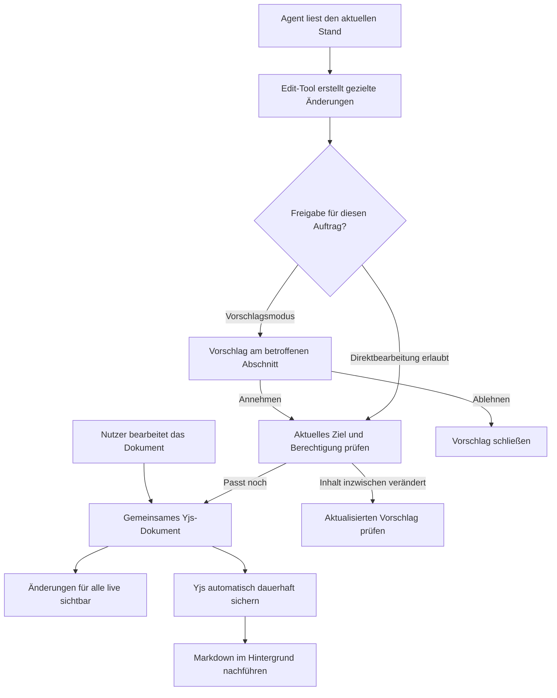

# Plan: Dokumente bearbeiten, Agentenvorschläge prüfen, automatisch sichern

Stand: 2026-09-11. Ausgangsbasis: `03f32ec0`. Status: Umsetzung in `codex/live-document-agent-editing`; Schritte 1–6 implementiert und gezielt geprüft; integrierte Abnahme in Schritt 7 offen.

Dieser Plan ergänzt den [Plan zum Editor-Lifecycle](editor-structure-lifecycle-plan.md). Seine historischen Implementierungsstände bleiben bestehen. Maßgeblich für die folgende Weiterentwicklung sind die aktuellen Befunde und das gewünschte Produktverhalten.

## 1. Produktentscheidung

Nutzer öffnen ein Dokument und bearbeiten es. Speichern ist eine Aufgabe des Systems. Im normalen Editor erscheinen weder Speicherzeilen noch Speicher-Icons, Checkpoint-Bezeichnungen, technische Zustände oder Erfolgsmeldungen nach Änderungen. Das gilt für Kontonutzer und Gäste mit entsprechenden Schreibrechten.

Sichtbar bleiben Menschen und Agenten, die am Dokument arbeiten, sowie prüfbare Agentenvorschläge. Technische Speicherinformationen gehören in eine bewusst geöffnete Entwicklerdiagnose. Ein tatsächlicher Fehler, der eine Entscheidung des Nutzers erfordert, wird verständlich und ohne ständig wechselnde Editorhöhe angezeigt. Solange automatische Wiederverbindung und lokale Sicherung funktionieren, muss der Nutzer nichts bestätigen.

Agenten lesen und ändern denselben aktuellen Dokumentzustand wie die Nutzer. Das bestehende Edit-Tool bleibt der Einstieg. Es verwendet den autorisierten Collaboration-Zugang und strukturierte Operationen. Der Agent muss weder Tasten simulieren noch eine Markdown-Datei überschreiben.

**Umgesetzte Freigaberegel:** Agentenänderungen werden standardmäßig als Vorschläge vorbereitet. Ein Nutzer kann direkte Bearbeitung für seinen konkreten Chat und dieses Dokument ausdrücklich für 30 Minuten erlauben und jederzeit widerrufen. Die Freigabe nimmt einen bereits vorliegenden Vorschlag nicht automatisch an. Beide Modi verwenden beim tatsächlichen Anwenden denselben Weg ins Live-Dokument.

## 2. Was vorhanden ist und was geändert werden muss

| Heute vorhanden | Konsequenz für die Umsetzung |
| --- | --- |
| `editAgentFile` und `applyAgentFilePatch` erkennen kollaborative Dateien und verwenden `prepareCollaborationTextEdit` | Bestehende Tools weiterentwickeln; keinen zweiten Agenteneditor bauen |
| `readCurrentCollaborationDocument` liest den laufenden Raum oder den gespeicherten Yjs-Zustand | Live-Lesen ist bereits vorbereitet; Dateipflicht und Markdown-Abhängigkeit an den Rändern beseitigen |
| `runCollaborationDirectConnection` schreibt unter Agentenidentität in den gemeinsamen Raum | Den bestehenden autorisierten Zugang beibehalten und als verbindlichen Schreibweg nutzen |
| Blockidentitäten, relative Textanker, Ziel-Hashes, Operation-IDs, Review und Revert | Vorhandene Sicherungen erweitern, nicht durch Ganzdokument-Ersetzungen ersetzen |
| Agentenabschluss und Tool-Ergebnis hängen an `checkpointed_file` | Erfolgreiche Anwendung plus bestätigte Yjs-Sicherung muss unabhängig vom Markdown-Export abschließen können |
| `executePreparedCollaborationTextEdit` setzt `explicitUserRequest: true` | Direktberechtigung künftig aus vertrauenswürdigem Auftragskontext ableiten; ein Tool-Aufruf allein ist keine pauschale Freigabe |
| Yjs wird vor dem Markdown-Checkpoint gespeichert; dessen Fehler setzt das gesamte Dokument auf `degraded` | Dauerhaftigkeit, Export und Freigabestatus getrennt modellieren |
| Metadaten-Refresh setzt auch im Live-Modus `idle → updating → idle`; `FileEditor` fügt dafür eine Zeile ein | Metadaten dürfen keine sichtbare Dokumentaktualisierung auslösen |
| Agenten-UI pollt und meldet Markdown-Checkpoint-Erfolg per Toast | Vorschläge/Anwendung als Produktzustände anzeigen; technische Checkpoint-Toasts entfernen |

Quellen: [Agenten-Dateitools](../app/lib/pi/agent-file-operations.ts), [Vorbereitung](../app/lib/collaboration/agent-file-edits.ts), [Operationen](../app/lib/collaboration/agent-operations.ts), [Dokumentzugang](../app/lib/collaboration/document-access.ts), [Server](../server/collaboration-server.ts), [Dateistore](../app/store/file-store.ts), [Editor](../app/components/editor/FileEditor.tsx).

## 3. Zielablauf

Vorschläge werden dauerhaft separat vom angenommenen Dokumentinhalt geführt und als Markierungen/Vorschau eingeblendet. Ein abgelehnter Vorschlag hat daher keine Änderungen am Dokument rückgängig zu machen. Präsenz ist nur eine Anzeige und keine Berechtigungsquelle.

## 4. Verbindliche Regeln

### Dokument und Persistenz

- Pro Dokument-ID und Generation gibt es genau einen zuständigen schreibenden Collaboration-Raum. Ein Prozess ohne Raumzugang verwendet den zuständigen Server; er erzeugt keine konkurrierende schreibende Kopie aus einer möglicherweise älteren Datenbankfassung.
- Nach der erstmaligen Aufnahme eines Dokuments ist Yjs die maßgebliche Inhaltsquelle. Eine geschlossene Editoransicht ändert daran nichts. Der Raum kann bei Bedarf aus dem gesicherten Zustand geöffnet werden.
- Binäre Yjs-Sicherung und Markdown-Projektion sind getrennte Aufgaben. Bestehende Schema-, Identitäts-, Berechtigungs- und Lifecycle-Prüfungen bleiben vor Mutationen erhalten. Markdown-Roundtrip-Prüfungen gehören zur Projektion und dürfen nicht pauschal deaktiviert werden.
- Die lokale Warteschlange überlebt Ansichtswechsel und wird beim Wiederverbinden automatisch übertragen. Ein Ansichtswechsel beendet nicht die noch benötigte Sicherung. Browser-Neustart, IndexedDB-Abschluss und Fehler bei lokaler Sicherung werden ausdrücklich geprüft.
- Serverbestätigungen belegen den tatsächlich gesicherten Zustand einschließlich Löschungen. Ein State-Vector allein reicht dafür nicht; den vorhandenen `stateProof` und Operationsnachweise beibehalten bzw. erweitern.
- Agenten erhalten nach bestätigter Yjs-Sicherung ein erfolgreiches Ergebnis. Ein noch ausstehender Markdown-Export ist kein Anlass, dieselbe Änderung erneut auszuführen. Bei unklarem Ausgang erhalten sie eine abfragbare Operation-ID statt eines mehrdeutigen allgemeinen Fehlers.

### Gezielte Agentenoperationen

Der strukturierte Read-Zugang liefert Dokumentreferenz, Generation, aktuelle Blockreferenzen und die für die Aufgabe benötigten Inhalte. Darauf basierend unterstützt das Edit-Tool schrittweise Text ersetzen, Blöcke einfügen/löschen/verschieben und gemeinsame Formatierungs-/Tabellenoperationen. Namen und genaue JSON-Felder werden bei der Tool-Schema-Änderung festgelegt; dies sind noch keine vorhandenen Tool-Parameter.

- Texte werden mit stabilen Blockreferenzen und relativen Yjs-Ankern adressiert. Verschieben ändert die Position eines Blocks, nicht dessen aktuellen Inhalt oder Identität.
- Vorbedingungen prüfen die betroffenen Inhalte und strukturellen Beziehungen. Eine Änderung in einem unabhängigen Absatz darf einen sonst passenden Vorschlag nicht allein wegen eines anderen Ganzdokument-Hashes unbrauchbar machen.
- Das bisherige `oldText/newText` bleibt als Adapter unterstützt. Mehrdeutige Treffer oder nicht sicher auflösbare Strukturänderungen führen zu einer gezielten Rückmeldung/einem aktualisierten Vorschlag. Kein ungeprüfter Rückfall auf Dateischreiben oder Ersetzen des ganzen Dokuments.
- Gemeinsame fachliche Regeln verwenden die vorhandenen Block- und Editoroperationen. UI-spezifische Auswahl/Fokus und agentenspezifische Autorisierung/Review bleiben getrennte Verantwortlichkeiten.
- Eine logische Änderung wird als zusammenhängende Transaktion mit Autor, Auftrag und stabiler Operation-ID angewendet. Wiederholte Zustellung derselben Operation darf nicht erneut ändern. Derselbe Schlüssel mit anderem Inhalt wird abgewiesen.
- UI-Undo betrifft die eigenen Änderungen. Die Rücknahme einer Agentenänderung verwendet deren gezielte Gegenoperation und prüft später geänderte Ziele. Sie stellt keine alte Gesamtfassung wieder her. Bestehende dauerhafte Revert-Daten nicht durch einen nur im Arbeitsspeicher gehaltenen Undo-Stack ersetzen.

### Freigabe bei gleichzeitiger Bearbeitung

Ein Vorschlag speichert Zielreferenzen, Ausgangsinhalt/Vorbedingungen, vorgeschlagene Operationen, Autor/Auftrag und eine Vorschlagsversion. Die Vorschau zeigt den konkreten aktuellen Vergleich am Ziel. Ein kurzlebiger Diff ist keine Erlaubnis, später eine beliebige neu berechnete Änderung anzuwenden.

Beim Annehmen werden Berechtigung, Dokumentgeneration, Vorschlagsversion und betroffene Ziele unmittelbar vor der synchronen Yjs-Transaktion erneut geprüft. Zwischen letzter Prüfung und Mutation darf im zuständigen Raum kein asynchroner Zwischenschritt die Vorbedingungen veralten lassen. Eine Annahme gilt nur für den gezeigten Vorschlag.

| Zwischenzeitliche Änderung | Verhalten |
| --- | --- |
| Jemand bearbeitet einen unabhängigen Absatz | Vorschlag bleibt anwendbar, sofern seine fachlichen Vorbedingungen weiterhin stimmen |
| Derselbe Block wurde verschoben; betroffener Text ist unverändert | Textvorschlag folgt der Blockidentität; Strukturvorschläge prüfen zusätzlich Eltern/Zielposition |
| Jemand ändert den betroffenen Text | Aktuellen Vergleich anzeigen und neue Freigabe verlangen; nichts still überschreiben |
| Betroffener Block wurde gelöscht oder mit einem anderen vereinigt | Vorschlag wird ungültig bzw. muss neu zugeordnet werden; Block nicht automatisch wiederherstellen |
| Vorschlag wird abgelehnt | Nur Vorschlagszustand ändern |
| Annahme wird doppelt geklickt oder nach Netzfehler wiederholt | Dieselbe bestätigte Operation zurückgeben |
| Ein Offline-Client liefert später eine überlappende Änderung | Update erhalten und bestehenden Mechanismus für nachträgliche fachliche Konflikte nutzen; Yjs-Konvergenz beweist keine inhaltliche Übereinstimmung |

Im ersten Ausbauschritt werden Änderungen pro logisch zusammengehöriger Gruppe angenommen oder abgelehnt. Selektives Annehmen einzelner Gruppen folgt nur dort, wo ihre Unabhängigkeit belegt ist. Kein stilles teilweises Anwenden eines als Einheit freigegebenen Vorschlags. Die vorhandenen Rechte auf Annahme/Rücknahme werden nicht pauschal auf alle Gäste erweitert.

## 5. Markdown und Dateizugriffe

Die `.md`-Datei bleibt für Dateizugriff, Freigaben und Exporte erhalten. Sie ist eine nachgeführte Darstellung. Edit-Tool und Live-Read warten dafür nicht auf einen Dateischreibvorgang.

Startwert für die Hintergrundprojektion: nach zwei Sekunden Bearbeitungsruhe, spätestens nach zehn Sekunden seit dem ältesten unprojizierten Stand wird ein Versuch angestoßen. Das sind konfigurierbare Planwerte, keine garantierten Exportlaufzeiten. Pro Dokument wird der neueste benötigte Stand zusammengefasst; ältere Jobs werden verworfen. Zuerst den bestehenden binären Speichertakt beibehalten und messen. Ein neues Update-Journal nur einführen, wenn Last-/Wiederherstellungstests es begründen.

Die Projektion erhält einen dauerhaft nachvollziehbaren Rückstand bzw. wiederherstellbaren Auftrag. Nach Prozessneustart werden noch nicht projizierte gesicherte Zustände erneut eingeplant. Wiederholungen ändern das Live-Dokument nicht. Ein Projektionsfehler bleibt in der Entwicklerdiagnose sichtbar, löst begrenzte Wiederholungen aus und sperrt keine ansonsten gültige und sicher gespeicherte Live-Bearbeitung.

Explizite Exporte/Freigaben verwenden einen konsistenten aktuellen Yjs-Snapshot oder warten auf dessen bestätigte Projektion. Dateibasierte Agenten-Lesewege werden auf den Live-Read umgestellt. Unvermeidbare externe Dateileser erhalten eine explizite Frischeprüfung. Externe Dateischreiber und Importer laufen durch die vorhandene Revisions-/Collaboration-Prüfung; sie dürfen das maßgebliche Dokument nicht über einen verspäteten Dateiinhalt ersetzen. Nicht kollaborationsfähige Dateiformate behalten ihren jeweiligen Speicherweg.

Operationserfolg, Yjs-Dauerhaftigkeit und Exportfortschritt werden als getrennte Dimensionen modelliert. Übergangskompatibilität für bestehende API-/Mobile-/Gast-Clients ausdrücklich testen. Rücknahme und Wiederherstellung müssen bereits nach Yjs-Sicherung möglich sein; sie dürfen nicht an `checkpointed_file` hängen bleiben.

## 6. Lifecycle und Fehleranzeige

- Dokumentidentität besteht aus Workspace, Dokument-ID und Generation; der Pfad ist ein veränderlicher Standort. Rename/Move übernimmt nur bestätigte Standortänderungen. Alte Aufträge dürfen weder am alten Pfad schreiben noch eine neue Datei am wiederverwendeten Pfad treffen.
- Löschen archiviert das Dokument und widerruft zugehörige Schreibaufträge. Wiederherstellen oder Migration beginnt eine ausdrücklich bestätigte Generation. Alte Vorschläge werden dabei nicht automatisch freigegeben.
- Serverraum, Yjs-Dokument, lokale Sicherung und History leben unabhängig von der gerade montierten Rich-/Read-/Source-Ansicht. Geschlossene Views dürfen keine verspäteten Änderungen zurückschreiben.
- Direkter Agentenzugriff prüft vor jeder Mutation die aktuellen Rechte aus dem vertrauenswürdigen Auftragskontext. Ein Agenten-Payload kann keine Direktfreigabe erteilen.
- Normalfall: keine Speicheranzeige. Automatisch behebbarer Exportfehler: Entwicklerdiagnose. Tatsächlich gefährdete lokale/serverseitige Sicherung oder entzogene Rechte: verständlicher Ausnahmehinweis mit passender Handlung. Keine falsche Erfolgsaussage und keine pauschale Entsperrung aller bisherigen `degraded`-Fälle.
- Sentry `CANVAS-NOTEBOOK-3W` separat beheben: PDF öffnen/schließen und anschließend im Markdown auswählen. Der zugeordnete PDF.js-Auswahl-Handler benötigt eine reproduzierte Abbruch-/Render-Lifecycle-Korrektur und eine Prüfung auf noch vorhandene Textlayer. Keine globale Unterdrückung von `getComputedStyle`-Fehlern.

## 7. Umsetzung in abschließbaren Schritten

Die Schritte werden nacheinander umgesetzt. Jeder Schritt endet mit den zugehörigen Nachweisen und einem eigenen Commit. Die finale integrierte Abnahme bleibt zusätzlich erforderlich.

| Schritt | Konkrete Arbeit / wichtigste Stellen | Fertig, wenn |
| --- | --- | --- |
| 1. Bestehende Löschfehler schließen | Nachgewiesene Leerzeichen-/Listen-/Umbruchfälle als gezielte Regressionen übernehmen; Markdown-Codecs und Validatorzuständigkeiten prüfen | Unterstützte Inhalte nach Löschen, Verschieben und binärem Neuladen unverändert bleiben; kein pauschales Abschalten der Roundtrip-Prüfung |
| 2. Dauerhafte Sicherung von Dateiausgabe trennen | `server/collaboration-server.ts`, `persistence.ts`, `checkpoint.ts`, `client-state.ts`; rückstandsbasierte, wiederanlaufbare Projektion | Ein erzwungener Markdown-Exportfehler Live-Änderungen und Yjs-Wiederherstellung nicht blockiert; echte Persistenzfehler weiterhin korrekt behandelt werden |
| 3. Agententools konsequent auf das Dokument ausrichten | `agent-file-operations.ts`, `agent-file-edits.ts`, `document-access.ts`, `direct-connection.ts`, `agent-operations.ts`; strukturierter Read/Edit, dauerhaft bestätigter Operationserfolg | Ein Agent ein auch ungeöffnetes Dokument am aktuellen Stand bearbeiten kann; Wiederholung, verzögerter Export und laufende Nutzereingaben weder Doppeländerungen noch alte Inhalte erzeugen |
| 4. Freigabe und gezielte Rücknahme abschließen | Vorschlagsversionen/-gruppen, vertrauenswürdige Moduswahl, aktuelle Zielprüfung, dauerhaft nachvollziehbare Annahme; vorhandene API-Routen erweitern | Annahme exakt den geprüften Vorschlag anwendet; überlappende Änderungen neue Prüfung verlangen; Ablehnen/Undo/Revert fremde Arbeit erhalten |
| 5. Oberfläche auf Bearbeitung und Vorschläge reduzieren | `FileEditor.tsx`, `MarkdownDocumentModes.tsx`, `CollaborationAgentOperations.tsx`, `file-store.ts`, Gastansicht, Übersetzungen und Produktdokumentation | Im Normalfall keine Speicherzeile, kein Speicherindikator, kein Checkpoint-Toast erscheint; Vorschläge nachvollziehbar sind; Editorposition bei Statuswechseln stabil bleibt |
| 6. Lifecycle und PDF-Wechsel absichern | Raum-/View-Cleanup, Rename/Delete/Migration, ausstehende Aufträge, `PdfViewer.tsx` und gezielter PDF.js-Fix | Veraltete Callbacks keine Mutation auslösen; gelöschte Inhalte nicht zurückkehren; PDF → Markdown auf iPhone ohne den Sentry-Fehler funktioniert |
| 7. Integriert prüfen und gestuft ausrollen | Bestehende Tests erweitern, Build, reale Mehrteilnehmer-/Browser-/Netz-/Neustarttests, kompatibler Rollout | Die folgende Abnahmematrix erfüllt ist und die neue Betriebsart keine alten Clientzustände falsch als erfolgreich oder fehlgeschlagen ausgibt |

Wichtige Implementierungsdetails in Schritt 3/4: Die bestehende Zustandsmaschine und `waitForDurableState` hängen heute am Dateicheckpoint. Tool-Ergebnis, Revert-Verfügbarkeit, Recovery und UI müssen gemeinsam auf den neuen Abschluss umgestellt werden. Operationsbeleg und zugehörige Yjs-Sicherung müssen nach Absturz eindeutig zuordenbar sein; unsichere Wiederholungen werden anhand des Belegs aufgelöst, nicht blind erneut ausgeführt.

## 8. Abnahmematrix

| Szenario | Erwartetes Ergebnis |
| --- | --- |
| Zwei Nutzer und ein Agent bearbeiten verschiedene Absätze | Alle Änderungen erhalten, alle Repliken stimmen überein |
| Agentenvorschlag; Nutzer verschiebt dessen unveränderten Block | Vorschlag bleibt am richtigen Block und lässt sich korrekt annehmen |
| Agentenvorschlag; Nutzer ändert/löscht dessen Ziel | Kein Überschreiben oder Wiederherstellen; aktualisierte Prüfung erforderlich |
| Annahme doppelt, Tool-Retry oder Absturz zwischen Anwenden und Antwort | Genau einmal angewendet; derselbe Ausgang abrufbar |
| Nutzer tippt nach Agentenänderung; Agentenänderung wird zurückgenommen | Fremde spätere Arbeit bleibt erhalten oder es wird ein gezielter Konflikt angezeigt |
| Markdown-Export fällt aus oder läuft lange | Live-Bearbeitung und binäre Sicherung funktionieren; Dateiausgabe holt nach |
| Verbindung weg, lokale Änderung, Ansichtswechsel, Wiederverbindung/Browserneustart | Gesicherte lokale Änderungen werden geladen und übertragen; keine manuelle Speicheraufgabe |
| Serverneustart nach bestätigter Yjs-Sicherung vor Markdown-Ausgabe | Bestätigte Änderung und Operationsbeleg wiederherstellbar; Projektion wird nachgeholt |
| Datei/Ordner umbenennen oder löschen während Agentenvorschlag und Exportjob | Keine Datei am alten/falschen Pfad; alte Generation kann nicht mehr schreiben |
| Entzogene Rechte, Gast-Lesezugriff oder abgelaufener Auftrag | Keine Mutation durch veraltete UI/Agentenaufrufe |
| Löschen/Backspace, Tabellen, Listen, Drag, Undo/Redo, Touch und IME | Erwartete Inhalte und Blockidentitäten in beiden noch unterstützten Repräsentationen |
| Viele Statuswechsel auf schmalem Bildschirm | Keine durch Statusanzeige veränderte Editorhöhe, kein Fokus-/Scrollsprung |
| PDF öffnen, schließen, Markdown-Text markieren | Keine zurückgebliebenen Auswahl-Handlerfehler |

Browserprüfung mit zwei Nutzerkontexten plus tatsächlichem Agenten-Tool, zusätzlich iPhone/WebKit und Wiederholungen auf Chromium. Für UI-/E2E-Ausführung gelten die bestehenden ausdrücklichen Freigaben und Repository-Regeln. Dieser Planungsschritt startet keinen Browser und baut keinen Container. Lokales Setup nur über den verwalteten Canvas-Stack; keine parallelen Testcontainer. Vor einer Produktionsbereitstellung erforderliche Tests und `npm run build`, bei Deployment die vollständigen Repository-Checks.

Messwerte nur für Entwickler: Zeit bis bestätigter Yjs-Sicherung, Projektionsrückstand/Fehler, Agentenlaufzeit bis Anwendung, wiederholte/unklare Operationen, Zielkonflikte und von Statusänderungen verursachte Layoutverschiebungen. Rollout zunächst für interne Dokumente, dann Gäste/Teams/Mobile nach Kompatibilitätsnachweis. Ein Abschalten neuer Agentenfunktionen darf vorhandene Yjs-Daten oder Vorschläge nicht auf einen älteren Markdown-Stand zurücksetzen.

## 9. Grundlagen und Grenze der Zusage

### Prüfstand Schritt 7: Build bestanden, Browserabnahme ausstehend

`npm run build` einschließlich Tool-App-Build und Lizenzprüfung besteht mit den fertigen Produktänderungen. Der Lizenzcache und die beiden daraus erzeugten Manifeste wurden über die vorhandenen Generatorskripte an den exakten PDF.js-Pin angepasst; Paketbestand und Lizenzbewertung bleiben gleich. Die zusätzlich reproduzierte volle Agentenwarteschlange hinterlässt nun einen dauerhaft prüfbaren Vorschlag, bevor überhaupt eine Live-Mutation beginnt. Die erweiterte Approval-Suite bestätigt diesen Fall und den unveränderten Schutz bereits angewendeter Operationsbelege.

Neun bestehende Browser-Testdateien sind an die neue Produktlogik angepasst und statisch geprüft. Vorbereitet sind unter anderem Delete/Move mit zwei Clients und stabilen Block-IDs, keine ein- und ausgeblendete Speicherzeile oder verschobene Editoroberkante, binäre Dauerhaftigkeit unabhängig vom Markdown-Fortschritt, exakte Vorschlagsannahme, überholte Annahme mit HTTP 409, stiller Projektionsfehler und verständliche Wiederherstellung bei tatsächlichem Zugriffsverlust. Diese Browserfälle wurden noch nicht ausgeführt; Selektoren, Timing, echtes Layout und iPhone-Verhalten sind daher noch nicht abgenommen.

Der verwaltete lokale Stack wurde geprüft: genau ein Stack, PostgreSQL 18.4/pgvector 0.8.3 und alle vorhandenen Dienste gesund. Sein laufender Notebook-Container enthält noch den älteren Build. Für die abschließende Prüfung muss er aus diesem Worktree neu gebaut und anschließend mit beiden vorgesehenen Nutzern, Agentenvorschlägen, Offline/Wiederverbindung, Dokumentwechsel und Neustart geprüft werden. Die explizite Freigabe für Browserautomatisierung und diesen Container-Neubau ist angefragt und steht aus. Bis diese Abnahme abgeschlossen ist, bleibt Schritt 7 offen; es erfolgte kein Push oder Rollout.

### Umsetzungsnachweis Schritt 6: Dokumentwechsel, Generationen und PDF

Der normale Ansichtswechsel wartet auf exakt bestätigtes Yjs oder einen vollständig abgeschlossenen lokalen IndexedDB-Snapshot. Er fordert keinen Markdown-Checkpoint mehr an. Auch der Browser-Schließschutz liest den aktuellen binären Nachweis einschließlich Löschungen; ein veralteter React-Zustand genügt nicht. Direkt vor dem Abschluss eines Übergangs bzw. der Freigabe eines Dokuments werden Standort, Berechtigung und der gesicherte Inhalt erneut geprüft.

Ein fehlgeschlagener oder durch spätere Änderungen überholter lokaler Commit behält Dokument und Verbindung im Arbeitsspeicher. Beim Wiederöffnen mit neuer Ansichtskennung wird diese Kopie nur innerhalb derselben Benutzer-/Gast-, Workspace-, Dokument-, Generations- und Schemaidentität übernommen. Parallel geöffnete Ansichten bleiben eigenständig. Die Diagnose `document_retained` enthält Identität und Fehlercode, keine Inhalte oder Tokens. Ein erzwungener Browserprozess-Abbruch kann eine ausschließlich im Arbeitsspeicher verbliebene Kopie bei gleichzeitig defektem IndexedDB und fehlender Serverbestätigung weiterhin verlieren.

Direkte Agentenverbindungen prüfen nach dem Öffnen und nach Wartezeiten erneut die aktuellen Rechte und Dokumentidentität unter derselben Workspace-Sperre wie Rename/Delete/Restore. Archivierte Agent-Sitzungen werden abgewiesen. Hocuspocus-Räume behalten die Generation ihrer tatsächlich geladenen Bytes. Ein alter Raum darf weder neue Generationen übernehmen noch durch einen verspäteten Aufräumvorgang einen neueren Raum entfernen. Paralleles Erstöffnen und normale Umbenennungen funktionieren weiterhin. Abgewiesene alte Raumzugriffe erhalten eine private Diagnose.

Zusätzlich wurde eine Datenbankblockade reproduziert: zehn gleichzeitige Agenten-/Freigabeanfragen hielten alle zehn Poolverbindungen und warteten auf weitere. Der Operationsspeicher leiht jetzt nur für einzelne CAS-Abfragen eine Verbindung. Länger gehaltene Freigabesperren werden vor dem Verbindungsaufbau begrenzt; Widerruf und laufende Anwendung behalten ihre Sperrreihenfolge. Die gemeinsame begrenzte Warteschlange bewahrt Kapazität für Rechteprüfung und Persistenz. Überlast endet nachvollziehbar als wiederholbare Anfrage, ohne ausgeführte Änderungen zu wiederholen. Für diesen Sperrpfad benötigt ein abweichend konfigurierter PostgreSQL-Pool mindestens drei Verbindungen; der unveränderte Standard ist zehn.

Der PDF-Wechsel wurde getrennt abgesichert: Späte Text-/Annotations-Renderabschlüsse dürfen nach dem Schließen keine Layer oder Auswahl-Listener zurücklassen. Das Schließen einer Seite entfernt keine Listener anderer sichtbarer Seiten. Der konkrete PDF.js-Auswahl-Handler prüft, ob überhaupt noch ein Textlayer existiert. PDF.js ist für den überprüften Patch exakt auf `6.2.108` gepinnt; andere `getComputedStyle`-Fehler bleiben sichtbar.

Nachweise: tatsächliche React-/Yjs-Übergänge und Browser-Schließ-Callbacks unter JSDOM, echter installierter PDF.js-Handler, echte Hocuspocus-Raum-Lifecycles sowie PostgreSQL-18 mit echten Dateimutationen. Sechs PostgreSQL-Lifecycle-Szenarien prüfen verzögerte Projektion, Rename/Delete/Restore, Ersatzdateien, Generationen und archivierte Sitzungen. Ein weiterer Lauf bestätigt 20 parallele dauerhaft gesicherte Agentenänderungen und 40 gleichzeitige Status-/Freigabeabfragen mit vollständig freigegebenem Pool. Die dafür erzeugten Testdatenbanken wurden entfernt. Die bisherigen fehlerhaften Lease- und Raum-Lifecycles schlagen in den neuen Gegenproben fehl. Die gemeinsamen Gates `test:collaboration:lifecycle`, `test:collaboration:agent-capacity`, `test:collaboration:agent-approval`, `test:collaboration:agent-durability`, `test:collaboration:projection` und `test:editor:presentation` sowie TypeScript, ESLint und Diff-Prüfung bestehen. Die vollständige WebSocket-/Browser-/iOS- und Neustartabnahme bleibt Schritt 7.

### Umsetzungsnachweis Schritt 5: ruhige Oberfläche und verständliche Vorschläge

Konto-, Gast- und Quelltextansichten zeigen beim normalen Bearbeiten keine Speicherzeile, Speicherindikatoren oder Checkpoint-Toasts mehr. Metadaten-Refreshes eines Live-Dokuments verändern weder seinen Inhalt noch seinen Synchronisationsstatus; identische Metadaten verursachen kein Store-Update. Eine neue Dokument-ID am selben Dateipfad übernimmt nicht die alte Editoridentität. Gastansicht und Kontoeditor verwenden dieselben Rich-Text-Werkzeuge; die bisherigen Grenzen für private Workspace-Funktionen bleiben erhalten. Der Kontoeditor berücksichtigt jetzt auch bei der Modusauswahl die tatsächlichen aktuellen Schreibrechte.

Echte Fehler werden in einem gemeinsamen, außerhalb des Dokumentlayouts positionierten Panel angezeigt. Hydrierte Dokumente behalten ihren vollständigen Yjs-Download auch dann, wenn Markdown nicht verfügbar ist oder der Zugriff entzogen wurde. Wiederherstellungskopie, gezieltes eigenes Undo und erneute Prüfung behalten ihre bisherigen Berechtigungs- und Lebensdauerprüfungen. Ein bestätigter binärer Stand entfernt auch eine zuvor fehlgeschlagene Retry-Anzeige, ohne auf die Dateiausgabe zu warten. Fehlende Erstverbindung mit vorhandenem lokalem Stand bleibt als Öffnungsproblem samt Download erkennbar; normale Offline-Bearbeitung erzeugt keine laufenden Meldungen.

Die Entwicklerdiagnose wird ausdrücklich mit `?collaborationDebug=1` aktiviert (bei bestehenden Queryparametern `&collaborationDebug=1`). Sie zeigt Verbindungs-, Sicherungs-, Projektions- und Fehlerdetails, keine Zugangstokens. Das gemeinsame Fehlerpanel protokolliert eine anhaltende Störung nur einmal mit Dokument-ID, Generation, Art und Fehlercode; Dokumenttext, Dateipfad und rohe Exception fehlen im Log. Routineeingaben erzeugen keine zusätzlichen Diagnosemeldungen.

Die Agentenvorschau unterscheidet explizit Text, Markdown und strukturierte Blöcke. Sie stellt betroffene Inhalte, Formatierungen, Tabellen und Orte von Verschiebungen verständlich gegenüber. Aktuelle und vorgeschlagene Ortsreferenzen stammen aus denselben geprüften Dokumentzuständen wie die Vorschau. Die Anzeige verwendet das gemeinsame Editorschema, bereinigt HTML und verhindert Requests durch Bilder oder Links. Annahme bleibt gesperrt, wenn eine Vorschau unvollständig oder noch nicht erfolgreich dargestellt ist. Technische Ziel-/Gruppen-IDs und JSON werden nicht als Dokumentvergleich ausgegeben.

Ein zusätzlicher reproduzierter Fehler im nativen Eingabehandler ist geschlossen: Live-Eingaben rufen keinen Markdown-Serializer mehr synchron auf. Der vorhandene Dokumentbeobachter liefert weiterhin die abgeleitete Textansicht. Eine gescheiterte Textprojektion entfernt keinen ansonsten nutzbaren nativen Rich-Editor; außerhalb kollaborativer Dokumente bleibt `onChange` unverändert.

Nachweise: Die neuen Presentation-/Gast-/Metadatenprüfungen und bestehende tatsächliche React-/CodeMirror-/Tiptap-Prüfungen unter JSDOM bestehen. Sie prüfen mehr als 100 normale Statuswechsel ohne zusätzliche Layout-Elemente, binäre Wiederherstellung trotz fehlender Markdown-Ausgabe, Zugriffsverlust, Erstöffnung, stale Hydration, Scopewechsel, Undo und gleiche Gastwerkzeuge. Der native Regressionstest erzwingt beide Markdown-Serializerfehler und belegt weitere Eingaben mit unveränderter Editor-/Blockidentität sowie identischem Yjs-Peer. Neue Vorschauprüfungen (3 Kontext-, 6 Renderer-Fälle), die erweiterte Approval-Suite, TypeScript, ESLint und Diff-Prüfung bestehen. Browser-, Netzwerk- und Neustartabnahme bleiben Bestandteil von Schritt 7; diese lokalen Komponentenprüfungen ersetzen sie nicht.

### Umsetzungsnachweis Schritt 4: genaue Freigabe und begrenzte Direktbearbeitung

Eine Annahme überträgt die tatsächlich angezeigte Vorschlagsversion. Der Server bindet sie kryptografisch an Nutzer, Operation, Payload, Dokumentgeneration und die relevanten aktuellen Ziele. Er prüft sie nochmals unmittelbar vor der synchronen Mutation im Live-Raum. Unabhängige Textänderungen bleiben erhalten; veränderte Ziele oder Formatierungen verlangen eine neue Prüfung. Ein zusammengehöriger Vorschlag wird bei der Annahme atomar angewendet. Doppelte Zustellung verwendet denselben dauerhaften Annahmebeleg. Alte Clients ohne Vorschlagsversion erhalten eine verständliche Aufforderung zum Neuladen. Vorschläge haben keine automatische Ablaufzeit; Rechte und Ziele werden bei jeder Annahme aktuell geprüft.

Eine Direktfreigabe kommt ausschließlich aus einer ausdrücklichen Nutzeraktion. Ihr Umfang wird aus der eigenen gespeicherten Chat-Sitzung und dem Dokument serverseitig ermittelt; Agentenparameter wie `explicitUserRequest` erteilen keine Berechtigung. Die Freigabe gilt für Nutzer, Agent, gespeicherte Sitzung, Workspace, Dokument und Generation höchstens 30 Minuten. Wiederholte Klicks oder Netz-Retries verlängern sie nicht. Löschen/Neuanlegen einer Sitzung übernimmt keine alte Freigabe. Eine PostgreSQL-Zeilensperre ordnet Direktanwendung und Widerruf eindeutig: Nach bestätigtem Widerruf kann keine weitere Mutation mit der alten Freigabe beginnen. Ein verlorenes Transaktionsabschluss-Ergebnis nach bereits bestätigter Dokumentanwendung verliert deren Operationsbeleg nicht und löst keine Doppeländerung aus.

Strukturänderungen des Markdown-Adapters werden für Blockdokumente einmalig als gezielte Operation mit festen Identitäten vorbereitet. Vorschau und Annahme suchen die ursprünglichen Texte nicht erneut in einem inzwischen veränderten Dokument. Gleichzeitige fremde Absätze bleiben beim Anwenden und bei der gezielten Rücknahme erhalten. Textoperationen prüfen auch die Formatierung des betroffenen Bereichs; Gegenoperationen erhalten gemischte Formatierungen und werden vor der Live-Mutation auf Größenlimits geprüft.

Kompatibilitätsgrenzen: Alte XML-Ganzdokumentvorschläge benötigen einen exakten serverseitigen Ausgangsbeleg; jede zwischenzeitliche XML-Änderung verlangt einen neuen Vorschlag. Alte Vorschläge ohne diesen Beleg werden nicht blind angewendet. Nicht sicher kombinierbare Änderungen von Blockstruktur und Frontmatter/abschließendem Zeilenumbruch werden vom Adapter abgewiesen und müssen gezielt getrennt vorbereitet werden. Für neue Blockoperationen gelten lokale Vorbedingungen statt eines pauschalen Ganzdokumentvergleichs.

Nachweise: `test:collaboration:agent-approval` mit 104 Service-, API-, Adapter- und gerenderten React-Prüfungen bestanden, einschließlich veränderter Formatierung, stale Polling, exakter Retry-Schlüssel und nicht automatisch angenommener Vorschläge. Struktur- und Durability-Suites, TypeScript, ESLint und Diff-Prüfung bestanden. Beide realen PostgreSQL-Integrationen bestehen mit echten gespeicherten Nutzern, Sitzungen und Berechtigungsauflösung. Der Widerrufstest weist den tatsächlichen Zeilen-Lock über `pg_blocking_pids` nach. Jede eigene Testdatenbank wurde entfernt. Logging enthält IDs und Fehlercodes, keine Dokumentinhalte oder Freigabetokens. Browserabnahme und die Vereinfachung der Oberfläche folgen in Schritten 5–7.

### Umsetzungsnachweis Schritt 3, Teil B: strukturierte Agentenoperationen

`read(includeStructure: true)` liefert eine begrenzte, paginierte JSON-Struktur samt Dokument-ID, Generation, Schema und stabilen Blockreferenzen. Text und Prüfsummen werden aus dem aktuellen Yjs-Dokument gelesen. Die Ausgabe bleibt innerhalb des tatsächlichen Tool-Budgets vollständig parsebar; IDs und Hashes werden nicht abgeschnitten. Der normale Text-Read bleibt kompatibel.

`edit_file` unterstützt zusätzlich gezieltes Verschieben, Löschen, Einfügen, Blockattribute, Inlineformatierungen und gemeinsame Tabellenaktionen. Ein optionaler `blockId` grenzt den bisherigen Textadapter auf genau diesen Block ein. Strukturierte Eingaben benötigen die Dokumentreferenz und lokale Vorbedingungen; sie nehmen keine vorbereiteten Yjs-Updates oder internen Rücknahmebelege entgegen. Der Server bereitet einen inkrementellen Patch mit festen IDs vor, validiert ihn auf einer aktuellen Kopie und integriert ihn synchron als eine Transaktion. Die bestehenden Editor-/Blocktree-Regeln bleiben maßgeblich. Ein gültiger Live-Blockzustand kann trotz eines Markdown-Roundtrip-Fehlers bearbeitet werden; der Exportvalidator bleibt streng.

Rücknahmen verwenden den gespeicherten Originalbeleg. Eigene Placement-Operationen werden gezielt zurückgenommen; Änderungen an Attributen und Inlineinhalt werden nur gegen ihre konkreten Nachbedingungen rückgängig gemacht. Neu eingefügte Blöcke werden tombstoned, ihre Records und Retry-Belege bleiben erhalten. Spätere fremde Arbeit bleibt erhalten oder führt zu einem gezielten Konflikt. Die Vorschau umfasst betroffene Blöcke, ihr Prüfwert nur relevante Bedingungen. Die genaue Freigabe dieser Vorschau wird in Schritt 4 ergänzt.

Parallele erste Zustellungen mit demselben Tool-Schlüssel verwenden den ursprünglichen serverseitigen Anfragebeleg, auch wenn ihre Vorbereitungen unterschiedliche neue Block-IDs erzeugt haben. Actor, Session, Workspace, Dokumentidentität und Ausführungsumfang müssen übereinstimmen. Die Antwort verwendet gespeicherte Originalhashes und den aktuellen Live-Stand; sie erzeugt keine zweite Änderung und keinen zweiten Audit. Ein unbestätigter Ausgang bleibt mit Operations-ID abfragbar.

Ein zusätzlicher `durability_ack` meldet, welchen exakt gesicherten Yjs-Stand ein Client beobachtet hat. Dadurch werden absichtliche Nutzereingaben nach einer bestätigten Agentenänderung nicht allein wegen ausstehender Markdown-Ausgabe als Offline-Konflikt behandelt. Der Server begrenzt die Meldung auf gesicherte Sequenzen und prüft Identität/Generation; der Ack sichert selbst nichts und erteilt keine Schreibrechte. Der bisherige `checkpoint_ack` bleibt kompatibel. Gezielte Konflikte werden mit IDs und Fehlercode protokolliert, ohne Dokumenttext.

Gezielte Modul-, Tool-/SDK-/Ausgabepipeline- und Replay-Prüfungen sowie reale PostgreSQL-Tests belegen bereits Move mit gleichzeitiger Texteingabe, binäres Neuladen, selektive Rücknahme, Blockidentität bei gleichen Texten, Formatierung, Tabellenänderung, atomaren Zielkonflikt und exakt einmalige parallele Zustellung. Die eigene Testdatenbank wird nach jedem Lauf entfernt. Das unabhängige Review hat zwei Fehler reproduziert und nach Korrektur geschlossen: Alte Forward-Patches dürfen den Konfliktstatus bestehender fremder Placements nicht verändern; kombinierte Löschaufträge prüfen den ursprünglichen Inhalt aller tatsächlich gelöschten bestehenden Blöcke. Beide ursprünglichen Repros lassen die Live-Bytes bei einem Konflikt unverändert. `test:collaboration:agent-structure` (13 Struktur-, 12 Placement-Revert-, 41 Blockoperations-, 5 Admission-, 15 Tool-/SDK- und 29 Replay-Tests), `test:collaboration:agent-durability` einschließlich 31 Ack-Prüfungen, bestehende Block-/Tool-/Agenten-Prüfungen, TypeScript, ESLint und Diff-Prüfung bestanden. Neue und bestehende reale PostgreSQL-Agentintegration bestanden; eigene Testdatenbanken entfernt. Browserabnahme und Build bleiben Schritt 7.

### Umsetzungsnachweis Schritt 3, Teil A

Agentenoperationen können mit `persisted_yjs` erfolgreich abschließen. Ein nur vom Server geschriebener Yjs-Snapshot-Beleg erfasst Clocks und DeleteSet ohne Dokumenttext. Bestätigung und Wiederherstellung prüfen seine Inklusion in den gespeicherten Binärzustand sowie Dokument-ID, Workspace, Organisation, Pfad, Generation, Schema und Repräsentation. Neuere unabhängige Änderungen sind erlaubt; ein unveränderter StateVector genügt bei einer Löschung nicht. Alte Operationen ohne neuen Beleg werden nach einem unklaren Absturz nicht allein anhand ihres Vektors bestätigt. Ein noch nicht bestätigter neuer Teilversuch übernimmt weder Beleg noch Gesamtdurability seines Vorgängers; fachliche Teilkonflikte bleiben nach späterer Sicherung erhalten.

Bestehende Live-Dokumente werden durch die Read/Edit/Patch-Werkzeuge aus Yjs gelesen. Ihr Markdown-Inhalt und eine neue Dateirevision sind dafür nicht mehr erforderlich. Ein read-only Metadaten-Snapshot prüft die bestehende Identität, ohne an der Workspace-Sperre einer Dateiausgabe zu warten. Schreibrechte, Alias-/Pfadprüfung und Dateiexistenz bleiben erhalten; die erste Aufnahme eines Dokuments verwendet weiterhin die Datei. Ein Auftrag mit gleichem Tool-Schlüssel und gleicher Prüfsumme findet seinen vorhandenen Beleg vor einer erneuten Textsuche. Ein veränderter Auftrag unter demselben Schlüssel wird abgewiesen. Ein nachträglich nicht mehr lesbares oder gewechseltes Dokument liefert die Operations-ID mit `safeToAutoRetry: false`, keinen erfundenen aktuellen Hash.

Sagas, Compensation, Compaction-/Migrations-/Archivregeln und die minimale Activity-/Revert-Darstellung behandeln bestätigtes Yjs als abgeschlossene Anwendung. Speichertexte/Toasts und die Freigaberegel werden erst in den folgenden Schritten vollständig geändert. Diagnoseeinträge enthalten Operations-/Dokument-IDs und technische Sequenzen, keine Texte oder Tokens.

Nachweise: `test:collaboration:agent-durability` (11 Snapshot-, 11 Terminalstatus- und 33 Tool-Tests sowie read-only SQL-/Aliasprüfungen), bestehende Agenten-/Tool-/Fehlertests, TypeScript, ESLint und Diff-Prüfung bestanden. Reale PostgreSQL-Integration bestätigt reine Löschung ohne Dateiausgabe, absichtlich verspätete Sicherung, unabhängige Nutzeränderung, identischen Tool-Retry, Payload-/Actor-/Session-Ablehnung, gezielte Rücknahme, Restart-Recovery und teilweise angewendete Aufträge. Ein Metadaten-Read endet während absichtlich blockierter Dateiausgabe. Die eigene Testdatenbank wurde entfernt. Strukturierte Blockoperationen, genaue Vorschlagsfreigabe und die finale Browserabnahme bleiben offen.

### Umsetzungsnachweis Schritt 2

Der Collaboration-Server bestätigt die binäre Yjs-Sicherung unabhängig von der Dateiausgabe. Die Hintergrundprojektion bündelt Änderungen nach zwei Sekunden Ruhe bzw. spätestens zehn Sekunden Wartezeit, begrenzt parallele Ausgaben und wiederholt Fehler mit Warteabständen. Ein Datenbank-Scan findet nach Neustart sowohl Sequenzrückstände als auch unvollständig abgeschlossene Dateiausgaben. Ein dauerhafter Projektionsbeleg wird vor Datei-I/O angelegt und erst nach Dateimetadaten und Freigabe-Synchronisierung abgeschlossen.

Dateiausgabe und Lifecycle-Mutationen teilen eine Workspace-Sperre; die Yjs-Zeile bleibt während Datei-I/O frei. Die kurze Datenbankbestätigung beschreibt exakt die ausgegebene Sequenz, auch wenn inzwischen neue Yjs-Änderungen gespeichert wurden. Unklare Transaktionsabbrüche verwerfen die PostgreSQL-Verbindung und lassen den dauerhaften Wiederherstellungsauftrag erhalten. Roundtrip-/Dateifehler bleiben von echten Persistenz-, Schema-, Identitäts- und Rechtefehlern getrennt. Konto-/Gastantworten bestätigen weiterhin nur autorisierte, durch Löschungen abgesicherte Zustände.

Nachweise: `test:collaboration:projection`, `test:collaboration:durability`, `test:collaboration:failures`, `test:collaboration:checkpoint-errors` sowie Hardening bestanden. Neue Tests prüfen Scheduler, tatsächliche Server-Callbacks, Clientzustände, Konto-/Gastendpunkte, private Diagnosefelder, Projektionsabbruch und Verbindungsverwerfen. PGlite mit echten Migrationen prüft dauerhafte Belege, SQL-Rollback, Generationen, Workspace-Zuordnung und Wiederanlauf. `file-agent-operation-integration-test.ts` besteht zusätzlich in einer eigenen temporären Datenbank auf dem verwalteten PostgreSQL-18-Server; insbesondere kann ein zweiter Yjs-Commit vor Freigabe des absichtlich pausierten Datei-I/O abschließen. Diese Testdatenbank wurde anschließend entfernt. TypeScript, ESLint und Diff-Prüfung bestanden; abschließende Browser-/Neustartabnahme bleibt Schritt 7.

### Umsetzungsnachweis Schritt 1

Die Markdown-Serialisierung bewahrt jetzt durch Löschung freigelegte Rand-Leerzeichen, markierte Leerzeichen einschließlich Inline-Code, mehrdeutige harte/weiche Umbrüche sowie wörtliche Listen-/Überschriften-/Tabellenzeichen. Die Roundtrip-Prüfung bleibt unverändert streng; der Codec korrigiert keine Nutzerinhalte. Gemeinsame Inline-Logik wird auch in Tabellen und Callout-Titeln verwendet.

Nachweise im isolierten Worktree: `npm run test:editor:core` einschließlich 48 tatsächlicher Editor-/Yjs-Löschtests und 29 ergänzender Syntaxprüfungen bestanden; beide Yjs-Repräsentationen, zweiter gebundener Editor, binäre Wiederherstellung und gezielte gleichzeitige Änderung abgedeckt. Bestehende Block-Binding-/Anker-, Roundtrip-, 224 Markierungs-/Leerzeichen- und 32 Tabellenumbruchprüfungen bestanden. Alle 220 zuvor aufgezeichneten fehlerhaften Dokumentzustände bestehen nun den Codec-Strukturvergleich. Geänderte Dateien bestehen ESLint und `git diff --check`.

Diese Nachweise sind gezielte lokale Regressionstests. Browser-/Netz-/Neustartabnahme und Build bleiben Bestandteil der abschließenden integrierten Prüfung. Ein bereits vor Löschung ungültiger Listenfall mit Tabulator vor weichem Umbruch (`A\t\nB`) bleibt als separater Codec-Randfall erfasst.

Die Fehleranalyse vom 11.09.2026 hat einen konkreten Löschfall in beiden Yjs-Repräsentationen reproduziert: Nach Entfernen von `One` aus `- **One** two` bleibt im Editor ` two`, beim Markdown-Einlesen dagegen `two`. Die binäre Yjs-Kopie bleibt korrekt. Ein isolierter Store-Test belegt außerdem `idle → updating → idle` bei unverändertem Live-Inhalt. Diese Befunde sind noch keine Abnahme des vorgeschlagenen Umbaus.

Yjs löst technische Zusammenführung; Zielreferenzen, fachliche Vorbedingungen, Berechtigungen und Freigabe ergänzen diese Grundlage. Später eintreffende Offline-Änderungen lassen sich bei einer früheren Freigabe nicht vorhersehen. Deshalb ist die vorhandene Behandlung später fachlicher Konflikte Teil des Plans.

Offizielle Grundlagen: [binäre Dokumentupdates](https://docs.yjs.dev/api/document-updates), [relative Positionen](https://docs.yjs.dev/api/relative-positions), [selektives Undo nach Transaktionsursprung](https://docs.yjs.dev/api/undo-manager). Ein nur flüchtiger UndoManager ersetzt keine dauerhafte Vorschlags-/Revert-Historie.
