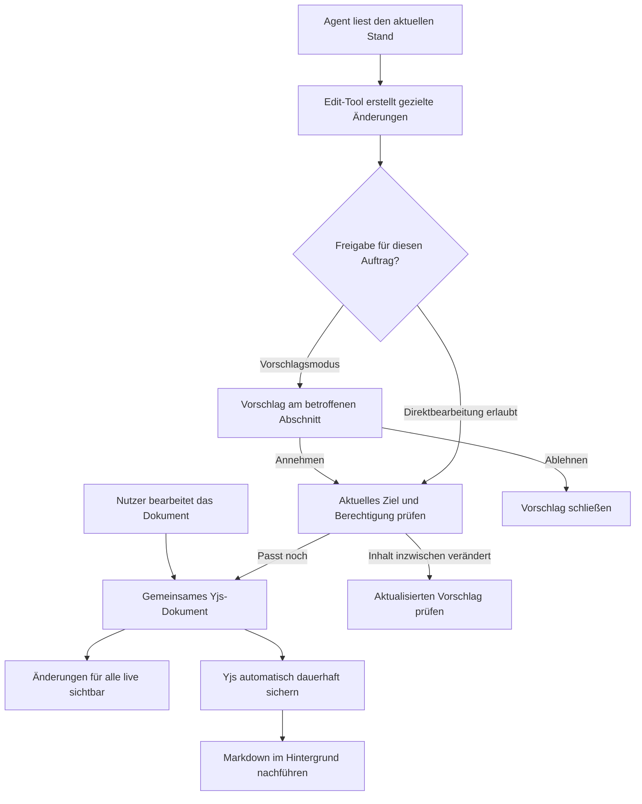

# Plan: Dokumente bearbeiten, Agentenvorschläge prüfen, automatisch sichern

Stand: 2026-09-11. Ausgangsbasis: `03f32ec0`. Status: Umsetzung in `codex/live-document-agent-editing`; Schritte 1–6 implementiert und gezielt geprüft; integrierte Abnahme in Schritt 7 offen.

Dieser Plan ergänzt den [Plan zum Editor-Lifecycle](editor-structure-lifecycle-plan.md). Seine historischen Implementierungsstände bleiben bestehen. Maßgeblich für die folgende Weiterentwicklung sind die aktuellen Befunde und das gewünschte Produktverhalten.

## 1. Produktentscheidung

Nutzer öffnen ein Dokument und bearbeiten es. Speichern ist eine Aufgabe des Systems. Im normalen Editor erscheinen weder Speicherzeilen noch Speicher-Icons, Checkpoint-Bezeichnungen, technische Zustände oder Erfolgsmeldungen nach Änderungen. Das gilt für Kontonutzer und Gäste mit entsprechenden Schreibrechten.

Sichtbar bleiben Menschen und Agenten, die am Dokument arbeiten, sowie prüfbare Agentenvorschläge. Technische Speicherinformationen gehören in eine bewusst geöffnete Entwicklerdiagnose. Ein tatsächlicher Fehler, der eine Entscheidung des Nutzers erfordert, wird verständlich und ohne ständig wechselnde Editorhöhe angezeigt. Solange automatische Wiederverbindung und lokale Sicherung funktionieren, muss der Nutzer nichts bestätigen.

Agenten lesen und ändern denselben aktuellen Dokumentzustand wie die Nutzer. Das bestehende Edit-Tool bleibt der Einstieg. Es verwendet den autorisierten Collaboration-Zugang und strukturierte Operationen. Der Agent muss weder Tasten simulieren noch eine Markdown-Datei überschreiben.

**Umgesetzte Freigaberegel:** Agentenänderungen werden standardmäßig als Vorschläge vorbereitet. Ein Nutzer kann direkte Bearbeitung für seinen konkreten Chat und dieses Dokument ausdrücklich für 30 Minuten erlauben und jederzeit widerrufen. Die Freigabe nimmt einen bereits vorliegenden Vorschlag nicht automatisch an. Beide Modi verwenden beim tatsächlichen Anwenden denselben Weg ins Live-Dokument.

## 2. Was vorhanden ist und was geändert werden muss

| Heute vorhanden | Konsequenz für die Umsetzung |
| --- | --- |
| `editAgentFile` und `applyAgentFilePatch` erkennen kollaborative Dateien und verwenden `prepareCollaborationTextEdit` | Bestehende Tools weiterentwickeln; keinen zweiten Agenteneditor bauen |
| `readCurrentCollaborationDocument` liest den laufenden Raum oder den gespeicherten Yjs-Zustand | Live-Lesen ist bereits vorbereitet; Dateipflicht und Markdown-Abhängigkeit an den Rändern beseitigen |
| `runCollaborationDirectConnection` schreibt unter Agentenidentität in den gemeinsamen Raum | Den bestehenden autorisierten Zugang beibehalten und als verbindlichen Schreibweg nutzen |
| Blockidentitäten, relative Textanker, Ziel-Hashes, Operation-IDs, Review und Revert | Vorhandene Sicherungen erweitern, nicht durch Ganzdokument-Ersetzungen ersetzen |
| Agentenabschluss und Tool-Ergebnis hängen an `checkpointed_file` | Erfolgreiche Anwendung plus bestätigte Yjs-Sicherung muss unabhängig vom Markdown-Export abschließen können |
| `executePreparedCollaborationTextEdit` setzt `explicitUserRequest: true` | Direktberechtigung künftig aus vertrauenswürdigem Auftragskontext ableiten; ein Tool-Aufruf allein ist keine pauschale Freigabe |
| Yjs wird vor dem Markdown-Checkpoint gespeichert; dessen Fehler setzt das gesamte Dokument auf `degraded` | Dauerhaftigkeit, Export und Freigabestatus getrennt modellieren |
| Metadaten-Refresh setzt auch im Live-Modus `idle → updating → idle`; `FileEditor` fügt dafür eine Zeile ein | Metadaten dürfen keine sichtbare Dokumentaktualisierung auslösen |
| Agenten-UI pollt und meldet Markdown-Checkpoint-Erfolg per Toast | Vorschläge/Anwendung als Produktzustände anzeigen; technische Checkpoint-Toasts entfernen |

Quellen: [Agenten-Dateitools](../app/lib/pi/agent-file-operations.ts), [Vorbereitung](../app/lib/collaboration/agent-file-edits.ts), [Operationen](../app/lib/collaboration/agent-operations.ts), [Dokumentzugang](../app/lib/collaboration/document-access.ts), [Server](../server/collaboration-server.ts), [Dateistore](../app/store/file-store.ts), [Editor](../app/components/editor/FileEditor.tsx).

## 3. Zielablauf

Vorschläge werden dauerhaft separat vom angenommenen Dokumentinhalt geführt und als Markierungen/Vorschau eingeblendet. Ein abgelehnter Vorschlag hat daher keine Änderungen am Dokument rückgängig zu machen. Präsenz ist nur eine Anzeige und keine Berechtigungsquelle.

## 4. Verbindliche Regeln

### Dokument und Persistenz

- Pro Dokument-ID und Generation gibt es genau einen zuständigen schreibenden Collaboration-Raum. Ein Prozess ohne Raumzugang verwendet den zuständigen Server; er erzeugt keine konkurrierende schreibende Kopie aus einer möglicherweise älteren Datenbankfassung.
- Nach der erstmaligen Aufnahme eines Dokuments ist Yjs die maßgebliche Inhaltsquelle. Eine geschlossene Editoransicht ändert daran nichts. Der Raum kann bei Bedarf aus dem gesicherten Zustand geöffnet werden.
- Binäre Yjs-Sicherung und Markdown-Projektion sind getrennte Aufgaben. Bestehende Schema-, Identitäts-, Berechtigungs- und Lifecycle-Prüfungen bleiben vor Mutationen erhalten. Markdown-Roundtrip-Prüfungen gehören zur Projektion und dürfen nicht pauschal deaktiviert werden.
- Die lokale Warteschlange überlebt Ansichtswechsel und wird beim Wiederverbinden automatisch übertragen. Ein Ansichtswechsel beendet nicht die noch benötigte Sicherung. Browser-Neustart, IndexedDB-Abschluss und Fehler bei lokaler Sicherung werden ausdrücklich geprüft.
- Serverbestätigungen belegen den tatsächlich gesicherten Zustand einschließlich Löschungen. Ein State-Vector allein reicht dafür nicht; den vorhandenen `stateProof` und Operationsnachweise beibehalten bzw. erweitern.
- Agenten erhalten nach bestätigter Yjs-Sicherung ein erfolgreiches Ergebnis. Ein noch ausstehender Markdown-Export ist kein Anlass, dieselbe Änderung erneut auszuführen. Bei unklarem Ausgang erhalten sie eine abfragbare Operation-ID statt eines mehrdeutigen allgemeinen Fehlers.

### Gezielte Agentenoperationen

Der strukturierte Read-Zugang liefert Dokumentreferenz, Generation, aktuelle Blockreferenzen und die für die Aufgabe benötigten Inhalte. Darauf basierend unterstützt das Edit-Tool schrittweise Text ersetzen, Blöcke einfügen/löschen/verschieben und gemeinsame Formatierungs-/Tabellenoperationen. Namen und genaue JSON-Felder werden bei der Tool-Schema-Änderung festgelegt; dies sind noch keine vorhandenen Tool-Parameter.

- Texte werden mit stabilen Blockreferenzen und relativen Yjs-Ankern adressiert. Verschieben ändert die Position eines Blocks, nicht dessen aktuellen Inhalt oder Identität.
- Vorbedingungen prüfen die betroffenen Inhalte und strukturellen Beziehungen. Eine Änderung in einem unabhängigen Absatz darf einen sonst passenden Vorschlag nicht allein wegen eines anderen Ganzdokument-Hashes unbrauchbar machen.
- Das bisherige `oldText/newText` bleibt als Adapter unterstützt. Mehrdeutige Treffer oder nicht sicher auflösbare Strukturänderungen führen zu einer gezielten Rückmeldung/einem aktualisierten Vorschlag. Kein ungeprüfter Rückfall auf Dateischreiben oder Ersetzen des ganzen Dokuments.
- Gemeinsame fachliche Regeln verwenden die vorhandenen Block- und Editoroperationen. UI-spezifische Auswahl/Fokus und agentenspezifische Autorisierung/Review bleiben getrennte Verantwortlichkeiten.
- Eine logische Änderung wird als zusammenhängende Transaktion mit Autor, Auftrag und stabiler Operation-ID angewendet. Wiederholte Zustellung derselben Operation darf nicht erneut ändern. Derselbe Schlüssel mit anderem Inhalt wird abgewiesen.
- UI-Undo betrifft die eigenen Änderungen. Die Rücknahme einer Agentenänderung verwendet deren gezielte Gegenoperation und prüft später geänderte Ziele. Sie stellt keine alte Gesamtfassung wieder her. Bestehende dauerhafte Revert-Daten nicht durch einen nur im Arbeitsspeicher gehaltenen Undo-Stack ersetzen.

### Freigabe bei gleichzeitiger Bearbeitung

Ein Vorschlag speichert Zielreferenzen, Ausgangsinhalt/Vorbedingungen, vorgeschlagene Operationen, Autor/Auftrag und eine Vorschlagsversion. Die Vorschau zeigt den konkreten aktuellen Vergleich am Ziel. Ein kurzlebiger Diff ist keine Erlaubnis, später eine beliebige neu berechnete Änderung anzuwenden.

Beim Annehmen werden Berechtigung, Dokumentgeneration, Vorschlagsversion und betroffene Ziele unmittelbar vor der synchronen Yjs-Transaktion erneut geprüft. Zwischen letzter Prüfung und Mutation darf im zuständigen Raum kein asynchroner Zwischenschritt die Vorbedingungen veralten lassen. Eine Annahme gilt nur für den gezeigten Vorschlag.

| Zwischenzeitliche Änderung | Verhalten |
| --- | --- |
| Jemand bearbeitet einen unabhängigen Absatz | Vorschlag bleibt anwendbar, sofern seine fachlichen Vorbedingungen weiterhin stimmen |
| Derselbe Block wurde verschoben; betroffener Text ist unverändert | Textvorschlag folgt der Blockidentität; Strukturvorschläge prüfen zusätzlich Eltern/Zielposition |
| Jemand ändert den betroffenen Text | Aktuellen Vergleich anzeigen und neue Freigabe verlangen; nichts still überschreiben |
| Betroffener Block wurde gelöscht oder mit einem anderen vereinigt | Vorschlag wird ungültig bzw. muss neu zugeordnet werden; Block nicht automatisch wiederherstellen |
| Vorschlag wird abgelehnt | Nur Vorschlagszustand ändern |
| Annahme wird doppelt geklickt oder nach Netzfehler wiederholt | Dieselbe bestätigte Operation zurückgeben |
| Ein Offline-Client liefert später eine überlappende Änderung | Update erhalten und bestehenden Mechanismus für nachträgliche fachliche Konflikte nutzen; Yjs-Konvergenz beweist keine inhaltliche Übereinstimmung |

Im ersten Ausbauschritt werden Änderungen pro logisch zusammengehöriger Gruppe angenommen oder abgelehnt. Selektives Annehmen einzelner Gruppen folgt nur dort, wo ihre Unabhängigkeit belegt ist. Kein stilles teilweises Anwenden eines als Einheit freigegebenen Vorschlags. Die vorhandenen Rechte auf Annahme/Rücknahme werden nicht pauschal auf alle Gäste erweitert.

## 5. Markdown und Dateizugriffe

Die `.md`-Datei bleibt für Dateizugriff, Freigaben und Exporte erhalten. Sie ist eine nachgeführte Darstellung. Edit-Tool und Live-Read warten dafür nicht auf einen Dateischreibvorgang.

Startwert für die Hintergrundprojektion: nach zwei Sekunden Bearbeitungsruhe, spätestens nach zehn Sekunden seit dem ältesten unprojizierten Stand wird ein Versuch angestoßen. Das sind konfigurierbare Planwerte, keine garantierten Exportlaufzeiten. Pro Dokument wird der neueste benötigte Stand zusammengefasst; ältere Jobs werden verworfen. Zuerst den bestehenden binären Speichertakt beibehalten und messen. Ein neues Update-Journal nur einführen, wenn Last-/Wiederherstellungstests es begründen.

Die Projektion erhält einen dauerhaft nachvollziehbaren Rückstand bzw. wiederherstellbaren Auftrag. Nach Prozessneustart werden noch nicht projizierte gesicherte Zustände erneut eingeplant. Wiederholungen ändern das Live-Dokument nicht. Ein Projektionsfehler bleibt in der Entwicklerdiagnose sichtbar, löst begrenzte Wiederholungen aus und sperrt keine ansonsten gültige und sicher gespeicherte Live-Bearbeitung.

Explizite Exporte/Freigaben verwenden einen konsistenten aktuellen Yjs-Snapshot oder warten auf dessen bestätigte Projektion. Dateibasierte Agenten-Lesewege werden auf den Live-Read umgestellt. Unvermeidbare externe Dateileser erhalten eine explizite Frischeprüfung. Externe Dateischreiber und Importer laufen durch die vorhandene Revisions-/Collaboration-Prüfung; sie dürfen das maßgebliche Dokument nicht über einen verspäteten Dateiinhalt ersetzen. Nicht kollaborationsfähige Dateiformate behalten ihren jeweiligen Speicherweg.

Operationserfolg, Yjs-Dauerhaftigkeit und Exportfortschritt werden als getrennte Dimensionen modelliert. Übergangskompatibilität für bestehende API-/Mobile-/Gast-Clients ausdrücklich testen. Rücknahme und Wiederherstellung müssen bereits nach Yjs-Sicherung möglich sein; sie dürfen nicht an `checkpointed_file` hängen bleiben.

## 6. Lifecycle und Fehleranzeige

- Dokumentidentität besteht aus Workspace, Dokument-ID und Generation; der Pfad ist ein veränderlicher Standort. Rename/Move übernimmt nur bestätigte Standortänderungen. Alte Aufträge dürfen weder am alten Pfad schreiben noch eine neue Datei am wiederverwendeten Pfad treffen.
- Löschen archiviert das Dokument und widerruft zugehörige Schreibaufträge. Wiederherstellen oder Migration beginnt eine ausdrücklich bestätigte Generation. Alte Vorschläge werden dabei nicht automatisch freigegeben.
- Serverraum, Yjs-Dokument, lokale Sicherung und History leben unabhängig von der gerade montierten Rich-/Read-/Source-Ansicht. Geschlossene Views dürfen keine verspäteten Änderungen zurückschreiben.
- Direkter Agentenzugriff prüft vor jeder Mutation die aktuellen Rechte aus dem vertrauenswürdigen Auftragskontext. Ein Agenten-Payload kann keine Direktfreigabe erteilen.
- Normalfall: keine Speicheranzeige. Automatisch behebbarer Exportfehler: Entwicklerdiagnose. Tatsächlich gefährdete lokale/serverseitige Sicherung oder entzogene Rechte: verständlicher Ausnahmehinweis mit passender Handlung. Keine falsche Erfolgsaussage und keine pauschale Entsperrung aller bisherigen `degraded`-Fälle.
- Sentry `CANVAS-NOTEBOOK-3W` separat beheben: PDF öffnen/schließen und anschließend im Markdown auswählen. Der zugeordnete PDF.js-Auswahl-Handler benötigt eine reproduzierte Abbruch-/Render-Lifecycle-Korrektur und eine Prüfung auf noch vorhandene Textlayer. Keine globale Unterdrückung von `getComputedStyle`-Fehlern.

## 7. Umsetzung in abschließbaren Schritten

Die Schritte werden nacheinander umgesetzt. Jeder Schritt endet mit den zugehörigen Nachweisen und einem eigenen Commit. Die finale integrierte Abnahme bleibt zusätzlich erforderlich.

| Schritt | Konkrete Arbeit / wichtigste Stellen | Fertig, wenn |
| --- | --- | --- |
| 1. Bestehende Löschfehler schließen | Nachgewiesene Leerzeichen-/Listen-/Umbruchfälle als gezielte Regressionen übernehmen; Markdown-Codecs und Validatorzuständigkeiten prüfen | Unterstützte Inhalte nach Löschen, Verschieben und binärem Neuladen unverändert bleiben; kein pauschales Abschalten der Roundtrip-Prüfung |
| 2. Dauerhafte Sicherung von Dateiausgabe trennen | `server/collaboration-server.ts`, `persistence.ts`, `checkpoint.ts`, `client-state.ts`; rückstandsbasierte, wiederanlaufbare Projektion | Ein erzwungener Markdown-Exportfehler Live-Änderungen und Yjs-Wiederherstellung nicht blockiert; echte Persistenzfehler weiterhin korrekt behandelt werden |
| 3. Agententools konsequent auf das Dokument ausrichten | `agent-file-operations.ts`, `agent-file-edits.ts`, `document-access.ts`, `direct-connection.ts`, `agent-operations.ts`; strukturierter Read/Edit, dauerhaft bestätigter Operationserfolg | Ein Agent ein auch ungeöffnetes Dokument am aktuellen Stand bearbeiten kann; Wiederholung, verzögerter Export und laufende Nutzereingaben weder Doppeländerungen noch alte Inhalte erzeugen |
| 4. Freigabe und gezielte Rücknahme abschließen | Vorschlagsversionen/-gruppen, vertrauenswürdige Moduswahl, aktuelle Zielprüfung, dauerhaft nachvollziehbare Annahme; vorhandene API-Routen erweitern | Annahme exakt den geprüften Vorschlag anwendet; überlappende Änderungen neue Prüfung verlangen; Ablehnen/Undo/Revert fremde Arbeit erhalten |
| 5. Oberfläche auf Bearbeitung und Vorschläge reduzieren | `FileEditor.tsx`, `MarkdownDocumentModes.tsx`, `CollaborationAgentOperations.tsx`, `file-store.ts`, Gastansicht, Übersetzungen und Produktdokumentation | Im Normalfall keine Speicherzeile, kein Speicherindikator, kein Checkpoint-Toast erscheint; Vorschläge nachvollziehbar sind; Editorposition bei Statuswechseln stabil bleibt |
| 6. Lifecycle und PDF-Wechsel absichern | Raum-/View-Cleanup, Rename/Delete/Migration, ausstehende Aufträge, `PdfViewer.tsx` und gezielter PDF.js-Fix | Veraltete Callbacks keine Mutation auslösen; gelöschte Inhalte nicht zurückkehren; PDF → Markdown auf iPhone ohne den Sentry-Fehler funktioniert |
| 7. Integriert prüfen und gestuft ausrollen | Bestehende Tests erweitern, Build, reale Mehrteilnehmer-/Browser-/Netz-/Neustarttests, kompatibler Rollout | Die folgende Abnahmematrix erfüllt ist und die neue Betriebsart keine alten Clientzustände falsch als erfolgreich oder fehlgeschlagen ausgibt |

Wichtige Implementierungsdetails in Schritt 3/4: Die bestehende Zustandsmaschine und `waitForDurableState` hängen heute am Dateicheckpoint. Tool-Ergebnis, Revert-Verfügbarkeit, Recovery und UI müssen gemeinsam auf den neuen Abschluss umgestellt werden. Operationsbeleg und zugehörige Yjs-Sicherung müssen nach Absturz eindeutig zuordenbar sein; unsichere Wiederholungen werden anhand des Belegs aufgelöst, nicht blind erneut ausgeführt.

## 8. Abnahmematrix

| Szenario | Erwartetes Ergebnis |
| --- | --- |
| Zwei Nutzer und ein Agent bearbeiten verschiedene Absätze | Alle Änderungen erhalten, alle Repliken stimmen überein |
| Agentenvorschlag; Nutzer verschiebt dessen unveränderten Block | Vorschlag bleibt am richtigen Block und lässt sich korrekt annehmen |
| Agentenvorschlag; Nutzer ändert/löscht dessen Ziel | Kein Überschreiben oder Wiederherstellen; aktualisierte Prüfung erforderlich |
| Annahme doppelt, Tool-Retry oder Absturz zwischen Anwenden und Antwort | Genau einmal angewendet; derselbe Ausgang abrufbar |
| Nutzer tippt nach Agentenänderung; Agentenänderung wird zurückgenommen | Fremde spätere Arbeit bleibt erhalten oder es wird ein gezielter Konflikt angezeigt |
| Markdown-Export fällt aus oder läuft lange | Live-Bearbeitung und binäre Sicherung funktionieren; Dateiausgabe holt nach |
| Verbindung weg, lokale Änderung, Ansichtswechsel, Wiederverbindung/Browserneustart | Gesicherte lokale Änderungen werden geladen und übertragen; keine manuelle Speicheraufgabe |
| Serverneustart nach bestätigter Yjs-Sicherung vor Markdown-Ausgabe | Bestätigte Änderung und Operationsbeleg wiederherstellbar; Projektion wird nachgeholt |
| Datei/Ordner umbenennen oder löschen während Agentenvorschlag und Exportjob | Keine Datei am alten/falschen Pfad; alte Generation kann nicht mehr schreiben |
| Entzogene Rechte, Gast-Lesezugriff oder abgelaufener Auftrag | Keine Mutation durch veraltete UI/Agentenaufrufe |
| Löschen/Backspace, Tabellen, Listen, Drag, Undo/Redo, Touch und IME | Erwartete Inhalte und Blockidentitäten in beiden noch unterstützten Repräsentationen |
| Viele Statuswechsel auf schmalem Bildschirm | Keine durch Statusanzeige veränderte Editorhöhe, kein Fokus-/Scrollsprung |
| PDF öffnen, schließen, Markdown-Text markieren | Keine zurückgebliebenen Auswahl-Handlerfehler |

Browserprüfung mit zwei Nutzerkontexten plus tatsächlichem Agenten-Tool, zusätzlich iPhone/WebKit und Wiederholungen auf Chromium. Für UI-/E2E-Ausführung gelten die bestehenden ausdrücklichen Freigaben und Repository-Regeln. Die laufende Abnahme verwendet die ausdrücklich freigegebene Browserautomatisierung und den lokalen Notebook-Neubau. Lokales Setup nur über den verwalteten Canvas-Stack; keine parallelen Testcontainer. Vor einer Produktionsbereitstellung erforderliche Tests und `npm run build`, bei Deployment die vollständigen Repository-Checks.

Messwerte nur für Entwickler: Zeit bis bestätigter Yjs-Sicherung, Projektionsrückstand/Fehler, Agentenlaufzeit bis Anwendung, wiederholte/unklare Operationen, Zielkonflikte und von Statusänderungen verursachte Layoutverschiebungen. Rollout zunächst für interne Dokumente, dann Gäste/Teams/Mobile nach Kompatibilitätsnachweis. Ein Abschalten neuer Agentenfunktionen darf vorhandene Yjs-Daten oder Vorschläge nicht auf einen älteren Markdown-Stand zurücksetzen.

## 9. Grundlagen und Grenze der Zusage

### Prüfstand Schritt 7: Browserabnahme läuft, weitere Fehler reproduziert

`npm run build` einschließlich Tool-App-Build und Lizenzprüfung besteht mit den fertigen Produktänderungen. Der Lizenzcache und die beiden daraus erzeugten Manifeste wurden über die vorhandenen Generatorskripte an den exakten PDF.js-Pin angepasst; Paketbestand und Lizenzbewertung bleiben gleich. Die zusätzlich reproduzierte volle Agentenwarteschlange hinterlässt nun einen dauerhaft prüfbaren Vorschlag, bevor überhaupt eine Live-Mutation beginnt. Die erweiterte Approval-Suite bestätigt diesen Fall und den unveränderten Schutz bereits angewendeter Operationsbelege.

Vor Beginn der integrierten Abnahme wurden neun bestehende Browser-Testdateien an die neue Produktlogik angepasst und statisch geprüft. Vorbereitet waren unter anderem Delete/Move mit zwei Clients und stabilen Block-IDs, keine ein- und ausgeblendete Speicherzeile oder verschobene Editoroberkante, binäre Dauerhaftigkeit unabhängig vom Markdown-Fortschritt, exakte Vorschlagsannahme, überholte Annahme mit HTTP 409, stiller Projektionsfehler und verständliche Wiederherstellung bei tatsächlichem Zugriffsverlust. Die inzwischen ausgeführten Fälle und neu gefundenen Fehler stehen im folgenden Prüfstand; eine statische Prüfung allein nimmt Selektoren, Timing, Layout oder iPhone-Verhalten nicht ab.

Der anschließende [Abgleich mit allen 13 Abnahmeszenarien](live-document-browser-acceptance.md) fand zusätzliche Lücken: Die ursprünglichen Clients teilten einen Account, der Neustarttest wartete bereits auf Markdown, und der PDF-Test wechselte nicht innerhalb derselben Seite zurück zum Editor. Die Testfälle wurden entsprechend erweitert; ihre tatsächliche Ausführung bleibt Voraussetzung für die Abnahme. Offline-/Prozessabbrüche und Gast-Rechte benötigen ebenfalls integrierte Nachweise. Emuliertes WebKit ersetzt keine Prüfung mit einer echten iPhone-Tastatur.

Der Nutzer hat Browserautomatisierung und den lokalen Container-Neubau ausdrücklich freigegeben. Der verwaltete Notebook-Container wurde aus diesem Worktree nach bestandenem Host- und Container-Produktionsbuild neu gebaut; genau ein Stack, PostgreSQL 18.4/pgvector 0.8.3 und alle Dienste wurden gesund bestätigt. Beide vorgesehenen Nutzer und der konfigurierte Ollama-Lauf sind über die normalen Fixture-Flows geprüft.

Erste tatsächliche Chromium-Nachweise: Der normale Chat-Agent erstellt einen Vorschlag, der Nutzer erteilt die begrenzte Direktfreigabe und nimmt den bisherigen Vorschlag separat an; anschließend bearbeitet derselbe Agent das Live-Dokument direkt, während ein anderer Nutzer weiterschreibt. Beide Änderungen und der dauerhaft gespeicherte Operationsstatus sind bestätigt. Einzelprüfungen für leere Quotes, Tabellen-/Codeinhalt, unterbrochene erste Sitzung, Auswahlmenü, Tabellenmenü und Bildgrößen/Undo/Reload bestehen. Der Bildtest bestand nach einem zunächst belasteten Lauf unverändert in Isolation.

Die integrierte Abnahme hat weitere Ursachen aufgedeckt: Interne atomare Zwischendateien gelangen in Dateiereignisse und lösen unnötige Metadatenabfragen aus; wiederholte Linkindex-Invalidierungen erzeugen zu viele Abfragen. Außerdem belegen zwei Tabs desselben Browserkontexts mit je drei EventSource-Verbindungen das HTTP/1.1-Verbindungslimit. Der kausale Browsernachweis hält dieselbe Anfrage fünf Sekunden wartend und erhält 124 ms nach Schließen eines Tabs HTTP 200. Die im Folgenden beschriebenen Korrekturen und ihre Regressionen schließen diese Ursachen; der komplette aktuelle Build muss anschließend die noch offenen Browserfälle bestehen. Die vollständige Offline-/Gast-/WebKit-/Neustartmatrix bleibt offen; kein Push oder Rollout.

Die daraus folgende Ergänzung bleibt außerhalb des Dokumentinhalts: Dateiereignisse, Anwesenheit und Terminalverfügbarkeit teilen einen WebSocket je Seite. Der Server ruft die bestehenden authentifizierten Stream-Handler direkt auf; Workspace- und Sitzungsrechte stammen weiterhin aus dem echten Request. Native Yjs-Verbindungen bleiben davon unabhängig. Gemeinsame Watcher- und Verbindungsregister verbinden den neuen Transport mit den bestehenden HTTP-Dateimutationen. Regelmäßige Rechteprüfungen und das Freigeben geschlossener Ansichten dürfen keine sichtbaren Fehlerzustände erzeugen; tatsächliche Fehler werden ohne Dokumenttext oder Zugangsdaten protokolliert.

Reservierte atomare Zwischenfiles werden in Watcher, Client-Ereigniseingang und Verzeichnislisten ausgefiltert; normale `.tmp`-Dateien bleiben sichtbar. Linkindex-Invalidierungen erhalten den laufenden Request, bündeln Benachrichtigungen und begrenzen Folgeabfragen auf einen Start je zehn Sekunden und Workspace pro Seite. Bereits wartende Leser erhalten ihren abgeschlossenen Snapshot; nach einer Invalidation eintreffende Leser teilen einen nachfolgenden Request. Fortlaufende Eingaben blockieren den Abschluss dieser Abfragen nicht. Diese Ergänzungen bestehen gezielte Regressionstests; der folgende Prüfstand hält die jeweils abgeschlossenen integrierten Nachweise fest.

Der zweite verwaltete Neubau ist abgeschlossen: Image `7c314675a8ad638530f8c10528af427e545f28e18cad8145ebc2f3c9633b10c0`, Start 11.09.2026 um 16:30:34 UTC. Host- und Container-Produktionsbuild, TypeScript sowie die normalen Benutzer-/Provider-Fixtures bestehen. Der erste Browserlauf dieses Images bestätigt drei Tabs desselben Chromium-Kontexts mit je drei Abonnements über den gemeinsamen WebSocket, keine alten EventSource-Verbindungen, erfolgreiche HTTP-Verzeichnisabstimmung, erreichbare normale Anfragen, gemeinsame Umbenennung mit URL-Anpassung und zwei weiter nutzbare Tabs nach Schließen des ersten. Stille Rechteprüfung und Erhalt einer Terminalsession sind zusätzlich am tatsächlich gerenderten Provider mit dem neuen Clientadapter geprüft. Weitere Abnahmeszenarien bleiben offen.

Auch der tatsächliche Read-/Source-/Rich-Wechsel besteht auf diesem Image. Ein zunächst fehlender Migrationsbutton war eine falsche Testvoraussetzung: Der Test erzeugte zusätzliche, nicht verlustfrei normalisierbare Leerabsätze. Er weist jetzt zuerst deren unveränderte Darstellung nach und macht anschließend eine ausdrückliche Quelltextänderung zu unterstütztem Markdown. „Edit“ startet den echten Migrationsversuch, ein aktiver Peer verhindert ihn, und nach dessen Schließen führt der normale UI-Retry zum formatierten Editor. Abgefangene HTTP-422-/403-Antworten prüfen zusätzlich die ruhige Fehlerdarstellung und Downloads; sie ersetzen weder den echten Server-Ausgabefehler noch den noch ausstehenden Rechtewiderrufstest.

Ein zusätzlicher Browserfall erzeugt eine eigene Datei direkt im tatsächlich autorisierten Testverzeichnis. Das echte WebSocket-Ereignis und der Datei-Read funktionieren, die normalen HTTP-Dateilisten bleiben jedoch veraltet. Ursache sind getrennte Cache-Instanzen in Custom-Server- und Next-Bundles. Beide Cachemodule verwenden jetzt dieselbe prozessweite Instanz; verspätete Referenzabfragen dürfen weder neue Ergebnisse überschreiben noch neuere laufende Abfragen aus der Deduplizierung entfernen. Sechs Regressionen mit separat kompilierten tatsächlichen Modulen sowie bestehende Cache-/Watcher-Prüfungen bestehen. Der unveränderte native Browserfall besteht auf Image `97018b7e5632`, einschließlich der tatsächlichen HTTP-Listenaktualisierung.

Der echte Offline-Lauf bestätigt bereits Löschen, Undo/Redo, den exakt abgeschlossenen IndexedDB-Stand und die Leseansicht, während der serverseitige Yjs-Nachweis unverändert bleibt. Beim erstmaligen Quelltextwechsel ohne Verbindung wird dagegen ein `ChunkLoadError` reproduziert: Der Codeeditor wird erst bei diesem Wechsel nachgeladen. Der Codeeditor wird nun statisch eingebunden und erst nach der Hydration gerendert. Sein echter transitiver Import ohne Browserglobals, beide SSR-Varianten und die Presentation-Suite bestehen. Die integrierte Wiederholung und Offline-Wiederöffnung bleiben offen; eine zuvor online geladene Source-Ansicht zählt nicht als Abnahme des ersten Fehlers. Ein ausdrücklich diagnostischer Warmup-Lauf reproduziert die nächste Grenze schon an der serverabhängigen Standortabfrage beim Tabwechsel. Die bereits gesicherten Yjs-Daten bleiben dabei erhalten.

Die lokale Wiederöffnung verwendet jetzt einen auf die aktuelle Anmeldung begrenzten Nachweis für bereits geöffnete Dokumente. Er enthält Identität, Metadaten und Yjs-Uhren samt Löschmenge, keinen Markdown-Inhalt. Nur ein tatsächlicher Netzwerkfehler darf diesen Weg öffnen; HTTP-Ablehnung, ungültige Antwort, anderer Nutzer, andere Generation oder fehlende native Daten erlauben keinen Ersatz. Vor dem Wiederverbinden ist eine frische Serverautorisierung erforderlich. Veraltete Editoransichten und verspätete Antworten können einen bekannten Rechteentzug nicht überschreiben. Auch bei erfolgreicher HTTP-Anmeldung bleibt ein lokaler Stand mit fehlender bekannter Löschung bis zur echten Synchronisation gesperrt. Die neuen Registry-/FileStore- und tatsächlichen Client-Hook-Regressionen sowie die Presentation-Suite bestehen. Fünf Chromium-Fälle auf Image `97018b7e5632` bestätigen die kalte Offline-Quellansicht, lokale Tab-Wiederöffnung, echte Profil-Wiederöffnung, Drei-Tab-Umbenennung und native Dateisystemereignisse.

Die ergänzende Syntaxprüfung verwendet die installierten Eingaberegeln für Überschriften, Listen, Aufgaben, Zitate und Code sowie literale Trennzeichen, weiche Zeilenumbrüche und ausdrücklich eingegebene harte Umbrüche. Alle 16 Fälle für beide Rich-Repräsentationen bestehen. Ein nicht verlustfrei exportierbarer Inline-Code-Inhalt in einer Markdown-Tabelle wird absichtlich als Ausgabeproblem behandelt: native Yjs-Daten bleiben erhalten und bearbeitbar, die letzte gültige Datei wird nicht beschädigt. Nach Entfernen der betreffenden Codeformatierung wird die Ausgabe automatisch wieder möglich. Drei echte Chromium-Browserfälle bestehen auf Image `2feff260fbf0` (Start 11.09.2026, 21:52:27 UTC): tatsächliche Eingaben, zwei Nutzer, PostgreSQL, IndexedDB, Dateiausgabe sowie Quellmodus-erfordernde Präsentationssyntax beim Bearbeiten und Wiederöffnen. Der Tabellenfall öffnet zusätzlich einen neuen Browserkontext ohne vorhandenes IndexedDB und erhält den vollständigen noch nicht exportierbaren Stand. Die Präsentationsprüfung verwendet die tatsächliche Navigation aus der Folienvorschau und echte Enter-Tastendrücke; sämtliche Zeichen einschließlich abschließender Zeilenumbrüche werden exakt verglichen.

### Umsetzungsnachweis Schritt 6: Dokumentwechsel, Generationen und PDF

Der normale Ansichtswechsel wartet auf exakt bestätigtes Yjs oder einen vollständig abgeschlossenen lokalen IndexedDB-Snapshot. Er fordert keinen Markdown-Checkpoint mehr an. Auch der Browser-Schließschutz liest den aktuellen binären Nachweis einschließlich Löschungen; ein veralteter React-Zustand genügt nicht. Direkt vor dem Abschluss eines Übergangs bzw. der Freigabe eines Dokuments werden Standort, Berechtigung und der gesicherte Inhalt erneut geprüft.

Ein fehlgeschlagener oder durch spätere Änderungen überholter lokaler Commit behält Dokument und Verbindung im Arbeitsspeicher. Beim Wiederöffnen mit neuer Ansichtskennung wird diese Kopie nur innerhalb derselben Benutzer-/Gast-, Workspace-, Dokument-, Generations- und Schemaidentität übernommen. Parallel geöffnete Ansichten bleiben eigenständig. Die Diagnose `document_retained` enthält Identität und Fehlercode, keine Inhalte oder Tokens. Ein erzwungener Browserprozess-Abbruch kann eine ausschließlich im Arbeitsspeicher verbliebene Kopie bei gleichzeitig defektem IndexedDB und fehlender Serverbestätigung weiterhin verlieren.

Direkte Agentenverbindungen prüfen nach dem Öffnen und nach Wartezeiten erneut die aktuellen Rechte und Dokumentidentität unter derselben Workspace-Sperre wie Rename/Delete/Restore. Archivierte Agent-Sitzungen werden abgewiesen. Hocuspocus-Räume behalten die Generation ihrer tatsächlich geladenen Bytes. Ein alter Raum darf weder neue Generationen übernehmen noch durch einen verspäteten Aufräumvorgang einen neueren Raum entfernen. Paralleles Erstöffnen und normale Umbenennungen funktionieren weiterhin. Abgewiesene alte Raumzugriffe erhalten eine private Diagnose.

Zusätzlich wurde eine Datenbankblockade reproduziert: zehn gleichzeitige Agenten-/Freigabeanfragen hielten alle zehn Poolverbindungen und warteten auf weitere. Der Operationsspeicher leiht jetzt nur für einzelne CAS-Abfragen eine Verbindung. Länger gehaltene Freigabesperren werden vor dem Verbindungsaufbau begrenzt; Widerruf und laufende Anwendung behalten ihre Sperrreihenfolge. Die gemeinsame begrenzte Warteschlange bewahrt Kapazität für Rechteprüfung und Persistenz. Überlast endet nachvollziehbar als wiederholbare Anfrage, ohne ausgeführte Änderungen zu wiederholen. Für diesen Sperrpfad benötigt ein abweichend konfigurierter PostgreSQL-Pool mindestens drei Verbindungen; der unveränderte Standard ist zehn.

Der PDF-Wechsel wurde getrennt abgesichert: Späte Text-/Annotations-Renderabschlüsse dürfen nach dem Schließen keine Layer oder Auswahl-Listener zurücklassen. Das Schließen einer Seite entfernt keine Listener anderer sichtbarer Seiten. Der konkrete PDF.js-Auswahl-Handler prüft, ob überhaupt noch ein Textlayer existiert. PDF.js ist für den überprüften Patch exakt auf `6.2.108` gepinnt; andere `getComputedStyle`-Fehler bleiben sichtbar.

Nachweise: tatsächliche React-/Yjs-Übergänge und Browser-Schließ-Callbacks unter JSDOM, echter installierter PDF.js-Handler, echte Hocuspocus-Raum-Lifecycles sowie PostgreSQL-18 mit echten Dateimutationen. Sechs PostgreSQL-Lifecycle-Szenarien prüfen verzögerte Projektion, Rename/Delete/Restore, Ersatzdateien, Generationen und archivierte Sitzungen. Ein weiterer Lauf bestätigt 20 parallele dauerhaft gesicherte Agentenänderungen und 40 gleichzeitige Status-/Freigabeabfragen mit vollständig freigegebenem Pool. Die dafür erzeugten Testdatenbanken wurden entfernt. Die bisherigen fehlerhaften Lease- und Raum-Lifecycles schlagen in den neuen Gegenproben fehl. Die gemeinsamen Gates `test:collaboration:lifecycle`, `test:collaboration:agent-capacity`, `test:collaboration:agent-approval`, `test:collaboration:agent-durability`, `test:collaboration:projection` und `test:editor:presentation` sowie TypeScript, ESLint und Diff-Prüfung bestehen. Die vollständige WebSocket-/Browser-/iOS- und Neustartabnahme bleibt Schritt 7.

### Umsetzungsnachweis Schritt 5: ruhige Oberfläche und verständliche Vorschläge

Konto-, Gast- und Quelltextansichten zeigen beim normalen Bearbeiten keine Speicherzeile, Speicherindikatoren oder Checkpoint-Toasts mehr. Metadaten-Refreshes eines Live-Dokuments verändern weder seinen Inhalt noch seinen Synchronisationsstatus; identische Metadaten verursachen kein Store-Update. Eine neue Dokument-ID am selben Dateipfad übernimmt nicht die alte Editoridentität. Gastansicht und Kontoeditor verwenden dieselben Rich-Text-Werkzeuge; die bisherigen Grenzen für private Workspace-Funktionen bleiben erhalten. Der Kontoeditor berücksichtigt jetzt auch bei der Modusauswahl die tatsächlichen aktuellen Schreibrechte.

Echte Fehler werden in einem gemeinsamen, außerhalb des Dokumentlayouts positionierten Panel angezeigt. Hydrierte Dokumente behalten ihren vollständigen Yjs-Download auch dann, wenn Markdown nicht verfügbar ist oder der Zugriff entzogen wurde. Wiederherstellungskopie, gezieltes eigenes Undo und erneute Prüfung behalten ihre bisherigen Berechtigungs- und Lebensdauerprüfungen. Ein bestätigter binärer Stand entfernt auch eine zuvor fehlgeschlagene Retry-Anzeige, ohne auf die Dateiausgabe zu warten. Vollständig vorhandene und authentifizierte lokale Daten sind inzwischen bereits vor der Erstverbindung nutzbar; fehlende oder unvollständige Daten bleiben als Öffnungsproblem erkennbar. Normale Offline-Bearbeitung erzeugt keine laufenden Meldungen.

Die Entwicklerdiagnose wird ausdrücklich mit `?collaborationDebug=1` aktiviert (bei bestehenden Queryparametern `&collaborationDebug=1`). Sie zeigt Verbindungs-, Sicherungs-, Projektions- und Fehlerdetails, keine Zugangstokens. Das gemeinsame Fehlerpanel protokolliert eine anhaltende Störung nur einmal mit Dokument-ID, Generation, Art und Fehlercode; Dokumenttext, Dateipfad und rohe Exception fehlen im Log. Routineeingaben erzeugen keine zusätzlichen Diagnosemeldungen.

Die Agentenvorschau unterscheidet explizit Text, Markdown und strukturierte Blöcke. Sie stellt betroffene Inhalte, Formatierungen, Tabellen und Orte von Verschiebungen verständlich gegenüber. Aktuelle und vorgeschlagene Ortsreferenzen stammen aus denselben geprüften Dokumentzuständen wie die Vorschau. Die Anzeige verwendet das gemeinsame Editorschema, bereinigt HTML und verhindert Requests durch Bilder oder Links. Annahme bleibt gesperrt, wenn eine Vorschau unvollständig oder noch nicht erfolgreich dargestellt ist. Technische Ziel-/Gruppen-IDs und JSON werden nicht als Dokumentvergleich ausgegeben.

Ein zusätzlicher reproduzierter Fehler im nativen Eingabehandler ist geschlossen: Live-Eingaben rufen keinen Markdown-Serializer mehr synchron auf. Der vorhandene Dokumentbeobachter liefert weiterhin die abgeleitete Textansicht. Eine gescheiterte Textprojektion entfernt keinen ansonsten nutzbaren nativen Rich-Editor; außerhalb kollaborativer Dokumente bleibt `onChange` unverändert.

Nachweise: Die neuen Presentation-/Gast-/Metadatenprüfungen und bestehende tatsächliche React-/CodeMirror-/Tiptap-Prüfungen unter JSDOM bestehen. Sie prüfen mehr als 100 normale Statuswechsel ohne zusätzliche Layout-Elemente, binäre Wiederherstellung trotz fehlender Markdown-Ausgabe, Zugriffsverlust, Erstöffnung, stale Hydration, Scopewechsel, Undo und gleiche Gastwerkzeuge. Der native Regressionstest erzwingt beide Markdown-Serializerfehler und belegt weitere Eingaben mit unveränderter Editor-/Blockidentität sowie identischem Yjs-Peer. Neue Vorschauprüfungen (3 Kontext-, 6 Renderer-Fälle), die erweiterte Approval-Suite, TypeScript, ESLint und Diff-Prüfung bestehen. Browser-, Netzwerk- und Neustartabnahme bleiben Bestandteil von Schritt 7; diese lokalen Komponentenprüfungen ersetzen sie nicht.

### Umsetzungsnachweis Schritt 4: genaue Freigabe und begrenzte Direktbearbeitung

Eine Annahme überträgt die tatsächlich angezeigte Vorschlagsversion. Der Server bindet sie kryptografisch an Nutzer, Operation, Payload, Dokumentgeneration und die relevanten aktuellen Ziele. Er prüft sie nochmals unmittelbar vor der synchronen Mutation im Live-Raum. Unabhängige Textänderungen bleiben erhalten; veränderte Ziele oder Formatierungen verlangen eine neue Prüfung. Ein zusammengehöriger Vorschlag wird bei der Annahme atomar angewendet. Doppelte Zustellung verwendet denselben dauerhaften Annahmebeleg. Alte Clients ohne Vorschlagsversion erhalten eine verständliche Aufforderung zum Neuladen. Vorschläge haben keine automatische Ablaufzeit; Rechte und Ziele werden bei jeder Annahme aktuell geprüft.

Eine Direktfreigabe kommt ausschließlich aus einer ausdrücklichen Nutzeraktion. Ihr Umfang wird aus der eigenen gespeicherten Chat-Sitzung und dem Dokument serverseitig ermittelt; Agentenparameter wie `explicitUserRequest` erteilen keine Berechtigung. Die Freigabe gilt für Nutzer, Agent, gespeicherte Sitzung, Workspace, Dokument und Generation höchstens 30 Minuten. Wiederholte Klicks oder Netz-Retries verlängern sie nicht. Löschen/Neuanlegen einer Sitzung übernimmt keine alte Freigabe. Eine PostgreSQL-Zeilensperre ordnet Direktanwendung und Widerruf eindeutig: Nach bestätigtem Widerruf kann keine weitere Mutation mit der alten Freigabe beginnen. Ein verlorenes Transaktionsabschluss-Ergebnis nach bereits bestätigter Dokumentanwendung verliert deren Operationsbeleg nicht und löst keine Doppeländerung aus.

Strukturänderungen des Markdown-Adapters werden für Blockdokumente einmalig als gezielte Operation mit festen Identitäten vorbereitet. Vorschau und Annahme suchen die ursprünglichen Texte nicht erneut in einem inzwischen veränderten Dokument. Gleichzeitige fremde Absätze bleiben beim Anwenden und bei der gezielten Rücknahme erhalten. Textoperationen prüfen auch die Formatierung des betroffenen Bereichs; Gegenoperationen erhalten gemischte Formatierungen und werden vor der Live-Mutation auf Größenlimits geprüft.

Kompatibilitätsgrenzen: Alte XML-Ganzdokumentvorschläge benötigen einen exakten serverseitigen Ausgangsbeleg; jede zwischenzeitliche XML-Änderung verlangt einen neuen Vorschlag. Alte Vorschläge ohne diesen Beleg werden nicht blind angewendet. Nicht sicher kombinierbare Änderungen von Blockstruktur und Frontmatter/abschließendem Zeilenumbruch werden vom Adapter abgewiesen und müssen gezielt getrennt vorbereitet werden. Für neue Blockoperationen gelten lokale Vorbedingungen statt eines pauschalen Ganzdokumentvergleichs.

Nachweise: `test:collaboration:agent-approval` mit 104 Service-, API-, Adapter- und gerenderten React-Prüfungen bestanden, einschließlich veränderter Formatierung, stale Polling, exakter Retry-Schlüssel und nicht automatisch angenommener Vorschläge. Struktur- und Durability-Suites, TypeScript, ESLint und Diff-Prüfung bestanden. Beide realen PostgreSQL-Integrationen bestehen mit echten gespeicherten Nutzern, Sitzungen und Berechtigungsauflösung. Der Widerrufstest weist den tatsächlichen Zeilen-Lock über `pg_blocking_pids` nach. Jede eigene Testdatenbank wurde entfernt. Logging enthält IDs und Fehlercodes, keine Dokumentinhalte oder Freigabetokens. Browserabnahme und die Vereinfachung der Oberfläche folgen in Schritten 5–7.

### Umsetzungsnachweis Schritt 3, Teil B: strukturierte Agentenoperationen

`read(includeStructure: true)` liefert eine begrenzte, paginierte JSON-Struktur samt Dokument-ID, Generation, Schema und stabilen Blockreferenzen. Text und Prüfsummen werden aus dem aktuellen Yjs-Dokument gelesen. Die Ausgabe bleibt innerhalb des tatsächlichen Tool-Budgets vollständig parsebar; IDs und Hashes werden nicht abgeschnitten. Der normale Text-Read bleibt kompatibel.

`edit_file` unterstützt zusätzlich gezieltes Verschieben, Löschen, Einfügen, Blockattribute, Inlineformatierungen und gemeinsame Tabellenaktionen. Ein optionaler `blockId` grenzt den bisherigen Textadapter auf genau diesen Block ein. Strukturierte Eingaben benötigen die Dokumentreferenz und lokale Vorbedingungen; sie nehmen keine vorbereiteten Yjs-Updates oder internen Rücknahmebelege entgegen. Der Server bereitet einen inkrementellen Patch mit festen IDs vor, validiert ihn auf einer aktuellen Kopie und integriert ihn synchron als eine Transaktion. Die bestehenden Editor-/Blocktree-Regeln bleiben maßgeblich. Ein gültiger Live-Blockzustand kann trotz eines Markdown-Roundtrip-Fehlers bearbeitet werden; der Exportvalidator bleibt streng.

Rücknahmen verwenden den gespeicherten Originalbeleg. Eigene Placement-Operationen werden gezielt zurückgenommen; Änderungen an Attributen und Inlineinhalt werden nur gegen ihre konkreten Nachbedingungen rückgängig gemacht. Neu eingefügte Blöcke werden tombstoned, ihre Records und Retry-Belege bleiben erhalten. Spätere fremde Arbeit bleibt erhalten oder führt zu einem gezielten Konflikt. Die Vorschau umfasst betroffene Blöcke, ihr Prüfwert nur relevante Bedingungen. Die genaue Freigabe dieser Vorschau wird in Schritt 4 ergänzt.

Parallele erste Zustellungen mit demselben Tool-Schlüssel verwenden den ursprünglichen serverseitigen Anfragebeleg, auch wenn ihre Vorbereitungen unterschiedliche neue Block-IDs erzeugt haben. Actor, Session, Workspace, Dokumentidentität und Ausführungsumfang müssen übereinstimmen. Die Antwort verwendet gespeicherte Originalhashes und den aktuellen Live-Stand; sie erzeugt keine zweite Änderung und keinen zweiten Audit. Ein unbestätigter Ausgang bleibt mit Operations-ID abfragbar.

Ein zusätzlicher `durability_ack` meldet, welchen exakt gesicherten Yjs-Stand ein Client beobachtet hat. Dadurch werden absichtliche Nutzereingaben nach einer bestätigten Agentenänderung nicht allein wegen ausstehender Markdown-Ausgabe als Offline-Konflikt behandelt. Der Server begrenzt die Meldung auf gesicherte Sequenzen und prüft Identität/Generation; der Ack sichert selbst nichts und erteilt keine Schreibrechte. Der bisherige `checkpoint_ack` bleibt kompatibel. Gezielte Konflikte werden mit IDs und Fehlercode protokolliert, ohne Dokumenttext.

Gezielte Modul-, Tool-/SDK-/Ausgabepipeline- und Replay-Prüfungen sowie reale PostgreSQL-Tests belegen bereits Move mit gleichzeitiger Texteingabe, binäres Neuladen, selektive Rücknahme, Blockidentität bei gleichen Texten, Formatierung, Tabellenänderung, atomaren Zielkonflikt und exakt einmalige parallele Zustellung. Die eigene Testdatenbank wird nach jedem Lauf entfernt. Das unabhängige Review hat zwei Fehler reproduziert und nach Korrektur geschlossen: Alte Forward-Patches dürfen den Konfliktstatus bestehender fremder Placements nicht verändern; kombinierte Löschaufträge prüfen den ursprünglichen Inhalt aller tatsächlich gelöschten bestehenden Blöcke. Beide ursprünglichen Repros lassen die Live-Bytes bei einem Konflikt unverändert. `test:collaboration:agent-structure` (13 Struktur-, 12 Placement-Revert-, 41 Blockoperations-, 5 Admission-, 15 Tool-/SDK- und 29 Replay-Tests), `test:collaboration:agent-durability` einschließlich 31 Ack-Prüfungen, bestehende Block-/Tool-/Agenten-Prüfungen, TypeScript, ESLint und Diff-Prüfung bestanden. Neue und bestehende reale PostgreSQL-Agentintegration bestanden; eigene Testdatenbanken entfernt. Browserabnahme und Build bleiben Schritt 7.

### Umsetzungsnachweis Schritt 3, Teil A

Agentenoperationen können mit `persisted_yjs` erfolgreich abschließen. Ein nur vom Server geschriebener Yjs-Snapshot-Beleg erfasst Clocks und DeleteSet ohne Dokumenttext. Bestätigung und Wiederherstellung prüfen seine Inklusion in den gespeicherten Binärzustand sowie Dokument-ID, Workspace, Organisation, Pfad, Generation, Schema und Repräsentation. Neuere unabhängige Änderungen sind erlaubt; ein unveränderter StateVector genügt bei einer Löschung nicht. Alte Operationen ohne neuen Beleg werden nach einem unklaren Absturz nicht allein anhand ihres Vektors bestätigt. Ein noch nicht bestätigter neuer Teilversuch übernimmt weder Beleg noch Gesamtdurability seines Vorgängers; fachliche Teilkonflikte bleiben nach späterer Sicherung erhalten.

Bestehende Live-Dokumente werden durch die Read/Edit/Patch-Werkzeuge aus Yjs gelesen. Ihr Markdown-Inhalt und eine neue Dateirevision sind dafür nicht mehr erforderlich. Ein read-only Metadaten-Snapshot prüft die bestehende Identität, ohne an der Workspace-Sperre einer Dateiausgabe zu warten. Schreibrechte, Alias-/Pfadprüfung und Dateiexistenz bleiben erhalten; die erste Aufnahme eines Dokuments verwendet weiterhin die Datei. Ein Auftrag mit gleichem Tool-Schlüssel und gleicher Prüfsumme findet seinen vorhandenen Beleg vor einer erneuten Textsuche. Ein veränderter Auftrag unter demselben Schlüssel wird abgewiesen. Ein nachträglich nicht mehr lesbares oder gewechseltes Dokument liefert die Operations-ID mit `safeToAutoRetry: false`, keinen erfundenen aktuellen Hash.

Sagas, Compensation, Compaction-/Migrations-/Archivregeln und die minimale Activity-/Revert-Darstellung behandeln bestätigtes Yjs als abgeschlossene Anwendung. Speichertexte/Toasts und die Freigaberegel werden erst in den folgenden Schritten vollständig geändert. Diagnoseeinträge enthalten Operations-/Dokument-IDs und technische Sequenzen, keine Texte oder Tokens.

Nachweise: `test:collaboration:agent-durability` (11 Snapshot-, 11 Terminalstatus- und 33 Tool-Tests sowie read-only SQL-/Aliasprüfungen), bestehende Agenten-/Tool-/Fehlertests, TypeScript, ESLint und Diff-Prüfung bestanden. Reale PostgreSQL-Integration bestätigt reine Löschung ohne Dateiausgabe, absichtlich verspätete Sicherung, unabhängige Nutzeränderung, identischen Tool-Retry, Payload-/Actor-/Session-Ablehnung, gezielte Rücknahme, Restart-Recovery und teilweise angewendete Aufträge. Ein Metadaten-Read endet während absichtlich blockierter Dateiausgabe. Die eigene Testdatenbank wurde entfernt. Strukturierte Blockoperationen, genaue Vorschlagsfreigabe und die finale Browserabnahme bleiben offen.

### Umsetzungsnachweis Schritt 2

Der Collaboration-Server bestätigt die binäre Yjs-Sicherung unabhängig von der Dateiausgabe. Die Hintergrundprojektion bündelt Änderungen nach zwei Sekunden Ruhe bzw. spätestens zehn Sekunden Wartezeit, begrenzt parallele Ausgaben und wiederholt Fehler mit Warteabständen. Ein Datenbank-Scan findet nach Neustart sowohl Sequenzrückstände als auch unvollständig abgeschlossene Dateiausgaben. Ein dauerhafter Projektionsbeleg wird vor Datei-I/O angelegt und erst nach Dateimetadaten und Freigabe-Synchronisierung abgeschlossen.

Dateiausgabe und Lifecycle-Mutationen teilen eine Workspace-Sperre; die Yjs-Zeile bleibt während Datei-I/O frei. Die kurze Datenbankbestätigung beschreibt exakt die ausgegebene Sequenz, auch wenn inzwischen neue Yjs-Änderungen gespeichert wurden. Unklare Transaktionsabbrüche verwerfen die PostgreSQL-Verbindung und lassen den dauerhaften Wiederherstellungsauftrag erhalten. Roundtrip-/Dateifehler bleiben von echten Persistenz-, Schema-, Identitäts- und Rechtefehlern getrennt. Konto-/Gastantworten bestätigen weiterhin nur autorisierte, durch Löschungen abgesicherte Zustände.

Nachweise: `test:collaboration:projection`, `test:collaboration:durability`, `test:collaboration:failures`, `test:collaboration:checkpoint-errors` sowie Hardening bestanden. Neue Tests prüfen Scheduler, tatsächliche Server-Callbacks, Clientzustände, Konto-/Gastendpunkte, private Diagnosefelder, Projektionsabbruch und Verbindungsverwerfen. PGlite mit echten Migrationen prüft dauerhafte Belege, SQL-Rollback, Generationen, Workspace-Zuordnung und Wiederanlauf. `file-agent-operation-integration-test.ts` besteht zusätzlich in einer eigenen temporären Datenbank auf dem verwalteten PostgreSQL-18-Server; insbesondere kann ein zweiter Yjs-Commit vor Freigabe des absichtlich pausierten Datei-I/O abschließen. Diese Testdatenbank wurde anschließend entfernt. TypeScript, ESLint und Diff-Prüfung bestanden; abschließende Browser-/Neustartabnahme bleibt Schritt 7.

### Umsetzungsnachweis Schritt 1

Die Markdown-Serialisierung bewahrt jetzt durch Löschung freigelegte Rand-Leerzeichen, markierte Leerzeichen einschließlich Inline-Code, mehrdeutige harte/weiche Umbrüche sowie wörtliche Listen-/Überschriften-/Tabellenzeichen. Die Roundtrip-Prüfung bleibt unverändert streng; der Codec korrigiert keine Nutzerinhalte. Gemeinsame Inline-Logik wird auch in Tabellen und Callout-Titeln verwendet.

Nachweise im isolierten Worktree: `npm run test:editor:core` einschließlich 48 tatsächlicher Editor-/Yjs-Löschtests und 29 ergänzender Syntaxprüfungen bestanden; beide Yjs-Repräsentationen, zweiter gebundener Editor, binäre Wiederherstellung und gezielte gleichzeitige Änderung abgedeckt. Bestehende Block-Binding-/Anker-, Roundtrip-, 224 Markierungs-/Leerzeichen- und 32 Tabellenumbruchprüfungen bestanden. Alle 220 zuvor aufgezeichneten fehlerhaften Dokumentzustände bestehen nun den Codec-Strukturvergleich. Geänderte Dateien bestehen ESLint und `git diff --check`.

Diese Nachweise sind gezielte lokale Regressionstests. Browser-/Netz-/Neustartabnahme und Build bleiben Bestandteil der abschließenden integrierten Prüfung. Ein bereits vor Löschung ungültiger Listenfall mit Tabulator vor weichem Umbruch (`A\t\nB`) bleibt als separater Codec-Randfall erfasst.

Die Fehleranalyse vom 11.09.2026 hat einen konkreten Löschfall in beiden Yjs-Repräsentationen reproduziert: Nach Entfernen von `One` aus `- **One** two` bleibt im Editor ` two`, beim Markdown-Einlesen dagegen `two`. Die binäre Yjs-Kopie bleibt korrekt. Ein isolierter Store-Test belegt außerdem `idle → updating → idle` bei unverändertem Live-Inhalt. Diese Befunde sind noch keine Abnahme des vorgeschlagenen Umbaus.

Yjs löst technische Zusammenführung; Zielreferenzen, fachliche Vorbedingungen, Berechtigungen und Freigabe ergänzen diese Grundlage. Später eintreffende Offline-Änderungen lassen sich bei einer früheren Freigabe nicht vorhersehen. Deshalb ist die vorhandene Behandlung später fachlicher Konflikte Teil des Plans.

Offizielle Grundlagen: [binäre Dokumentupdates](https://docs.yjs.dev/api/document-updates), [relative Positionen](https://docs.yjs.dev/api/relative-positions), [selektives Undo nach Transaktionsursprung](https://docs.yjs.dev/api/undo-manager). Ein nur flüchtiger UndoManager ersetzt keine dauerhafte Vorschlags-/Revert-Historie.

### Ergänzung: verlustfreie abgeleitete Ansichten

Die Browserabnahme reproduzierte eine weitere Inkonsistenz: Der Server verweigerte zu Recht eine verlustbehaftete Markdown-Datei, während die Quellansicht dieselbe Fassung trotzdem zeigte. Quell-/Leseansicht und Wiederherstellungs-Export prüfen jetzt auf Anforderung, ob der erzeugte Text wieder dieselbe native Struktur ergibt. Das Ergebnis wird für den beobachteten Dokumentstand wiederverwendet; normale Rich-Eingaben führen diese Parse-Prüfung nicht aus. Bei ungeeignetem Markdown bleibt die Leseansicht beim schreibgeschützten nativen Dokument, und der Quellmodus bietet keine verfälschte Fassung an. Der vollständige binäre Sicherungsweg bleibt verfügbar. Eine gültige native Korrektur gibt die Textansicht automatisch wieder frei.

Nachweise: tatsächlicher React-/Tiptap-/Yjs-Test bestätigt identische Binärdaten über Source/Read/Edit, weitere Peer-Eingaben, verzögerte und wiederverwendete Validierung sowie automatische Erholung. Presentation-/Recovery-Suite, 16 Eingaberegeltests, TypeScript, ESLint und Host-/Container-Produktionsbuild bestehen. Der Drei-Fälle-Chromium-Lauf `step7-formatting-syntax-chromium-08` besteht vollständig (59,2 Sekunden). Derselbe Dreierlauf besteht anschließend in WebKit mit 390 × 844 Touch-Viewport (`step7-formatting-syntax-webkit-01`, 53,8 Sekunden). Das ersetzt keine echte iPhone-Tastatur oder IME-Prüfung. Die übrige integrierte Abnahme einschließlich Prozessneustart bleibt offen.

### Ergänzung: aktueller Cursor bei Blockverschiebung

Die wiederholte Browserprüfung hat eine zeitabhängige falsche Zielauswahl reproduziert: Nach Klick auf einen anderen Absatz befindet sich der sichtbare Cursor bereits dort, während ProseMirror noch die vorherige Textauswahl führt. Ein unmittelbar folgendes Alt+Shift+Pfeil nach oben/unten verwendet dann den alten Block. Der bestehende DOM-Auswahlabgleich vor Enter/Löschen wird jetzt auch vor dieser Tastenkombination für Textauswahlen ausgeführt. Strukturierte Block-/Zell-/Gesamtauswahlen sowie Komposition und Schreibschutz behalten ihre eigenen Regeln.

Der neue tatsächliche Editor-Test schlägt mit dem unveränderten Handler sowohl lokal als auch kollaborativ fehl und besteht mit der Korrektur. Die vollständige Blockbewegungs-Suite mit 30 Tests, Editor-/Lösch-Suite und ESLint bestehen. Der unveränderte schnelle Browserablauf ohne Diagnose-Zwischenschritte besteht dreimal hintereinander auf Image `f547c2f2e316` (Start 11.09.2026, 22:26:29 UTC; Lauf `step7-quiet-blocks-fixed-chromium`, 54,9 Sekunden). Er prüft zwei echte Nutzer, Löschen, Verschieben, stabile Block-IDs, aktuelle Dateiausgabe, Wiederöffnung sowie keine Speicherzeile oder Layoutverschiebung während der Bearbeitung. Host-/Container-Produktionsbuild und normale Testfixtures bestehen.

### Ergänzung: Cursoranzeige über den Editor-Lifecycle

Die Zwei-Nutzer-Browserprüfung fand fehlende fremde Cursor trotz korrekt zusammengeführter Texte. ProseMirror erstellt beim Registrieren von Auswahlmenüs seine Plugin-Views neu. Die Cursor-Erweiterung hielt ihren Aktivstatus jedoch außerhalb der einzelnen View und blieb nach deren erstem Abbau dauerhaft deaktiviert. Jede montierte View besitzt jetzt eigene Veröffentlichung und Aufräumlogik; nach der Initialisierung wird auch ohne weitere Texteingabe die aktuelle Auswahl wieder übertragen. Alte Callbacks können keine neuere Cursoranzeige überschreiben oder löschen. Diese Vorgänge verändern nur Anwesenheitsdaten, keine Dokumentbytes.

Die gemeinsame Anbindung reicht außerdem die konfigurierte Darstellung fremder Auswahlen an die Block-Erweiterung weiter. Textauswahlen erhalten die vorgesehenen Farben und Nutzerattribute; Block- und Zellauswahlen dekorieren ihre vorhandenen DOM-Knoten, ohne Tabellenzellen mit Inline-Elementen zu umschließen. Die Cursor- und Darstellungsfehler sind durch vor der Produktkorrektur fehlgeschlagene Regressionen belegt. Der erste integrierte Wiederholungslauf bestätigt die Cursoranzeige und findet zusätzlich die bisher nicht übertragene Gesamtauswahl. Ein eigener Anwesenheitstyp bildet „Alles auswählen“ ab, ohne die Anker für Dokumentänderungen oder Rücknahmen zu erweitern; Text-, Block-, Tabellen- und Gesamtauswahl sind gemeinsam geprüft. Die vollständige Block-Binding-Suite mit 44 Fällen und die Ankerprüfungen bestehen. Host-/Container-Produktionsbuild, TypeScript, ESLint und normale Testfixtures bestehen. Auf Image `857c6ddbd64d` (Start 11.09.2026, 22:58:38 UTC) bestehen beide tatsächlichen Zwei-Nutzer-Fälle für ruhiges Löschen/Verschieben sowie gemeinsame Texte, Cursor, Gesamtauswahl, Wiederverbindung und Dateiausgabe (`step7-live-caret-fixed-chromium-03`). Der anschließende separate Agententest stoppt an seiner Sitzungszuordnung; die umfassende Agentenabnahme bleibt offen. Ein vorangehender Lauf erreichte wegen des Login-Anfragelimits keinen Editor und zählt nicht als Editor-Nachweis.

### Ergänzung: markierte Ziele struktureller Agentenvorschläge

Der Browserlauf erreicht nach Korrektur des Test-Agenten-Alias die echte Vorschlagsprüfung und reproduziert eine fehlende Hervorhebung: Strukturelle Blockvorschläge enthalten keine Inline-Anker. Die Anzeige verwendet jetzt zusätzlich die bestehenden Block-IDs der serverseitigen Vorschau. Blockziele und Textanker bleiben ausdrücklich verschiedene Typen; der Quelleditor behandelt Block-IDs nicht als Textpositionen. Sichtbare Markierungen verändern weder Yjs noch Freigabetokens oder Operationsbelege.

Sieben Block-/Agentenprüfungen, bestehende Textankerprüfungen und elf Tests für abgeschlossene Agentenoperationen bestehen. Die neue Regression prüft gleich aussehende Blöcke, Verschieben, Löschen, unveränderte Binärdaten und das Entfernen der Markierungen nach Abschluss. TypeScript, ESLint und Diff-Prüfung bestehen. Host-/Container-Produktionsbuild, normale Testfixtures und die integrierte Agentenprüfung auf Image `f4e71df8ff18` (Start 11.09.2026, 23:14:21 UTC) bestehen. `step7-agent-block-highlight-chromium-03` prüft zwei echte Nutzer, reale Read/Edit/Patch-Werkzeuge, sichtbare strukturelle Ziele, unveränderte Vorschlagsversion nach unabhängiger Peer-Eingabe, Annahme, 409 bei veralteter Freigabe, Ablehnung und vollständige native Struktur nach Wiederöffnung beider Browser. Der Agentenkommentar bleibt erhalten; der Test wechselt bei einer regulär geöffneten Leseansicht ausdrücklich zu Bearbeiten. Die beiden anderen Live-Browserfälle bestehen ebenfalls auf diesem Image im vorangehenden Lauf. Testkontexte verwenden die von der Sitzungs-API zurückgegebene kanonische Agenten-ID, und der Tool-Treiber prüft die echte gespeicherte Sitzung, statt eine Test-Sitzung in SQL zu erzeugen.

### Ergänzung: integrierte Freigabe- und Rücknahmefälle

Alle vier Fälle in `editor-agent-review-lifecycle.spec.ts` bestehen mit zwei echten Konten auf Image `f4e71df8ff18`. `step7-agent-review-lifecycle-chromium` bestätigt die ersten drei: identische Freigabe für ein unverändertes verschobenes Ziel, tatsächliche Anwendung mit anschließend verlorener Browserantwort und exaktem Retry ohne zweite Mutation, sowie selektive Rücknahme mit erhaltener Peer-Änderung und anschließendem Konflikt bei Überlappung. `step7-agent-deleted-target-chromium` bestätigt den vierten: tatsächliche Löschung, danach 409 für die alte Freigabe, unveränderte native Struktur und kein Wiederherstellen des gelöschten Blocks. Die Auswahl im Löschfixture erfolgt über echte Mausereignisse; eine direkt gesetzte DOM-Range wurde während Hintergrundaktualisierungen zurückgesetzt, bevor der Test überhaupt löschte. Diese vier Ergebnisse ersetzen nicht den separaten Prozessneustarttest.

### Ergänzung: Live-Zugriff ohne Warten auf Dateiausgabe

Die echte Speicherfehlerprobe reproduzierte trotz entkoppelter Yjs-Persistenz eine weitere Blockade: Vor jeder WebSocket-Nachricht wartete die frische Dokument-Identitätsprüfung auf dieselbe Workspace-Sperre wie die Markdown-Dateiausgabe. Auch die Prüfung einer Gastfreigabe nahm diesen Weg. Beide verwenden jetzt den vorhandenen reinen Metadaten-Lesezugriff. Sitzungen, Workspace-Rechte, Gastfreigaben, Dokumentidentität und Generation werden weiterhin frisch geprüft; die Lifecycle- und Persistenzsperren für tatsächliche Mutationen bleiben bestehen.

Die neuen Regressionen für Konto und Gast schlugen vor der Korrektur unter gehaltener Workspace-Sperre fehl und bestehen danach. Sie prüfen ebenfalls Rechteentzug und falsche Generation. Zugriff-, Gast-, Fehler- und Lifecycle-Suites einschließlich echter Hocuspocus-Räume bestehen; TypeScript, ESLint, Host- und Container-Produktionsbuild sowie unabhängige Codeprüfung bestehen.

Auf Image `fb16204c006a` besteht `step7-restart-lock-fixed-prepare`: reale unbeschreibbare Fixture-Datei, bestätigte Agentenänderung über normale HTTP-Freigabe, weitere Peer-Eingaben und anschließend echte Linux-Dateisperre. Beide Browser bleiben bearbeitbar, Live-Änderungen konvergieren und Yjs bestätigt Sequenz 3 bei weiterhin ausstehender Dateiausgabe (Checkpoint 0), ohne Speicherstatuszeile. `step7-restart-lock-fixed-verify` besteht nach tatsächlichem Notebook-Neustart (12.09.2026, 01:44:17 MESZ): zwei frische Browser zeigen den unveränderten nativen Inhalt, State-Proof, Generation und Operationsbeleg bleiben identisch. Nach Wiederherstellung der Dateirechte holt die Ausgabe ohne weitere Eingabe automatisch auf. Der Test entfernt seine Datei, Sitzung und privaten Wiederanlaufzustand und lässt keine Sperre zurück. Die übrige integrierte Browserabnahme bleibt offen.

### Nachprüfung nach der Zugriffskorrektur

Auf Image `fb16204c006a` bestehen erneut alle drei Fälle in `editor-formatting-syntax.spec.ts`: Chromium (`step7-access-lock-formatting-chromium`, 53,5 Sekunden) und WebKit mit 390 × 844 Touch-Viewport (`step7-access-lock-formatting-webkit`, 51,2 Sekunden). Das umfasst wörtliche Formatierungszeichen und Umbrüche, einen absichtlich nicht verlustfrei exportierbaren Tabelleninhalt mit weiteren Peer-Eingaben und automatischer Erholung sowie exakte Präsentationssyntax im erforderlichen Quellmodus.

Der normale konfigurierte Chat-Agent besteht ebenfalls erneut mit zwei tatsächlichen Nutzern (`step7-access-lock-agent-runtime-caret-aware`, 52,3 Sekunden): Vorschlag, UI-Freigabe, ausdrücklich erlaubte Direktänderung und gleichzeitige Peer-Eingabe bleiben erhalten, ohne Speicherstatuszeile oder Browserfehler. Der Inhaltsvergleich entfernt nur Cursorbeschriftungen aus einer DOM-Kopie; sie sind kein Dokumenttext. Der ursprüngliche erneute Lauf erreichte die tatsächliche Direktänderung, zählte aber die nach dem Cursorfix sichtbare Nutzerbeschriftung als Absatzinhalt. Der erste Aufruf ohne explizites Runtime-Testflag wurde übersprungen und zählt nicht als bestandene Abnahme. Die Änderungen am Browserfixture bestehen TypeScript und ESLint.

### Ergänzung: Gasteditor mit regulären Freigaben

`editor-guest-collaboration.spec.ts` besteht auf Image `fb16204c006a` in Chromium (`step7-guest-editor-challenge-fixed`, 13,4 Sekunden) und WebKit mit schmalem Touch-Viewport (`step7-guest-editor-webkit`, 15,1 Sekunden). Ein regulärer Kontonutzer erstellt zwei echte Einladungen mit der vorhandenen Team-Lizenz. Die Dienste erzeugen und prüfen den tatsächlichen Einmalcode und stellen den gewöhnlichen HttpOnly-Gastcookie aus. Ausschließlich die Zustellung der E-Mail wird im auf Loopback, Testdatenbank-Port, bestehende Einladung und eigene UUID-Testdatei begrenzten Treiber abgefangen. Ein gekennzeichnetes Ergebnis trennt den privaten Code von zusätzlichen Laufzeitmeldungen, ohne diese als JSON zu interpretieren.

Die Prüfung bestätigt dieselben Auswahlwerkzeuge wie im normalen Editor, beidseitige Textänderungen, übertragene Fettformatierung, einen ausschließlich lesenden Gast und Widerruf eines bereits geöffneten Schreibzugangs. Eine tatsächliche lokale Transaktion nach Widerruf erscheint nicht beim Besitzer und nicht in der Dateiausgabe; der Gasteditor wird schreibgeschützt. Der vollständige Yjs-Download bleibt parsebar verfügbar. Die Testauswahl verwendet echte Mausereignisse, und der Kontonutzer wechselt ausdrücklich von Lesen zu Bearbeiten. TypeScript, ESLint und Diff-Prüfung bestehen. Die noch offenen Struktur-, Mobile- und PDF-Lifecycle-Prüfungen bleiben getrennt erfasst.

### Ergänzung: Struktur und Dateipfade im Browser

Alle drei Fälle in `editor-structure-lifecycle.spec.ts` bestehen auf Image `fb16204c006a` (`step7-structure-distinct-users`, 33,1 Sekunden). Zwei nachweislich unterschiedliche Konten im gleichen Workspace beginnen einen tatsächlichen Drag und löschen über den zweiten Browser entweder den Quell- oder den Zielblock. Die laufende Vorschau wird aufgehoben; der spätere Drop lässt beide Dokumente, die Dateiausgabe und die native Struktur nach Wiederöffnung unverändert. Der dritte Fall verschiebt einen Ordner, belegt dessen alten Pfad neu und prüft nach Neuladen weiterhin die ursprüngliche Dokumentidentität sowie den anderen geöffneten Tab. Testfixture, TypeScript, ESLint und Diff-Prüfung bestehen.

### Ergänzung: schmaler Touch-Viewport und Hintergrundspeicherung

Alle drei Fälle in `editor-mobile-block-moves.spec.ts` bestehen auf Image `fb16204c006a` in Chromium (`step7-mobile-blocks-chromium`, 30,5 Sekunden) und WebKit (`step7-mobile-blocks-webkit`, 30,7 Sekunden). Die Prüfung verringert den Inhaltsbereich nach Fokus, hält das Blockmenü länger als die Interaktionskulanz offen und verschiebt Absatz bzw. Codeblock über das tatsächliche Menü. Undo/Redo, weitere Code-/Texteingaben, Löschung und korrekte Markdown-Ausgabe bleiben erhalten. Der Listen-/Tabellenfall prüft native Struktur nach History und Wiederöffnung sowie unveränderte Fokus-/Scrollwerte und keine Speicherstatuszeile während der Hintergrundausgabe. Die Screenshots zeigen erreichbare Menüaktionen und die erhaltene Tabellenstruktur. TypeScript (gemeinsamer Lauf), ESLint und Diff-Prüfung bestehen. Eine echte iPhone-Tastatur oder IME wird damit weiterhin nicht simuliert.

### Ergänzung: PDF-Auswahl und Wechsel zurück zu Markdown

Auf Image `fb16204c006a` bestehen beide Fälle in `pdf-viewer-layers.spec.ts` in Chromium (`step7-pdf-chromium-final`, 11,7 Sekunden) und WebKit mit Touch-Viewport (`step7-pdf-webkit-local-transport`, 14,5 Sekunden). Der Lifecycle-Fall öffnet die tatsächliche Workspace-PDF über den Dateibaum bzw. die mobile Dateiliste, markiert PDF-Text, rendert mehrere Seiten, zoomt und schließt dreimal ohne Notebook-Neunavigation. Anschließend bleibt Markdown auswählbar; die Zahl der registrierten PDF-Auswahl-Listener fällt jeweils auf den Ausgangswert zurück. Keine Viewer- oder Anwendungsfehler treten auf. Der zweite Fall prüft Text- und Linkschichten, Zoom, Rotation und interne/externe PDF-Links sowohl privat als auch in der öffentlichen Vorschau. TypeScript, ESLint und Diff-Prüfung bestehen.

Die mobile Navigation erfolgt über den sichtbaren Explorer und echte Touch-Ereignisse. Ein anfänglicher Timeout mit dem Desktop-Dateibaum hinterließ genau zwei bekannte Fixture-Dateien; beide wurden anschließend über die reguläre API entfernt und ihre Abwesenheit bestätigt. Der Test räumt jetzt auch dann per API auf, wenn die vorbereitende Leer-Seiten-Navigation fehlschlägt. Zwei weitere bekannte eigene Überreste aus älteren Läufen (Formatierungsfixture und Agentensitzung) wurden ebenfalls über die API entfernt.

Grenzen und separate Befunde: Gewöhnliche relative PDF-Links in der Markdown-Leseansicht führen zu einer Browseradresse mit 404; der PDF-Lifecycle wird deshalb über die reguläre Dateinavigation geprüft. Der externe Sentry-Versand aus der öffentlichen Vorschau löste in WebKit einen Zugriffskontrollfehler aus. Für die lokalen Viewer-Tests wird ausschließlich dieser Transport vor dem Netzwerkzugriff mit einer lokalen Antwort ersetzt; Anwendungscode, CSP, Rechte und Fehlererfassung bleiben unverändert. Dieser Lauf bestätigt keine Sentry-Konnektivität und behebt den relativen PDF-Link nicht.

### Ergänzung: Fokus und Dokumentbreite

`editor-focus-width.spec.ts` besteht auf Image `fb16204c006a` (`step7-focus-width-chromium`, 19,4 Sekunden). Fokusmodus und Breitenwechsel erhalten die tatsächliche Editorinstanz, History, Chatentwurf und gespeicherte Panel-Einstellungen; die breite Tabelle scrollt innerhalb der Leseansicht. Das Fixture liest die reale Terminal-Verfügbarkeit: Ist das Terminal wie in diesem Stack abgeschaltet, wird seine Abwesenheit geprüft. Ein laufendes Terminal wurde in diesem Durchgang nicht getestet. Gemeinsamer TypeScript-Lauf, ESLint und Diff-Prüfung bestehen.

### Ergänzung: leere Zitate und nicht umgeschriebener Quelltext

Alle drei Fälle in `editor-empty-quote.spec.ts` bestehen erneut auf Image `fb16204c006a` (`step7-empty-quote-final`, 46,0 Sekunden): leeres Slash-Zitat mit weiterer Eingabe, Undo und Neuladen; vorhandene gemeinsame Markdown-Strukturen einschließlich Tabellenzellen und Code; sowie Lesen aus dem aktuellen Live-Quelltext ohne Umschreiben und zurückgestellter Darstellungswechsel bei anderen aktiven Bearbeitern. Die bereits vorbereiteten Browserfixture-Korrekturen verwenden den tatsächlichen View-Wechsel und getrennte Browserkontexte. Gemeinsamer TypeScript-Lauf, ESLint und Diff-Prüfung bestehen.

### Ergänzung: tatsächliches Einfügen von URLs

Der unveränderte Fall `editor-url-paste.spec.ts` besteht auf Image `fb16204c006a` (`step7-url-paste-final`, 28,7 Sekunden). Er verwendet die Browser-Zwischenablage und prüft Abbrechen mit erhaltener Auswahl, einen normalen Link, die ausdrücklich gewählte Vorschau, eine unterstützte Dokumenteinbettung sowie unveränderte URL-Eingabe innerhalb von Code. Markdown-Ausgabe, Wiederöffnung und sichtbarer eingebetteter Inhalt in Lesen bleiben erhalten; keine Speicherstatuszeile erscheint. Der kontrollierte Vorschau-Endpunkt liefert eine Testgrafik und misst, dass ohne ausdrückliche Vorschauwahl kein Abruf erfolgt.
