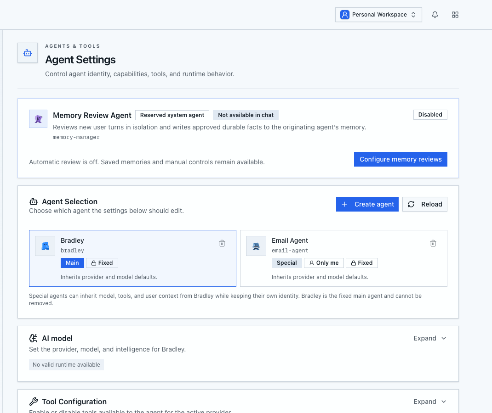
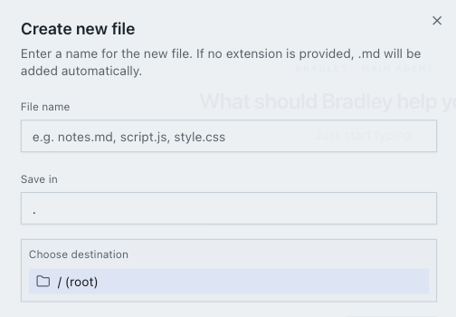
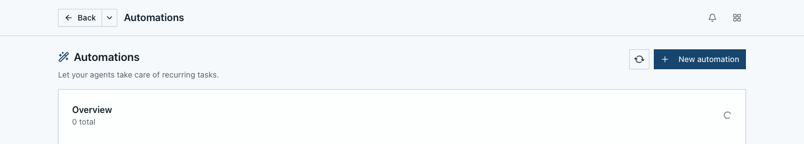
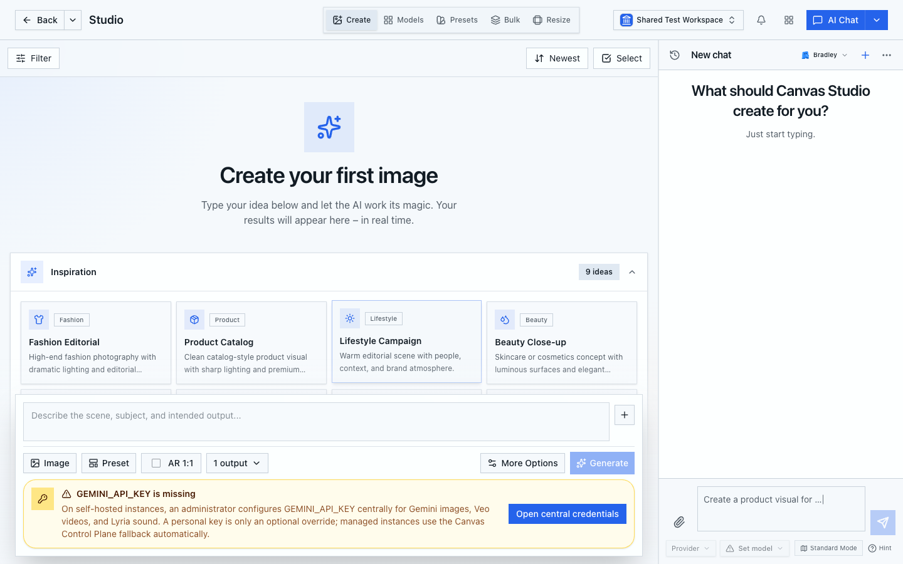
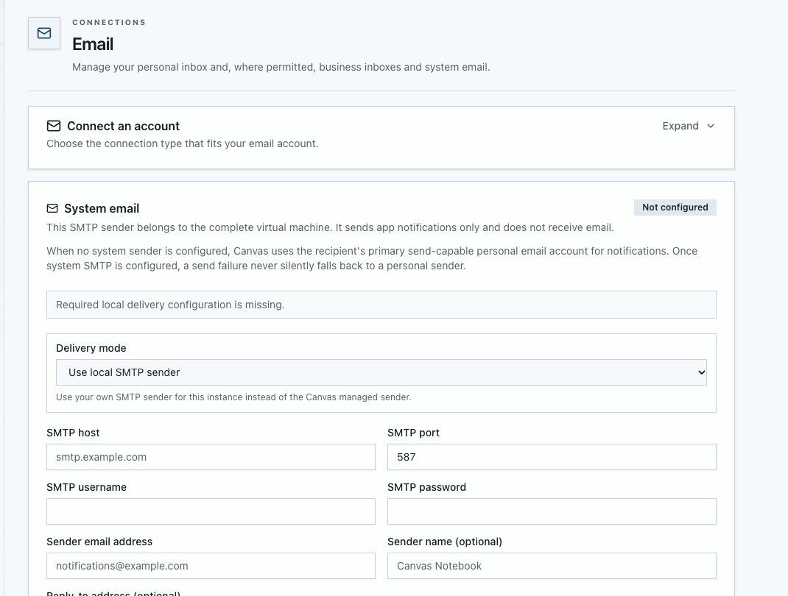

# Get started in Canvas Notebook

This guide begins after you can sign in to Canvas Notebook. It does not cover installing or self-hosting a Notebook. Start in a personal or shared workspace where you have permission to create files.

Before asking an agent to do work, make sure a model is available to your account. Open **Open apps → More apps → Settings → AI Providers & Models**. An administrator may need to connect a provider and make a model available. Adding a credential alone does not guarantee that an agent has a usable runtime. If Agent Settings shows **No valid runtime available**, ask an administrator to check the provider, model access, and defaults. See [Models and providers](/docs/agents/models-and-providers) for setup details.

## 1. Start with the main agent

Open **Open apps → More apps → Settings → Agent Settings**. Canvas Notebook includes **Bradley**, the fixed main agent. Start with Bradley; create a specialized agent only when you need a separate identity or focused instructions. The screenshot shows the agent selector and runtime status.



## 2. Create a Markdown note

Open **Notebook** from **Open apps → Quick access**. Select the **Files** tab, choose **Create → New file**, enter `welcome.md`, and choose **Create file**. If you want it in a subfolder, choose that destination before creating it. Add a short working brief in the editor:

```md
# Weekly campaign

## Goal

Prepare three launch concepts for the new product.

## Audience

Independent consultants and small creative teams.

## Next action

- Review the product notes
- Draft three campaign angles
- Select one direction on Friday
```

The file belongs to the selected workspace. In **Chat**, mention `welcome.md` and ask Bradley to summarize its goal or propose the next action. This step requires a usable model; if chat reports that no runtime is available, finish provider setup first.



## 3. Turn a repeatable task into an automation

After you have checked the one-off result, open **Automations** from **Open apps → Quick access** and choose **New automation**. Use a prompt with a clear scope and output, for example:

```text
Review welcome.md every weekday morning. Summarize the current goal,
list unfinished actions, and write the result to reports/daily-status.md.
Do not modify the original note.
```

Select a workspace the agent can access, choose a schedule, and keep the automation paused until you have reviewed its configuration. Run it manually first, confirm the result in run history, and only then enable a recurring schedule. Follow [Creating a scheduled automation](/docs/automations/scheduled) for the full setup and [Run history](/docs/automations/run-history) to inspect the result.

Canvas Notebook runs recurring work through workspace automations. If your instance had an older, separate agent Heartbeat, see [Legacy Heartbeats and workspace automations](/docs/automations/heartbeat-config) for what changed.



## 4. Optional: generate a Studio image

Open **Studio** from **Open apps → Quick access**. Before generating, make sure an administrator has configured the image provider credentials centrally. Studio displays a credentials prompt when setup is incomplete. Generation may use an external provider; review its terms and your organization’s settings before submitting a prompt.

When image generation is available, describe the subject, setting, and visual style. For example:

```text
Editorial product photograph of a matte black notebook on a technical
grid desk, precise overhead lighting, restrained blue accent, 4:5 format.
```

Review the result and use the save-to-workspace action if you want the image stored with your files. See [Generate images](/docs/studio/generate-images) and [Save Studio output to a workspace](/docs/studio/save-to-workspace). Image generation was not run during this review because the local Studio screen required administrator credentials.



## 5. Optional: connect email

Open **Email** from **Open apps → Quick access**. Connecting an account requires provider details and access; follow [Connect an email account](/docs/email/connect). The inbox and send actions were not exercised in this review to avoid contacting any real recipient.

For account setup, open **Open apps → More apps → Settings → Email** and expand **Connect an account**. System email is a separate instance-level setting and is used for app notifications; it does not connect a personal inbox.



Before using an agent for email, confirm the account and workspace scope, start with drafts, and review recipients and attachments before sending. See [Email sending policies](/docs/email/policies).

## Continue from here

You now have a workspace note and a repeatable task pattern. When a model and the relevant integrations are ready, extend the workflow with [the AI agent](/docs/features/ai-agent), the [Markdown knowledge base](/docs/features/knowledge-base), or [Automations](/docs/features/automations).

[Open dashboard](/dashboard)
